# SmartPulse Documentation Map

**Generated**: 2025-11-13
**Total Files**: 30
**Total Size**: 630 KB (0.62 MB)
**Total Lines**: 22,399
**Mermaid Diagrams**: 68

---

## Purpose

This document provides a comprehensive map of all SmartPulse documentation:
- **Complete file tree** with descriptions
- **Cross-reference matrix** showing document relationships
- **Quick reference guide** by topic and role
- **File statistics** (size, lines, diagrams, last modified)

---

## Table of Contents

1. [Complete File Tree](#complete-file-tree)
2. [File Statistics](#file-statistics)
3. [Cross-Reference Matrix](#cross-reference-matrix)
4. [Documentation Structure Diagram](#documentation-structure-diagram)
5. [Quick Reference by Topic](#quick-reference-by-topic)
6. [Quick Reference by Role](#quick-reference-by-role)
7. [Document Categories](#document-categories)

---

## Complete File Tree

```
docs/
├── README.md ......................... Main documentation index and navigation guide
│
├── architecture/
│   ├── 00_system_overview.md ......... Complete system architecture, Electric.Core deep dive
│   ├── architectural_patterns.md ..... Design principles, communication patterns, resilience
│   └── data_flow_communication.md .... Data flows, API contracts, event schemas
│
├── components/
│   ├── README.md ..................... Components overview and navigation
│   ├── electric_core.md .............. Electric.Core framework documentation
│   ├── 04_distributed_data_manager.md  Deep dive: version-based sync, JSON Patch
│   ├── electric_core_MERGE_SUMMARY.md  Merge summary (reference only)
│   ├── PHASE_1_2_DELIVERABLES.md ..... Phase 1.2 documentation project summary
│   │
│   ├── production_forecast/
│   │   ├── README.md ................. ProductionForecast service overview
│   │   ├── web_api_layer.md .......... REST endpoints, GraphQL subscriptions
│   │   └── business_logic_caching.md . 4-layer caching strategy, CDC integration
│   │
│   ├── notification_service/
│   │   ├── README.md ................. NotificationService overview
│   │   ├── service_architecture.md ... Worker patterns, queue processing
│   │   ├── data_models_integration.md  Domain models, database schema
│   │   └── api_endpoints.md .......... REST API, GraphQL mutations
│   │
│   └── infrastructure/
│       └── README.md ................. Shared utilities, logging, monitoring
│
├── integration/
│   ├── pulsar.md ..................... Apache Pulsar message bus integration
│   └── redis.md ...................... Redis distributed cache integration
│
├── data/
│   ├── ef_core.md .................... Entity Framework Core patterns
│   └── cdc.md ........................ Change Data Capture implementation
│
├── patterns/
│   ├── design_patterns.md ............ Repository, CQRS, Event Sourcing, Saga
│   ├── batch_processing.md ........... Bulk operations, ETL patterns
│   ├── distributed_sync.md ........... CRDT-like sync, optimistic locking
│   ├── worker_patterns.md ............ Background services, hosted services
│   └── caching_patterns.md ........... Multi-level cache, invalidation strategies
│
└── guides/
    ├── setup.md ...................... Development environment setup
    ├── deployment.md ................. Kubernetes deployment, monitoring
    ├── performance.md ................ Benchmarks, optimization strategies
    └── troubleshooting.md ............ Common issues, debugging techniques
```

---

## File Statistics

### Overview by Category

| Category | Files | Total Size (KB) | Total Lines | Avg Size (KB) |
|----------|-------|-----------------|-------------|---------------|
| **components/** | 13 | 298.9 | 9,450 | 23.0 |
| **architecture/** | 3 | 90.3 | 2,908 | 30.1 |
| **patterns/** | 5 | 100.4 | 3,722 | 20.1 |
| **guides/** | 4 | 63.8 | 2,550 | 16.0 |
| **integration/** | 2 | 45.8 | 1,802 | 22.9 |
| **data/** | 2 | 40.3 | 1,530 | 20.2 |
| **README.md** | 1 | 7.4 | 239 | 7.4 |
| **TOTAL** | **30** | **630.8** | **22,399** | **21.0** |

### Detailed File Statistics

| File | Size (KB) | Lines | Diagrams | Last Modified |
|------|-----------|-------|----------|---------------|
| **README.md** | 7.4 | 239 | 0 | 2025-11-13 |
| **architecture/00_system_overview.md** | 37.6 | 1,053 | 8 | 2025-11-13 |
| **architecture/architectural_patterns.md** | 24.5 | 831 | 3 | 2025-11-13 |
| **architecture/data_flow_communication.md** | 28.2 | 1,024 | 6 | 2025-11-13 |
| **components/README.md** | 9.6 | 279 | 0 | 2025-11-13 |
| **components/electric_core.md** | 34.0 | 1,189 | 4 | 2025-11-13 |
| **components/04_distributed_data_manager.md** | 53.8 | 1,560 | 0 | 2025-11-13 |
| **components/electric_core_MERGE_SUMMARY.md** | 10.7 | 304 | 0 | 2025-11-13 |
| **components/PHASE_1_2_DELIVERABLES.md** | 14.2 | 331 | 0 | 2025-11-13 |
| **components/production_forecast/README.md** | 16.8 | 618 | 5 | 2025-11-13 |
| **components/production_forecast/web_api_layer.md** | 15.9 | 682 | 2 | 2025-11-13 |
| **components/production_forecast/business_logic_caching.md** | 28.0 | 1,104 | 8 | 2025-11-13 |
| **components/notification_service/README.md** | 14.3 | 469 | 0 | 2025-11-13 |
| **components/notification_service/service_architecture.md** | 29.8 | 983 | 4 | 2025-11-13 |
| **components/notification_service/data_models_integration.md** | 21.5 | 915 | 1 | 2025-11-13 |
| **components/notification_service/api_endpoints.md** | 21.9 | 835 | 3 | 2025-11-13 |
| **components/infrastructure/README.md** | 12.7 | 379 | 1 | 2025-11-13 |
| **integration/pulsar.md** | 22.1 | 865 | 1 | 2025-11-13 |
| **integration/redis.md** | 23.7 | 937 | 1 | 2025-11-13 |
| **data/ef_core.md** | 22.8 | 894 | 0 | 2025-11-13 |
| **data/cdc.md** | 17.5 | 636 | 1 | 2025-11-13 |
| **patterns/design_patterns.md** | 23.4 | 874 | 3 | 2025-11-12 |
| **patterns/batch_processing.md** | 15.7 | 618 | 0 | 2025-11-13 |
| **patterns/distributed_sync.md** | 19.8 | 687 | 1 | 2025-11-13 |
| **patterns/worker_patterns.md** | 21.6 | 800 | 1 | 2025-11-13 |
| **patterns/caching_patterns.md** | 19.8 | 743 | 2 | 2025-11-13 |
| **guides/setup.md** | 17.9 | 670 | 7 | 2025-11-13 |
| **guides/deployment.md** | 17.7 | 748 | 2 | 2025-11-13 |
| **guides/performance.md** | 15.2 | 619 | 2 | 2025-11-13 |
| **guides/troubleshooting.md** | 12.9 | 513 | 2 | 2025-11-13 |

### Largest Files

| File | Size (KB) | Lines | Purpose |
|------|-----------|-------|---------|
| **04_distributed_data_manager.md** | 53.8 | 1,560 | Deep dive on distributed state management |
| **00_system_overview.md** | 37.6 | 1,053 | Complete system architecture reference |
| **electric_core.md** | 34.0 | 1,189 | Electric.Core framework documentation |
| **notification_service/service_architecture.md** | 29.8 | 983 | NotificationService architecture |
| **data_flow_communication.md** | 28.2 | 1,024 | Data flow and communication patterns |

### Most Diagram-Heavy Files

| File | Diagrams | Purpose |
|------|----------|---------|
| **architecture/00_system_overview.md** | 8 | System architecture diagrams |
| **production_forecast/business_logic_caching.md** | 8 | Caching architecture diagrams |
| **guides/setup.md** | 7 | Setup process diagrams |
| **architecture/data_flow_communication.md** | 6 | Data flow sequence diagrams |
| **production_forecast/README.md** | 5 | Service architecture diagrams |

---

## Cross-Reference Matrix

### Most Referenced Files

These files are referenced by many other documents:

| File | Incoming References | Referenced By |
|------|---------------------|---------------|
| **integration/pulsar.md** | 12 | system_overview, architectural_patterns, data_flow, electric_core, production_forecast (3 files), notification_service (4 files), cdc |
| **integration/redis.md** | 11 | system_overview, architectural_patterns, data_flow, electric_core, production_forecast (3 files), notification_service (3 files), caching_patterns |
| **architecture/00_system_overview.md** | 9 | README, components/README, production_forecast/README, notification_service/README, infrastructure/README, ef_core, design_patterns, distributed_sync, worker_patterns |
| **components/electric_core.md** | 9 | system_overview, architectural_patterns, components/README, production_forecast (3 files), notification_service (2 files), distributed_data_manager |
| **architecture/architectural_patterns.md** | 9 | README, data_flow, electric_core, production_forecast/README, notification_service/README, distributed_sync, worker_patterns, caching_patterns, deployment |

### Hub Documents

Documents that reference many other documents:

| File | Outgoing References | Links To |
|------|---------------------|----------|
| **README.md** | 45+ | All major categories (architecture, components, integration, data, patterns, guides) |
| **architecture/00_system_overview.md** | 15+ | architectural_patterns, data_flow, electric_core, pulsar, redis, ef_core, cdc, distributed_data_manager |
| **components/README.md** | 12+ | electric_core, distributed_data_manager, production_forecast (3 files), notification_service (4 files), infrastructure |
| **architecture/architectural_patterns.md** | 10+ | system_overview, data_flow, pulsar, redis, ef_core, cdc, worker_patterns, distributed_sync, deployment |
| **components/production_forecast/README.md** | 8+ | system_overview, electric_core, web_api_layer, business_logic_caching, pulsar, redis, ef_core, cdc |

### Cross-Reference Relationships

```
README.md (hub)
    ├──> architecture/* (all 3 files)
    ├──> components/* (all major files)
    ├──> integration/* (pulsar, redis)
    ├──> data/* (ef_core, cdc)
    ├──> patterns/* (all 5 files)
    └──> guides/* (all 4 files)

architecture/00_system_overview.md (hub)
    ├──> architectural_patterns.md
    ├──> data_flow_communication.md
    ├──> electric_core.md
    ├──> distributed_data_manager.md
    ├──> pulsar.md
    ├──> redis.md
    ├──> ef_core.md
    └──> cdc.md

components/production_forecast/README.md
    ├──> web_api_layer.md
    ├──> business_logic_caching.md
    ├──> electric_core.md
    ├──> pulsar.md
    ├──> redis.md
    ├──> ef_core.md
    └──> cdc.md

components/notification_service/README.md
    ├──> service_architecture.md
    ├──> data_models_integration.md
    ├──> api_endpoints.md
    ├──> electric_core.md
    ├──> pulsar.md
    ├──> redis.md
    └──> worker_patterns.md

integration/pulsar.md (heavily referenced)
    Referenced by: 12 files

integration/redis.md (heavily referenced)
    Referenced by: 11 files
```

---

## Documentation Structure Diagram

```mermaid
graph TD
    README[README.md<br/>Main Index]

    subgraph Architecture
        SYS[00_system_overview.md<br/>37 KB, 1053 lines, 8 diagrams]
        ARCH[architectural_patterns.md<br/>25 KB, 831 lines, 3 diagrams]
        FLOW[data_flow_communication.md<br/>28 KB, 1024 lines, 6 diagrams]
    end

    subgraph Components
        COMP_IDX[README.md<br/>Components Index]
        ELECTRIC[electric_core.md<br/>34 KB, 1189 lines, 4 diagrams]
        DDM[04_distributed_data_manager.md<br/>54 KB, 1560 lines]

        subgraph ProductionForecast
            PF_IDX[README.md<br/>17 KB, 618 lines, 5 diagrams]
            PF_API[web_api_layer.md<br/>16 KB, 682 lines, 2 diagrams]
            PF_CACHE[business_logic_caching.md<br/>28 KB, 1104 lines, 8 diagrams]
        end

        subgraph NotificationService
            NS_IDX[README.md<br/>14 KB, 469 lines]
            NS_ARCH[service_architecture.md<br/>30 KB, 983 lines, 4 diagrams]
            NS_DATA[data_models_integration.md<br/>21 KB, 915 lines, 1 diagram]
            NS_API[api_endpoints.md<br/>22 KB, 835 lines, 3 diagrams]
        end

        INFRA[infrastructure/README.md<br/>13 KB, 379 lines, 1 diagram]
    end

    subgraph Integration
        PULSAR[pulsar.md<br/>22 KB, 865 lines, 1 diagram]
        REDIS[redis.md<br/>24 KB, 937 lines, 1 diagram]
    end

    subgraph Data
        EFCORE[ef_core.md<br/>23 KB, 894 lines]
        CDC[cdc.md<br/>17 KB, 636 lines, 1 diagram]
    end

    subgraph Patterns
        DESIGN[design_patterns.md<br/>23 KB, 874 lines, 3 diagrams]
        BATCH[batch_processing.md<br/>16 KB, 618 lines]
        DSYNC[distributed_sync.md<br/>20 KB, 687 lines, 1 diagram]
        WORKER[worker_patterns.md<br/>22 KB, 800 lines, 1 diagram]
        CACHE_PAT[caching_patterns.md<br/>20 KB, 743 lines, 2 diagrams]
    end

    subgraph Guides
        SETUP[setup.md<br/>18 KB, 670 lines, 7 diagrams]
        DEPLOY[deployment.md<br/>18 KB, 748 lines, 2 diagrams]
        PERF[performance.md<br/>15 KB, 619 lines, 2 diagrams]
        TROUBLE[troubleshooting.md<br/>13 KB, 513 lines, 2 diagrams]
    end

    README --> SYS
    README --> ARCH
    README --> FLOW
    README --> COMP_IDX
    README --> PULSAR
    README --> REDIS
    README --> EFCORE
    README --> CDC
    README --> DESIGN
    README --> SETUP

    SYS --> ARCH
    SYS --> FLOW
    SYS --> ELECTRIC
    SYS --> PULSAR
    SYS --> REDIS

    COMP_IDX --> ELECTRIC
    COMP_IDX --> DDM
    COMP_IDX --> PF_IDX
    COMP_IDX --> NS_IDX

    PF_IDX --> PF_API
    PF_IDX --> PF_CACHE
    PF_IDX --> ELECTRIC
    PF_IDX --> PULSAR
    PF_IDX --> REDIS

    NS_IDX --> NS_ARCH
    NS_IDX --> NS_DATA
    NS_IDX --> NS_API
    NS_IDX --> ELECTRIC
    NS_IDX --> PULSAR

    ELECTRIC --> DDM
    ELECTRIC --> PULSAR
    ELECTRIC --> REDIS

    style README fill:#ffcccc,stroke:#333,stroke-width:3px
    style SYS fill:#ccffcc,stroke:#333,stroke-width:2px
    style ELECTRIC fill:#ccccff,stroke:#333,stroke-width:2px
    style PULSAR fill:#ffffcc,stroke:#333,stroke-width:2px
    style REDIS fill:#ffffcc,stroke:#333,stroke-width:2px
```



---

## Quick Reference by Topic

### Performance Optimization

| Document | Key Sections | Read Time |
|----------|--------------|-----------|
| [Performance Guide](./guides/performance.md) | Benchmarks, profiling, optimization strategies | 15-20 min |
| [EF Core](./data/ef_core.md) | Query optimization, compiled queries, batch operations | 25-30 min |
| [Caching Patterns](./patterns/caching_patterns.md) | Multi-level cache, invalidation strategies | 25-30 min |
| [Batch Processing](./patterns/batch_processing.md) | Bulk operations, ETL patterns | 20-25 min |
| [ProductionForecast Caching](./components/production_forecast/business_logic_caching.md) | 4-layer caching implementation | 30-35 min |

**Total**: ~2 hours for complete performance mastery

### Scalability & Resilience

| Document | Key Sections | Read Time |
|----------|--------------|-----------|
| [Architectural Patterns](./architecture/architectural_patterns.md) | Scaling strategies, resilience patterns | 30-40 min |
| [Distributed Sync](./patterns/distributed_sync.md) | Multi-instance coordination | 25-30 min |
| [Worker Patterns](./patterns/worker_patterns.md) | Background processing, job scheduling | 25-30 min |
| [Deployment Guide](./guides/deployment.md) | Kubernetes, horizontal scaling | 20-25 min |
| [Pulsar Integration](./integration/pulsar.md) | Message partitioning, consumer groups | 25-30 min |

**Total**: ~2 hours for scalability expertise

### Data Consistency

| Document | Key Sections | Read Time |
|----------|--------------|-----------|
| [CDC](./data/cdc.md) | Change Data Capture implementation | 20-25 min |
| [Distributed Sync](./patterns/distributed_sync.md) | Eventual consistency, conflict resolution | 25-30 min |
| [Caching Patterns](./patterns/caching_patterns.md) | Cache invalidation strategies | 25-30 min |
| [EF Core](./data/ef_core.md) | Transactions, concurrency control | 25-30 min |
| [Distributed Data Manager](./components/04_distributed_data_manager.md) | Version-based sync, JSON Patch | 45-60 min |

**Total**: ~2.5 hours for consistency mastery

### Integration & Messaging

| Document | Key Sections | Read Time |
|----------|--------------|-----------|
| [Pulsar Integration](./integration/pulsar.md) | Producers, consumers, topics, partitioning | 25-30 min |
| [Redis Integration](./integration/redis.md) | Distributed cache, pub/sub | 25-30 min |
| [Data Flow & Communication](./architecture/data_flow_communication.md) | API contracts, event schemas | 30-40 min |
| [Electric.Core](./components/electric_core.md) | Message bus abstraction | 30-40 min |

**Total**: ~2 hours for integration expertise

### Microservices Development

| Document | Key Sections | Read Time |
|----------|--------------|-----------|
| [System Overview](./architecture/00_system_overview.md) | Microservices topology, deployment | 45-60 min |
| [ProductionForecast Overview](./components/production_forecast/README.md) | Service architecture, domain models | 25-30 min |
| [NotificationService Overview](./components/notification_service/README.md) | Service architecture, notification channels | 20-25 min |
| [Architectural Patterns](./architecture/architectural_patterns.md) | Design principles, communication patterns | 30-40 min |
| [Design Patterns](./patterns/design_patterns.md) | Repository, CQRS, Event Sourcing | 25-30 min |

**Total**: ~2.5 hours for service development proficiency

### Operations & Deployment

| Document | Key Sections | Read Time |
|----------|--------------|-----------|
| [Setup Guide](./guides/setup.md) | Development environment, dependencies | 20-25 min |
| [Deployment Guide](./guides/deployment.md) | Kubernetes, monitoring, CI/CD | 20-25 min |
| [Troubleshooting Guide](./guides/troubleshooting.md) | Common issues, debugging | 15-20 min |
| [Performance Guide](./guides/performance.md) | Benchmarks, profiling | 15-20 min |
| [Pulsar Integration](./integration/pulsar.md) | Operational considerations | 25-30 min |
| [Redis Integration](./integration/redis.md) | Operational considerations | 25-30 min |

**Total**: ~2 hours for operational readiness

---

## Quick Reference by Role

### Backend Engineer

**Day 1** (Essential reading - 2-3 hours):
1. [README.md](./README.md) - 15 min
2. [System Overview](./architecture/00_system_overview.md) - 45-60 min
3. [Electric.Core](./components/electric_core.md) - 30-40 min
4. [ProductionForecast Overview](./components/production_forecast/README.md) - 25-30 min

**Week 1** (Core concepts - 4-5 hours):
1. [Architectural Patterns](./architecture/architectural_patterns.md) - 30-40 min
2. [Design Patterns](./patterns/design_patterns.md) - 25-30 min
3. [EF Core](./data/ef_core.md) - 25-30 min
4. [CDC](./data/cdc.md) - 20-25 min
5. [Caching Patterns](./patterns/caching_patterns.md) - 25-30 min
6. [Pulsar Integration](./integration/pulsar.md) - 25-30 min
7. [Redis Integration](./integration/redis.md) - 25-30 min

**Month 1** (Deep dive - 8-10 hours):
1. [Distributed Data Manager](./components/04_distributed_data_manager.md) - 45-60 min
2. [Data Flow & Communication](./architecture/data_flow_communication.md) - 30-40 min
3. [ProductionForecast Web API](./components/production_forecast/web_api_layer.md) - 20-25 min
4. [ProductionForecast Caching](./components/production_forecast/business_logic_caching.md) - 30-35 min
5. [NotificationService Architecture](./components/notification_service/service_architecture.md) - 30-35 min
6. [Worker Patterns](./patterns/worker_patterns.md) - 25-30 min
7. [Batch Processing](./patterns/batch_processing.md) - 20-25 min
8. [Distributed Sync](./patterns/distributed_sync.md) - 25-30 min

**Total**: 14-18 hours to full proficiency

### Platform Engineer / SRE

**Day 1** (Operations focus - 1-2 hours):
1. [README.md](./README.md) - 15 min
2. [Deployment Guide](./guides/deployment.md) - 20-25 min
3. [Troubleshooting Guide](./guides/troubleshooting.md) - 15-20 min
4. [Performance Guide](./guides/performance.md) - 15-20 min

**Week 1** (Infrastructure - 3-4 hours):
1. [System Overview](./architecture/00_system_overview.md) - 45-60 min (focus on deployment model)
2. [Setup Guide](./guides/setup.md) - 20-25 min
3. [Pulsar Integration](./integration/pulsar.md) - 25-30 min
4. [Redis Integration](./integration/redis.md) - 25-30 min
5. [CDC](./data/cdc.md) - 20-25 min (monitoring section)

**Month 1** (Deep infrastructure knowledge - 5-6 hours):
1. [Architectural Patterns](./architecture/architectural_patterns.md) - 30-40 min (scaling section)
2. [Worker Patterns](./patterns/worker_patterns.md) - 25-30 min (lifecycle section)
3. [Caching Patterns](./patterns/caching_patterns.md) - 25-30 min (monitoring section)
4. [ProductionForecast Caching](./components/production_forecast/business_logic_caching.md) - 30-35 min (monitoring section)

**Total**: 9-12 hours to operational expertise

### Architect

**Day 1** (Architecture overview - 2-3 hours):
1. [README.md](./README.md) - 15 min
2. [System Overview](./architecture/00_system_overview.md) - 45-60 min
3. [Architectural Patterns](./architecture/architectural_patterns.md) - 30-40 min
4. [Data Flow & Communication](./architecture/data_flow_communication.md) - 30-40 min

**Week 1** (Design decisions - 4-5 hours):
1. [Distributed Synchronization](./patterns/distributed_sync.md) - 25-30 min
2. [Distributed Data Manager](./components/04_distributed_data_manager.md) - 45-60 min
3. [Design Patterns](./patterns/design_patterns.md) - 25-30 min
4. [Caching Patterns](./patterns/caching_patterns.md) - 25-30 min
5. [Worker Patterns](./patterns/worker_patterns.md) - 25-30 min
6. [Batch Processing](./patterns/batch_processing.md) - 20-25 min

**Month 1** (Complete understanding - 6-8 hours):
1. [Electric.Core](./components/electric_core.md) - 30-40 min
2. [ProductionForecast Overview](./components/production_forecast/README.md) - 25-30 min
3. [ProductionForecast Caching](./components/production_forecast/business_logic_caching.md) - 30-35 min
4. [NotificationService Overview](./components/notification_service/README.md) - 20-25 min
5. [NotificationService Architecture](./components/notification_service/service_architecture.md) - 30-35 min
6. [Pulsar Integration](./integration/pulsar.md) - 25-30 min
7. [Redis Integration](./integration/redis.md) - 25-30 min
8. [EF Core](./data/ef_core.md) - 25-30 min
9. [CDC](./data/cdc.md) - 20-25 min

**Total**: 12-16 hours to architectural mastery

### New Team Member

**Day 1** (Onboarding - 1-2 hours):
1. [README.md](./README.md) - 15 min
2. [Setup Guide](./guides/setup.md) - 20-25 min
3. [System Overview](./architecture/00_system_overview.md) - 45-60 min (high-level only)

**Week 1** (Core concepts - 3-4 hours):
1. [Architectural Patterns](./architecture/architectural_patterns.md) - 30-40 min
2. [ProductionForecast Overview](./components/production_forecast/README.md) - 25-30 min
3. [NotificationService Overview](./components/notification_service/README.md) - 20-25 min
4. [Design Patterns](./patterns/design_patterns.md) - 25-30 min
5. [Troubleshooting Guide](./guides/troubleshooting.md) - 15-20 min

**Follow backend engineer or platform engineer path based on role**

---

## Document Categories

### Architecture Documentation (3 files, 90 KB, 2,908 lines)

**Purpose**: High-level system design, patterns, and communication flows

| Document | Description | Key Topics |
|----------|-------------|------------|
| **00_system_overview.md** | Complete architecture reference | Topology, deployment, Electric.Core deep dive |
| **architectural_patterns.md** | Design principles and patterns | Communication, resilience, scaling, monitoring |
| **data_flow_communication.md** | Detailed data flows | API contracts, event schemas, cache invalidation |

**When to read**: System design, architecture reviews, onboarding

### Component Documentation (13 files, 299 KB, 9,450 lines)

**Purpose**: Detailed microservice and module documentation

#### Subcategories:

**Infrastructure (5 files)**:
- Electric.Core framework documentation
- Distributed Data Manager deep dive
- Infrastructure utilities
- Components overview and navigation
- Phase deliverables summary

**ProductionForecast (3 files)**:
- Service architecture and domain models
- Web API layer (REST, GraphQL)
- 4-layer caching strategy

**NotificationService (4 files)**:
- Service architecture overview
- Worker patterns and queue processing
- Data models and database schema
- API endpoints and rate limiting

**When to read**: Service development, API implementation, caching design

### Integration Documentation (2 files, 46 KB, 1,802 lines)

**Purpose**: External system integrations

| Document | Description | Key Topics |
|----------|-------------|------------|
| **pulsar.md** | Apache Pulsar message bus | Producers, consumers, topics, partitioning |
| **redis.md** | Redis distributed cache | Cache patterns, pub/sub, connection pooling |

**When to read**: Event streaming, distributed caching, pub/sub patterns

### Data Layer Documentation (2 files, 40 KB, 1,530 lines)

**Purpose**: Database access and change tracking

| Document | Description | Key Topics |
|----------|-------------|------------|
| **ef_core.md** | Entity Framework Core | DbContext design, query optimization, migrations |
| **cdc.md** | Change Data Capture | Polling-based CDC, event publishing |

**When to read**: Database design, query optimization, change tracking

### Patterns Documentation (5 files, 100 KB, 3,722 lines)

**Purpose**: Design patterns and best practices

| Document | Description | Key Topics |
|----------|-------------|------------|
| **design_patterns.md** | Core design patterns | Repository, CQRS, Event Sourcing, Saga |
| **batch_processing.md** | Bulk operations | ETL patterns, performance optimization |
| **distributed_sync.md** | Multi-instance sync | CRDT-like patterns, optimistic locking |
| **worker_patterns.md** | Background processing | Hosted services, job scheduling |
| **caching_patterns.md** | Caching strategies | Multi-level cache, invalidation |

**When to read**: Pattern selection, architecture design, performance optimization

### Guides Documentation (4 files, 64 KB, 2,550 lines)

**Purpose**: Setup, deployment, and operations

| Document | Description | Key Topics |
|----------|-------------|------------|
| **setup.md** | Development environment | Dependencies, configuration, Docker setup |
| **deployment.md** | Production deployment | Kubernetes, monitoring, CI/CD pipelines |
| **performance.md** | Optimization strategies | Benchmarks, profiling, optimization |
| **troubleshooting.md** | Common issues | Debugging techniques, monitoring |

**When to read**: Environment setup, deployment, troubleshooting, performance tuning

---

## Content Highlights

### Most Comprehensive Documents

1. **04_distributed_data_manager.md** (54 KB, 1,560 lines)
   - Most detailed technical deep dive
   - Version-based optimistic locking
   - JSON Patch delta synchronization
   - Complete with 4+ practical examples

2. **00_system_overview.md** (38 KB, 1,053 lines, 8 diagrams)
   - Complete system architecture
   - Electric.Core module breakdown
   - Deployment model
   - Performance characteristics

3. **electric_core.md** (34 KB, 1,189 lines, 4 diagrams)
   - Complete framework reference
   - All 8 major component categories
   - Usage examples and best practices

### Most Diagram-Rich Documents

1. **production_forecast/business_logic_caching.md** (8 diagrams)
   - 4-layer caching architecture
   - Cache invalidation flows
   - Multi-instance synchronization

2. **architecture/00_system_overview.md** (8 diagrams)
   - System topology
   - Deployment model
   - Data flow architecture
   - Electric.Core modules

3. **guides/setup.md** (7 diagrams)
   - Setup process flows
   - Architecture diagrams
   - Dependency relationships

### Key Integration Points

**Electric.Core** (referenced by 9 documents):
- Central infrastructure library
- Provides: messaging, caching, CDC, workers
- Used by all microservices

**Apache Pulsar** (referenced by 12 documents):
- Message bus for all services
- Event streaming backbone
- Cache invalidation broadcast

**Redis** (referenced by 11 documents):
- Distributed cache layer
- Pub/sub for sync
- Session state management

---

## Validation Summary

**Total Documentation**:
- ✅ 30 files scanned
- ✅ 630 KB total size
- ✅ 22,399 lines of documentation
- ✅ 68 Mermaid diagrams
- ✅ 143 valid cross-references
- ✅ 0 file structure issues

**Content Coverage**:
- ✅ Architecture: Complete (3 files)
- ✅ Components: Complete (13 files)
- ✅ Integration: Complete (2 files)
- ✅ Data Layer: Complete (2 files)
- ✅ Patterns: Complete (5 files)
- ✅ Guides: Complete (4 files)

**Quality Metrics**:
- Average document size: 21 KB
- Average diagrams per file: 2.3
- Average lines per file: 747
- Cross-reference density: 4.8 links per file

---

## Usage Tips

### Finding Information Quickly

1. **Start with README.md**: Main index with all navigation options
2. **Use this document**: Complete map with file sizes and descriptions
3. **Follow cross-references**: Related documents linked throughout
4. **Check role-based paths**: Recommended reading order by role

### Reading Strategies

**Quick Overview** (2-3 hours):
- README.md
- System Overview
- One service overview (ProductionForecast or NotificationService)

**Comprehensive Understanding** (12-18 hours):
- Follow backend engineer path
- Read all architecture docs
- Study patterns and integration docs

**Topic-Focused** (2-4 hours per topic):
- Use "Quick Reference by Topic" section
- Follow cross-references
- Focus on relevant patterns

### Maintenance

**When adding new documentation**:
1. Add to appropriate folder
2. Update this DOCUMENTATION_MAP.md
3. Update README.md if major component
4. Run validation script: `python plan/validate_documentation.py`

**When updating existing documentation**:
1. Update "Last Modified" date
2. Run validation to check links
3. Update cross-references if structure changed

---

**Document Version**: 1.0
**Last Updated**: 2025-11-13
**Generated By**: Documentation validation and mapping system

For complete validation reports, see:
- [Validation Report](../plan/VALIDATION_REPORT.md)
- [Cross-Reference Report](../plan/CROSSREF_VALIDATION_RESULTS.md)
