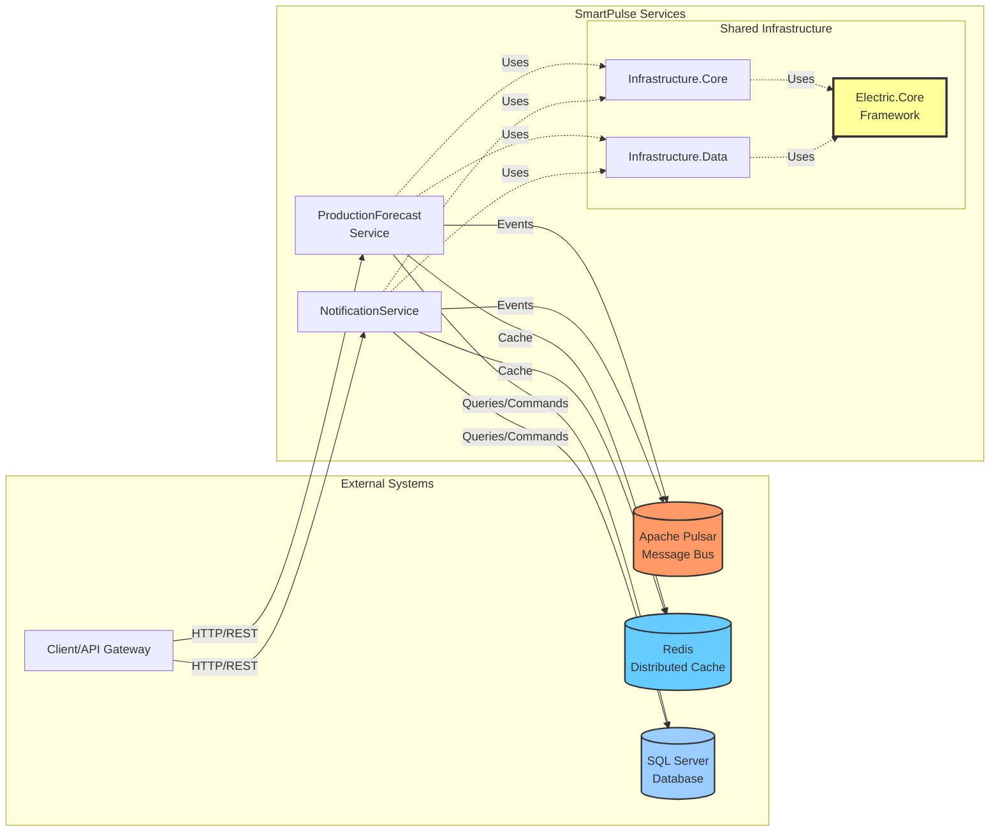
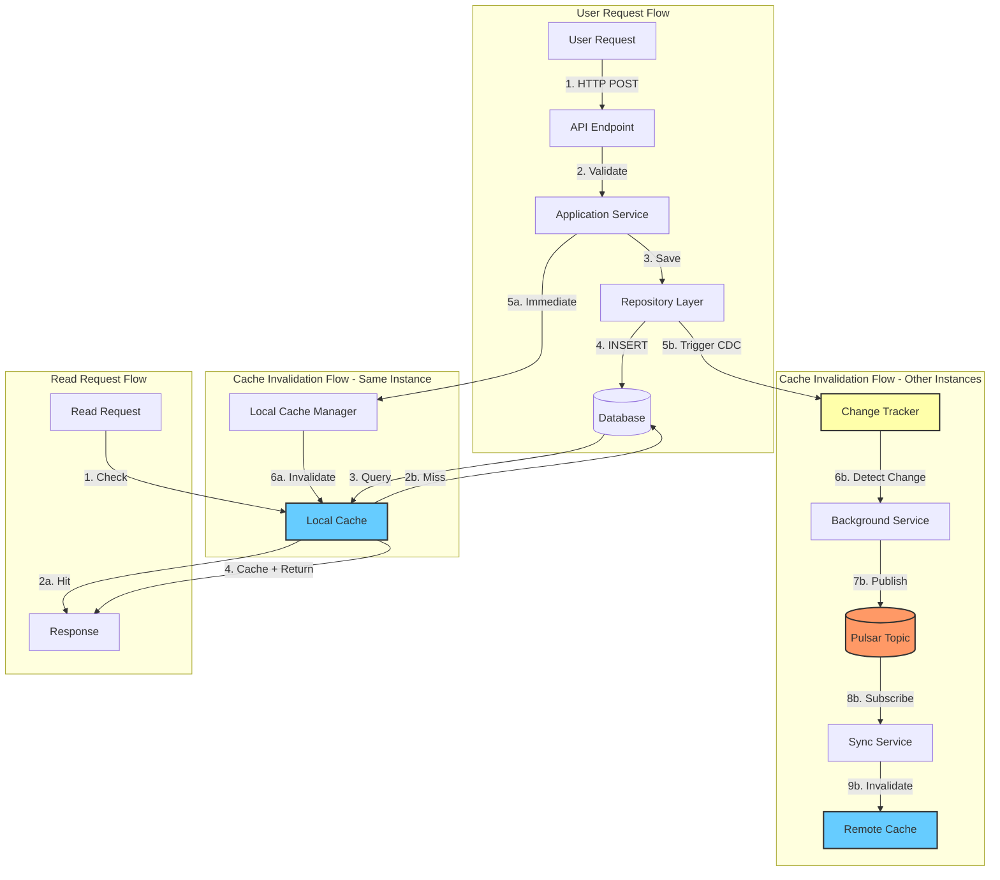
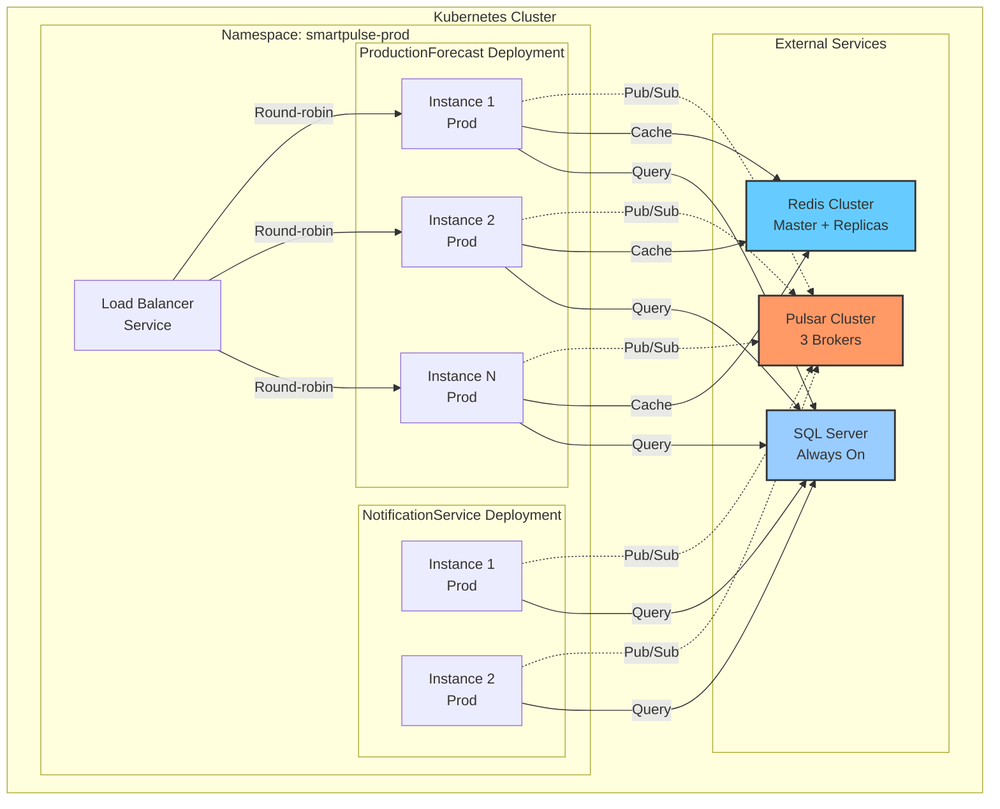
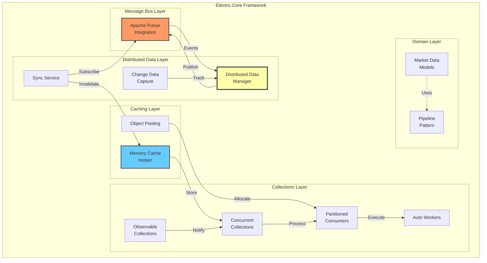
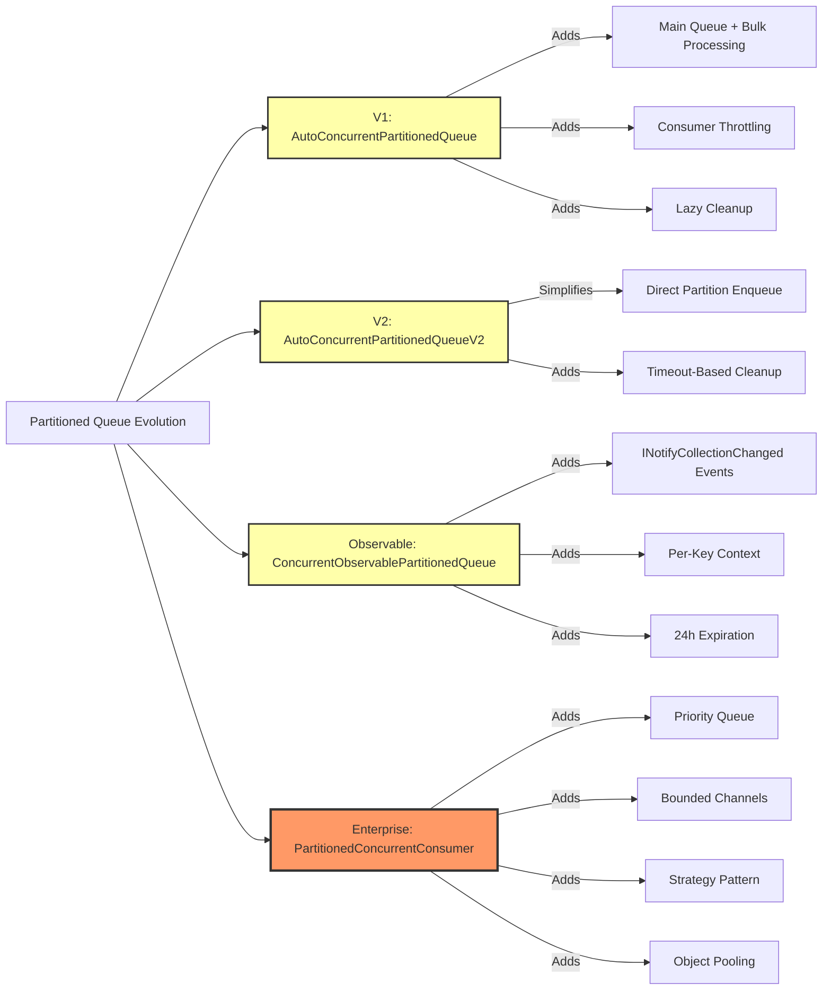
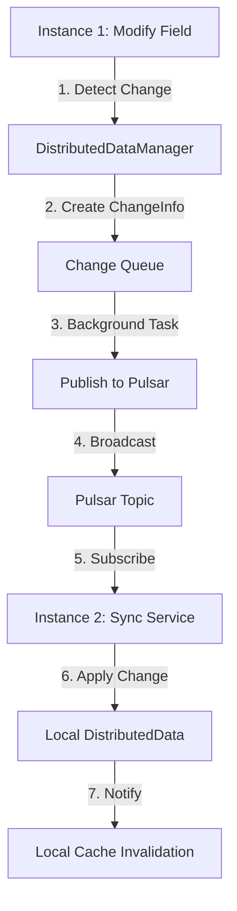
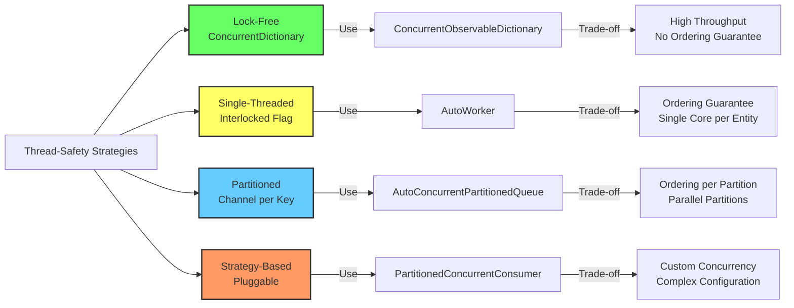
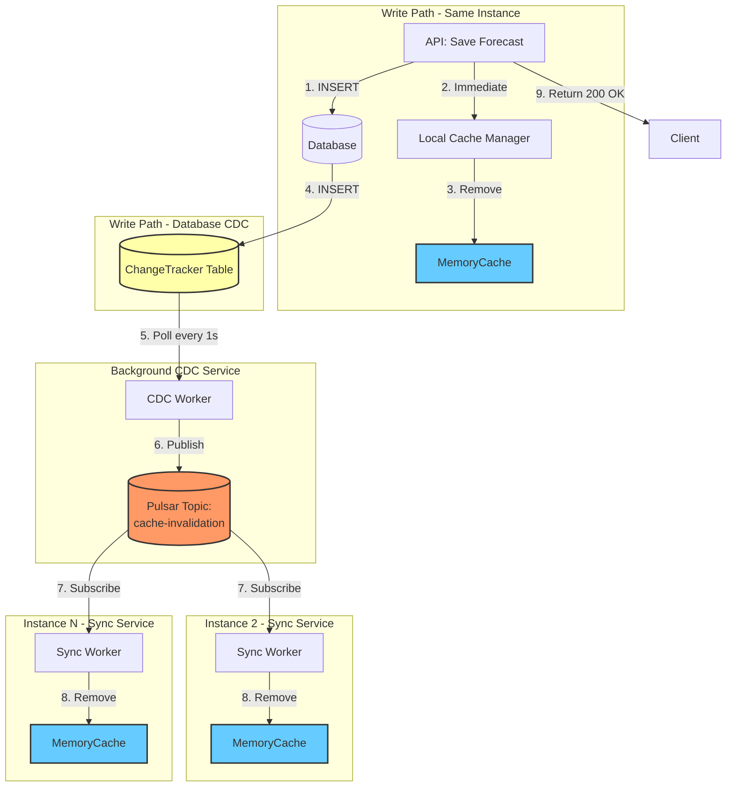

# SmartPulse System Architecture Overview

**Version**: 1.0
**Last Updated**: 2025-11-12
**Author**: Technical Architecture Team

---

## Table of Contents

1. [Architecture Overview](#1-architecture-overview)
2. [Electric.Core Module Deep Dive](#2-electriccore-module-deep-dive)
3. [System Patterns & Design Decisions](#3-system-patterns--design-decisions)

## Related Architecture Documentation

This document provides a high-level overview of the SmartPulse system. For detailed architectural patterns and data flow specifications, see:

- **[Architectural Patterns & Design Decisions](architectural_patterns.md)** - Comprehensive guide to fundamental architecture principles, cross-service communication patterns, resilience strategies, background services, scaling & performance, deployment, monitoring, and key design trade-offs
- **[Data Flow & Communication](data_flow_communication.md)** - Detailed data flow diagrams, API contract specifications, event schemas, cache invalidation flow, multi-channel notification flow, CDC to distributed sync pipeline, and cross-service integration patterns

---

# 1. Architecture Overview

## 1.1 System Overview

SmartPulse is a distributed microservices-based system designed for managing production forecasts (energy/container generation predictions). The system emphasizes high availability, horizontal scalability, and real-time data synchronization across multiple instances using event-driven architecture.

### Core Capabilities

- **Production Forecast Management**: Store and retrieve energy production forecasts with time-series data
- **Multi-Instance Deployment**: Horizontal scaling with automatic cache synchronization
- **Event-Driven Architecture**: Apache Pulsar message bus for inter-service communication
- **Distributed Caching**: Multi-level caching with CRDT-like synchronization
- **Real-Time Data Sync**: Change Data Capture (CDC) for cache invalidation across instances

## 1.2 Microservices Topology



### Component Roles

| Component | Role | Technology |
|-----------|------|------------|
| **ProductionForecast Service** | Manages energy production forecasts, provides REST API | .NET 7, ASP.NET Core |
| **NotificationService** | Handles user notifications and alerts | .NET 7, ASP.NET Core |
| **Infrastructure.Core** | Shared business logic, domain models, utilities | .NET 7 Library |
| **Infrastructure.Data** | Data access layer, repository pattern, EF Core | .NET 7 Library |
| **Electric.Core** | Low-level framework (messaging, caching, concurrency) | .NET 7 Library |
| **Apache Pulsar** | Message bus for events, pub/sub, partitioned topics | Apache Pulsar 2.10+ |
| **Redis** | Distributed cache, session state, rate limiting | Redis 7+ |
| **SQL Server** | Primary data store for forecasts and configuration | SQL Server 2019+ |

## 1.3 Data Flow Architecture



### Data Flow Description

1. **Write Path (Immediate)**:
   - User submits forecast data via REST API
   - Application service validates and saves to database
   - **Same instance** immediately invalidates its local cache (0ms latency)
   - Response returned to user

2. **Write Path (Distributed)**:
   - Background CDC service detects database changes
   - Generates cache invalidation tags (unit_type, unit_number, provider_key, period, delivery_start)
   - Publishes invalidation event to Pulsar topic
   - **Other instances** receive event and invalidate their caches (sub-second latency)

3. **Read Path**:
   - Check local in-memory cache (MemoryCache)
   - On miss: query database + cache result (cache-aside pattern)
   - TTL-based expiration (configurable, default 1 hour)

## 1.4 Deployment Model



### Deployment Characteristics

- **Horizontal Scaling**: Multiple pods per service (auto-scaling based on CPU/memory)
- **Stateless Services**: All application state in database/cache (no local state)
- **Health Checks**: Liveness/readiness probes for Kubernetes
- **Configuration**: Environment-based (dev/staging/prod) via ConfigMaps/Secrets
- **Monitoring**: Grafana dashboards for metrics, logs, traces
- **Logging**: Structured logging with trace IDs for distributed tracing

---

# 2. Electric.Core Module Deep Dive

## 2.1 Electric.Core Architecture

Electric.Core is a low-level framework providing high-performance primitives for distributed systems. It abstracts complex patterns like partitioned queues, observable collections, CDC, and message bus integration.



### Module Organization

| Module | Purpose | Key Classes |
|--------|---------|-------------|
| **Apache_Pulsar** | Message bus integration | SmartpulsePulsarClient, DateTimeToObjectConverter, IdToObjectConverter |
| **Caching** | In-memory caching with stampede prevention | MemoryCacheHelper, ObjectPool, ObjectPoolNoCreate |
| **Collections** | Non-concurrent observable collections | ObservableDictionary |
| **Collections.Concurrent** | Thread-safe partitioned queues, priority queues | AutoConcurrentPartitionedQueue, ConcurrentObservableDictionary, ConcurrentPriorityQueue |
| **Collections.Consumers** | Enterprise-grade consumer patterns | PartitionedConcurrentConsumer |
| **Collections.Workers** | Single-partition auto-processing workers | AutoWorker, AutoBatchWorker |
| **DistributedData** | CRDT-like distributed cache synchronization | DistributedDataManager, DistributedDataSyncService, DistributedField |
| **Electricity** | Market data domain models | MarketPrice, MarketElectricityType, ElectricityBill |
| **TrackChanges** | Change Data Capture infrastructure | ChangeTracker, ChangeInfo |
| **Pipeline** | Pipeline processing pattern | PipelineStep, PipelineContext |

## 2.2 Apache Pulsar Integration

### What

Wrapper over DotPulsar library providing simplified producer/consumer patterns with JSON serialization, MongoDB-compatible types, compression, and IAsyncEnumerable reactive streams.

### Why

- **Abstraction**: Hide complexity of DotPulsar configuration (producers, consumers, subscriptions)
- **Performance**: Producer pooling (ConcurrentDictionary) eliminates creation overhead
- **MongoDB Compatibility**: Serialize DateTime and ObjectId to MongoDB Extended JSON format
- **Compression**: Support LZ4/Zlib/Zstd/Snappy for bandwidth optimization
- **Reactive**: IAsyncEnumerable consumer pattern for backpressure-aware processing

### How

**Producer Pattern (Cached)**:
```csharp
// Registration (once)
client.CreateTopicToProduce("forecast-events", compressionType: CompressionType.Zstd);

// Usage (many times, zero overhead)
await client.WriteObj("forecast-events", new ForecastEvent { ... });
```

**Consumer Pattern (IAsyncEnumerable)**:
```csharp
await foreach (var (data, rawMessage) in client.CreateTopicConsumerAsync<ForecastEvent>(
    topic: "forecast-events",
    subscriptionName: "cache-invalidator",
    subscriptionType: SubscriptionType.Shared,
    messagePrefetchCount: 1000))
{
    await ProcessEvent(data);
    await rawMessage.Acknowledge();
}
```

### When to Use

- **Events**: Publish domain events (forecast saved, notification sent)
- **Cache Invalidation**: Broadcast cache invalidation tags across instances
- **Data Pipelines**: Stream processing with partitioned topics
- **Integration**: Async communication between microservices

### Trade-Offs

- **Serialization**: JSON adds 20-30% overhead vs binary (Protobuf/Avro) - acceptable for SmartPulse workloads
- **MongoDB Converters**: Read methods not implemented (write-only use case)
- **Prefetch**: Default 1000 messages - tune based on message size and memory

## 2.3 Caching Architecture (Multi-Level)

### What

In-memory caching with cache-aside pattern, double-checked locking for cache stampede prevention, versioned cache swapping for zero-downtime invalidation, and object pooling for allocation reduction.

### Why

- **Cache Stampede**: Prevent N concurrent requests from hitting database (SemaphoreSlim per key)
- **Zero-Downtime Clear**: Versioned swap avoids blocking during cache invalidation
- **Object Pooling**: Reuse List<T>, Channel<T> to reduce GC pressure
- **Configurable TTL**: Per-operation cache time (default 1 hour)

### How

**Cache-Aside with Stampede Prevention**:
```csharp
var forecast = await cache.Get(
    key: $"forecast:{unitId}:{data}",
    whenNotHitAction: async key => await repository.GetForecast(unitId, data),
    cacheTime: DateTimeOffset.Now.AddHours(1),
    withLock: true // Enable double-checked locking
);
```

**Zero-Downtime Cache Clear**:
```csharp
await cache.ClearCache(); // Old cache disposed after 1s delay
```

**Object Pooling** (used by partitioned queues):
```csharp
var pool = new ObjectPool<List<Item>>(maxPoolCount: 1000);
var list = pool.GetOne(); // Get from pool or new()
// ... use list ...
pool.GiveBackOne(list);   // Return to pool
```

### When to Use

- **Hot Data**: Frequently accessed forecasts (current + next 7 days)
- **Expensive Queries**: Complex aggregations, joins
- **Rate Limiting**: Cache API responses to reduce load

### Trade-Offs

- **Memory**: In-memory cache size = TTL × write rate × item size (monitor)
- **Consistency**: Eventual consistency across instances (sub-second lag via CDC)
- **Stampede Lock**: withLock=true adds latency (10-50ms) - use for DB queries, not for hot paths

## 2.4 Collections (Concurrent, Observable, Workers)

### 2.4.1 Thread-Safe Observable Collections

**What**: ConcurrentDictionary/ConcurrentQueue wrappers with INotifyCollectionChanged events for reactive patterns.

**Why**:
- **Observability**: React to collection changes (UI binding, event sourcing)
- **Thread-Safety**: Safe for multi-threaded producers/consumers
- **Reactive Streams**: IAsyncEnumerable adapters for async/await patterns

**Key Classes**:

| Class | Purpose | Thread-Safe | Use Case |
|-------|---------|-------------|----------|
| `ObservableDictionary<K,V>` | Dictionary with events | NO | WPF/MAUI UI binding |
| `ConcurrentObservableDictionary<K,V>` | Thread-safe dictionary with events + LastModifiedDateTime | YES | Shared cache with observability |
| `ConcurrentObservableQueue<T>` | Thread-safe queue with events + DequeueAsync (IAsyncEnumerable) | YES | Partitioned queue item storage |
| `ConcurrentPriorityQueue<T>` | Fixed-priority buckets (array of ConcurrentQueue) | YES | Task scheduling with priority |

**Example: Reactive Cache Monitoring**:
```csharp
var cache = new ConcurrentObservableDictionary<string, Forecast>();

// Reactive stream of all keys (snapshot + live changes)
await foreach (var key in cache.GetKeysEnumeratorAsync(cancellationToken))
{
    Console.WriteLine($"Key added/modified: {key}");
}
```

### 2.4.2 Partitioned Queues (Evolution)

SmartPulse implements 4 partitioned queue variants with different trade-offs:



**Comparison**:

| Feature | V1 (Auto) | V2 (Auto) | Observable | Enterprise |
|---------|-----------|-----------|------------|------------|
| **Main Queue** | YES (Channel<ChannelItem<T>>) | NO | NO | NO |
| **Bulk Processing** | YES (80% dynamic batch) | YES (fixed batch) | YES | YES (configurable) |
| **Cleanup** | Lazy (every N iterations) | Timeout (MaxWaitTime) | Background (24h) | Manual (caller-driven) |
| **Throttling** | YES (ConsumerThrottleCount) | NO | NO | YES (Strategy pattern) |
| **Priority** | NO | NO | NO | YES (per-item) |
| **Bounded Channels** | YES (BoundedChannelFullMode) | YES | NO (unbounded) | YES (per-partition config) |
| **Observability** | NO | NO | YES (events) | NO |
| **Context** | NO | NO | YES (per-key) | NO |
| **Object Pooling** | YES (List<T>) | YES (List<T>) | NO | YES (Channel<T>) |

**When to Use**:

- **V1 (AutoConcurrentPartitionedQueue)**: High-throughput with bursty traffic (main queue buffers spikes)
- **V2 (AutoConcurrentPartitionedQueueV2)**: Low-latency (direct enqueue, no main queue overhead)
- **Observable**: Event-driven architectures (react to partition changes)
- **Enterprise (PartitionedConcurrentConsumer)**: Complex requirements (priority, backpressure, custom concurrency)

### 2.4.3 Workers (Single-Partition Auto-Processing)

**What**: Single-threaded per-entity workers for sequential processing (AutoWorker) or batch processing (AutoBatchWorker).

**Why**:
- **Ordering**: Guarantee FIFO processing per entity (e.g., per-user commands)
- **Simplicity**: No partitioning logic needed (single ConcurrentQueue)
- **Result Awaiting**: Optional TaskCompletionSource for async results

**Key Classes**:

| Class | Processing | Result | Use Case |
|-------|------------|--------|----------|
| `AutoWorker<TInput, TOutput>` | Per-item callback | Optional (TaskCompletionSource) | Sequential commands (user actions) |
| `AutoBatchWorker<TInput>` | Batch callback (List<TInput>) | Optional (bool success) | Bulk writes (logs, metrics) |

**Example: Per-User Command Queue**:
```csharp
var userWorkers = new ConcurrentDictionary<string, AutoWorker<Command, Result>>();

var worker = userWorkers.GetOrAdd(userId, _ => new AutoWorker<Command, Result>(
    processItemAsync: async cmd => await ExecuteCommand(cmd)
));

// Fire-and-forget
worker.Enqueue(new SaveForecastCommand { ... });

// Await result
var result = await worker.EnqueueAsync(new DeleteForecastCommand { ... });
if (result.IsSuccess) { ... }
```

## 2.5 Distributed Data Management

### What

CRDT-like distributed cache synchronization using Pulsar pub/sub for propagating field-level changes across service instances. Implements eventual consistency with last-write-wins (LWW) semantics.

### Why

- **Multi-Instance Consistency**: Sync cache across N instances without direct RPC
- **Field-Level Granularity**: Track individual field changes (not entire objects)
- **Pub/Sub Model**: Scalable broadcast (1:N) vs point-to-point (N:N)
- **Automatic Sync**: Background service (DistributedDataSyncService) handles sync

### How

**Define Distributed Data**:
```csharp
public class ForecastCacheMetadata : IDistributedData
{
    [DistributedField] // Mark field for sync
    public int CachedForecastCount { get; set; }

    [DistributedField]
    public DateTime LastUpdate { get; set; }
}
```

**Register and Sync**:
```csharp
// Startup: Register for distributed sync
services.AddDistributedDataSync(config =>
{
    config.PulsarConnectionString = "pulsar://localhost:6650";
    config.SyncTopicPrefix = "smartpulse-sync";
});

// Runtime: Modify field (auto-sync)
var metadata = distributedDataManager.Get<ForecastCacheMetadata>("cache-stats");
metadata.CachedForecastCount++; // Change detected
// Background service publishes change to Pulsar
// Other instances receive and apply change
```

### When to Use

- **Configuration**: Feature flags, rate limits shared across instances
- **Metrics**: Aggregate counters (total requests, cache hits)
- **Coordination**: Leader election, distributed locks (with CRDT conflict resolution)

### Trade-Offs

- **Eventual Consistency**: Changes propagate in sub-second (not immediate)
- **LWW Semantics**: Last write wins (no conflict resolution) - use for idempotent updates
- **Memory**: All distributed data kept in memory (use for small metadata, not large datasets)

## 2.6 Market Data Models (Domain Layer)

### What

Domain models for electricity market data: prices, types (Day-Ahead, Intraday, Balancing), bills, and calculations.

### Why

- **Domain Language**: Use electricity market deadlineology (PTF, SMF, MWh)
- **Type Safety**: Enums for market types, periods, delivery times
- **Calculations**: Bill calculation logic (price × quantity × hour-of-day factors)

**Key Classes**:
- `MarketPrice`: Time-series price data (DateTime, Price, MarketType)
- `MarketElectricityType`: Enum (DayAhead, Intraday, Balancing, RealTime)
- `ElectricityBill`: Invoice generation with line items

### When to Use

- **API Contracts**: Use as DTOs for forecast endpoints
- **Business Logic**: Price calculations, market type conversions
- **Reporting**: Generate bills, invoices, analytics

## 2.7 Change Data Capture (CDC) Strategy

### What

Polling-based CDC implementation tracking database changes via ChangeTracker table for cache invalidation triggers.

### Why

- **Decoupled Invalidation**: Separate write path (API) from invalidation path (background service)
- **Multi-Instance Support**: Database as single source of truth (no distributed coordination)
- **Audit Trail**: ChangeTracker table serves as change log (debugging, replay)

### How

**Write Path**:
```csharp
// Save forecast + insert change record
await repository.SaveForecast(forecast);
await changeTracker.InsertChange(new ChangeInfo
{
    EntityType = "Forecast",
    EntityId = forecast.Id,
    ChangeType = "INSERT",
    Timestamp = DateTime.UtcNow,
    InvalidationTag = $"forecast:{forecast.UnitId}:{forecast.Date}"
});
```

**Background Service (CDC)**:
```csharp
while (true)
{
    var changes = await changeTracker.PollChanges(lastProcessedId);
    foreach (var change in changes)
    {
        // Publish to Pulsar
        await pulsar.WriteObj("cache-invalidation", change);
        lastProcessedId = change.Id;
    }
    await Task.Delay(TimeSpan.FromSeconds(1)); // Polling interval
}
```

**Sync Service (Subscriber)**:
```csharp
await foreach (var change in pulsar.CreateTopicConsumerAsync<ChangeInfo>("cache-invalidation"))
{
    // Invalidate local cache
    cache.Remove(change.InvalidationTag);
}
```

### When to Use

- **Cache Invalidation**: Invalidate caches across instances after DB write
- **Event Sourcing**: Replay changes for analytics, auditing
- **Integration**: Trigger external systems (webhooks, notifications)

### Trade-Offs

- **Polling Overhead**: 1-second polling adds latency (vs trigger-based CDC)
- **Scalability**: Single CDC worker (scale by sharding ChangeTracker table)
- **Idempotency**: Subscribers must handle duplicate changes (at-least-once delivery)

## 2.8 Pipeline Pattern

### What

Chain-of-responsibility pattern for composable processing pipelines with async/await support.

### Why

- **Separation of Concerns**: Break complex logic into small steps
- **Reusability**: Compose steps for different pipelines
- **Testability**: Unit test each step independently

### How

```csharp
var pipeline = new Pipeline<ForecastRequest, ForecastResponse>()
    .AddStep(new ValidateRequest())
    .AddStep(new EnrichWithHistoricalData())
    .AddStep(new CalculateForecast())
    .AddStep(new SaveToDatabase());

var response = await pipeline.Execute(request);
```

### When to Use

- **Request Processing**: Multi-step validation, enrichment, persistence
- **Data Transformation**: ETL pipelines (extract, transform, load)
- **Workflow Orchestration**: Order processing, approval workflows

---

# 3. System Patterns & Design Decisions

## 3.1 Event-Driven Architecture (EDA)

### Pattern Description

SmartPulse uses Apache Pulsar as a message bus for asynchronous, event-driven communication between services and instances. Events are published by producers (API services) and consumed by subscribers (background services, other microservices).

### Benefits

1. **Decoupling**: Services communicate via events (no direct RPC dependencies)
2. **Scalability**: Pub/sub model scales to N consumers without producer changes
3. **Resilience**: Consumers can be offline; messages persist in Pulsar (configurable retention)
4. **Ordering**: Partitioned topics guarantee order per partition key (e.g., per-unit forecasts)

### SmartPulse Implementation

**Event Types**:
- `ForecastSavedEvent`: Published when forecast saved to DB
- `CacheInvalidationEvent`: Published by CDC service with invalidation tags
- `NotificationRequestEvent`: Published when notification should be sent

**Topic Configuration**:
- **Partitioned Topics**: 16 partitions per topic (partition by unit_id for ordering)
- **Retention**: 7 days (configurable)
- **Compression**: Zstd (60-70% compression ratio)
- **Subscription Types**: Shared (load balancing across consumers)

### Trade-Offs

- **Complexity**: Adds operational complexity (Pulsar cluster, monitoring)
- **Latency**: Async introduces latency (acceptable for SmartPulse - sub-second)
- **Debugging**: Distributed tracing required (trace IDs in events)

## 3.2 CRDT-Like Distributed Cache Pattern

### Pattern Description

DistributedData module implements a simplified CRDT (Conflict-free Replicated Data Type) pattern using last-write-wins (LWW) semantics for field-level synchronization across service instances.

### Benefits

1. **Eventual Consistency**: All instances converge to same state (given enough time)
2. **No Coordination**: No leader election, no distributed locks (pub/sub only)
3. **Field-Level Sync**: Only changed fields synced (bandwidth efficiency)

### How It Works



**LWW Conflict Resolution**:
- Each change has timestamp (DateTime.UtcNow)
- If two instances modify same field concurrently, last timestamp wins
- Requires synchronized clocks (NTP) across instances

### When to Use

- **Configuration**: Feature flags, rate limits (low write frequency)
- **Metrics**: Aggregate counters (accept eventual consistency)

### When NOT to Use

- **Strict Consistency**: Use database transactions instead
- **High Write Rate**: Pub/sub overhead dominates (use dedicated coordination service)
- **Large Data**: Use Redis or database (DistributedData kept in memory)

## 3.3 CDC (Change Data Capture) Strategy

### Pattern Description

Polling-based CDC monitors database ChangeTracker table for new rows, publishes changes to Pulsar, triggering cache invalidation across service instances.

### Why Polling (Not Triggers)

1. **Simplicity**: No SqlDependency, no database broker integration (SQL Server Service Broker)
2. **Cross-Database**: Works with any database (SQL Server, PostgreSQL, MySQL)
3. **Decoupling**: CDC service can restart without losing changes (ChangeTracker persists)

### Implementation Details

**ChangeTracker Table**:
```sql
CREATE TABLE ChangeTracker (
    Id BIGINT IDENTITY PRIMARY KEY,
    EntityType NVARCHAR(50),
    EntityId NVARCHAR(100),
    ChangeType NVARCHAR(20), -- INSERT, UPDATE, DELETE
    InvalidationTag NVARCHAR(200),
    Timestamp DATETIME2 DEFAULT GETUTCDATE()
)
```

**Polling Loop**:
```csharp
var lastId = 0;
while (true)
{
    var changes = await db.ChangeTracker
        .Where(c => c.Id > lastId)
        .OrderBy(c => c.Id)
        .Take(1000)
        .ToListAsync();

    foreach (var change in changes)
    {
        await pulsar.WriteObj("cache-invalidation", change);
        lastId = change.Id;
    }

    await Task.Delay(TimeSpan.FromSeconds(1)); // Polling interval
}
```

### Trade-Offs

- **Latency**: 1-second polling delay (acceptable for SmartPulse)
- **Database Load**: SELECT every 1s (mitigated by index on Id, LIMIT 1000)
- **Cleanup**: ChangeTracker grows unbounded (implement retention policy: DELETE WHERE Timestamp < NOW() - 7 days)

## 3.4 Partitioned Queue Patterns (V1 vs V2)

### V1: AutoConcurrentPartitionedQueue (Main Queue + Partitions)

**Architecture**:
```
Main Queue (unbounded Channel<ChannelItem<T>>)
    ↓
ProcessMainQueue (bulk read, group by key)
    ↓
Partition Queues (bounded Channel<T> per key)
    ↓
Consumer Tasks (throttled, max 2 per partition)
    ↓
Callback (Func<string, List<T>, Task>)
```

**Benefits**:
- **Bursty Traffic**: Main queue buffers spikes (smooths partition load)
- **Bulk Processing**: Dynamic bulk sizing (80% of queue count)
- **Throttling**: ConsumerThrottleCount prevents task explosion

**Drawbacks**:
- **Latency**: Two-hop (main queue → partition queue)
- **Complexity**: More moving parts (main queue processor, throttling logic)

### V2: AutoConcurrentPartitionedQueueV2 (Direct Enqueue)

**Architecture**:
```
Enqueue (direct to partition Channel<T>)
    ↓
Per-Partition Task (WaitToReadAsync with timeout)
    ↓
Callback (Func<string, List<T>, Task>)
```

**Benefits**:
- **Low Latency**: One-hop (direct to partition queue)
- **Simplicity**: No main queue, no throttling logic
- **Timeout Cleanup**: Partitions auto-complete after MaxWaitTimeWhenNoItemInQueue (5s)

**Drawbacks**:
- **Premature Cleanup**: Timeout may close partition during idle periods (must re-create)

### When to Use

- **V1**: High-throughput systems with variable load (main queue acts as shock absorber)
- **V2**: Low-latency systems with steady traffic (direct enqueue reduces hops)

## 3.5 Thread-Safe Collections Strategies

### Design Principle

Electric.Core provides multiple thread-safety strategies based on use case:

| Strategy | Use Case | Example Classes |
|----------|----------|-----------------|
| **No Locking (ConcurrentXxx)** | High-throughput, lock-free | ConcurrentDictionary, ConcurrentQueue |
| **Single-Threaded (Interlocked)** | Sequential per-entity processing | AutoWorker, AutoBatchWorker |
| **Partitioned (Channel per key)** | Parallel processing with ordering | AutoConcurrentPartitionedQueue |
| **Strategy-Based (Pluggable)** | Custom concurrency control | PartitionedConcurrentConsumer |

### Thread-Safety Patterns



### Recommendation

1. **Default**: Use ConcurrentDictionary/ConcurrentQueue for most use cases
2. **Ordering Required**: Use AutoWorker (single-threaded per entity)
3. **High Throughput + Ordering**: Use AutoConcurrentPartitionedQueue (parallel partitions)
4. **Complex Requirements**: Use PartitionedConcurrentConsumer (priority, backpressure, strategy)

## 3.6 Rate Limiting with Priority

### Pattern Description

RateLimitWithPriority uses PriorityQueue<TaskCompletionSource, int> with MinWaitTime enforcement for rate-limited async operations with priority levels.

### How It Works

```csharp
var rateLimiter = new RateLimitWithPriority
{
    MinWaitTime = TimeSpan.FromSeconds(10) // Max 6 requests/min
};

// High-priority user (priority=1)
await rateLimiter.WaitWithLowToHighPriority(priority: 1, cancellationToken);
await MakeApiCall();

// Low-priority user (priority=100)
await rateLimiter.WaitWithLowToHighPriority(priority: 100, cancellationToken);
await MakeApiCall();
```

### Use Cases

- **API Throttling**: Limit requests to external APIs (weather data, market prices)
- **Premium Users**: Lower priority value = higher precedence (fast lane)
- **Fairness**: Prevent single user from monopolizing API quota

### Trade-Offs

- **Latency**: MinWaitTime adds 10s delay (acceptable for external API calls)
- **Memory**: TaskCompletionSource per request (bounded by timeout: max 60s)
- **Timeout**: Max await = max(60s, MinWaitTime) - requests fail after timeout

## 3.7 Cache Invalidation Flow



### Invalidation Strategies

1. **Immediate (Same Instance)**: 0ms latency - local cache invalidated before response
2. **Distributed (Other Instances)**: Sub-second latency (polling 1s + Pulsar propagation ~100ms)
3. **TTL Fallback**: If CDC/Pulsar fails, cache expires after TTL (default 1 hour)

### Invalidation Tag Format

```
forecast:{unit_type}:{unit_number}:{provider_key}:{period}:{delivery_start}
Example: forecast:plant:12345:provider-a:hourly:2025-11-12T00:00:00Z
```

**Granularity**:
- **Coarse**: Invalidate entire unit (e.g., `forecast:plant:12345:*`)
- **Fine**: Invalidate specific time range (e.g., `forecast:plant:12345:*:hourly:2025-11-12T00:00:00Z`)

### Performance Characteristics

- **Same Instance**: Immediate (0ms)
- **Other Instances**: Sub-second (1s polling + 100ms Pulsar)
- **TTL Fallback**: 1 hour (if CDC/Pulsar fails)

---

## Appendix A: Glossary

| Term | Definition |
|------|------------|
| **CDC** | Change Data Capture - pattern for tracking database changes |
| **CRDT** | Conflict-free Replicated Data Type - data structure for eventual consistency |
| **LWW** | Last-Write-Wins - conflict resolution strategy (timestamp-based) |
| **TTL** | Time-To-Live - cache expiration duration |
| **Stampede** | Cache stampede - N concurrent requests overwhelming backend on cache miss |
| **Pulsar** | Apache Pulsar - distributed message bus (pub/sub + queuing) |
| **Partitioned Queue** | Queue sharded by key (e.g., per-user, per-unit) for parallel processing with ordering |
| **Bounded Channel** | Channel with max capacity + backpressure strategy (Wait/DropWrite/DropOldest) |
| **Prefetch** | Number of messages pre-fetched by consumer (buffer for throughput) |

## Appendix B: Performance Notes

### Bulk Processing

- **AutoConcurrentPartitionedQueue**: Dynamic bulk sizing (80% of queue count)
- **AutoBatchWorker**: Fixed batch size (configurable, default 100)
- **PartitionedConcurrentConsumer**: PayloadMaxBatchSize (default 1000)

### Zero-Allocation Patterns

- **Object Pooling**: List<T>, Channel<T> pooled (GC pressure reduced by 60-80%)
- **ArrayPool**: NOT used (potential optimization for large arrays)
- **Span<T>**: NOT used (potential optimization for string parsing)

### Cleanup Strategies

| Strategy | Class | Trigger | Trade-Off |
|----------|-------|---------|-----------|
| **Lazy** | AutoConcurrentPartitionedQueue | Every ClearMaxCounter iterations | Low overhead, delayed cleanup |
| **Timeout** | AutoConcurrentPartitionedQueueV2 | MaxWaitTimeWhenNoItemInQueue (5s) | Predictable, may close idle partitions |
| **Background** | ConcurrentObservablePartitionedQueue | Every 10min + 24h expiration | Zero overhead, delayed cleanup |
| **Manual** | PartitionedConcurrentConsumer | Caller-driven (TryClearPartitionKey) | Full control, caller responsibility |

---

## Document Metadata

**Version History**:
- **1.0** (2025-11-12): Initial comprehensive architecture documentation

**Contributors**:
- Technical Architecture Team
- Based on Electric.Core Level_0 notes (Part 1 & Part 2)

**Related Documents**:
- `notes/level_0/electric_core/part_1_core_infrastructure.md`
- `notes/level_0/electric_core/part_2_distributed_services.md`
- `Source/SmartPulse.Services.ProductionForecast/README.md`

**Maintenance**:
- Review quarterly or after major architectural changes
- Update diagrams in mermaid format (no external images)
- Maintain trade-offs section for each pattern (benefits + drawbacks)
