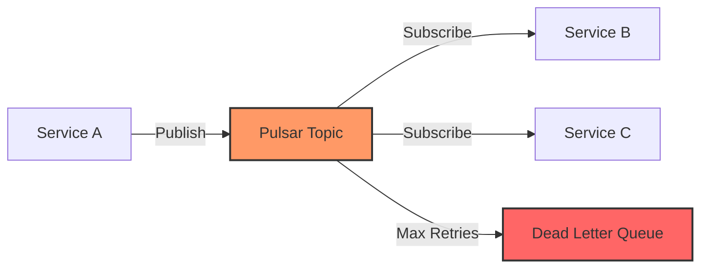
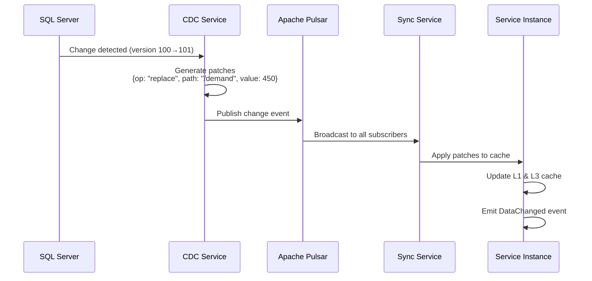
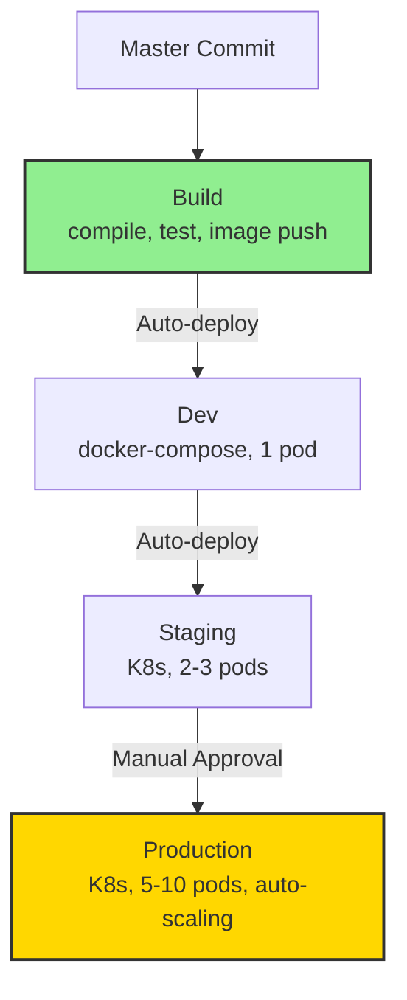

# SmartPulse Architectural Patterns & Design Decisions

**Version**: 1.0
**Last Updated**: 2025-11-12
**Status**: Current
**Audience**: Architects, senior developers, technical leads

---

## Table of Contents

1. [Overview](#overview)
2. [Fundamental Architecture Principles](#fundamental-architecture-principles)
3. [Cross-Service Communication Patterns](#cross-service-communication-patterns)
4. [Resilience & Fault Tolerance](#resilience--fault-tolerance)
5. [Background Service Patterns](#background-service-patterns)
6. [Scaling & Performance Optimization](#scaling--performance-optimization)
7. [Deployment & Configuration](#deployment--configuration)
8. [Monitoring & Observability](#monitoring--observability)
9. [Key Design Decisions & Trade-Offs](#key-design-decisions--trade-offs)
10. [Consistency Model](#consistency-model)

---

## Overview

SmartPulse implements a **highly distributed, event-driven microservices architecture** optimized for:

- **Real-time data synchronization** across service instances
- **Horizontal scalability** via stateless design and eventual consistency
- **Production resilience** through retry strategies, health checks, and graceful degradation
- **Multi-level caching** (in-memory, Redis, database) for performance at scale

### Key Technologies

| Technology | Purpose |
|------------|---------|
| **Apache Pulsar** | Event bus for asynchronous communication |
| **Redis** | Distributed cache + Pub/Sub for invalidation |
| **SQL Server CDC** | Change Data Capture for event sourcing |
| **.NET 9 / ASP.NET Core** | Microservice framework |
| **Docker & Kubernetes** | Container orchestration |

---

## Fundamental Architecture Principles

### 1. Layered Architecture with Separation of Concerns

All three services (ProductionForecast, NotificationService, Infrastructure) follow identical layering:

```
┌─────────────────────────────┐
│  Presentation Layer (API)   │  REST endpoints, HTTP validation
├─────────────────────────────┤
│  Application Layer          │  Business logic, orchestration, workflows
├─────────────────────────────┤
│  Repository/Data Access     │  Database queries, repository pattern
├─────────────────────────────┤
│  Infrastructure Layer       │  External services (Redis, Pulsar, DB)
├─────────────────────────────┤
│  Electric.Core Framework    │  CDC, caching, messaging, workers
└─────────────────────────────┘
```

**Benefits:**
- ✅ Clear responsibilities per layer
- ✅ Easy to test each layer independently
- ✅ Dependency Injection at each level
- ✅ Consistent across all services

### 2. Stateless Service Design

All services are **completely stateless**:

```
Service Instance A
├─ No local file storage
├─ No session state
├─ No inter-instance communication
└─ All state in: Redis or SQL Server
          ↓
Service Instance B (identical)
├─ Can replace Instance A at any time
├─ Auto-scales horizontally
└─ Load balancer: round-robin acceptable

Result: Any pod can handle any request
        → Horizontal scalability achieved
```

**Implications:**
- **Scaling:** 2 replicas → 10 replicas (transparent to code)
- **Updates:** Zero-downtime rolling updates
- **Recovery:** Pod crashes → auto-restart → transparent to users

### 3. Multi-Level Caching Strategy

SmartPulse implements a **4-tier caching hierarchy**:

```
Tier 1: In-Memory Cache (MemoryCache)
  │
  ├─ Speed: <1ms
  ├─ Scope: Per-pod (not shared)
  ├─ Used for: Frequently accessed config, hierarchies
  └─ TTL: 60-3600 seconds
          ↓
Tier 2: EF Core Second-Level Cache
  │
  ├─ Speed: 1-5ms
  ├─ Scope: Per-pod (DbContext query cache)
  ├─ Used for: Database query results
  └─ TTL: Query-level (no explicit TTL)
          ↓
Tier 3: Redis Distributed Cache
  │
  ├─ Speed: 5-20ms (network round-trip)
  ├─ Scope: Cluster-wide (all pods share)
  ├─ Used for: Cross-pod cache, invalidation triggers
  └─ TTL: 300-3600 seconds
          ↓
Tier 4: SQL Server Database
  │
  ├─ Speed: 50-500ms (query execution)
  ├─ Scope: Single source of truth
  └─ Used for: Persistent storage, CDC source
```

**Hit Probability:**
- **L1 (in-memory)**: 70-80% of requests
- **L2 (EF Core)**: 10-15% of requests
- **L3 (Redis)**: 5-10% of requests
- **L4 (Database)**: <1% of requests (cache miss = expensive)

<details>
<summary>Click to expand: Cache retrieval example</summary>

```csharp
var forecast = await cacheManager.GetAsync(forecastId);
// 1. Check L1 (MemoryCache) - 75% hit rate → return in <1ms
// 2. Check L2 (EF DbContext) - 15% hit rate → execute query, return in 5ms
// 3. Check L3 (Redis) - 8% hit rate → network call, return in 20ms
// 4. Query Database - 2% hit rate → fetch, cache in all 3 levels
```

</details>

**Related Documentation:**
- [Electric.Core Architecture](../components/electric_core.md#architecture)
- [System Overview - Data Flow](00_system_overview.md#13-data-flow-architecture)

---

## Cross-Service Communication Patterns

### 1. Event-Driven via Apache Pulsar

All services communicate through **Apache Pulsar topics**:



**Key Principle**: Services are decoupled
- No direct HTTP calls between services
- Publishers don't know about subscribers
- Events persisted in Pulsar (at-least-once delivery)

**Event Types in SmartPulse:**

| Event Type | Topic | Purpose | Pattern |
|------------|-------|---------|---------|
| **Cache Invalidation** | `forecast:invalidation` | Forecast/hierarchy changed | Fan-out (1→N) |
| **Notification Events** | `notification:publish` | System event (alert, forecast ready) | Fan-out (N→1) |
| **CDC Change Events** | `cdc:table-changes` | Database row changes | Point-to-point (sequential) |

**Related Documentation:**
- [Electric.Core Apache Pulsar Integration](../components/electric_core.md#apache-pulsar-integration)
- [Data Flow & Communication](data_flow_communication.md#cross-service-integration-patterns)

### 2. Distributed Data Synchronization

SmartPulse implements **field-level change propagation** for distributed state:



**Versioning Strategy:**
- Each data object has `VersionId` (monotonic counter)
- CDC polling updates version on each write
- Subscribers check version to detect stale data
- **Gap detection** (version jump > 1) triggers full resync

**Related Documentation:**
- [Distributed Data Manager Component](../components/04_distributed_data_manager.md)
- [CDC Strategy Details](data_flow_communication.md#database-cdc-to-distributed-sync)

### 3. Change Detection via CDC (Change Data Capture)

**SQL Server CDC Configuration:**

<details>
<summary>Click to expand: CDC SQL commands</summary>

```sql
-- Enable CDC on database
EXEC sys.sp_cdc_enable_db;

-- Enable on table
EXEC sys.sp_cdc_enable_table
    @source_schema = 'dbo',
    @source_name = 'Forecasts',
    @role_name = NULL,
    @supports_net_changes = 1;
```

</details>

**Polling Mechanism:**

```
Version ID: 0 (initial)
    ↓
Query: SELECT * FROM CHANGETABLE(CHANGES dbo_Forecasts, 0)
    ├─ Result: [INSERT forecast_1, UPDATE forecast_2, DELETE forecast_3]
    └─ New version ID: 100
    ↓
Query: SELECT * FROM CHANGETABLE(CHANGES dbo_Forecasts, 100)
    ├─ Result: [UPDATE forecast_2]
    └─ New version ID: 101
    ↓
Query: SELECT * FROM CHANGETABLE(CHANGES dbo_Forecasts, 101)
    ├─ Result: [] (no changes)
    ├─ Backoff: Wait 50ms, 100ms, 200ms, ... (exponential)
    └─ Continue until stoppingToken
```

**Advantages:**
- ✅ No application code changes needed
- ✅ Database-level change tracking (atomic)
- ✅ Row-level granularity (single field change detected)
- ✅ Automatic cleanup (CDC engine manages history)

---

## Resilience & Fault Tolerance

### 1. Retry Strategies

SmartPulse implements **three retry patterns**:

#### Pattern 1: Fixed Retry (Simple Operations)

<details>
<summary>Click to expand: Fixed retry example</summary>

```csharp
// DistributedDataManager version increment
for (int i = 0; i < 100; i++)
{
    try
    {
        target.VersionId = await incrementVersionAsync();
        break;  // Success
    }
    catch { }
    await Task.Delay(50);  // Fixed 50ms delay
}
```

</details>

**Characteristics:**
- 100 attempts × 50ms = 5 seconds max
- No exponential backoff
- **Used for:** Redis operations (fast failure/recovery)

#### Pattern 2: Exponential Backoff (I/O Operations)

<details>
<summary>Click to expand: Exponential backoff example</summary>

```csharp
// MailWorkerService
for (int attempt = 1; attempt <= MaxAttempts; attempt++)
{
    try
    {
        await ProcessMailsAsync(items);
        break;  // Success
    }
    catch (Exception ex)
    {
        if (attempt == MaxAttempts) throw;

        // Exponential backoff: 100ms, 200ms, 400ms, 800ms
        var delay = BaseDelay * Math.Pow(2, attempt - 1);
        await Task.Delay(delay);
    }
}
```

</details>

**Characteristics:**
- Exponential delay: 2^n multiplier
- **Used for:** Database operations, external APIs
- Prevents thundering herd (spreading retries over time)

#### Pattern 3: SqlServerRetryingExecutionStrategy

<details>
<summary>Click to expand: EF Core retry configuration</summary>

```csharp
// EF Core database operations
options.EnableRetryOnFailure(
    maxRetryCount: 3,
    maxRetryDelaySeconds: 30,
    errorNumbersToAdd: null);  // All transient errors
```

</details>

**Built-in Transient Errors:**
- Connection timeouts
- Deadlocks
- Resource contention
- Temporary SQL Server unavailability

### 2. Health Checks & Graceful Degradation

**Health Check Endpoints:**

| Endpoint | Purpose | Check Frequency | Used By |
|----------|---------|-----------------|---------|
| `GET /health` | Service alive | Every 10 seconds | Kubernetes liveness probe |
| `GET /health/ready` | Service ready for traffic | Every 5 seconds | Kubernetes readiness probe |
| `GET /metrics` | Prometheus metrics | Every 15 seconds | Prometheus scraper |

**Readiness Prerequisites:**
- ✅ Database connectivity
- ✅ Redis connectivity
- ✅ Cache warm-up complete
- ✅ CDC trackers initialized

**Graceful Degradation Strategy:**

```
Cache L3 (Redis) fails:
  ├─ Fall back to L2 (EF Core cache)
  ├─ Performance degrades: ~5ms → ~20ms
  ├─ No functional failure
  └─ System continues

Cache L1 & L2 fail:
  ├─ Fall back to L4 (Database)
  ├─ Performance degrades: ~20ms → ~500ms
  ├─ No functional failure
  └─ System continues (slow)

Database fails:
  ├─ All tiers fail
  ├─ Return 503 Service Unavailable
  ├─ Kubernetes readiness probe fails
  └─ Load balancer stops sending traffic

Result: Partial failures don't cascade
        → System remains operational
```

### 3. Circuit Breaker Pattern (Implicit)

SmartPulse doesn't explicitly use circuit breakers but implements similar behavior:

<details>
<summary>Click to expand: Cache miss handling example</summary>

```csharp
// Cache miss handling (Redis offline scenario)
var cached = redis.StringGet(key);

if (cached.IsNull)
{
    // L3 failed, try L2
    var fromDb = await dbContext.Forecasts.FirstOrDefaultAsync(f => f.Id == id);

    if (fromDb != null)
    {
        // L2 succeeded, return from database
        return fromDb;
    }

    // L2 also failed, return 500
    throw new ServiceUnavailableException();
}
```

</details>

**Effect:**
- Requests circuit automatically on dependency failure
- Timeouts (5 seconds) prevent cascading failures
- Automatic recovery when dependency comes back online

---

## Background Service Patterns

### 1. AutoBatchWorker (Batch Processing)

Generic batch processor for high-throughput operations:

<details>
<summary>Click to expand: AutoBatchWorker implementation</summary>

```csharp
public class AutoBatchWorker<TInput>
{
    private readonly ConcurrentQueue<(TInput, TaskCompletionSource<bool>)> _queue;
    private readonly Func<List<TInput>, Task> _processItemAsync;
    private readonly int _batchSize;

    public AutoBatchWorker(Func<List<TInput>, Task> processItemAsync, int batchSize = 100)
    {
        _batchSize = batchSize;
        _ = ProcessQueue();  // Start background loop
    }

    private async Task ProcessQueue()
    {
        while (true)
        {
            var batch = new List<TInput>();

            // Dequeue up to _batchSize items
            while (_queue.TryDequeue(out var item) && batch.Count < _batchSize)
                batch.Add(item.Item1);

            if (batch.Count > 0)
                await _processItemAsync(batch);  // Process entire batch

            await Task.Delay(100);  // Prevent CPU spinning
        }
    }
}
```

</details>

**Usage Example: MailAutoBatchWorker**

```csharp
// Enqueue mails
await worker.EnqueueMailWithAttachmentsAsync(mail);

// Background worker processes every 100 mails or 100ms
// 1. Groups by template
// 2. Renders templates (parallel via Node.js)
// 3. Bulk inserts to database
// 4. Retries on failure (exponential backoff)
```

**Performance Characteristics:**
- **Throughput**: 1000-5000 items/second
- **Latency**: 50-150ms (from enqueue to batch start)
- **Batch size**: 100 (configurable)
- **Backpressure**: Queue size monitored, stops if >10K items

**Related Documentation:**
- [Electric.Core Workers](../components/electric_core.md#architecture)

### 2. DistributedDataSyncService (Distributed State)

Synchronizes data changes across all instances:

<details>
<summary>Click to expand: DistributedDataSyncService implementation</summary>

```csharp
public class DistributedDataSyncService : BackgroundService
{
    protected override async Task ExecuteAsync(CancellationToken stoppingToken)
    {
        // Two parallel tasks per manager
        await Task.WhenAll(_managers.Select(m => Task.WhenAll(
            GetAndApplyChangesAsync(m, stoppingToken),      // Task 1: Listen & apply
            FlushCacheAsync(m, stoppingToken)               // Task 2: Periodic maintenance
        )));
    }

    // Task 1: Change Detection Loop (runs forever)
    private async Task GetAndApplyChangesAsync(IDistributedDataManager manager, CancellationToken ct)
    {
        await foreach (var change in manager.GetDistributedDataChangeEnumerationAsync("*", ct))
        {
            // Subscribe to Redis Pub/Sub for changes
            await manager.ApplyDataChangesAsync(change);
        }
    }

    // Task 2: Periodic Flushing Loop (every 5 min)
    private async Task FlushCacheAsync(IDistributedDataManager manager, CancellationToken ct)
    {
        while (!ct.IsCancellationRequested)
        {
            // Flush change buffer (every 10 seconds, max age 10s)
            await manager.FlushChangeBufferAsync(TimeSpan.FromSeconds(10));

            // Flush stale data (every 10 minutes, max age 1 day)
            await manager.FlushDataAsync(TimeSpan.FromDays(1));

            await Task.Delay(TimeSpan.FromMinutes(5), ct);
        }
    }
}
```

</details>

**Behavior:**
- **Always on:** Starts with application, runs until shutdown
- **Partition-aware:** Per-partition ordered processing (prevents race conditions)
- **Eventually consistent:** Changes eventually propagate to all instances
- **Self-healing:** Automatic version mismatch detection & resync

**Related Documentation:**
- [Distributed Data Manager](../components/04_distributed_data_manager.md)
- [CDC to Distributed Sync Flow](data_flow_communication.md#database-cdc-to-distributed-sync)

---

## Scaling & Performance Optimization

### 1. Horizontal Scaling Strategy

SmartPulse scales to 10+ pod replicas:

```yaml
HorizontalPodAutoscaler:
  minReplicas: 2    # HA requirement
  maxReplicas: 10   # Cost control
  cpuThreshold: 70%
  memoryThreshold: 80%

Result:
  - 1 pod: Cannot handle peak load
  - 2 pods: Baseline (always running)
  - 5 pods: Normal load
  - 10 pods: Peak load (all replicas used)
```

**Why Stateless Design Enables This:**
- No shared state on pods (all in Redis/DB)
- Pod A can be killed → Request routes to Pod B seamlessly
- Load balancer: Round-robin acceptable (no session affinity needed)
- Cost: $X per 2 pods, scales linearly

### 2. Caching as Scaling Multiplier

Multi-level cache dramatically reduces database load:

```
Without caching:
  1 pod: 1000 requests/sec → 1000 DB queries/sec (bottleneck)

With 4-tier caching:
  1 pod: 1000 requests/sec
    ├─ 750 from L1 (in-memory) → 0 DB queries
    ├─ 150 from L2 (EF Core) → 0 DB queries
    ├─ 80 from L3 (Redis) → 0 DB queries
    └─ 20 from L4 (Database) → 20 DB queries

  Result: 1000 requests → 20 DB queries (50× reduction)

With 10 pods:
  10,000 requests/sec → 200 DB queries/sec (easily handled)

Effect: Cache enables horizontal scaling
```

**Cache Hit Rates by Tier:**

| Tier | Hit Rate | Speed | Workload |
|------|----------|-------|----------|
| L1 (MemoryCache) | 70-80% | <1ms | Per-pod cache |
| L2 (EF Core) | 10-15% | 1-5ms | DbContext query cache |
| L3 (Redis) | 5-10% | 5-20ms | Cross-pod cache |
| L4 (Database) | <1% | 50-500ms | Source of truth |

### 3. Batch Processing for Throughput

AutoBatchWorker patterns maximize throughput:

```
Single-item processing:
  100 emails/sec
  Overhead: N network round-trips, N DB transactions

Batch processing (100 emails/batch):
  5,000 emails/sec
  Overhead: 1 network round-trip, 1 DB transaction

Result: 50× throughput improvement
```

**Batch Size Optimization:**
- **Too small (1-10)**: Overhead-dominated
- **Optimal (100-500)**: Balance between latency and throughput
- **Too large (10K+)**: Memory overhead, latency tail increases

---

## Deployment & Configuration

### 1. Environment-Specific Configuration

SmartPulse adapts to environment via configuration:

| Environment | Cache TTL | Database | Redis | Logging Level | Replicas |
|-------------|-----------|----------|-------|---------------|----------|
| **Development** | 60 sec | sql.dev.smartpulse.io | redis:6379 (local) | Debug | 1 per service |
| **Staging** | 300 sec | sql.staging.smartpulse.io | redis-cluster (shared) | Information | 2-3 per service |
| **Production** | 3600 sec | voltdb.database.windows.net | redis-master (HA cluster) | Warning | 5-10 per service (auto-scaling) |

**Configuration Hierarchy:**

```
1. docker-compose.override.yml (dev-specific overrides)
2. docker-compose.yml (base configuration)
3. appsettings.{ENVIRONMENT}.json (environment-specific)
4. appsettings.json (application defaults)
5. Environment variables (runtime overrides)
```

### 2. CI/CD Pipeline Integration

Multi-stage Azure Pipelines deployment:



**Key Points:**
- ✅ Automatic deployment to Dev/Staging
- ✅ Manual approval for Production
- ✅ Blue-green deployment capability
- ✅ Rollback on failure (previous image maintained)

---

## Monitoring & Observability

### 1. OpenTelemetry Metrics

SmartPulse exports metrics to Prometheus:

**Endpoint:** `GET /metrics`

**Metrics Exported:**
- `process_cpu_seconds_total`
- `process_resident_memory_bytes`
- `process_working_set_bytes`
- `http_requests_total{method, status}`
- `http_request_duration_seconds{method, path}`
- `database_query_duration_seconds`
- `cache_hits_total`
- `cache_misses_total`
- `pulsar_messages_published_total`
- `pulsar_messages_consumed_total`

### 2. Logging Strategy

| Environment | Log Level | Storage | Alerts |
|-------------|-----------|---------|--------|
| **Development** | Debug | Console + File | None |
| **Production** | Warning | Database (NLog) | Email on Error |

**NLog Integration:**
- Logs persisted to database
- Searchable via SQL queries
- Email alerts on Error in production
- Integration with ELK/Splunk possible

---

## Key Design Decisions & Trade-Offs

### Decision 1: Event-Driven via Pulsar

**Why Pulsar over direct HTTP calls:**
- ✅ Services decoupled (don't need to know each other)
- ✅ Automatic retry & dead letter queue
- ✅ Publish-subscribe pattern (1→N publishers)
- ✅ Persistence (events stored durably)
- ⚠️ **Trade-off:** Eventual consistency (not immediate)

### Decision 2: Multi-Level Caching

**Why 4 tiers instead of single cache:**
- ✅ Dramatically reduces database load (50×)
- ✅ Improves latency (L1: <1ms vs L4: 500ms)
- ✅ Resilience (L3 failure → fall back to L2)
- ⚠️ **Trade-off:** Consistency complexity (cache invalidation timing)

### Decision 3: Stateless Services

**Why no local state:**
- ✅ Horizontal scalability (any pod = any request)
- ✅ Zero-downtime updates
- ✅ Automatic recovery (pod crash → restart transparent)
- ⚠️ **Trade-off:** All state must go to Redis/DB (network latency)

### Decision 4: Batch Processing

**Why AutoBatchWorker pattern:**
- ✅ 50× throughput improvement (100 items/batch)
- ✅ Reduced network round-trips
- ✅ Reduced database transactions
- ⚠️ **Trade-off:** Latency tail increases (batch wait time)

### Decision 5: CDC over Application-Level Change Tracking

**Why CDC:**
- ✅ Database-level accuracy (every change captured)
- ✅ No application code changes needed
- ✅ Atomic change detection (no missed updates)
- ⚠️ **Trade-off:** SQL Server specific (not portable to other DBs)

---

## Consistency Model

SmartPulse implements **eventual consistency** across all services:

```
Strong Consistency (immediate):
  ✗ Not needed for this use case
  ✗ Would require distributed locks (performance hit)

Eventual Consistency (seconds-to-minutes):
  ✓ Acceptable for: Forecasts, notifications, hierarchies
  ✓ Example: ProductionForecast updated
              → 1. Write to DB (committed)
              → 2. CDC detects change (1-5 sec delay)
              → 3. Publish to Redis (10ms)
              → 4. Other pods receive via Pub/Sub (20ms)
              → 5. Cache updated on all pods
              Total time: 1-5 seconds
```

### Consistency Guarantees

- ✅ Each pod eventually sees each update
- ✅ Updates applied in version order
- ✅ Version gaps trigger full resync
- ✅ No lost updates (CDC is atomic)

### Example Scenario

```
User A: Edits forecast X (demand: 100 → 150)
  ├─ Database updated immediately
  ├─ User A sees new value instantly
  └─ User B in different pod...

User B (on different pod):
  ├─ First request: Sees old value (100) from cache
  ├─ CDC detects change (after 1-5 seconds)
  ├─ Update propagated via Pub/Sub
  ├─ Next request: Sees new value (150)
  └─ Total lag: 1-5 seconds for visibility
```

**Impact:**
- ✓ Acceptable for business forecasts (humans work at second+ timescales)
- ✗ Not acceptable for financial transactions (need strong consistency)

---

## Related Documentation

- [System Overview](00_system_overview.md) - High-level system architecture
- [Data Flow & Communication](data_flow_communication.md) - API contracts and event schemas
- [Electric.Core Component](../components/electric_core.md) - Framework details
- [Distributed Data Manager](../components/04_distributed_data_manager.md) - Synchronization patterns

---

## Document Metadata

**Version History:**
- **1.0** (2025-11-12): Initial comprehensive architecture documentation

**Contributors:**
- Technical Architecture Team
- Based on Electric.Core Level_0 notes and Level_1 synthesis

**Maintenance:**
- Review quarterly or after major architectural changes
- Update diagrams in Mermaid format (no external images)
- Maintain trade-offs section for each pattern (benefits + drawbacks)
