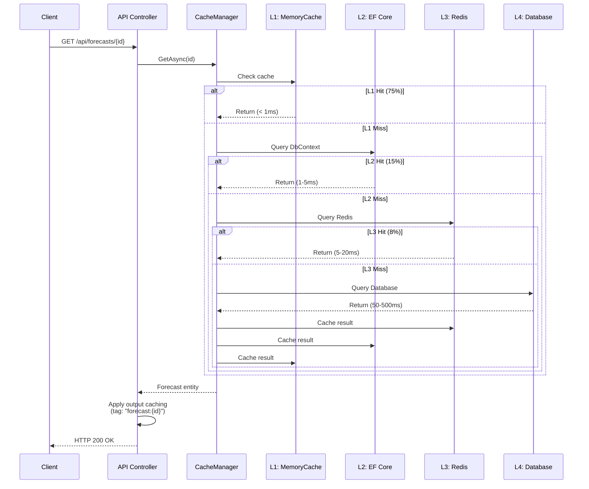
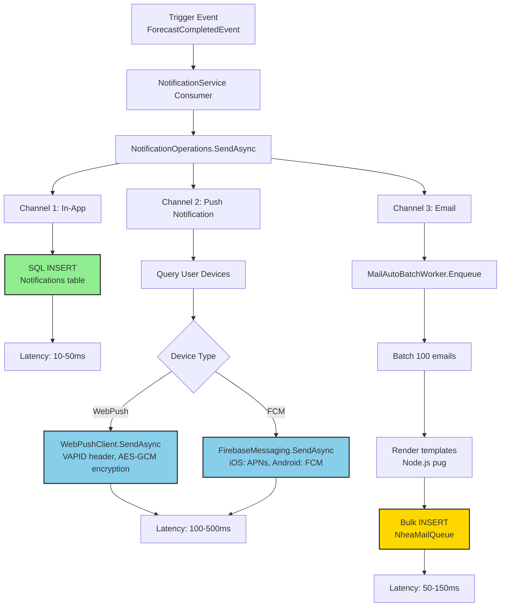
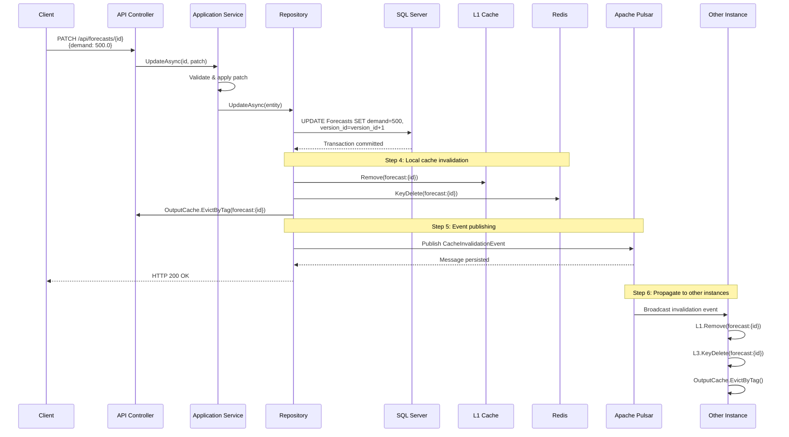
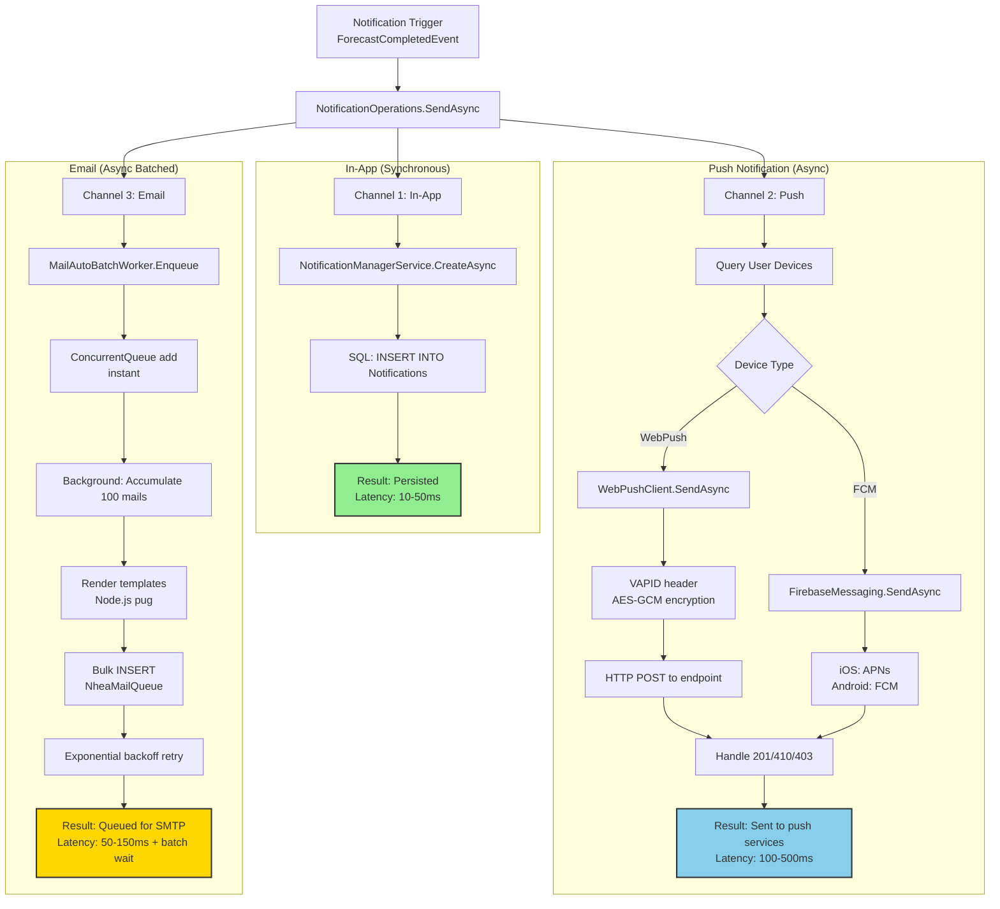
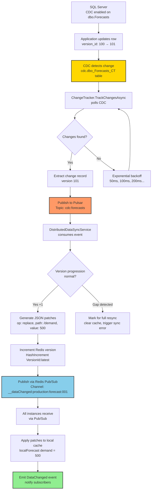
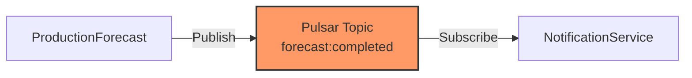

# SmartPulse Data Flow & Inter-Service Communication

**Version**: 1.0
**Last Updated**: 2025-11-12
**Status**: Current
**Audience**: API developers, integration engineers, system designers

---

## Table of Contents

1. [Overview](#overview)
2. [Data Flow Diagrams](#data-flow-diagrams)
3. [API Contract Specifications](#api-contract-specifications)
4. [Event Schemas & Payloads](#event-schemas--payloads)
5. [Cache Invalidation Flow](#cache-invalidation-flow)
6. [Multi-Channel Notification Flow](#multi-channel-notification-flow)
7. [Database CDC to Distributed Sync](#database-cdc-to-distributed-sync)
8. [Cross-Service Integration Patterns](#cross-service-integration-patterns)
9. [Performance Characteristics Summary](#performance-characteristics-summary)

---

## Overview

This document details the **end-to-end data flows**, **API contracts**, **event schemas**, and **integration points** across SmartPulse microservices. It complements the [Architectural Patterns](architectural_patterns.md) document with concrete implementation details.

### Key Communication Patterns

| Pattern | Technology | Use Case | Latency |
|---------|------------|----------|---------|
| **Synchronous API** | HTTP/REST | Client-server requests | 1-20ms (with cache) |
| **Asynchronous Events** | Apache Pulsar | Inter-service communication | Sub-second |
| **Cache Invalidation** | Redis Pub/Sub | Multi-instance synchronization | 1-5 seconds |
| **Change Data Capture** | SQL Server CDC | Database change tracking | 1-5 seconds |

---

## Data Flow Diagrams

### 1. ProductionForecast Service: Request-Response Flow



**Cache Hit Probability:**
- **L1 (in-memory)**: 70-80% → <1ms response
- **L2 (EF Core)**: 10-15% → 1-5ms response
- **L3 (Redis)**: 5-10% → 5-20ms response
- **L4 (Database)**: <1% → 50-500ms response

**Related Documentation:**
- [Architectural Patterns - Multi-Level Caching](architectural_patterns.md#3-multi-level-caching-strategy)
- [System Overview - Data Flow](00_system_overview.md#13-data-flow-architecture)

### 2. NotificationService: Multi-Channel Flow



**Channel Characteristics:**

| Channel | Storage | Delivery | Latency | Guarantee |
|---------|---------|----------|---------|-----------|
| **In-App** | Database (immediate) | Synchronous | 10-50ms | Durable |
| **Push Notification** | External (WebPush/FCM) | Asynchronous | 100-500ms | Best-effort |
| **Email** | Queue (batched) | Asynchronous | 50-150ms + batch wait | At-least-once |

**Related Documentation:**
- [Architectural Patterns - Background Services](architectural_patterns.md#background-service-patterns)

---

## API Contract Specifications

### 1. ProductionForecast API

**Base URL:** `http://productionforecast:8080/api`

#### Endpoint: GET /forecasts/{id}

<details>
<summary>Click to expand: Request/Response details</summary>

**Request:**
```http
GET /api/forecasts/{id} HTTP/1.1
Authorization: Bearer {jwt_token}
```

**Response 200 OK:**
```json
{
  "id": "uuid",
  "companyId": "uuid",
  "productionUnitId": "uuid",
  "forecastDate": "2025-11-12T10:30:00Z",
  "demand": 450.5,
  "supply": 480.0,
  "variance": 29.5,
  "confidenceLevel": 0.95,
  "status": "Completed",
  "createdAt": "2025-11-12T10:00:00Z",
  "updatedAt": "2025-11-12T10:30:00Z",
  "versionId": 12345
}
```

**Response 404 Not Found:**
```json
{
  "error": "Forecast not found",
  "code": "FORECAST_NOT_FOUND"
}
```

**Response 401 Unauthorized:**
```json
{
  "error": "Invalid or missing token",
  "code": "UNAUTHORIZED"
}
```

</details>

**Caching Headers:**
```http
Cache-Control: max-age=60, public
ETag: "abc123"
X-Cache-Hit: true
X-Cache-Level: L1|L2|L3|L4
```

#### Endpoint: POST /forecasts

<details>
<summary>Click to expand: Request/Response details</summary>

**Request:**
```http
POST /api/forecasts HTTP/1.1
Content-Type: application/json

{
  "companyId": "uuid",
  "productionUnitId": "uuid",
  "forecastDate": "2025-11-13T00:00:00Z",
  "demand": 500.0,
  "confidence": 0.92
}
```

**Response 201 Created:**
```json
{
  "id": "uuid",
  "companyId": "uuid",
  "productionUnitId": "uuid",
  "forecastDate": "2025-11-13T00:00:00Z",
  "demand": 500.0,
  "supply": 520.0,
  "variance": 20.0,
  "confidenceLevel": 0.92,
  "status": "Pending",
  "createdAt": "2025-11-12T10:35:00Z",
  "updatedAt": "2025-11-12T10:35:00Z",
  "versionId": 12346
}
```

</details>

**Events Published:**
- **Topic:** `forecast:invalidation`
- **Payload:**
  ```json
  {
    "entityId": "forecast_uuid",
    "tags": ["unit:uuid", "company:uuid"],
    "timestamp": "2025-11-12T10:30:00Z"
  }
  ```

**Side Effects:**
- L1 cache: Invalidated
- L3 cache (Redis): Invalidated
- CDC: Change tracked (VersionId incremented)
- Output cache: Tag-invalidated ("forecast:*")

### 2. NotificationService API

**Base URL:** `http://notificationservice/api`

#### Endpoint: GET /notifications

<details>
<summary>Click to expand: Request/Response details</summary>

**Request:**
```http
GET /api/notifications?skip=0&take=20 HTTP/1.1
Authorization: Bearer {jwt_token}
```

**Response 200 OK:**
```json
{
  "total": 150,
  "items": [
    {
      "id": "uuid",
      "userId": "uuid",
      "title": "Forecast Completed",
      "body": "Your forecast for Unit A is ready",
      "type": "ForecastCompleted",
      "readAt": null,
      "createdAt": "2025-11-12T10:30:00Z"
    }
  ]
}
```

**Stored Procedure Used:**
```sql
dbo.GetNotifications @UserId, @Skip, @Take

-- Query Execution:
SELECT TOP @Take *
FROM Notifications
WHERE UserId = @UserId
ORDER BY CreatedAt DESC
OFFSET @Skip ROWS
```

</details>

#### Endpoint: PUT /notifications/{id}/read

<details>
<summary>Click to expand: Request/Response details</summary>

**Request:**
```http
PUT /api/notifications/{id}/read HTTP/1.1
Authorization: Bearer {jwt_token}
```

**Response 200 OK:**
```json
{
  "success": true
}
```

**Database Update:**
```sql
UPDATE Notifications
SET ReadAt = GETUTCDATE()
WHERE Id = @Id AND UserId = @CurrentUserId
```

</details>

#### Endpoint: POST /send-push-notification

<details>
<summary>Click to expand: Request/Response details</summary>

**Request:**
```http
POST /api/send-push-notification HTTP/1.1
Content-Type: application/json

{
  "userId": "uuid",
  "title": "Alert",
  "body": "Forecast alert: production down 20%",
  "deviceType": "WebPush|FCM|Both"
}
```

**Response 200 OK:**
```json
{
  "sent": 3,
  "failed": 0,
  "results": [
    { "deviceId": "uuid", "status": "sent" },
    { "deviceId": "uuid", "status": "sent" },
    { "deviceId": "uuid", "status": "sent" }
  ]
}
```

**Internal Flow:**
1. Query `SysUserDeviceInfo` for `userId`
2. For each device:
   - **WebPush:** Call `WebPushClient.SendAsync()`
   - **FCM:** Call `FirebaseMessaging.SendAsync()`
3. Handle device-specific errors (410, 403, timeout)
4. Return aggregated results

</details>

---

## Event Schemas & Payloads

### 1. Pulsar Event: Forecast Updated

**Topic:** `forecast:updated`
**Subscription:** `productionforecast-cache-sync`

<details>
<summary>Click to expand: Event schema</summary>

```json
{
  "eventType": "ForecastUpdated",
  "eventId": "uuid",
  "timestamp": "2025-11-12T10:30:00Z",
  "aggregateId": "forecast_uuid",
  "aggregateType": "Forecast",
  "data": {
    "forecastId": "forecast_uuid",
    "companyId": "company_uuid",
    "unitId": "unit_uuid",
    "previousVersionId": 100,
    "currentVersionId": 101,
    "changes": [
      {
        "field": "demand",
        "oldValue": 450.0,
        "newValue": 500.0
      },
      {
        "field": "confidence",
        "oldValue": 0.90,
        "newValue": 0.95
      }
    ]
  },
  "source": "ProductionForecast.Api",
  "userId": "user_uuid"
}
```

</details>

### 2. Pulsar Event: Cache Invalidation

**Topic:** `forecast:invalidation`
**Type:** Fan-out (all instances subscribe)

<details>
<summary>Click to expand: Event schema and processing</summary>

```json
{
  "entityId": "forecast_uuid",
  "entityType": "Forecast",
  "tags": [
    "unit:unit_uuid",
    "company:company_uuid",
    "provider:provider_uuid"
  ],
  "timestamp": "2025-11-12T10:30:00Z",
  "reason": "DataUpdated"
}
```

**Processing on Receiving Instance:**
1. Remove from L3 cache: `redis.KeyDelete($"forecast:{forecast_uuid}")`
2. Remove from L1 cache: `memoryCache.Remove($"forecast:{forecast_uuid}")`
3. Remove tag-based cache: `outputCache.EvictByTagAsync("forecast:*")`
4. Emit DataChanged event: `DataIsChanged?.Invoke(this, new DistributedDataChangedInfo(...))`

</details>

### 3. Redis Pub/Sub Message: Distributed Data Change

**Channel:** `__dataChanged:{partition}:{section}:{dataKey}`
**Example:** `__dataChanged:production:forecast:forecast_001`

<details>
<summary>Click to expand: Message schema and operations</summary>

```json
{
  "DataManagerId": "manager_uuid",
  "PartitionKey": "production",
  "Section": "forecast",
  "DataKey": "forecast_001",
  "VersionId": 101,
  "ChangeTime": "2025-11-12T10:30:00Z",
  "PatchItems": [
    {
      "Op": "replace",
      "Path": "/demand",
      "Value": 500.0
    },
    {
      "Op": "add",
      "Path": "/tags/0",
      "Value": "critical"
    },
    {
      "Op": "remove",
      "Path": "/deprecated_field"
    }
  ]
}
```

**Patch Operations (JSON Pointer - RFC 6901):**
- **"replace"**: Update existing field
- **"add"**: Add new array element
- **"remove"**: Delete field
- **Path format:** `/level1/level2/0` (JSON Pointer)

</details>

**Related Documentation:**
- [Distributed Data Manager](../components/04_distributed_data_manager.md)
- [Electric.Core Apache Pulsar](../components/electric_core.md#apache-pulsar-integration)

---

## Cache Invalidation Flow

### Complete Cache Invalidation Sequence



### Invalidation Steps Breakdown

**Step 1-3: Update Initiates**
- Client sends PATCH request
- Application layer processes update
- Database transaction commits

**Step 4: Local Cache Invalidation (Same Instance)**
- L1 (MemoryCache): `memoryCache.Remove($"forecast:{id}")`
- L2 (EF Core): `dbContext.ChangeTracker.Clear()` (implicit)
- L3 (Redis): `redis.KeyDelete($"forecast:{id}")`
- Output cache: `outputCache.EvictByTagAsync("forecast:{id}")`

**Step 5: Event Publishing**
- Create invalidation event with entity ID and tags
- Publish to Pulsar topic: `forecast:invalidation`
- Message persisted (at-least-once guarantee)

**Step 6: Propagate to Other Instances**
- All instances subscribed to `forecast:invalidation`
- Each instance receives same event
- Per-instance processing:
  - Remove from L1 (MemoryCache)
  - Remove from L3 (Redis)
  - Invalidate output cache
  - Ready for next request (cache miss → reload)

**Step 7-9: CDC Background Processing**
- ChangeTracker polls CDC for changes
- Detects version progression (100→101)
- Publishes to Pulsar: `cdc:forecasts`
- DistributedDataSyncService processes and generates JSON patches
- Publishes via Redis Pub/Sub to all instances

**Total Latency:** Complete invalidation across cluster in **1-5 seconds**

**Related Documentation:**
- [Architectural Patterns - Cache Invalidation](architectural_patterns.md#3-multi-level-caching-strategy)
- [System Overview - Data Flow](00_system_overview.md#13-data-flow-architecture)

---

## Multi-Channel Notification Flow

### Complete Notification Publishing Sequence



### Channel Implementation Details

#### Channel 1: In-App Notification (Synchronous)

<details>
<summary>Click to expand: Implementation details</summary>

**Process:**
1. `NotificationManagerService.CreateAsync()`
2. Build entity:
   ```csharp
   {
     Id: NewGuid(),
     UserId: userId,
     Title: "Production Alert",
     Body: "Demand dropped 30%",
     Type: NotificationType.Alert,
     ReadAt: null,
     CreatedAt: UtcNow
   }
   ```
3. Stored procedure: `dbo.InsertNotification (@params)`
4. SQL: `INSERT INTO Notifications (...) VALUES (...)`
5. Result: Persisted to database (durable)

**Latency:** 10-50ms

</details>

#### Channel 2: Push Notification (Async)

<details>
<summary>Click to expand: Implementation details</summary>

**Process:**
1. `PushNotificationSender.SendAsync()`
2. Query user devices: `dbo.GetUserDevices @UserId`
3. For each device (parallel):

**WebPush (IntegrationType == 0):**
- Query subscription JSON from `SysUserDeviceInfo`
- Parse subscription object (endpoint, keys: p256dh, auth)
- Create VAPID header: `Authorization: vapid t={jwt}, pk={publicKey}`
- HTTP POST to endpoint with AES-GCM encrypted payload
- Handle responses:
  - **201 Created:** ✓ Sent successfully
  - **410 Gone:** ✗ Remove device from DB
  - **403 Forbidden:** ✗ Invalid credentials (log alert)
  - **Timeout:** Retry with exponential backoff

**FCM (IntegrationType == 1):**
- Create message with platform-specific configs:
  ```json
  {
    "token": deviceToken,
    "notification": { "title": "...", "body": "..." },
    "apns": { "aps": { "alert": {...}, "badge": 1, "sound": "default" } },
    "android": { "priority": "high", "notification": { "icon": "ic_notification" } }
  }
  ```
- Call `FirebaseMessaging.SendAsync()`
- Firebase handles iOS (APNs) and Android (FCM) delivery
- Auto-retry on transient failures
- Handle invalid token: Remove from DB

**Latency:** 100-500ms (all devices in parallel)

</details>

#### Channel 3: Email Notification (Async Batched)

<details>
<summary>Click to expand: Implementation details</summary>

**Process:**
1. `MailAutoBatchWorker.EnqueueMailWithAttachmentsAsync()`
2. Build mail item:
   ```csharp
   {
     To: user.Email,
     Subject: "Production Alert",
     TemplateId: alert_template_id,
     TemplateData: {
       userName: "John",
       alertMessage: "Demand dropped 30%",
       forecastLink: "https://..."
     }
   }
   ```
3. Enqueue to worker: Added to `ConcurrentQueue` (instant)
4. Batching process (background):
   - Worker accumulates 100 mails
   - Render templates (pug via Node.js): `node dist/render-template.js "alert_template" {data}`
   - Result: HTML email
   - Bulk insert to database: `INSERT INTO NheaMailQueue (...) VALUES (...), (...), ...` (100 rows)
   - Retry on failure:
     - Attempt 1: 100ms delay
     - Attempt 2: 200ms delay
     - Attempt 3: 400ms delay
     - Attempt 4: 800ms delay (max)
   - Result: Email queued for SMTP transmission (separate service)

**Latency:** 50-150ms + batch wait

</details>

**Result Summary:**
- **Single API call** triggers **3 independent channels**
- **In-app:** Stored immediately (~50ms)
- **Push:** Sent to push services in parallel (~500ms)
- **Email:** Queued for batched processing (~100ms + batch wait)

**Related Documentation:**
- [Architectural Patterns - Background Services](architectural_patterns.md#1-autobatchworker-batch-processing)

---

## Database CDC to Distributed Sync

### Complete CDC Pipeline



### CDC Pipeline Step-by-Step

**Step 1: Application Updates Row**
- API endpoint: `PATCH /api/forecasts/{id}`
- SQL: `UPDATE Forecasts SET demand=500, version_id=version_id+1 WHERE id=...`
- Transaction commits
- Version ID: 100 → 101

**Step 2: CDC Detects Change**
- Internal SQL Server mechanism tracks in `cdc.dbo_Forecasts_CT` table
- Change record includes:
  ```
  __$start_lsn: <binary log sequence>
  __$operation: 4 (UPDATE)
  Id: forecast_uuid
  demand: 500.0
  version_id: 101
  ```
- Retention: Automatic (CDC cleanup job)

**Step 3: ChangeTracker Polls CDC**

<details>
<summary>Click to expand: Polling implementation</summary>

```csharp
// Background task: ChangeTracker.TrackChangesAsync()
// Continuous polling with exponential backoff

var versionId = 100; // Last processed version

// Query CDC
var query = "SELECT * FROM CHANGETABLE(CHANGES dbo_Forecasts, @version_id)";
var results = await db.ExecuteQueryAsync(query, new { version_id = versionId });

if (results.Any())
{
    // Changes found: version 100→101
    foreach (var change in results)
    {
        // Process change
        await PublishToPulsar(change);
        versionId = change.VersionId; // Update to 101
    }
}
else
{
    // No changes: exponential backoff
    // No changes for 1 sec → wait 50ms
    // No changes for 10 sec → wait 100ms
    // No changes for 100 sec → wait 200ms
    // Max wait: ~5 seconds
    await Task.Delay(CalculateBackoff(noChangesDuration));
}
```

</details>

**Step 4: Publish to Pulsar**
- **Topic:** `cdc:forecasts`
- **Message:**
  ```json
  {
    "EventId": "uuid",
    "Timestamp": "2025-11-12T10:30:00Z",
    "VersionId": 101,
    "Operation": "UPDATE",
    "EntityId": "forecast_uuid",
    "Data": { "id": "...", "demand": 500.0, ... }
  }
  ```
- **Compression:** Zstd (20-30% size reduction)
- **Persistence:** Durable in Pulsar (retention: 7 days)
- **Delivery:** At-least-once (via subscription acknowledgment)

**Step 5: DistributedDataSyncService Consumes**
- **Subscription:** `productionforecast-cdc-sync`
- **Subscription type:** Exclusive (single consumer, ordered)
- Process message:
  1. Extract version: 101
  2. Load previous from cache: version 100
  3. Check progression: 100 → 101 (normal, +1)
  4. Generate patches:
     ```json
     { "Op": "replace", "Path": "/demand", "Value": 500.0 }
     ```
  5. Increment Redis version counter: `redis.HashIncrement("forecast:forecast_001", "VersionId:latest")`

**Version Gap Detection:**
- If version jump > 1 (e.g., 101 → 103):
  - Detect: Missing update (102)
  - Action: Mark for full resync
  - Clear local cache
  - Trigger: `SyncErrorHappenedAsync` event

**Step 6: Publish via Redis Pub/Sub**
- **Channel:** `__dataChanged:production:forecast:forecast_001`
- **Message:** `{ ...patches, VersionId: 101 }`

**Step 7: All Instances Receive via Pub/Sub**
- Instance 1, 2, 3 all receive message
- Per-instance processing:
  1. `DistributedDataManager.ApplyDataChangesAsync()`
  2. Verify version (no gap)
  3. Apply patches: `localForecast["demand"] = 500.0`
  4. Update L1 & L3 cache
  5. Emit `DataChanged` event
  6. Subscribers notified

**Total Latency:** **1-5 seconds** (database → all instances)
- CDC detection: 100-500ms
- Polling to Pulsar: 100-300ms
- Pulsar propagation: 50-100ms
- Redis Pub/Sub delivery: 10-50ms
- Instance processing: 10-50ms

**Related Documentation:**
- [Architectural Patterns - CDC Strategy](architectural_patterns.md#3-change-detection-via-cdc-change-data-capture)
- [Distributed Data Manager](../components/04_distributed_data_manager.md)

---

## Cross-Service Integration Patterns

### 1. Service A → Service B Communication

**Pattern:** Event-Driven (Asynchronous)



**Event Flow:**
- ProductionForecast publishes: `ForecastCompletedEvent`
- Topic: `forecast:completed`
- Payload: `{ ForecastId, Status, CompletedAt }`
- NotificationService subscribes:
  - Subscription: `notification-service-consumer`
  - Processes: Create notification for user
  - Side effect: Send push notifications
  - **Decoupled:** ProductionForecast doesn't know about NotificationService

**Benefits:**
- ✅ Services don't need to know each other
- ✅ Async processing (non-blocking)
- ✅ Durable (events persist in Pulsar)
- ✅ Scalable (multiple subscribers possible)

### 2. Shared Infrastructure Dependencies

```
All services depend on:
    │
    ├─ SQL Server Database
    │   └─ Each service has own schema/tables
    │   └─ CDC enabled for change tracking
    │   └─ Connection pooling (max 100 connections/pod)
    │
    ├─ Redis Cache
    │   └─ Shared key namespace (partition: "forecast", "notification")
    │   └─ Pub/Sub for invalidation
    │   └─ Memory limit: 10GB cluster
    │
    └─ Apache Pulsar Message Bus
        └─ Topics for each event type
        └─ Subscriptions per service
        └─ Retention: 7 days per topic
```

### 3. Error Handling Across Services

**Scenario:** NotificationService cannot reach Firebase

<details>
<summary>Click to expand: Error handling flow</summary>

**Flow:**
1. Send push notification attempt
2. Firebase unreachable (timeout after 5 seconds)
3. Retry: Exponential backoff (100ms, 200ms, 400ms, 800ms)
4. After 4 failures: Log error
   - `NLog.LogError("Firebase send failed")`
   - In production: Trigger email alert to ops

**Behavior:**
- **In-app notification:** Still sent (database layer working)
- **Push notification:** Retry up to 4 times, then fail
- **Email:** Still queued and sent (separate channel)
- **User impact:** Degraded (missing push, but other channels work)
- **System impact:** Partial failure, no cascade

</details>

**Related Documentation:**
- [Architectural Patterns - Resilience](architectural_patterns.md#resilience--fault-tolerance)

---

## Performance Characteristics Summary

### Data Flow Latency Comparison

| Flow | Trigger | Latency | Channels | Consistency Guarantee |
|------|---------|---------|----------|----------------------|
| **Cache Miss** | Client request | <20ms (L3-L4) | Single read | Single source of truth |
| **Cache Invalidation** | Data update | 1-5 seconds | Pulsar broadcast | Eventually consistent |
| **Notification** | Event trigger | 50-500ms | In-app, Push, Email | Best-effort (per channel) |
| **CDC Sync** | Database change | 1-5 seconds | Redis Pub/Sub | Version-ordered |

### Key System Insights

SmartPulse achieves **high scalability** through:

1. **Event-driven decoupling** - Services independent
2. **Multi-tier caching** - 50× DB load reduction
3. **Eventual consistency model** - Not strongly consistent
4. **Batch processing** - 50× throughput improvement
5. **Horizontal scaling** - Stateless design

**Production Readiness:** ✅ Yes
- ✅ Horizontal scaling enabled
- ✅ Multi-level fallbacks
- ✅ Comprehensive monitoring
- ✅ Graceful degradation
- ✅ Event-driven architecture

---

## Related Documentation

- [Architectural Patterns](architectural_patterns.md) - Design decisions and trade-offs
- [System Overview](00_system_overview.md) - High-level system architecture
- [Electric.Core Component](../components/electric_core.md) - Framework implementation details
- [Distributed Data Manager](../components/04_distributed_data_manager.md) - Synchronization patterns

---

## Document Metadata

**Version History:**
- **1.0** (2025-11-12): Initial comprehensive data flow documentation

**Contributors:**
- Technical Architecture Team
- Based on Level_1 synthesis and Level_0 service analysis

**Maintenance:**
- Review quarterly or after API contract changes
- Update event schemas when message formats change
- Maintain Mermaid diagrams for visual clarity
- Document all new integration patterns
