# Electric.Core Framework - Component Documentation

**Last Updated**: 2025-11-13
**Purpose**: Infrastructure library providing distributed messaging, caching, collections, and change tracking primitives for SmartPulse microservices.

---

## Table of Contents

1. [Overview](#overview)
2. [Architecture](#architecture)
3. [Apache Pulsar Integration](#apache-pulsar-integration)
4. [Caching Strategy](#caching-strategy)
5. [Concurrent Collections](#concurrent-collections)
6. [Distributed Data Management](#distributed-data-management)
7. [Change Data Capture](#change-data-capture)
8. [Worker Patterns](#worker-patterns)
9. [Pipeline Infrastructure](#pipeline-infrastructure)
10. [Electricity Domain Models](#electricity-domain-models)
11. [API Reference](#api-reference)
12. [Usage Examples](#usage-examples)

---

## Overview

Electric.Core is a foundational infrastructure library used by all SmartPulse services. It abstracts away complexity of:

- **Distributed messaging** via Apache Pulsar (producer pooling, compression, serialization)
- **Multi-level caching** with thread-safe access patterns
- **Concurrent data structures** optimized for specific workloads
- **Field-level distributed synchronization** using CRDT-like patterns
- **Real-time change tracking** via SQL Server CDC
- **Scalable processing** with worker patterns and pipeline abstractions

### Key Dependencies

```
Electric.Core
├── DotPulsar (4.3.2) - Apache Pulsar client
├── StackExchange.Redis (2.9.25) - Redis client
├── System.Runtime.Caching - In-memory caching
├── System.Text.Json - JSON serialization
├── MongoDB.Bson - Extended JSON format support
├── NodaTime - Timezone-aware datetime
└── Newtonsoft.Json - JSON Patch operations
```

---

## Architecture

Electric.Core is organized into **7 major component categories**:

#### 📨 **Message Bus** (Apache Pulsar Integration)
- **SmartpulsePulsarClient** - High-level wrapper with producer pooling and compression
- **Consumers** - IAsyncEnumerable pattern for typed, string, and raw binary consumers
- **Compression** - LZ4, Zstd, Snappy compression per topic

#### 💾 **Caching Layer** (In-Memory & Distributed)
- **MemoryCacheHelper** - Cache-Aside pattern with SemaphoreSlim stampede prevention
- **ObjectPool** - List<T> and Channel<T> reuse for GC reduction
- **Redis Integration** - Distributed cache with field-level versioning

#### 🗂️ **Concurrent Collections** (Thread-Safe Data Structures)
- **ConcurrentObservableDictionary** - Thread-safe + INotifyCollectionChanged events
- **AutoConcurrentPartitionedQueue** - Kafka-style partitioned processing (100K+/sec)
- **ConcurrentPriorityQueue** - Priority-based FIFO with custom comparers

#### 🔄 **Distributed Data** (CRDT-Like Synchronization)
- **DistributedDataManager<T>** - Field-level sync across instances
- **VersionId + PatchItems** - Delta replication format
- **Redis Pub/Sub** - Event broadcasting to all instances

#### ⚡ **Domain Models** (Electricity Market)
- Market domain models (Intraday trading, orders, positions)
- Entity definitions with IDistributedData interface
- Platform-specific managers (EPIAS, NORDPOOL, OMIE)

#### 📊 **Change Data Capture** (CDC - Real-time Change Tracking)
- **TableChangeTrackerBase** - SQL Server CDC polling
- **ChangeItem** - Operation stream (INSERT, UPDATE, DELETE)
- **IChangeTracker** - Interface for CDC implementations

#### 🔗 **Pipeline** (TPL Dataflow)
- **TplPipeline** - Dataflow block abstraction
- **Producer/Consumer blocks** - Async processing pipelines

---

### Architecture Diagrams

#### **Layer 1: Core Electric.Core Library**

```mermaid
%%{init: {'theme':'base', 'themeVariables': { 'fontSize':'20px', 'primaryColor':'#0288d1', 'primaryBorderColor':'#01579b'}}}%%
graph TB
    A["<b>⚙️ Electric.Core</b><br/>Infrastructure Library"]

    B["<b>📨 Message Bus</b><br/>Apache Pulsar"]
    C["<b>💾 Caching Layer</b><br/>MemoryCache + Redis"]
    D["<b>🗂️ Collections</b><br/>Concurrent + Observable"]
    E["<b>🔄 Distributed Data</b><br/>CRDT-like Sync"]
    F["<b>⚡ Domain Models</b><br/>Electricity Market"]
    G["<b>📊 CDC</b><br/>Change Tracking"]
    H["<b>🔗 Pipeline</b><br/>TPL Dataflow"]

    A --> B
    A --> C
    A --> D
    A --> E
    A --> F
    A --> G
    A --> H

    style A fill:#0288d1,stroke:#01579b,color:#fff,stroke-width:4px
    style B fill:#00897b,stroke:#004d40,color:#fff,stroke-width:3px
    style C fill:#00897b,stroke:#004d40,color:#fff,stroke-width:3px
    style D fill:#00897b,stroke:#004d40,color:#fff,stroke-width:3px
    style E fill:#00897b,stroke:#004d40,color:#fff,stroke-width:3px
    style F fill:#00897b,stroke:#004d40,color:#fff,stroke-width:3px
    style G fill:#00897b,stroke:#004d40,color:#fff,stroke-width:3px
    style H fill:#00897b,stroke:#004d40,color:#fff,stroke-width:3px

    linkStyle 0,1,2,3,4,5,6 stroke:#2c3e50,stroke-width:3px
```



#### **Complete Architecture View**

```mermaid
%%{init: {'theme':'base', 'themeVariables': { 'fontSize':'14px', 'primaryColor':'#0288d1'}}}%%
graph TB
    subgraph Core["⚙️ ELECTRIC.CORE LIBRARY"]
        A["Core Library"]
    end

    subgraph MessageBus["📨 MESSAGE BUS"]
        B1["SmartpulsePulsarClient"]
        B2["Consumers"]
        B3["Compression"]
    end

    subgraph Caching["💾 CACHING"]
        C1["MemoryCacheHelper"]
        C2["ObjectPool"]
    end

    subgraph Collections["🗂️ COLLECTIONS"]
        D1["ObservableDictionary"]
        D2["PartitionedQueue"]
        D3["PriorityQueue"]
    end

    subgraph DistributedData["🔄 DISTRIBUTED DATA"]
        E1["DataManager"]
        E2["VersionId+Patches"]
        E3["Redis Pub/Sub"]
    end

    subgraph CDC["📊 CDC"]
        G1["TableChangeTracker"]
        G2["ChangeItem Stream"]
    end

    A --> B1
    A --> C1
    A --> D1
    A --> E1
    A --> G1

    style Core fill:#e3f2fd,stroke:#0288d1,stroke-width:3px
    style MessageBus fill:#e0f2f1,stroke:#00897b,stroke-width:3px
    style Caching fill:#f3e5f5,stroke:#7b1fa2,stroke-width:3px
    style Collections fill:#ffe0b2,stroke:#f57c00,stroke-width:3px
    style DistributedData fill:#f1f8e9,stroke:#558b2f,stroke-width:3px
    style CDC fill:#ffebee,stroke:#c62828,stroke-width:3px
```



---

## Apache Pulsar Integration

### SmartpulsePulsarClient

**Purpose**: High-level wrapper over DotPulsar providing producer pooling, compression, and serialization.

**Key Features**:
- **Producer caching**: Once created, producers are reused across messages
- **Compression**: Configurable per topic (None, LZ4, Zlib, Zstd, Snappy)
- **Serialization**: System.Text.Json for objects, raw bytes for binary data
- **Thread-safety**: ConcurrentDictionary for producer management
- **Async-all-the-way**: IAsyncEnumerable consumers, ValueTask for hot paths

### Producer Registration

<details>
<summary>Click to expand SmartpulsePulsarClient implementation details</summary>

**Method Signature:**
```csharp
public void CreateTopicToProduce(
    string topic,
    bool attachTraceInfoMessages = false,
    uint maxPendingMessages = 500,
    CompressionType compressionType = CompressionType.None,
    Func<ProducerStateChanged, CancellationToken, ValueTask>? stateChangeHandler = null)
```

**Patterns Used:**
- Repository pattern (cached producers)
- Factory pattern
- Dispose pattern (IAsyncDisposable)

**Threading**: Thread-safe via ConcurrentDictionary for producers

**Internal Dependencies**: DotPulsar IPulsarClient

</details>

Registers a producer for a topic. The producer is cached and reused:

```csharp
pulsarClient.CreateTopicToProduce("forecasts", compressionType: CompressionType.Zstd);
await pulsarClient.WriteObj("forecasts", forecast);
await pulsarClient.WriteObj("forecasts", anotherForecast); // Reuses producer
```

### Consumer Patterns

Three consumer methods for different serialization needs:

**1. Typed consumer** - Deserializes JSON to C# objects:

<details>
<summary>Click to expand typed consumer example</summary>

```csharp
await foreach (var (forecast, message) in
    pulsarClient.CreateTopicConsumerAsync<ForecastData>(
        topic: "forecasts",
        subscriptionName: "forecast-processor",
        subscriptionType: SubscriptionType.Exclusive,
        subscriptionInitialPosition: SubscriptionInitialPosition.Latest,
        messagePrefetchCount: 1000))
{
    // Process typed forecast, access raw message for metadata
    var messageId = message.MessageId;
    var timestamp = message.PublishTime;

    // Business logic here
    await ProcessForecast(forecast);
}
```

</details>

**2. String consumer** - Returns UTF-8 strings:

<details>
<summary>Click to expand string consumer example</summary>

```csharp
await foreach (var (jsonText, message) in
    pulsarClient.CreateTopicConsumerAsync(
        topic: "forecasts",
        subscriptionName: "forecast-logger"))
{
    // Handle raw JSON string
    Console.WriteLine($"Received: {jsonText}");
}
```

</details>

**3. Raw consumer** - Binary data:

<details>
<summary>Click to expand raw binary consumer example</summary>

```csharp
await foreach (var message in
    pulsarClient.CreateTopicConsumerRawAsync(
        topic: "binary-data",
        subscriptionName: "raw-processor"))
{
    var bytes = message.Data.ToArray();
    await ProcessBinaryData(bytes);
}
```

</details>

### MongoDB Extended JSON Converters

`DateTimeToObjectConverter` and `IdToObjectConverter` provide MongoDB Extended JSON format support:

⚠️ **Note**: Read() methods not implemented (return default values). These converters currently work for **write-only** scenarios.

```csharp
// Serializes to MongoDB format:
// DateTime → {"$date":{"$numberLong":"1731360000000"}}
// ObjectId → {"$oid":"507f1f77bcf86cd799439011"}
```

**Performance Notes:**
- **Prefetch**: Default prefetch 1000 messages for throughput optimization
- **Compression**: Zstd recommended for text-heavy data, LZ4 for frequent messages
- **Thread-safety**: Multiple producers/consumers safe; write errors logged to Console

**See also:**
- [Apache Pulsar Integration Guide](../integration/pulsar.md)

---

## Caching Strategy

### MemoryCacheHelper - Cache-Aside with Stampede Prevention

**Pattern**: Cache-Aside (Lazy Loading) with double-checked locking to prevent cache stampede.

**Double-Checked Locking Implementation**:

<details>
<summary>Click to expand MemoryCacheHelper implementation</summary>

```csharp
public async ValueTask<T> Get<T>(
    string key,
    Func<string, Task<T>> whenNotHitAction,
    DateTimeOffset? cacheTime = null,
    bool withLock = false)
{
    // First check (unlocked)
    if (Cache.Contains(key))
        return (T)Cache[key];

    if (!withLock)
    {
        // Fast path: no locking
        var value = await whenNotHitAction(key);
        Add(key, value, cacheTime);
        return value;
    }

    // Double-checked locking path
    var semaphore = GetAddSemaphore(key, cacheTime);
    await semaphore.WaitAsync();
    try
    {
        // Second check (locked)
        if (Cache.Contains(key))
            return (T)Cache[key];

        // Call factory and cache result
        var value = await whenNotHitAction(key);
        Add(key, value, cacheTime);
        return value;
    }
    finally
    {
        semaphore.Release();
    }
}
```

**Key Methods:**
- `GetAddSemaphore(key, cacheTime)` - Creates SemaphoreSlim(1,1) per key, caches it with same TTL as data
- `Add(key, value, cacheTime)` - Direct addition to cache
- `Remove(key)` - Removal from cache
- `ClearCache()` - Zero-downtime cache clear via versioned swap

</details>

Without lock:
- Check cache → Miss → Call factory → Store → Return

With lock (`withLock = true`):
1. Check cache (unlocked)
2. If miss, acquire SemaphoreSlim(1,1) for this key
3. Check cache again (double-check)
4. If still miss, call factory
5. Store in cache with TTL
6. Release lock

This prevents N threads from calling the factory simultaneously when cache expires.

### ObjectPooling

Reduces GC pressure by reusing expensive objects:

<details>
<summary>Click to expand ObjectPool usage examples</summary>

```csharp
// ListObjectPool<T>
var pool = new ListObjectPool<int>(maxPoolCount: 100);
var list = pool.Get(); // Reuses or creates new
list.Add(42);
pool.Return(list); // Returns to pool for reuse

// ChannelObjectPool
var channelPool = new ChannelObjectPool<string>(capacity: 100);
var channel = channelPool.Get();
await channel.Writer.WriteAsync("message");
channelPool.Return(channel);
```

</details>

**When to use**:
- Bulk operations returning large lists
- High-frequency channel creation in concurrent scenarios
- Memory-constrained environments

### Cache Versioning and Zero-Downtime Clear

```csharp
// Internal: Uses _v1/_v2 toggle
await cacheHelper.ClearCache();
// 1. Creates new MemoryCache instance
// 2. Atomically swaps via Interlocked.Exchange
// 3. Disposes old cache after 1s (allows in-flight reads)
```

**Benefit**: Readers never block during cache clear operations.

**Configuration**: MemoryCacheHelperConfiguration allows customization:
- `SemaphoreSuffix: string` - Default: "_semaphore"
- `DefaultCacheHours: int` - Default: 1 hour TTL
- `CacheName: string` - Default: "TheCache"

**See also:**
- [Redis Integration](../integration/redis.md) for distributed caching

---

## Concurrent Collections

### ConcurrentObservableDictionary

Thread-safe dictionary with observable change streams:

<details>
<summary>Click to expand ConcurrentObservableDictionary usage</summary>

```csharp
var dict = new ConcurrentObservableDictionary<string, Forecast>();

// Add with change notification
dict.AddOrUpdate("forecast-1", forecast1);

// Subscribe to changes (Rx.NET compatible)
dict.AddPropertyChanged += (sender, args) =>
{
    Console.WriteLine($"Item changed: {args.PropertyName}");
};

// Get as reactive stream
await foreach (var item in dict.GetKeysEnumeratorAsync())
{
    // Yields all current keys + future additions
    Console.WriteLine($"Key: {item}");
}
```

**Key Features:**
- Thread-safe (ConcurrentDictionary base class)
- INotifyCollectionChanged events
- LastModifiedDateTime tracking
- GetKeysEnumeratorAsync for reactive patterns

</details>

**Use case**: Real-time UI binding, distributed cache synchronization.

### AutoConcurrentPartitionedQueue

High-throughput Kafka-style partitioned queue with automatic processing:

<details>
<summary>Click to expand AutoConcurrentPartitionedQueue implementation</summary>

```csharp
var queue = new AutoConcurrentPartitionedQueue<OrderUpdate>(
    partitionKeySelector: update => update.OrderId.ToString(),
    asyncProcessFunc: async (updates) =>
    {
        // Process batch of updates for a partition
        await UpdateOrderBatch(updates);
    },
    maxBulkSize: 100,
    bulkWaitMs: 1000);

// Enqueue items
queue.Enqueue(key: "order-123", item: update1);
queue.Enqueue(key: "order-123", item: update2); // Same partition, batched together

// Wait for processing
await queue.WaitForAllFinish();
```

**Architecture**:
- **Main queue**: Central Channel<T> accepts all items
- **Partition queues**: Per-partition Channel<T> for ordered processing
- **Dynamic sizing**: Max bulk = 80% of queue count
- **Auto-processing**: Starts background processing when items added
- **Lazy cleanup**: Only removes partition queues when queue grows large

**Performance**:
- **Throughput**: 100K+/sec per partition
- **Latency**: 1-10ms end-to-end with default 1s await
- **Memory**: Lazy cleanup reduces partition queue overhead

</details>

### ConcurrentPriorityQueue

Thread-safe priority queue with custom comparers:

<details>
<summary>Click to expand ConcurrentPriorityQueue example</summary>

```csharp
var pq = new ConcurrentPriorityQueue<string, Order>(
    comparer: new PriceDescendingComparer()); // Higher price = higher priority

pq.Enqueue("order-123", order, priority: 5);
pq.Enqueue("order-456", order, priority: 3);

if (pq.TryDequeue(out var item, out var priority))
{
    Console.WriteLine($"Processing order {item} with priority {priority}");
}
```

**Characteristics:**
- Priority order: 0 = highest priority, maxPriority-1 = lowest
- Fixed buckets: Array size fixed in constructor
- Performance: O(maxPriority) for Dequeue/Peek; O(1) for Enqueue

</details>

**See also:**
- [Design Patterns](../patterns/design_patterns.md) for queue pattern details

---

## Distributed Data Management

### DistributedDataManager<T> - CRDT-Like Field Sync

**Purpose**: Synchronize object fields across multiple instances with eventual consistency.

**Key Concepts**:

1. **Field-level versioning**: Each field has independent VersionId
2. **Optimistic locking**: SemaphoreSlim per key prevents conflicts
3. **Delta patching**: Only changed fields transmitted
4. **Redis Pub/Sub**: All instances notified of changes
5. **Eventual consistency**: Last-write-wins semantics

### Update Flow

<details>
<summary>Click to expand DistributedDataManager usage example</summary>

```csharp
var dataManager = new DistributedDataManager<OrderData>(
    redisConnection: redis,
    pulsarClient: pulsar);

await dataManager.SetAsync(
    dataKey: "order-123",
    updateAction: async (order) =>
    {
        order.Status = "confirmed";
        order.ConfirmedAt = DateTime.UtcNow;
    },
    publish: true); // Broadcast to other instances
```

</details>

### Internals

**SetAsync Flow:**

```
1. Lock acquisition (SemaphoreSlim per key)
2. Get current data from Redis Hash
3. Deserialize to C# object (JToken)
4. Apply updateAction (local modification)
5. Compute delta:
   - Convert before/after to JToken
   - Extract changed fields (add/remove/replace operations)
   - PatchItems format: [{"op":"replace","path":"Status","value":"confirmed"}, ...]
6. Increment VersionId atomically
7. Save to Redis Hash (data + _version fields)
8. Publish to Pulsar topic
9. Broadcast to other instances via Pub/Sub
10. Lock release
```

### Change Subscription

<details>
<summary>Click to expand change subscription example</summary>

```csharp
await foreach (var changeInfo in
    dataManager.GetDistributedDataChangeEnumerationAsync("order-123"))
{
    // Changes from other instances applied locally
    Console.WriteLine($"Field {changeInfo.FieldName} changed to {changeInfo.NewValue}");
    Console.WriteLine($"Version: {changeInfo.VersionId}");
}
```

</details>

### Redis Storage Format

```
HSET order:123
  _data "{\"Status\":\"confirmed\",\"ConfirmedAt\":\"2025-11-12T...\"}"
  Status_version 1
  ConfirmedAt_version 1
  OrderId_version 1
```

### Architecture Diagram


**Performance Notes:**
- **Change buffer**: Prevents full reload for late subscribers (max 50 changes buffered)
- **Version gaps**: Gap > 1 triggers cache eviction and SyncErrorTaken event
- **Retry logic**: 100 iterations × 50ms = 5s max retry for Redis operations
- **Stability retry**: HGETALL retries up to 10 times if HLEN unstable

**See also:**
- [Redis Integration](../integration/redis.md) for Pub/Sub details
- [Design Patterns](../patterns/design_patterns.md) for CRDT patterns

---

## Change Data Capture

### TableChangeTrackerBase - SQL Server CDC Polling

**Purpose**: Real-time change stream from SQL Server with polling-based CDC.

<details>
<summary>Click to expand CDC implementation example</summary>

```csharp
var tracker = new OrderChangeTracker(dbContext,
    tableNameSql: "dbo.Orders",
    selectColumns: "OrderId, Status, Amount",
    extraFilter: "Status != 'Cancelled'");

await foreach (var changeList in
    tracker.TrackChangesAsync(
        delayMs: 1000,
        maxChangesPerIteration: 1000))
{
    foreach (var change in changeList)
    {
        Console.WriteLine($"Op: {change.OperationType}, Keys: {string.Join(",", change.Keys)}");
        // Op: UPDATE, Keys: 123
        // Op: INSERT, Keys: 124
        // Op: DELETE, Keys: 120
    }
}
```

</details>

### Implementation Details

**CDC Polling Loop:**

```
1. Enable Change Tracking on table (one-time setup)
2. Get current version: SELECT CHANGE_TRACKING_CURRENT_VERSION()
3. Loop:
   a. Query CHANGETABLE(CHANGES dbo.Orders, @version)
   b. Parse result rows (PK, operation type, change bit fields)
   c. Convert to ChangeItem list
   d. Yield changes
   e. Adaptive backoff when no changes (1s → 5s → 10s)
   f. Refresh version every 10 empty iterations
```

### Change Item Structure

<details>
<summary>Click to expand ChangeItem definition</summary>

```csharp
public struct ChangeItem
{
    public object[] Keys { get; set; }           // Primary key values
    public int OperationType { get; set; }       // 1=INSERT, 2=UPDATE, 4=DELETE
    public bool[] ChangedColumns { get; set; }   // Which columns changed (UPDATE only)
}
```

</details>

### CDC Flow Diagram


**Backoff Strategy:**
- emptyCounter increments on no changes
- Clamped to 1,000,000
- Typical pattern: `counter => TimeSpan.FromMilliseconds(Math.Min(counter * 10, 5000))` (10ms → 5s)

**See also:**
- [Entity Framework Core](../data/ef_core.md) for CDC setup

---

## Worker Patterns

### AutoWorker - Sequential Per-Entity Processing

**Purpose**: Process items sequentially per entity key, maintaining order.

<details>
<summary>Click to expand AutoWorker usage</summary>

```csharp
var worker = new AutoWorker<string, OrderUpdate>(
    processFunc: async (updates) =>
    {
        // All updates for one OrderId here, in sequence
        await ProcessOrderUpdates(updates);
    });

worker.Enqueue(key: "order-123", item: update1);
worker.Enqueue(key: "order-123", item: update2);
worker.Enqueue(key: "order-456", item: update3);

// order-123: [update1, update2] processed together
// order-456: [update3] processed separately
```

**Guarantees**:
- Items with same key processed sequentially
- No guarantee on order between different keys
- Single-threaded per key (locks with Interlocked flag)

</details>

### AutoBatchWorker - Batched Processing

**Purpose**: Process items in fixed-size batches.

<details>
<summary>Click to expand AutoBatchWorker example</summary>

```csharp
var batchWorker = new AutoBatchWorker<OrderUpdate>(
    processFunc: async (batch) =>
    {
        // batch.Length <= 100
        await BulkInsertOrders(batch);
    },
    batchSize: 100,
    batchWaitMs: 5000);

for (int i = 0; i < 250; i++)
{
    batchWorker.Enqueue(new OrderUpdate(...));
}

// Processes in: [100 items] + [100 items] + [50 items]
// Or: [100 items (5s timeout)] + [100 items] + [50 items]
```

**Characteristics:**
- Batch optimization: Reduces overhead of callbacks
- Partial batch: Last batch can be < batchSize
- Error handling: Entire batch fails if exception
- Use case: Bulk database inserts, bulk log writes

</details>

**See also:**
- [Design Patterns](../patterns/design_patterns.md) for worker pattern details

---

## Pipeline Infrastructure

### TplPipeline<T> - TPL Dataflow Abstraction

**Purpose**: Fluent builder for TPL Dataflow pipelines with block chaining, branching, and completion propagation.

<details>
<summary>Click to expand TplPipeline usage example</summary>

```csharp
var pipeline = TplPipeline<Message>.CreatePipeline()
    .AddBroadcastBlock() // Fan-out
    .AddTransformBlock<ProcessedMessage>(new MessageTransformer())
    .AddBatchActionBlock(new BatchProcessor { BatchSize = 100 })
    .AddBufferActionBlock(new BufferedWriter { BufferCapacity = 1000 });

// Post messages
await pipeline.SendAsync(message1);
await pipeline.SendAsync(message2);

// Signal completion
await pipeline.Complete();
```

**Key Features:**
- **Fluent interface**: Chain blocks with method calls
- **Backpressure**: SendAsync respects BoundedCapacity
- **Completion propagation**: Complete() signals all blocks and awaits
- **Branching**: Multiple blocks can link to same source (fan-out)

</details>

### Pipeline Blocks

**Available block types:**

1. **BroadcastBlock**: Fan-out with optional cloning
2. **BatchBlock**: Accumulate items before processing
3. **BufferBlock**: Bounded capacity with backpressure
4. **ActionBlock**: Execute action per item or batch
5. **TransformBlock**: Transform TIn → TOut

**See also:**
- [Design Patterns](../patterns/design_patterns.md) for pipeline patterns

---

## Electricity Domain Models

### Domain Structure

Electric.Core provides comprehensive domain models for electricity market integration:

**Market Types:**
- Intraday trading
- Day-ahead (extensible)
- Balancing (extensible)

**Platform Support:**
- EPIAS (Turkey)
- NORDPOOL (Nordic)
- OMIE (Spain)

### Key Models

<details>
<summary>Click to expand Electricity domain models</summary>

**IntradayTrade** - Single trade execution record:
```csharp
public class IntradayTrade : IDistributedData
{
    public string TradeId { get; set; }
    public string ContractId { get; set; }
    public decimal Price { get; set; }
    public decimal Quantity { get; set; }
    public DateTimeOffset TradeTime { get; set; }
    public string BuyOrderId { get; set; }
    public string SellOrderId { get; set; }
    public PlatformType PlatformType { get; set; }

    // IDistributedData fields
    public string PartitionKey { get; set; }
    public string DataKey { get; set; }
    public string Section { get; set; }
    public long VersionId { get; set; }
    public DateTimeOffset ChangeTime { get; set; }
}
```

**IntradayOrder** - Order book entry:
```csharp
public class IntradayOrder : IDistributedData
{
    public string OrderId { get; set; }
    public string ContractId { get; set; }
    public decimal Price { get; set; }
    public decimal Quantity { get; set; }
    public TradeDirection Direction { get; set; } // Buy/Sell
    public DateTimeOffset OrderTime { get; set; }
    public string OrderStatus { get; set; }
    public PlatformType PlatformType { get; set; }
    // Plus IDistributedData fields...
}
```

**Other Models:**
- `IntradayPosition` - Net position per participant/contract
- `IntradayDepth` - Order book depth (bid/ask levels)
- `IntradayLimits` - Trading limits and circuit breakers
- `IntradayMarketValue` - Market statistics (last price, volume, VWAP)
- `IntradayContracts` - Active contracts metadata
- `IntradaySystemStatus` - Market system status

</details>

### Distributed Data Managers

Each model has a specialized manager:

- `TradesDataManager` - Manages IntradayTrades
- `OrderDataManager` - Manages IntradayOrder
- `PositionDataManager` - Manages IntradayPosition
- `DepthsDataManager` - Manages IntradayDepths
- `MarketValueDataManager` - Market statistics
- And 8+ additional managers...

**Redis Key Format**: `{PartitionKey}:{Section}:{DataKey}`
Example: `"Intraday:EPIAS:Trades:MCP_20231115"`

**See also:**
- [System Overview](../architecture/00_system_overview.md) for market integration

---

## API Reference

### Dependency Injection Setup

<details>
<summary>Click to expand DI configuration</summary>

```csharp
// Apache Pulsar
services.AddApachePulsarClient(
    pulsarConnectionStringFactory: () => "pulsar://pulsar:6650");

// Distributed Data Manager
services.AddSingleton(new DistributedDataManager<YourDataType>(
    redisConnection: redisConnection,
    pulsarClient: pulsarClient));

// Change Tracker
services.AddSingleton<IChangeTracker>(
    new YourCustomChangeTracker(dbContext));

// Memory Cache
services.AddSmartpulseMemoryCache(
    new MemoryCacheHelperConfiguration
    {
        DefaultCacheHours = 2,
        CacheName = "AppCache"
    });
```

</details>

### Key Classes Reference

| Class | Purpose | Thread-Safe | Lifetime |
|-------|---------|-------------|----------|
| SmartpulsePulsarClient | Pulsar messaging | ✅ Yes (producer pooling) | Singleton |
| MemoryCacheHelper | In-memory cache | ✅ Yes (SemaphoreSlim per key) | Singleton |
| ConcurrentObservableDictionary<K,V> | Observable changes | ✅ Yes | Any |
| AutoConcurrentPartitionedQueue<T> | Partitioned queue | ✅ Yes | Any |
| ConcurrentPriorityQueue<T,U> | Priority queue | ✅ Yes | Any |
| DistributedDataManager<T> | Distributed sync | ✅ Yes (optimistic locking) | Singleton |
| TableChangeTrackerBase | CDC tracking | ✅ Yes (async enumerable) | Singleton |
| TplPipeline<T> | TPL Dataflow | ✅ Yes | Per-pipeline |

---

## Usage Examples

### Example 1: End-to-End Forecast Update with Caching and Distribution

<details>
<summary>Click to expand complete example</summary>

```csharp
// 1. Update forecast locally
var forecast = new Forecast { Id = "f-123", Price = 45.50m };

// 2. Cache with stampede prevention
var cachedForecast = await cacheHelper.Get(
    key: "forecast-f-123",
    whenNotHitAction: async (k) => await database.GetForecast(k),
    withLock: true); // Double-checked locking

// 3. Distribute to other instances
await distributedDataManager.SetAsync(
    dataKey: "forecast-f-123",
    updateAction: async (f) =>
    {
        f.Price = 45.50m;
        f.UpdatedAt = DateTime.UtcNow;
    },
    publish: true);

// 4. Broadcast to consumers
pulsarClient.CreateTopicToProduce("forecast-updates",
    compressionType: CompressionType.Zstd);
await pulsarClient.WriteObj("forecast-updates", forecast);

// 5. Trigger cache invalidation on database change
await changeTracker.BroadcastChanges(
    "dbo.Forecasts",
    new[] { "f-123" });
```

</details>

### Example 2: Processing High-Volume Order Updates

<details>
<summary>Click to expand partitioned queue example</summary>

```csharp
// Kafka-style partitioned queue for order updates
var orderQueue = new AutoConcurrentPartitionedQueue<OrderUpdate>(
    partitionKeySelector: u => u.OrderId,
    asyncProcessFunc: async (updates) =>
    {
        // All updates for one order, batched
        await database.BulkUpdateOrders(updates);

        // Publish to Pulsar with compression
        pulsarClient.CreateTopicToProduce("order-events",
            compressionType: CompressionType.LZ4);

        foreach (var update in updates)
        {
            await pulsarClient.WriteObj("order-events", update);
        }
    },
    maxBulkSize: 1000,
    bulkWaitMs: 100);

// Enqueue millions of updates
for (int i = 0; i < 1_000_000; i++)
{
    orderQueue.Enqueue(
        key: $"order-{i % 10000}",
        item: new OrderUpdate(...));
}

// Process continues in background
await orderQueue.WaitForAllFinish();
```

</details>

### Example 3: Real-time Cache Synchronization

<details>
<summary>Click to expand synchronization example</summary>

```csharp
// Subscribe to remote changes
var syncTask = Task.Run(async () =>
{
    await foreach (var change in
        distributedDataManager.GetDistributedDataChangeEnumerationAsync("order-123"))
    {
        // Apply remote changes to local cache
        cacheHelper.Remove($"order-{change.DataKey}");

        // Notify UI
        localDict.AddOrUpdate(change.DataKey, change.NewValue);
    }
});

// Listen for database changes
var cdcTask = Task.Run(async () =>
{
    await foreach (var changes in
        changeTracker.TrackChangesAsync())
    {
        foreach (var change in changes)
        {
            if (change.OperationType == 2) // UPDATE
            {
                // Invalidate cache
                cacheHelper.Remove($"order-{change.Keys[0]}");

                // Publish invalidation event
                await pulsarClient.WriteObj("cache-invalidate",
                    new CacheInvalidation { Key = change.Keys[0] });
            }
        }
    }
});

await Task.WhenAll(syncTask, cdcTask);
```

</details>

---

## Performance Characteristics

| Operation | Throughput | Latency P50 | Latency P99 |
|-----------|------------|------------|------------|
| Cache get (hit) | 50K+/sec | <1ms | 2ms |
| Cache get (stampede prevention) | 10K+/sec | 2-5ms | 20ms |
| Partitioned queue enqueue | 100K+/sec per partition | <1ms | 5ms |
| Distributed data set | 1K+/sec | 50-100ms | 200ms |
| CDC change poll | 10K+/sec | 10-50ms | 100ms |
| Pulsar write (compressed) | 5K+/sec | 5-10ms | 50ms |

---

## Best Practices

1. **Producer pooling**: Always call CreateTopicToProduce before WriteObj in hot paths
2. **Compression**: Use Zstd for text-heavy data, LZ4 for frequent messages
3. **Cache stampede**: Enable `withLock = true` for expensive operations
4. **Batch processing**: Use AutoConcurrentPartitionedQueue for high-volume updates
5. **CDC polling**: Don't poll faster than 100ms; use adaptive backoff
6. **Object pooling**: Reuse List<T> and Channel<T> in tight loops
7. **Distributed sync**: Expect eventual consistency (100-200ms delay)
8. **Error handling**: Implement retry with exponential backoff for transient failures

---

## Cross-References

- [Apache Pulsar Integration](../integration/pulsar.md)
- [Redis Integration](../integration/redis.md)
- [Entity Framework Core](../data/ef_core.md)
- [Design Patterns](../patterns/design_patterns.md)
- [System Overview](../architecture/00_system_overview.md)

---

**Last Updated**: 2025-11-13
**Version**: 2.0 (Merged with level_0 notes)
