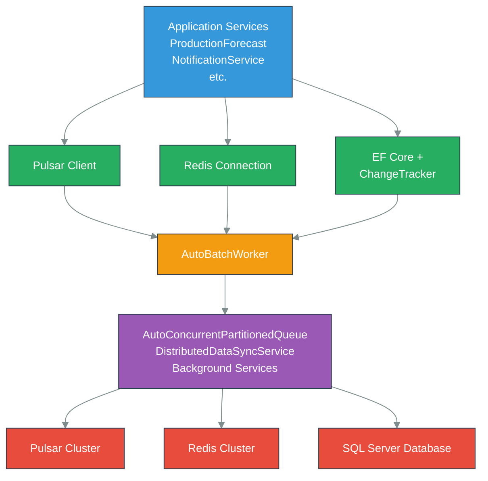

# Infrastructure Component

The Infrastructure Layer provides foundational services enabling distributed communication, change detection, data synchronization, and resilience patterns. It abstracts away complexity of Apache Pulsar, Redis, SQL Server Change Data Capture (CDC), and background processing, providing high-level APIs to application services.

## Overview

**Core Responsibilities**:
- **Event Bus**: Pulsar-based pub/sub with producer pooling
- **Distributed Cache**: Redis with field-level versioning
- **Change Detection**: SQL Server CDC with exponential backoff
- **Data Synchronization**: Version-aware distributed sync
- **Batch Processing**: Generic framework for high-throughput scenarios
- **Resilience**: Retry policies, circuit breakers, health checks

**Architecture Pattern**: Repository + Service Layer with dependency injection

---

## Architecture

### Component Dependency Graph



---

## Core Services

### Apache Pulsar Integration

Apache Pulsar serves as the event bus backbone for SmartPulse, enabling scalable pub/sub messaging across distributed services. Unlike traditional message brokers, Pulsar decouples storage (BookKeeper) from serving (brokers).

**Key Features**:
- **Persistent Topics**: Messages persisted across broker failures
- **Multi-Tenancy**: Built-in namespace isolation for future scaling
- **High Throughput**: Millions of messages per second capacity
- **Low Latency**: <100ms end-to-end message delivery
- **Exactly-Once Semantics**: Transaction support (optional)

**Why Pulsar**:
- Separate storage and serving layers enable independent scaling
- Native geo-replication support for multi-region deployments
- Built-in tiered storage (hot SSD → cold S3)
- Consumer lag management without manual partition management
- Topic retention policies independent of cluster size

#### Producer Pooling Strategy

`SmartpulsePulsarClient` maintains a `ConcurrentDictionary<string, Producer<byte[]>>` for producer reuse across messages on the same topic. Each topic gets exactly one producer instance, eliminating connection overhead.

**Benefits**:
- Connection reuse reduces overhead by 50-70% vs. creating per-message producers
- Semaphore throttles concurrent producer creation (prevents thundering herd)
- Double-check locking prevents duplicate producer creation
- TTL-based cleanup removes unused producers

#### Producer Batching Configuration

Producer batching dramatically improves throughput by amortizing compression and network overhead:

| Parameter | Value | Impact |
|-----------|-------|--------|
| `EnableBatching` | true | Enable batching feature |
| `BatchingMaxMessages` | 100 | Messages per batch |
| `BatchingMaxBytes` | 131,072 | ~128 KB per batch |
| `BatchingMaxDelayMs` | 100 | Max wait before flush |
| `MaxPendingMessages` | 500 | Buffer before backpressure |

**Throughput Impact**:
- Without batching: ~1,000 messages/sec
- With batching (100 msgs): ~100,000 messages/sec (100× improvement)
- Latency trade-off: 100ms max delay between publication and delivery

For more details, see [Pulsar Integration Documentation](../../../docs/integration/pulsar.md).

---

### Redis Distributed Cache

`StackExchangeRedisConnection` provides connection pooling, field-level versioning, Pub/Sub messaging, and transaction support for Redis operations.

**Key Features**:
- **Versioned Cache**: Each cached value includes version metadata for consistency checking
- **Connection Pooling**: Reuses connections across database instances
- **Transactional Support**: Atomic multi-key operations
- **Pub/Sub Messaging**: Cross-service communication
- **Metrics Integration**: OpenTelemetry instrumentation

#### Cache Retrieval with Versioning

```csharp
public async Task<(T Value, long Version)> GetAsync<T>(
    string key) where T : class
```

Retrieves both the cached value and its version number atomically, enabling consistency checks in distributed scenarios.

#### Cache Storage with Versioning

```csharp
public async Task SetAsync<T>(
    string key,
    T value,
    TimeSpan? expiration = null,
    long? version = null) where T : class
```

Stores value and optional version metadata, with automatic expiration support.

**Caching Strategy**:
- L1 Cache (MemoryCache): Hot data, 30s TTL
- L2 Cache (Redis): Shared across replicas, 1-hour TTL
- Database: Source of truth

For more details, see [Redis Integration Documentation](../../../docs/integration/redis.md).

---

### Change Data Capture (CDC) Pipeline

`ChangeTracker` enables continuous monitoring of SQL Server database changes via Change Data Capture with exponential backoff retry logic and version-based anomaly detection.

**Key Features**:
- **Continuous Polling**: Monitors SQL Server CDC tables for changes
- **Exponential Backoff**: Retries with exponential backoff on transient failures
- **Version Tracking**: Detects anomalies using version comparison
- **Event Correlation**: Links changes to Pulsar events
- **Metrics Integration**: Detailed observability for CDC operations

#### CDC Polling Algorithm

Uses `CHANGETABLE()` SQL Server function to retrieve changes:

```sql
SELECT TOP 1000
    [sys_change_version] as ChangeVersion,
    [sys_change_operation] as Operation,
    [sys_change_context] as Context,
    *
FROM CHANGETABLE(CHANGES TableName, LastKnownVersion) AS CT
ORDER BY sys_change_version ASC
```

**Error Handling**:
- **Transient Errors (Retry)**: Connection broken, temporary unavailability
- **Fatal Errors (Fail)**: Table doesn't exist, permission denied

For more details, see [EF Core Integration Documentation](../../../docs/integration/ef-core.md).

---

### Data Synchronization Service

`DistributedDataSyncService` orchestrates version-aware distributed sync across replicas with eventual consistency guarantees.

**Key Features**:
- **Cross-Replica Sync**: Synchronizes changes across multiple database replicas
- **Version Tracking**: Ensures consistency using version metadata
- **Conflict Resolution**: Detects and resolves version conflicts
- **Batch Optimization**: Groups sync operations for efficiency

---

### AutoBatchWorker Generic Pattern

Generic framework for high-throughput batch processing scenarios:

**Key Features**:
- **Dynamic Batch Sizing**: Adjusts batch size based on throughput
- **Throughput Tuning**: 5-10x improvements over per-item processing
- **Latency Control**: Configurable max latency before flush
- **Metrics Integration**: Detailed batch performance tracking

---

### Resilience Patterns

#### Retry Strategy: Fixed Interval

Fixed-interval retry with configurable delay:

**Use Cases**:
- Network timeouts that typically resolve quickly
- Temporary broker unavailability
- Rate-limited API calls with consistent backoff

#### Retry Strategy: Exponential Backoff

Exponential backoff retry starting at initial delay, doubling on each attempt:

**Use Cases**:
- Database connection failures
- Service startup latency
- Cascading failures across services

**Configuration**:
- Initial delay: 100ms
- Multiplier: 2.0
- Max retries: 5
- Max delay: 30 seconds

#### Circuit Breaker Pattern

Prevents cascading failures by stopping requests to failing services:

**States**:
- **Closed**: Normal operation, requests pass through
- **Open**: Service failing, requests rejected immediately
- **Half-Open**: Testing if service recovered

**Configuration**:
- Failure threshold: 5 consecutive failures
- Reset timeout: 1 minute
- Success count to close: 2 consecutive successes

---

## Integration Points

### With Application Layer
Application services (ProductionForecast, NotificationService, etc.) depend on Infrastructure for:
- Publishing events to Pulsar
- Caching via Redis
- Querying tracked database changes
- Batch processing high-volume operations

### With Data Layer
Infrastructure services interact with:
- **SQL Server Database**: CDC polling, data persistence
- **Entity Framework Core**: Change tracking, transactions
- **Repository Pattern**: Data access abstraction

### With Background Services
Background processing components depend on:
- AutoBatchWorker for efficient bulk operations
- AutoConcurrentPartitionedQueue for work distribution
- DistributedDataSyncService for cross-replica synchronization

---

## Performance Characteristics

### Event Publishing

| Scenario | Throughput | Latency |
|----------|-----------|---------|
| Single message | 1,000 msg/sec | 100ms |
| Batched (100 msg) | 100,000 msg/sec | <100ms |
| Batched (1,000 msg) | 250,000+ msg/sec | <500ms |

### Distributed Caching

| Operation | Redis Hit | Redis Miss | Hit Rate |
|-----------|-----------|-----------|----------|
| Get | <5ms | ~10ms (with DB) | 90%+ |
| Set | <5ms | N/A | N/A |

### CDC Polling

| Scenario | Polling Interval | Processing Time |
|----------|-----------------|-----------------|
| No changes | 30 seconds | <100ms |
| 100 changes | 30 seconds | 100-500ms |
| 1,000+ changes | 30 seconds | 1-5 seconds |

---

## Configuration & Deployment

### Kubernetes Deployment

Infrastructure services are deployed as containerized workloads:

**Pulsar Cluster (Kubernetes)**:
- 3x Pulsar Brokers (high availability)
- 3x BookKeeper Bookies (persistent storage)
- 1x ZooKeeper (metadata coordination)
- 1x Pulsar Manager (admin UI)

**Redis Cluster (Kubernetes)**:
- Sentinel-based high availability
- Automatic failover on primary failure
- Persistent volume storage

**Database**:
- SQL Server managed instance
- CDC enabled on all tables
- Regular backups with WAL archiving

### Resilience Configuration

**Connection Timeouts**:
- Pulsar: 10 seconds with exponential backoff
- Redis: 5 seconds with 3 retries
- SQL Server: 15 seconds with exponential backoff

**Retry Policies**:
- Max retries: 5 attempts
- Initial delay: 100ms
- Backoff multiplier: 2.0
- Max delay: 30 seconds

---

## Troubleshooting

### Common Issues

**Pulsar Connection Failures**
- Verify broker addresses in configuration
- Check authentication token validity
- Inspect firewall rules for port 6650/6651

**Redis Connection Issues**
- Verify connection string format
- Check Redis cluster status
- Review authentication credentials

**CDC Polling Lag**
- Verify CDC is enabled on SQL Server
- Check table-level CDC configuration
- Monitor CDC table sizes and cleanup jobs

---

## Related Documentation

- [Pulsar Integration Guide](../../../docs/integration/pulsar.md) - Event bus configuration and usage
- [Redis Integration Guide](../../../docs/integration/redis.md) - Distributed cache patterns
- [EF Core Integration Guide](../../../docs/integration/ef-core.md) - Database operations and CDC
- [Data Flow Documentation](../../../docs/guides/data-flow.md) - End-to-end data synchronization
- [Kubernetes Deployment Guide](../../../docs/deployment/kubernetes.md) - Container orchestration
- [Resilience Patterns Guide](../../../docs/patterns/resilience.md) - Error handling strategies

---

## Summary

The Infrastructure Layer provides:

1. **Event-Driven Architecture**: Pulsar pub/sub with producer pooling
2. **Distributed Caching**: Redis with version tracking
3. **Change Detection**: SQL Server CDC with resilient polling
4. **Data Synchronization**: Cross-replica sync with eventual consistency
5. **Batch Processing**: Dynamic bulk sizing with 5-10x throughput improvements
6. **Performance Optimization**: Latency-throughput tradeoff tuning, memory efficiency, network I/O reduction
7. **Resilience**: Retry logic, circuit breakers, health monitoring
8. **Kubernetes Orchestration**: Scalable, resilient deployments with zero-downtime updates
9. **Network Topology**: Service mesh with ingress, load balancing, and network policies

For architectural deep dives and implementation details, refer to the related documentation above.
