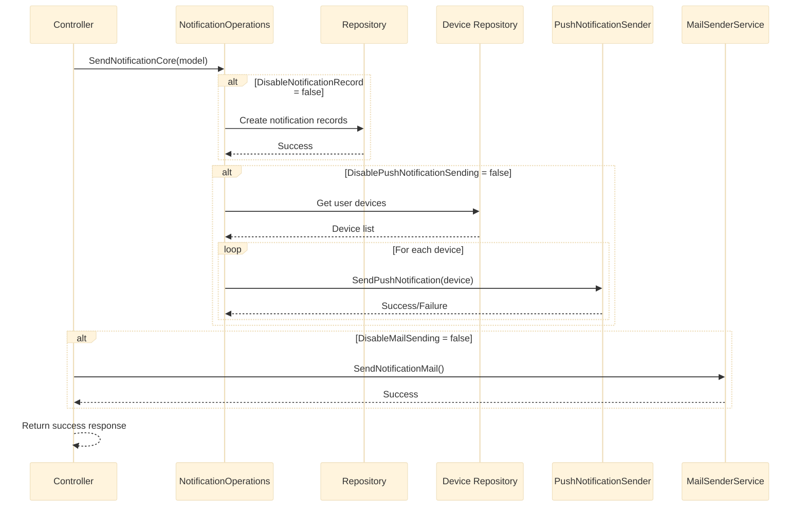
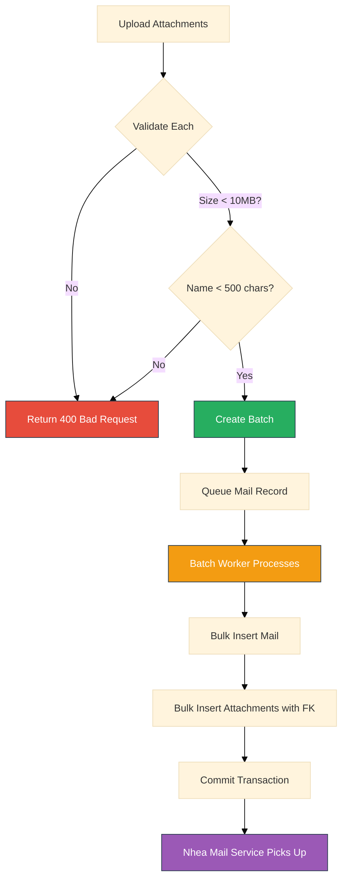

# NotificationService - API Endpoints

**Source:** [Part 3 - API Endpoints and Request/Response Workflows](../../../notes/level_0/notification_service/part_3_api_endpoints.md)

## Table of Contents

1. [Controller Overview](#controller-overview)
2. [API Endpoints Specification](#api-endpoints-specification)
3. [Notification Management Endpoints](#notification-management-endpoints)
4. [Email Sending Endpoints](#email-sending-endpoints)
5. [Multi-Channel Notification Endpoint](#multi-channel-notification-endpoint)
6. [Error Handling and Status Codes](#error-handling-and-status-codes)
7. [Performance Characteristics](#performance-characteristics)

---

## Controller Overview

**Route Base:** `/api/notification`

<details>
<summary>Click to expand controller definition</summary>

```csharp
[ApiController]
[Route("api/[controller]")]
public class NotificationController : ControllerBase
{
    private readonly INotificationManagerService _notificationManagerService;
    private readonly IMailSenderService _mailSenderService;
    private readonly NotificationOperations _notificationOperations;
    private readonly ILogger<NotificationController> _logger;

    public NotificationController(
        INotificationManagerService notificationManagerService,
        IMailSenderService mailSenderService,
        NotificationOperations notificationOperations,
        ILogger<NotificationController> logger)
    {
        _notificationManagerService = notificationManagerService
            ?? throw new ArgumentNullException(nameof(notificationManagerService));
        _mailSenderService = mailSenderService
            ?? throw new ArgumentNullException(nameof(mailSenderService));
        _notificationOperations = notificationOperations
            ?? throw new ArgumentNullException(nameof(notificationOperations));
        _logger = logger ?? throw new ArgumentNullException(nameof(logger));
    }
}
```

</details>

---

## API Endpoints Specification

### Summary Table

| # | HTTP | Endpoint | Request Model | Response | Purpose |
|---|------|----------|---------------|----------|---------|
| 1 | POST | `/notification/list` | NotificationListRequestModel | BaseModel<NotificationListResponseModel> | Get user notifications |
| 2 | POST | `/notification/unread-notification-count` | NotificationListRequestModel | BaseModel<int> | Count unread |
| 3 | POST | `/notification/read-all` | NotificationListRequestModel | BaseModel<int> | Mark all read |
| 4 | POST | `/notification/read` | NotificationReadRequestModel | BaseModel<object> | Mark single read |
| 5 | POST | `/notification/new` | NewNotificationRequestModel | BaseModel<object> | Multi-channel send |
| 6 | POST | `/notification/send-email` | NewMailRequestModel | BaseModel<object> | Basic email |
| 7 | POST | `/notification/send-email-by-template` | NewMailByTemplateRequestModel | BaseModel<object> | Templated email |
| 8 | POST | `/notification/send-email-with-attachments` | NewMailWithAttachmentsRequestModel | BaseModel<object> | Email with files |

---

## Notification Management Endpoints

### 1. Get Notifications List

**Endpoint:** `POST /api/notification/list`

<details>
<summary>Click to expand request example</summary>

**HTTP Request:**

```http
POST /api/notification/list HTTP/1.1
Host: notification-service.smartpulse.local
Content-Type: application/json

{
  "userId": 42
}
```

</details>

<details>
<summary>Click to expand implementation</summary>

```csharp
[HttpPost("list")]
public IActionResult GetNotificationList([FromBody] NotificationListRequestModel model)
{
    try
    {
        _logger.LogInformation("Getting notifications for user {UserId}", model.UserId);

        var response = _notificationManagerService.NotificationList(model);

        _logger.LogInformation("Retrieved {Count} notifications for user {UserId}",
            response.Data?.Notifications?.Count() ?? 0, model.UserId);

        return Ok(response);
    }
    catch (Exception ex)
    {
        _logger.LogError(ex, "Error getting notifications for user {UserId}", model.UserId);
        return StatusCode(StatusCodes.Status500InternalServerError,
            new BaseModel
            {
                Success = false,
                ErrorCode = HttpStatusCode.InternalServerError,
                ResultMessage = "Failed to retrieve notifications"
            });
    }
}
```

</details>

<details>
<summary>Click to expand response example</summary>

**HTTP Response (200 OK):**

```json
{
  "errorCode": 200,
  "success": true,
  "resultMessage": "Success",
  "data": {
    "notifications": [
      {
        "id": "550e8400-e29b-41d4-a716-446655440000",
        "status": 0,
        "type": "ForecastUpdate",
        "webUrl": "/forecast/details/123",
        "targetEntityId": "forecast-123",
        "description": "New forecast available for Unit A",
        "createDate": "12.11.2025 14:30:22"
      },
      {
        "id": "550e8400-e29b-41d4-a716-446655440001",
        "status": 1,
        "type": "SystemAlert",
        "webUrl": "/alerts/456",
        "targetEntityId": "alert-456",
        "description": "System maintenance completed",
        "createDate": "11.11.2025 10:15:00"
      }
    ]
  }
}
```

</details>

**Performance:**
- Small queries (<10 notifications): 10-20ms
- Medium queries (10-100): 30-80ms
- Large queries (100+): 100-300ms

---

### 2. Get Unread Count

**Endpoint:** `POST /api/notification/unread-notification-count`

<details>
<summary>Click to expand request/response</summary>

**HTTP Request:**

```http
POST /api/notification/unread-notification-count HTTP/1.1
Content-Type: application/json

{
  "userId": 42
}
```

**HTTP Response (200 OK):**

```json
{
  "errorCode": 200,
  "success": true,
  "resultMessage": "Success",
  "data": 7
}
```

</details>

**Performance:** 10-20ms (stored procedure execution)

---

### 3. Read All Notifications

**Endpoint:** `POST /api/notification/read-all`

<details>
<summary>Click to expand request/response</summary>

**HTTP Request:**

```http
POST /api/notification/read-all HTTP/1.1
Content-Type: application/json

{
  "userId": 42
}
```

**HTTP Response (200 OK):**

```json
{
  "errorCode": 200,
  "success": true,
  "resultMessage": "Success",
  "data": 7
}
```

**Response Fields:**
- `data`: Number of rows affected (rows updated)

</details>

**Performance:**
- Small updates (1-10 rows): 15-30ms
- Medium updates (10-100): 40-100ms
- Large updates (100+): 150-300ms

---

### 4. Mark Single Notification as Read

**Endpoint:** `POST /api/notification/read`

<details>
<summary>Click to expand request/response</summary>

**HTTP Request:**

```http
POST /api/notification/read HTTP/1.1
Content-Type: application/json

{
  "id": "550e8400-e29b-41d4-a716-446655440000",
  "userId": 42
}
```

**HTTP Response (200 OK):**

```json
{
  "errorCode": 200,
  "success": true,
  "resultMessage": "Success",
  "data": null
}
```

**HTTP Response (404 Not Found):**

```json
{
  "errorCode": 404,
  "success": false,
  "resultMessage": "Notification not found",
  "data": null
}
```

</details>

**Security:**
- Validates user ownership (userId check prevents unauthorized reads)
- User can only mark their own notifications as read

**Performance:** 20-35ms total

---

## Multi-Channel Notification Endpoint

### Send Multi-Channel Notification

**Endpoint:** `POST /api/notification/new`

<details>
<summary>Click to expand request example</summary>

**HTTP Request:**

```http
POST /api/notification/new HTTP/1.1
Content-Type: application/json

{
  "users": [42, 43, 44],
  "targetEntityId": "forecast-789",
  "notificationType": "ForecastUpdate",
  "description": "New forecast available - please review",
  "disableNotificationRecord": false,
  "mailMessage": "A new forecast has been generated for your review",
  "mailSubject": "SmartPulse: New Forecast Available",
  "buttonText": "View Forecast",
  "disableMailSending": false,
  "disablePushNotificationSending": false,
  "webUrl": "/forecast/details/789"
}
```

</details>

<details>
<summary>Click to expand implementation</summary>

```csharp
[HttpPost("new")]
public async Task<IActionResult> SendNotification([FromBody] NewNotificationRequestModel model)
{
    try
    {
        _logger.LogInformation(
            "Sending notification type={Type} to {UserCount} users. " +
            "DB={DbRecord}, Push={PushEnabled}, Mail={MailEnabled}",
            model.NotificationType, model.Users.Count,
            !model.DisableNotificationRecord,
            !model.DisablePushNotificationSending,
            !model.DisableMailSending);

        // 1. Send multi-channel notification (DB + Push)
        await _notificationOperations.SendNotificationCore(model, _logger);

        // 2. Send email if enabled
        if (!model.DisableMailSending && !string.IsNullOrEmpty(model.MailSubject))
        {
            foreach (var user in model.Users)
            {
                _mailSenderService.SendNotificationMail(
                    to: "user@example.com",  // Would fetch from database
                    subject: model.MailSubject,
                    title: model.NotificationType,
                    description: model.MailMessage);
            }
        }

        return Ok(new BaseModel
        {
            Success = true,
            ErrorCode = HttpStatusCode.OK,
            ResultMessage = "Notification sent"
        });
    }
    catch (Exception ex)
    {
        _logger.LogError(ex, "Error sending notification");
        return StatusCode(StatusCodes.Status500InternalServerError,
            new BaseModel
            {
                Success = false,
                ErrorCode = HttpStatusCode.InternalServerError,
                ResultMessage = "Failed to send notification"
            });
    }
}
```

</details>

### Orchestration Sequence



**Independent Channel Processing:**
- If push fails → Email still sent, DB record still created
- If email fails → Push still sent, DB record still created
- Each channel can be disabled independently

**Performance:** 150-400ms for 3 users with 2 devices each

---

## Email Sending Endpoints

### 6. Send Basic Email

**Endpoint:** `POST /api/notification/send-email`

<details>
<summary>Click to expand request example</summary>

**HTTP Request:**

```http
POST /api/notification/send-email HTTP/1.1
Content-Type: application/json

{
  "from": "noreply@smartpulse.com",
  "to": "user@example.com",
  "cc": "supervisor@example.com",
  "bcc": "archive@smartpulse.com",
  "mailSubject": "Weekly Forecast Report",
  "title": "Your Weekly Forecast",
  "description": "Please find attached your weekly forecast summary",
  "tableValues": {
    "Week": "Nov 11-17, 2025",
    "Total Units": "45",
    "Total MW": "2500.5",
    "Accuracy": "94.2%"
  },
  "disableAddingDefaultDate": false,
  "highPriority": false
}
```

</details>

<details>
<summary>Click to expand response</summary>

**HTTP Response (200 OK):**

```json
{
  "errorCode": 200,
  "success": true,
  "resultMessage": "Email queued for sending",
  "data": null
}
```

</details>

**Table Values Rendering:**

Input:
```json
{
  "tableValues": {
    "Week": "Nov 11-17, 2025",
    "Total Units": "45",
    "Total MW": "2500.5"
  }
}
```

Rendered HTML:
```html
<table border="1" cellpadding="10">
  <tr><td>Week</td><td>Nov 11-17, 2025</td></tr>
  <tr><td>Total Units</td><td>45</td></tr>
  <tr><td>Total MW</td><td>2500.5</td></tr>
</table>
```

**Default Fields Added:**
- Date: "12.11.2025 14:30:22" (if `disableAddingDefaultDate = false`)
- Environment: "Production" or "Development" (always added)

**Performance:** 30-70ms per email

---

### 7. Send Templated Email

**Endpoint:** `POST /api/notification/send-email-by-template`

<details>
<summary>Click to expand request example</summary>

**HTTP Request:**

```http
POST /api/notification/send-email-by-template HTTP/1.1
Content-Type: application/json

{
  "from": "noreply@smartpulse.com",
  "to": "analyst@example.com",
  "mailSubject": "EAK Forecast Report",
  "title": "EAK System Alert",
  "description": "Energy availability analysis complete",
  "templateName": "EAK_Template",
  "data": {
    "forecastId": "fcast-2025-11-12-001",
    "systemStatus": "OPTIMAL",
    "confidenceScore": 0.97,
    "nextUpdateTime": "2025-11-12T18:00:00Z"
  },
  "tableValues": {
    "Analysis Date": "2025-11-12",
    "Confidence": "97%",
    "Status": "Green"
  },
  "highPriority": true
}
```

</details>

**Template Rendering Flow:**

```mermaid
%%{init: {'theme':'base', 'themeVariables': {'fontSize':'14px'}}}%%
graph LR
    A[Template Name + Data] --> B[Node.js INodeServices]
    B --> C[Load Pug Template]
    C --> D[Compile to HTML Function]
    D --> E[Execute with Data]
    E --> F[Return HTML String]
    F --> G[Queue Email]

    style A fill:#3498db,stroke:#2c3e50,color:#fff
    style B fill:#27ae60,stroke:#2c3e50,color:#fff
    style F fill:#f39c12,stroke:#2c3e50,color:#fff
    style G fill:#9b59b6,stroke:#2c3e50,color:#fff
```



**Available Templates:**
- `BasicTemplate` - Standard layout with title/description/table
- `ListTemplate` - Table rendering
- `WrapperTemplate` - Base email wrapper
- `EAK_Template` - Energy analysis reports
- `GOP_Template` - GOP-specific notifications

---

### 8. Send Email with Attachments

**Endpoint:** `POST /api/notification/send-email-with-attachments`

<details>
<summary>Click to expand request example</summary>

**HTTP Request:**

```http
POST /api/notification/send-email-with-attachments HTTP/1.1
Content-Type: multipart/form-data; boundary=----WebKitFormBoundary

------WebKitFormBoundary
Content-Disposition: form-data; name="to"

analyst@example.com
------WebKitFormBoundary
Content-Disposition: form-data; name="mailSubject"

Monthly Report with Charts
------WebKitFormBoundary
Content-Disposition: form-data; name="attachments"; filename="report.pdf"
Content-Type: application/pdf

[Binary PDF content]
------WebKitFormBoundary--
```

</details>

<details>
<summary>Click to expand implementation</summary>

```csharp
[HttpPost("send-email-with-attachments")]
public IActionResult SendEmailWithAttachments([FromForm] NewMailWithAttachmentsRequestModel model)
{
    try
    {
        // Validate attachment sizes
        const long maxAttachmentSize = 10 * 1024 * 1024;  // 10 MB
        foreach (var attachment in model.Attachments ?? new List<Attachment>())
        {
            if (attachment.Data?.Length > maxAttachmentSize)
            {
                return BadRequest(new BaseModel
                {
                    Success = false,
                    ErrorCode = HttpStatusCode.BadRequest,
                    ResultMessage = $"Attachment '{attachment.Name}' exceeds maximum size of 10 MB"
                });
            }
        }

        var success = _mailSenderService.SendNotificationMail(
            to: model.To,
            cc: model.Cc,
            bcc: model.Bcc,
            subject: model.MailSubject,
            title: model.Title,
            description: model.Description,
            attachments: model.Attachments,
            tableValues: model.TableValues,
            addDateAsDefault: !model.DisableAddingDefaultDate,
            from: model.From,
            highPriority: model.HighPriority);

        if (success)
        {
            return Ok(new BaseModel
            {
                Success = true,
                ErrorCode = HttpStatusCode.OK,
                ResultMessage = "Email with attachments queued"
            });
        }

        return StatusCode(StatusCodes.Status500InternalServerError,
            new BaseModel
            {
                Success = false,
                ErrorCode = HttpStatusCode.InternalServerError,
                ResultMessage = "Failed to send email with attachments"
            });
    }
    catch (Exception ex)
    {
        _logger.LogError(ex, "Error sending email with attachments to {To}", model.To);
        return StatusCode(StatusCodes.Status500InternalServerError,
            new BaseModel
            {
                Success = false,
                ErrorCode = HttpStatusCode.InternalServerError,
                ResultMessage = "Error sending email with attachments"
            });
    }
}
```

</details>

**Attachment Constraints:**

| Constraint | Value | Validation |
|-----------|-------|-----------|
| Max per file | 10 MB | Checked in controller |
| Max per mail | Unlimited | SQL varbinary(max) limit (~2GB) |
| Filename length | 500 chars | Database VARCHAR(500) |
| Supported types | Any binary | No whitelist (rely on antivirus) |

**Attachment Processing:**



---

## Error Handling and Status Codes

### HTTP Status Codes Used

| Code | Status | When | Response |
|------|--------|------|----------|
| 200 | OK | Request successful | BaseModel with data |
| 400 | Bad Request | Invalid input (bad JSON, file too large) | Error message |
| 404 | Not Found | Resource not found (notification doesn't exist) | Error message |
| 500 | Internal Server Error | Unhandled exception | Error message |

### Exception Handling Pattern

<details>
<summary>Click to expand error handling example</summary>

```csharp
[HttpPost("list")]
public IActionResult GetNotificationList([FromBody] NotificationListRequestModel model)
{
    try
    {
        // Validation
        if (model?.UserId <= 0)
        {
            return BadRequest(new BaseModel
            {
                Success = false,
                ErrorCode = HttpStatusCode.BadRequest,
                ResultMessage = "UserId must be greater than 0"
            });
        }

        var response = _notificationManagerService.NotificationList(model);
        return Ok(response);
    }
    catch (DbUpdateException ex)
    {
        _logger.LogError(ex, "Database error");
        return StatusCode(StatusCodes.Status500InternalServerError,
            new BaseModel { Success = false, ErrorCode = HttpStatusCode.InternalServerError });
    }
    catch (TimeoutException ex)
    {
        _logger.LogError(ex, "Operation timeout");
        return StatusCode(StatusCodes.Status504GatewayTimeout,
            new BaseModel { Success = false, ErrorCode = HttpStatusCode.GatewayTimeout });
    }
    catch (Exception ex)
    {
        _logger.LogError(ex, "Unexpected error");
        return StatusCode(StatusCodes.Status500InternalServerError,
            new BaseModel { Success = false, ErrorCode = HttpStatusCode.InternalServerError });
    }
}
```

</details>

---

## Performance Characteristics

### Endpoint Response Time Analysis

| Endpoint | Operation Type | Avg Time | Max Time | Notes |
|----------|----------------|----------|----------|-------|
| `/list` | Read (SP) | 20-30ms | 100ms | Depends on notification count |
| `/unread-notification-count` | Read (SP) | 10-15ms | 50ms | Quick count query |
| `/read-all` | Update (SP) | 50-100ms | 300ms | Depends on unread count |
| `/read` | Update (1 row) | 25-40ms | 100ms | Single record update |
| `/new` | Multi-channel | 200-400ms | 1000ms | Parallel push sends |
| `/send-email` | Queue | 30-70ms | 200ms | Includes template render |
| `/send-email-by-template` | Template render | 40-100ms | 300ms | Node.js compilation |
| `/send-email-with-attachments` | Queue with files | 50-150ms | 500ms | File size dependent |

### Throughput Analysis

| Scenario | Requests/sec | Bottleneck |
|----------|--------------|-----------|
| Single notification read | 40-50 | Database query |
| Email queueing | 15-20 | Node.js template rendering |
| Push notification send | 5-10 | Firebase/WebPush API calls |
| Batch processing (100 items) | 2-3 | Bulk insert transaction |

### Database Connection Pool

<details>
<summary>Click to expand pool configuration</summary>

```csharp
// Configuration in DbContext
.UseSqlServer(connectionString, sqlOptions =>
{
    sqlOptions.EnableRetryOnFailure(maxRetryCount: 10, maxRetryDelaySeconds: 30);
    sqlOptions.CommandTimeout(180);
    sqlOptions.MaxBatchSize(1);
});
```

**Pool Settings:**
- Min pool size: 5
- Max pool size: 100 (default)
- Connection lifetime: 300s (default)
- Connection idle timeout: 30s
- Retry attempts: 10
- Max delay: 30 seconds

</details>

---

## Related Documentation

- **[Service Architecture](service_architecture.md)** - Core components and layered architecture
- **[Data Models & Integration](data_models_integration.md)** - Entity models, database schema, external integrations
- **[README](README.md)** - Component overview and quick start guide
