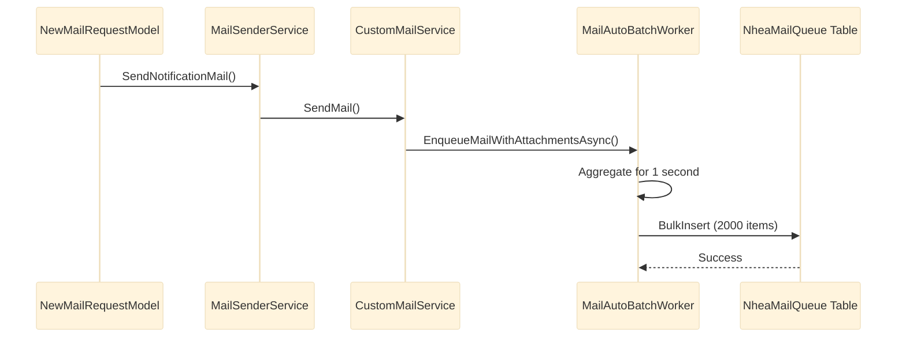

# NotificationService - Data Models and Integration

**Source:** [Part 2 - Data Models, Database Design, and External Integrations](../../../notes/level_0/notification_service/part_2_data_models_integration.md)

## Table of Contents

1. [Entity Model Hierarchy](#entity-model-hierarchy)
2. [Database Schema Design](#database-schema-design)
3. [Data Transfer Objects (DTOs)](#data-transfer-objects-dtos)
4. [Firebase Cloud Messaging Integration](#firebase-cloud-messaging-integration)
5. [Web Push Protocol (VAPID) Integration](#web-push-protocol-vapid-integration)
6. [Email Template System](#email-template-system)
7. [Nhea Mail Queue Integration](#nhea-mail-queue-integration)

---

## Entity Model Hierarchy

### 1. Notification Entity

**Database Table:** `dbo.Notification`

<details>
<summary>Click to expand entity definition</summary>

```csharp
[Table("Notification")]
public partial class Notification
{
    [Key]
    public Guid Id { get; set; }

    [Column(TypeName = "int")]
    public int SysUserId { get; set; }

    [StringLength(50)]
    public string Type { get; set; }

    [Column(TypeName = "datetime")]
    public DateTime CreateDate { get; set; }

    [Column(TypeName = "int")]
    public int Status { get; set; }  // 0=New, 1=Seen

    [StringLength(250)]
    public string TargetEntityId { get; set; }

    [StringLength(2000)]
    public string WebUrl { get; set; }

    [StringLength(400)]
    public string Description { get; set; }

    [Column(TypeName = "datetime")]
    public DateTime? SeenOn { get; set; }
}
```

</details>

**Schema Characteristics:**

| Property | Type | Length | Required | Purpose |
|----------|------|--------|----------|---------|
| `Id` | GUID | - | Yes | Primary key |
| `SysUserId` | int | - | Yes | Foreign key to user |
| `Type` | nvarchar | 50 | Yes | Notification category |
| `CreateDate` | datetime | - | Yes | Creation timestamp |
| `Status` | int | - | Yes | 0=New, 1=Seen |
| `TargetEntityId` | nvarchar | 250 | No | Reference to entity |
| `WebUrl` | nvarchar | 2000 | No | Navigation URL |
| `Description` | nvarchar | 400 | No | Message (truncated) |
| `SeenOn` | datetime | - | No | Read timestamp |

**Stored Procedures:**

<details>
<summary>Click to expand stored procedures</summary>

```sql
-- Get all notifications for user
CREATE PROCEDURE [dbo].[GetNotifications]
    @UserId INT
AS
BEGIN
    SELECT Id, SysUserId, Type, CreateDate, Status,
           TargetEntityId, WebUrl, Description, SeenOn
    FROM dbo.Notification
    WHERE SysUserId = @UserId
    ORDER BY CreateDate DESC;
END;

-- Get unread count
CREATE PROCEDURE [dbo].[GetUnreadNotificationsCount]
    @UserId INT
AS
BEGIN
    SELECT COUNT(*) AS UnreadCount
    FROM dbo.Notification
    WHERE SysUserId = @UserId AND Status = 0;
END;

-- Mark all as read
CREATE PROCEDURE [dbo].[ReadAllNotifications]
    @UserId INT
AS
BEGIN
    UPDATE dbo.Notification
    SET Status = 1, SeenOn = GETUTCDATE()
    WHERE SysUserId = @UserId AND Status = 0;

    RETURN @@ROWCOUNT;
END;
```

</details>

**Recommended Indexes:**

<details>
<summary>Click to expand index definitions</summary>

```sql
-- Composite index for typical query: GetNotifications
CREATE NONCLUSTERED INDEX [IX_Notification_SysUserId_Status]
    ON [dbo].[Notification] ([SysUserId] ASC, [Status] ASC)
    INCLUDE ([CreateDate], [Description]);

-- Index for sorting/filtering
CREATE NONCLUSTERED INDEX [IX_Notification_SysUserId_CreateDate]
    ON [dbo].[Notification] ([SysUserId] ASC, [CreateDate] DESC);

-- Index for type filtering
CREATE NONCLUSTERED INDEX [IX_Notification_Type]
    ON [dbo].[Notification] ([Type] ASC);
```

</details>

---

### 2. SysUserDeviceInfo Entity

**Database Table:** `dbo.SysUserDeviceInfo`

<details>
<summary>Click to expand entity definition</summary>

```csharp
[Table("SysUserDeviceInfo")]
public partial class SysUserDeviceInfo
{
    [Key]
    public Guid Id { get; set; }

    [Required]
    [StringLength(2000)]
    public string DeviceToken { get; set; }

    [Column(TypeName = "int")]
    public int DeviceTypeId { get; set; }    // 1=Web, 2=Android, 3=iOS

    [Column(TypeName = "int")]
    public int SysUserId { get; set; }

    [Column(TypeName = "datetime")]
    public DateTime CreateDate { get; set; }

    [Column(TypeName = "datetime")]
    public DateTime ModifyDate { get; set; }

    [StringLength(200)]
    public string DeviceUniqueId { get; set; }

    [StringLength(2000)]
    public string DeviceKey { get; set; }    // WebPush P-256 public key

    [StringLength(2000)]
    public string DeviceAuth { get; set; }   // WebPush authentication secret

    [StringLength(5000)]
    public string IntegrationToken { get; set; }  // FCM registration token

    [Column(TypeName = "int")]
    public int IntegrationType { get; set; }     // 0=WebPush, 1=FCM
}
```

</details>

**Enumerations:**

```csharp
public enum DeviceTypes
{
    Web = 1,        // Web browser with Web Push support
    Android = 2,    // Android device with Firebase
    iOS = 3         // iOS device with Firebase (APNS)
}

public enum IntegrationTypes
{
    Default = 0,    // Web Push Protocol (VAPID)
    Fcm = 1         // Firebase Cloud Messaging
}
```

---

### 3. NheaMailQueue Entity

**Database Table:** `dbo.NheaMailQueue`

<details>
<summary>Click to expand entity definition</summary>

```csharp
[Table("NheaMailQueue")]
public class NheaMailQueue
{
    [Key]
    public Guid Id { get; set; }

    [Required]
    [StringLength(256)]
    public string From { get; set; }

    [Required]
    [StringLength(1000)]
    public string To { get; set; }

    [StringLength(250)]
    public string Cc { get; set; }

    [StringLength(250)]
    public string Bcc { get; set; }

    [StringLength(500)]
    public string Subject { get; set; }

    [Column(TypeName = "nvarchar(max)")]
    [Required]
    public string Body { get; set; }

    public int? MailProviderId { get; set; }

    [Column(TypeName = "datetime")]
    public DateTime Priority { get; set; }  // Sort key for processing

    public bool IsReadyToSend { get; set; }

    public bool HasAttachment { get; set; }

    [Column(TypeName = "datetime")]
    public DateTime CreateDate { get; set; }
}
```

</details>

**Priority Sorting Strategy:**

```csharp
public class MailPriority
{
    public static DateTime High => new DateTime(2000, 1, 1);      // Processes first
    public static DateTime Normal => DateTime.UtcNow;             // Current time
    public static DateTime Low => new DateTime(9999, 12, 31);     // Processes last
}
```

**Queue Processing Query:**

```sql
-- Get ready-to-send mail in priority order
SELECT TOP 100 *
FROM dbo.NheaMailQueue
WHERE IsReadyToSend = 1
ORDER BY Priority ASC, CreateDate ASC;
```

---

### 4. NheaMailQueueAttachment Entity

**Database Table:** `dbo.NheaMailQueueAttachment`

<details>
<summary>Click to expand entity definition</summary>

```csharp
[Table("NheaMailQueueAttachment")]
public class NheaMailQueueAttachment
{
    [Key]
    public int Id { get; set; }

    [ForeignKey(nameof(NheaMailQueue))]
    public Guid MailQueueId { get; set; }

    [Required]
    [StringLength(500)]
    public string AttachmentName { get; set; }

    [Required]
    [Column(TypeName = "varbinary(max)")]
    public byte[] AttachmentData { get; set; }

    public virtual NheaMailQueue MailQueue { get; set; }
}
```

</details>

**Attachment Constraints:**

| Constraint | Value | Purpose |
|-----------|-------|---------|
| Max filename | 500 chars | Long filename support |
| Max file size | ~2 GB (varbinary(max)) | Practical: 1-100 MB |
| Per mail | Unlimited | Multiple attachments |
| Combined | SQL Server limit | Typically 1-2 GB per mail |

---

## Database Schema Design

### DbContext Configuration

<details>
<summary>Click to expand DbContext</summary>

```csharp
public class NotificationDbContext : DbContext
{
    public DbSet<Notification> Notifications { get; set; }
    public DbSet<SysUserDeviceInfo> SysUserDeviceInfos { get; set; }
    public DbSet<NheaMailQueue> NheaMailQueues { get; set; }
    public DbSet<NheaMailQueueAttachment> NheaMailQueueAttachments { get; set; }
    public DbSet<UnreadNotificationsResult> UnreadNotificationsResults { get; set; }

    public NotificationDbContext(DbContextOptions<NotificationDbContext> options)
        : base(options) { }

    protected override void OnModelCreating(ModelBuilder modelBuilder)
    {
        base.OnModelCreating(modelBuilder);

        // Notification configuration
        modelBuilder.Entity<Notification>(entity =>
        {
            entity.HasKey(e => e.Id);
            entity.Property(e => e.Id).ValueGeneratedOnAdd();
            entity.HasIndex(e => new { e.SysUserId, e.Status })
                .HasName("IX_Notification_UserId_Status");
        });

        // SysUserDeviceInfo configuration
        modelBuilder.Entity<SysUserDeviceInfo>(entity =>
        {
            entity.HasKey(e => e.Id);
            entity.HasIndex(e => e.SysUserId)
                .HasName("IX_SysUserDeviceInfo_UserId");
        });

        // Query result (no key)
        modelBuilder.Entity<UnreadNotificationsResult>().HasNoKey();
    }
}
```

</details>

### Connection Management

<details>
<summary>Click to expand connection wrapper</summary>

```csharp
public class NotificationDbContextWrapper
{
    public static string DbConnectionString { get; set; }

    public NotificationDbContext GetContext()
    {
        var optionsBuilder = new DbContextOptionsBuilder<NotificationDbContext>();
        optionsBuilder.UseSqlServer(DbConnectionString, sqlOptions =>
        {
            sqlOptions.EnableRetryOnFailure(
                maxRetryCount: 10,
                maxRetryDelaySeconds: 30,
                errorNumbersToAdd: null);

            sqlOptions.CommandTimeout(180);  // 3 minutes
            sqlOptions.MaxBatchSize(1);      // Safety: individual commands
        });

        return new NotificationDbContext(optionsBuilder.Options);
    }

    public NotificationDbContext GetContextAsNoTracking()
    {
        var context = GetContext();
        context.ChangeTracker.QueryTrackingBehavior = QueryTrackingBehavior.NoTracking;
        return context;
    }
}
```

</details>

**SQL Server Options:**

| Option | Value | Rationale |
|--------|-------|-----------|
| `EnableRetryOnFailure` | 10 attempts, 30s max delay | Network resilience |
| `CommandTimeout` | 180 seconds | Large stored procedures |
| `MaxBatchSize` | 1 | Safety: send individually |

---

## Data Transfer Objects (DTOs)

### Response Wrapper: BaseModel<T>

<details>
<summary>Click to expand wrapper definition</summary>

```csharp
[Serializable]
public class BaseModel<T>
{
    [JsonPropertyName("errorCode")]
    public HttpStatusCode ErrorCode { get; set; }

    [JsonPropertyName("success")]
    public bool Success { get; set; }

    [JsonPropertyName("resultMessage")]
    public string ResultMessage { get; set; } = string.Empty;

    [JsonPropertyName("data")]
    public T Data { get; set; }

    // Factory methods
    public static BaseModel<T> SuccessResponse(T data)
        => new(HttpStatusCode.OK, true, "Success", data);

    public static BaseModel<T> ErrorResponse(
        string message,
        HttpStatusCode statusCode = HttpStatusCode.InternalServerError)
        => new(statusCode, false, message);
}
```

</details>

**JSON Example:**

```json
{
  "errorCode": 200,
  "success": true,
  "resultMessage": "Success",
  "data": {
    "notifications": [...]
  }
}
```

### Domain DTOs

<details>
<summary>Click to expand NotificationModel</summary>

```csharp
[Serializable]
public class NotificationModel
{
    [JsonPropertyName("id")]
    public Guid Id { get; set; }

    [JsonPropertyName("status")]
    public int Status { get; set; }  // 0=New, 1=Seen

    [JsonPropertyName("type")]
    public string Type { get; set; }

    [JsonPropertyName("webUrl")]
    public string WebUrl { get; set; }

    [JsonPropertyName("targetEntityId")]
    public string TargetEntityId { get; set; }

    [JsonPropertyName("description")]
    public string Description { get; set; }

    [JsonPropertyName("createDate")]
    public string CreateDate { get; set; }  // Formatted: "dd.MM.yyyy HH:mm:ss"
}
```

</details>

### Request Models

<details>
<summary>Click to expand NewNotificationRequestModel</summary>

```csharp
[Serializable]
public class NewNotificationRequestModel
{
    [JsonPropertyName("users")]
    public List<int> Users { get; set; }

    [JsonPropertyName("targetEntityId")]
    public string TargetEntityId { get; set; }

    [JsonPropertyName("notificationType")]
    public string NotificationType { get; set; }

    [JsonPropertyName("description")]
    public string Description { get; set; }

    [JsonPropertyName("disableNotificationRecord")]
    public bool DisableNotificationRecord { get; set; } = false;

    [JsonPropertyName("mailMessage")]
    public string MailMessage { get; set; }

    [JsonPropertyName("mailSubject")]
    public string MailSubject { get; set; }

    [JsonPropertyName("buttonText")]
    public string ButtonText { get; set; }

    [JsonPropertyName("disableMailSending")]
    public bool DisableMailSending { get; set; } = false;

    [JsonPropertyName("disablePushNotificationSending")]
    public bool DisablePushNotificationSending { get; set; } = false;

    [JsonPropertyName("webUrl")]
    public string WebUrl { get; set; }
}
```

</details>

---

## Firebase Cloud Messaging Integration

### Configuration

<details>
<summary>Click to expand Firebase setup</summary>

```csharp
// Startup.cs
var fcmFilePath = Path.Combine(
    Environment.CurrentDirectory,
    Configuration.GetSection("GoogleFirebase")["FileName"]);

if (File.Exists(fcmFilePath))
{
    var credential = GoogleCredential.FromFile(fcmFilePath);
    FirebaseApp.Create(new AppOptions { Credential = credential });
}
```

**appsettings.json:**

```json
{
  "GoogleFirebase": {
    "FileName": "smartpulse-mobile-firebase-adminsdk-v1m05-c6c7b9940c.json"
  }
}
```

</details>

### FCM Message Structure

<details>
<summary>Click to expand message definition</summary>

```csharp
var fcmMessage = new Message
{
    Token = deviceInfo.IntegrationToken,

    Notification = new Notification
    {
        Title = "smartPulse",
        Body = message  // Truncated to 400 chars
    },

    Apns = new ApnsConfig
    {
        Aps = new Aps
        {
            MutableContent = true,
            Alert = new ApsAlert
            {
                Title = "smartPulse",
                Body = message
            }
        }
    }
};

var response = await FirebaseMessaging.DefaultInstance.SendAsync(fcmMessage);
```

</details>

### Error Handling

<details>
<summary>Click to expand FCM error patterns</summary>

```csharp
try
{
    var response = await FirebaseMessaging.DefaultInstance.SendAsync(fcmMessage);
}
catch (FirebaseException ex) when (ex.Code == ErrorCode.InvalidArgument)
{
    // Invalid token - device no longer registered
    await RemoveDeviceAsync(deviceInfo);
}
catch (FirebaseException ex) when (ex.Code == ErrorCode.NotFound)
{
    // Token not found - instance ID no longer valid
    await RemoveDeviceAsync(deviceInfo);
}
```

</details>

---

## Web Push Protocol (VAPID) Integration

### VAPID Configuration

**Environment Variables:**

```bash
WEBPUSH_SUBJECT=mailto:support@smartpulse.com
WEBPUSH_PUBLICKEY=BC8rN2K7...  # Public key for browsers
WEBPUSH_PRIVATEKEY=abc123...    # Private key for server
```

<details>
<summary>Click to expand configuration loading</summary>

```csharp
var subject = Environment.GetEnvironmentVariable("WEBPUSH_SUBJECT")
    ?? "mailto:support@smartpulse.com";
var publicKey = Environment.GetEnvironmentVariable("WEBPUSH_PUBLICKEY")
    ?? throw new InvalidOperationException("WEBPUSH_PUBLICKEY not configured");
var privateKey = Environment.GetEnvironmentVariable("WEBPUSH_PRIVATEKEY")
    ?? throw new InvalidOperationException("WEBPUSH_PRIVATEKEY not configured");

var webPushClient = new WebPushClient();
webPushClient.SetVapidDetails(subject, publicKey, privateKey);
```

</details>

### Push Payload Structure

<details>
<summary>Click to expand payload definition</summary>

```csharp
var pushPayload = new
{
    title = "smartPulse",
    body = message,
    icon = "/smartpulse-icon-192x192.png",
    badge = "/smartpulse-badge-72x72.png",
    tag = "notification",
    data = new
    {
        customItem = "entity-id"
    }
};

var json = JsonConvert.SerializeObject(pushPayload);

var subscription = new PushSubscription(
    endpoint: deviceInfo.DeviceToken,
    p256dh: deviceInfo.DeviceKey,
    auth: deviceInfo.DeviceAuth);

await webPushClient.SendNotificationAsync(subscription, json);
```

</details>

### Browser Registration

<details>
<summary>Click to expand JavaScript example</summary>

```javascript
// Browser JavaScript to register device
navigator.serviceWorker.ready.then(registration =>
{
    registration.pushManager.subscribe({
        userVisibleOnly: true,
        applicationServerKey: BASE64_PUBLIC_KEY
    }).then(subscription =>
    {
        // Send subscription details to server:
        // - subscription.endpoint (DeviceToken)
        // - subscription.getKey('p256dh').toString('base64') (DeviceKey)
        // - subscription.getKey('auth').toString('base64') (DeviceAuth)
    });
});
```

</details>

### Error Handling

<details>
<summary>Click to expand Web Push error patterns</summary>

```csharp
try
{
    await webPushClient.SendNotificationAsync(subscription, json);
}
catch (WebPushException ex) when (ex.StatusCode == 410)
{
    // HTTP 410 Gone - subscription expired
    await RemoveDeviceAsync(deviceInfo);
}
catch (WebPushException ex) when (ex.StatusCode == 403)
{
    // HTTP 403 Forbidden - authentication failed
    await RemoveDeviceAsync(deviceInfo);
}
```

</details>

---

## Email Template System

### Pug Template Architecture

**File Structure:**

```
MailTemplates/
├── pugtemplategenerator.js     # Main Node.js processor
├── BasicTemplate.pug            # Standard layout
├── ListTemplate.pug             # Table rendering
├── WrapperTemplate.pug          # Email wrapper
├── EAK_Template.pug             # Domain-specific
└── GOP_Template.pug             # Domain-specific
```

### Template Renderer (Node.js)

<details>
<summary>Click to expand pugtemplategenerator.js</summary>

```javascript
const pug = require('pug');
const path = require('path');

module.exports = {
    render: function(templateName, templateData) {
        const templatePath = path.join(__dirname, templateName + '.pug');
        const compiledTemplate = pug.compileFile(templatePath);
        return compiledTemplate(templateData);
    },

    renderListTemplate: function(tableValues) {
        let html = '<table border="1" cellpadding="10">';
        for (const [key, value] of Object.entries(tableValues)) {
            html += `<tr><td>${key}</td><td>${value}</td></tr>`;
        }
        html += '</table>';
        return html;
    }
};
```

</details>

### Template Data Structure

<details>
<summary>Click to expand template data object</summary>

```csharp
var templateData = new
{
    preheadertitle = "Forecast Update",
    preheaderdescription = "New forecast...",
    title = "New Forecast Available",
    description = "Your latest forecast...",
    tablevalues = htmlTableContent,
    data = new
    {
        forecastId = "fc-123",
        unitName = "Solar Farm A",
        modelRuns = 5
    },
    isProduction = true
};
```

</details>

---

## Nhea Mail Queue Integration

### Mail Queue Flow



### Bulk Insert Configuration

<details>
<summary>Click to expand batch configuration</summary>

```csharp
var bulkConfig = new BulkConfig
{
    BatchSize = 2000,
    BulkCopyTimeout = 3600,
    SqlBulkCopyOptions = SqlBulkCopyOptions.FireTriggers,
    TrackingEntities = false,
    WithHoldlock = false,
    PreserveInsertOrder = true,
    SetOutputIdentity = true,
    UseTempDB = false
};

await context.NheaMailQueues.BulkInsertAsync(mails, config: bulkConfig);
await context.NheaMailQueueAttachments.BulkInsertAsync(attachments, config: bulkConfig);
```

</details>

### Retry Logic

**Exponential Backoff:**

```csharp
const int maxAttempts = 5;
const int baseDelayMs = 500;

for (int attempt = 1; attempt <= maxAttempts; attempt++)
{
    try
    {
        await ProcessMailsAsync(items);
        return;
    }
    catch (Exception ex) when (attempt < maxAttempts)
    {
        int delayMs = baseDelayMs * attempt;  // 500ms, 1s, 1.5s, 2s, 2.5s
        await Task.Delay(delayMs);
    }
}
```

**Retry Scenarios:**

| Scenario | Retries | Total Time | Action |
|----------|---------|-----------|--------|
| Network timeout | 5 | ~7.5 sec | Exponential backoff |
| Database lock | 5 | ~7.5 sec | Retry after delay |
| SQL connection failure | 10 | ~300 sec | Built-in EF retry |
| Attachment too large | 0 | Immediate | Fail and log |

---

## Related Documentation

- **[Service Architecture](service_architecture.md)** - Core components and layered architecture
- **[API Endpoints](api_endpoints.md)** - REST API specification with examples
- **[README](README.md)** - Component overview and quick start guide
