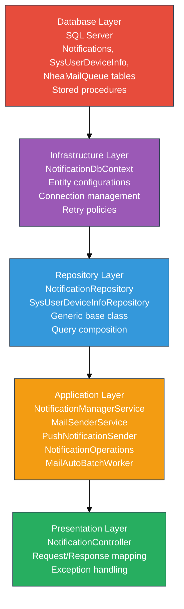
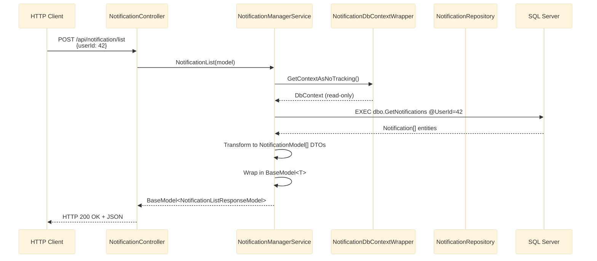
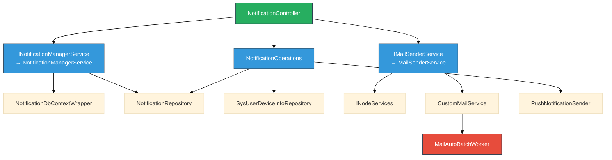
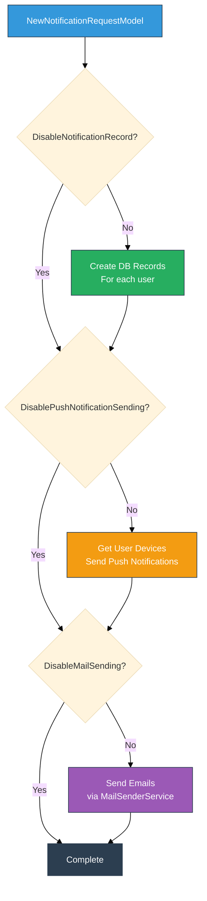

# NotificationService - Service Architecture

**Source:** [Part 1 - Service Architecture and Core Components](../../../notes/level_0/notification_service/part_1_service_architecture.md)

## Table of Contents

1. [Project Structure](#project-structure)
2. [Layered Architecture](#layered-architecture)
3. [Core Service Classes](#core-service-classes)
4. [Repository Pattern Implementation](#repository-pattern-implementation)
5. [Worker Pattern and Batch Processing](#worker-pattern-and-batch-processing)
6. [Dependency Injection Configuration](#dependency-injection-configuration)

---

## Project Structure

### Assembly Organization

**Root Directory:** `D:\Work\Temp projects\SmartPulse\Source\SmartPulse.Services.NotificationService\`

```
NotificationService/
├── 1. NotificationService.Web.Api (Entry Point)
│   ├── Controllers/
│   │   ├── NotificationController.cs     (API endpoints)
│   │   └── TestController.cs             (Diagnostics)
│   ├── MailTemplates/                    (Pug templates)
│   ├── Program.cs                        (ASP.NET Core host)
│   ├── Startup.cs                        (Service configuration)
│   └── Properties/
│
├── 2. NotificationService.Application (Business Logic)
│   ├── Interfaces/
│   │   ├── INotificationManagerService.cs
│   │   └── IMailSenderService.cs
│   ├── Services/
│   │   ├── NotificationManagerService.cs (Notification CRUD)
│   │   ├── MailSenderService.cs          (Email composition)
│   │   ├── CustomMailService.cs          (Queueing)
│   │   └── MetricService.cs              (Observability)
│   ├── Workers/
│   │   └── MailAutoBatchWorker.cs        (Batch processing)
│   ├── Operations/
│   │   └── NotificationOperations.cs     (Multi-channel send)
│   └── PushNotificationSender.cs         (Static push handler)
│
├── 3. NotificationService.Repository (Data Access)
│   ├── Repository.cs                     (Base class)
│   ├── BaseEntityFrameworkCoreRepository.cs
│   ├── NotificationRepository.cs         (Notification CRUD)
│   └── SysUserDeviceInfoRepository.cs    (Device management)
│
├── 4. NotificationService.Infrastructure.Data (EF Core)
│   ├── NotificationDbContext.cs          (DbContext definition)
│   ├── NotificationDbContextWrapper.cs   (Connection management)
│   ├── Entities/
│   │   ├── Notification.cs               (Notification table)
│   │   ├── SysUserDeviceInfo.cs          (Device tokens)
│   │   ├── NheaMailQueue.cs              (Email queue)
│   │   └── NheaMailQueueAttachment.cs    (Email attachments)
│   ├── Configurations/
│   │   ├── NheaMailQueueConfiguration.cs
│   │   └── NheaMailQueueAttachmentConfiguration.cs
│   └── Extensions/
│       └── SqlServerDbContextOptionsBuilderExtension.cs
│
├── 5. SmartPulse.Services.NotificationService.Models (DTOs)
│   ├── BaseModel.cs                      (Response wrapper)
│   ├── NotificationModel.cs              (Outbound DTO)
│   └── Transfer/
│       ├── NotificationListRequestModel.cs
│       ├── NotificationListResponseModel.cs
│       ├── NotificationReadRequestModel.cs
│       ├── NewNotificationRequestModel.cs
│       ├── NewMailRequestModel.cs
│       ├── NewMailByTemplateRequestModel.cs
│       └── NewMailWithAttachmentsRequestModel.cs
│
└── 6. SmartPulse.Services.NotificationService (Constants)
    └── Notifications.cs                  (Constants/Enums)
```

**Framework Versions:**
- **API & Application:** .NET 9.0
- **Infrastructure.Data:** .NET 7.0-9.0 (multi-target)
- **Models:** Shared project (no version)

### Key Dependencies

| Package | Version | Purpose | Assembly |
|---------|---------|---------|----------|
| `EntityFrameworkCore` | 9.0.1 | ORM | Infrastructure.Data |
| `EntityFrameworkCore.SqlServer` | 9.0.1 | SQL Server provider | Infrastructure.Data |
| `EFCore.BulkExtensions` | 8.0.5 | Bulk insert/update | Application |
| `Electric.Core` | Latest | Message bus, workers | Application |
| `FirebaseAdmin` | 3.1.0 | FCM integration | Web.Api |
| `WebPush` | 1.0.12 | VAPID push protocol | Application |
| `Nhea.Communication` | Latest | Mail framework | Application |
| `Nhea.Logging` | Latest | Database logging | Web.Api |
| `System.Drawing.Common` | 9.0.0 | Image processing | Web.Api |
| `OpenTelemetry` | 1.9.0 | Metrics | Web.Api |
| `NodeServices` | 3.1.32 | Pug templates | Application |

---

## Layered Architecture

### Architectural Stack (Bottom-Up)



### Request Flow Example: Get Notifications



### Service Dependencies (Injection Graph)



---

## Core Service Classes

### 1. NotificationManagerService

**Purpose:** Central service for notification CRUD operations using stored procedures.

**Interface:**

<details>
<summary>Click to expand interface definition</summary>

```csharp
public interface INotificationManagerService
{
    BaseModel<NotificationListResponseModel> NotificationList(NotificationListRequestModel model);
    BaseModel<object> ReadNotification(NotificationReadRequestModel model);
    BaseModel<int> GetUnreadNotificationCount(NotificationListRequestModel model);
    BaseModel<int> ReadAllNotifications(NotificationListRequestModel model);
}
```

</details>

**Implementation:**

<details>
<summary>Click to expand implementation</summary>

```csharp
public class NotificationManagerService : INotificationManagerService
{
    private readonly ILogger<INotificationManagerService> _logger;
    private readonly NotificationDbContextWrapper _notificationDbContextWrapper;
    private readonly NotificationRepository _notificationRepository;

    public NotificationManagerService(
        ILogger<INotificationManagerService> logger,
        NotificationDbContextWrapper notificationDbContextWrapper,
        NotificationRepository notificationRepository)
    {
        _logger = logger ?? throw new ArgumentNullException(nameof(logger));
        _notificationDbContextWrapper = notificationDbContextWrapper
            ?? throw new ArgumentNullException(nameof(notificationDbContextWrapper));
        _notificationRepository = notificationRepository
            ?? throw new ArgumentNullException(nameof(notificationRepository));
    }
}
```

</details>

**Key Methods:**

#### NotificationList - Retrieve User's Notifications

<details>
<summary>Click to expand method</summary>

```csharp
public BaseModel<NotificationListResponseModel> NotificationList(
    NotificationListRequestModel model)
{
    try
    {
        using (var context = _notificationDbContextWrapper.GetContextAsNoTracking())
        {
            // Call stored procedure: dbo.GetNotifications @UserId
            var notifications = context.Notifications
                .FromSqlInterpolated($"EXECUTE dbo.GetNotifications @UserId = {model.UserId}")
                .AsNoTracking()
                .ToList();

            // Transform entities to DTOs
            var notificationModels = notifications
                .Select(n => new NotificationModel
                {
                    Id = n.Id,
                    Status = n.Status,
                    Type = n.Type,
                    WebUrl = n.WebUrl,
                    TargetEntityId = n.TargetEntityId,
                    Description = n.Description,
                    CreateDate = n.CreateDate.ToString("dd.MM.yyyy HH:mm:ss")
                })
                .ToList();

            var response = new NotificationListResponseModel
            {
                Notifications = notificationModels
            };

            return new BaseModel<NotificationListResponseModel>
            {
                Success = true,
                ErrorCode = HttpStatusCode.OK,
                Data = response
            };
        }
    }
    catch (Exception ex)
    {
        _logger.LogError(ex, "Error retrieving notifications for user {UserId}", model.UserId);
        return new BaseModel<NotificationListResponseModel>
        {
            Success = false,
            ErrorCode = HttpStatusCode.InternalServerError,
            ResultMessage = "Failed to retrieve notifications"
        };
    }
}
```

</details>

#### ReadNotification - Mark Single as Read

<details>
<summary>Click to expand method</summary>

```csharp
public BaseModel<object> ReadNotification(NotificationReadRequestModel model)
{
    try
    {
        var notification = _notificationRepository
            .GetAsync(n => n.Id == model.Id && n.SysUserId == model.UserId)
            .Result;

        if (notification == null)
        {
            return new BaseModel<object>
            {
                Success = false,
                ErrorCode = HttpStatusCode.NotFound,
                ResultMessage = "Notification not found"
            };
        }

        notification.Status = (int)NotificationRepository.StatusType.Seen;
        notification.SeenOn = DateTime.UtcNow;

        _notificationRepository.UpdateAsync(notification).Wait();
        _notificationRepository.SaveChanges();

        return new BaseModel<object>
        {
            Success = true,
            ErrorCode = HttpStatusCode.OK
        };
    }
    catch (Exception ex)
    {
        _logger.LogError(ex, "Error reading notification {NotificationId}", model.Id);
        return new BaseModel<object>
        {
            Success = false,
            ErrorCode = HttpStatusCode.InternalServerError,
            ResultMessage = "Failed to read notification"
        };
    }
}
```

</details>

**Patterns Observed:**
1. **Using Pattern:** DbContext wrapped in `using` for proper disposal
2. **Error Handling:** Try-catch with logging at service level
3. **NoTracking Queries:** Read-heavy operations use `AsNoTracking()`
4. **Repository Pattern:** Updates via repository, reads via direct context
5. **DTO Transformation:** Entities → DTOs at service boundary
6. **Response Wrapping:** All responses in `BaseModel<T>`

---

### 2. MailSenderService

**Purpose:** Email composition with Pug template rendering and queue management.

**Interface:**

<details>
<summary>Click to expand interface</summary>

```csharp
public interface IMailSenderService
{
    bool SendNotificationMail(
        string to,
        string subject,
        string title,
        string description,
        Dictionary<string, string>? tableValues = null,
        bool highPriority = false);

    bool SendNotificationMail(
        string to,
        string cc,
        string bcc,
        string subject,
        string title,
        string description,
        Dictionary<string, string>? tableValues = null,
        bool addDateAsDefault = false,
        string? from = null,
        bool highPriority = false,
        bool addEnvironmentAsDefault = false);

    bool SendNotificationMail(
        string to,
        string cc,
        string bcc,
        string subject,
        string title,
        string description,
        string templateName,
        object data,
        Dictionary<string, string>? tableValues = null,
        bool addDateAsDefault = false,
        string? from = null,
        bool highPriority = false,
        bool addEnvironmentAsDefault = false);

    bool SendNotificationMail(
        string to,
        string cc,
        string bcc,
        string subject,
        string title,
        string description,
        List<Attachment> attachments,
        Dictionary<string, string>? tableValues = null,
        bool addDateAsDefault = false,
        string? from = null,
        bool highPriority = false,
        bool addEnvironmentAsDefault = false);
}
```

</details>

**Key Method: Templated Email with Pug Rendering**

<details>
<summary>Click to expand method</summary>

```csharp
public bool SendNotificationMail(
    string to,
    string cc,
    string bcc,
    string subject,
    string title,
    string description,
    string templateName,
    object data,
    Dictionary<string, string>? tableValues = null,
    bool addDateAsDefault = false,
    string? from = null,
    bool highPriority = false,
    bool addEnvironmentAsDefault = false)
{
    try
    {
        tableValues ??= new();

        if (addDateAsDefault)
            tableValues.TryAdd("Date", DateTime.Now.ToString("dd.MM.yyyy HH:mm:ss"));

        if (addEnvironmentAsDefault)
            tableValues.TryAdd("Environment",
                Nhea.Configuration.Settings.Application.EnvironmentType.ToString());

        // Render table HTML asynchronously
        var tableHtml = Task.Run(async () =>
            await _nodeServices.InvokeAsync<string>(
                "MailTemplates/pugtemplategenerator",
                "renderListTemplate",
                tableValues)).Result;

        // Prepare template data object
        var templateData = new
        {
            preheadertitle = title,
            preheaderdescription = description,
            title = title,
            description = description,
            tablevalues = tableHtml,
            data = data,
            isProduction = Nhea.Configuration.Settings.Application.EnvironmentType
                == Nhea.Configuration.EnvironmentType.Production
        };

        // Render mail body template
        var mailBody = Task.Run(async () =>
            await _nodeServices.InvokeAsync<string>(
                "MailTemplates/pugtemplategenerator",
                "render",
                templateName,
                templateData)).Result;

        // Queue mail via CustomMailService
        var request = new NewMailRequestModel
        {
            From = from ?? "noreply@smartpulse.com",
            To = to,
            Cc = cc,
            Bcc = bcc,
            MailSubject = subject,
            Title = title,
            Description = description,
            TableValues = tableValues
        };

        _customMailService.SendMailWithCustomBody(
            request: request,
            mailBody: mailBody,
            highPriority: highPriority);

        return true;
    }
    catch (Exception ex)
    {
        _logger.LogError(ex, "Error sending templated mail to {To} using template {Template}",
            to, templateName);
        return false;
    }
}
```

</details>

**Key Patterns:**
1. **Pug Rendering:** Node.js via `INodeServices` for template compilation
2. **Async Node Calls:** Wrapped in `Task.Run()` for blocking await
3. **Template Data:** Standard object structure (preheader, title, data)
4. **Queue Abstraction:** Actual sending via `CustomMailService`
5. **Return Type:** Boolean indicating success/failure

---

### 3. NotificationOperations

**Purpose:** Multi-channel orchestration coordinating DB, push, and email delivery.

**Core Method: SendNotificationCore**

<details>
<summary>Click to expand orchestration flow</summary>

```csharp
public async Task SendNotificationCore(
    NewNotificationRequestModel model,
    ILogger logger)
{
    try
    {
        var truncatedDescription = model.Description?.Length > 400
            ? model.Description.Substring(0, 400)
            : model.Description;

        // 1. Create notification records (unless disabled)
        if (!model.DisableNotificationRecord)
        {
            foreach (var userId in model.Users)
            {
                var notification = _notificationRepository.CreateNew();
                notification.SysUserId = userId;
                notification.Type = model.NotificationType;
                notification.Description = truncatedDescription;
                notification.TargetEntityId = model.TargetEntityId;
                notification.WebUrl = model.WebUrl;
                notification.CreateDate = DateTime.UtcNow;
                notification.Status = (int)NotificationRepository.StatusType.New;

                await _notificationRepository.AddAsync(notification);
            }
            _notificationRepository.SaveChanges();
        }

        // 2. Send push notifications (unless disabled)
        if (!model.DisablePushNotificationSending)
        {
            foreach (var userId in model.Users)
            {
                var devices = (await _sysUserDeviceInfoRepository
                    .QueryAsync(d => d.SysUserId == userId))
                    .ToList();

                var customItem = ExtractCustomItemFromUrl(model.WebUrl);

                foreach (var device in devices)
                {
                    await PushNotificationSender.SendPushNotification(
                        device,
                        title: "smartPulse",
                        message: truncatedDescription,
                        customItem: customItem,
                        logger: logger);
                }
            }
        }

        logger.LogInformation(
            "Notification sent: Type={Type}, Users={UserCount}, " +
            "DB={DbRecorded}, Push={PushSent}, Email={EmailDisabled}",
            model.NotificationType,
            model.Users.Count,
            !model.DisableNotificationRecord,
            !model.DisablePushNotificationSending,
            model.DisableMailSending);
    }
    catch (Exception ex)
    {
        logger.LogError(ex, "Error in SendNotificationCore for type {NotificationType}",
            model.NotificationType);
        throw;
    }
}
```

</details>

**Orchestration Flow:**



---

### 4. PushNotificationSender

**Purpose:** Static helper for Firebase FCM and Web Push (VAPID) delivery.

**Core Method:**

<details>
<summary>Click to expand push notification logic</summary>

```csharp
public static async Task SendPushNotification(
    SysUserDeviceInfo deviceInfo,
    string title,
    string message,
    string customItem,
    ILogger logger)
{
    try
    {
        if (deviceInfo.IntegrationType == (int)SysUserDeviceInfoRepository.IntegrationTypes.Fcm)
        {
            await SendFirebaseNotificationAsync(deviceInfo, title, message, logger);
        }
        else
        {
            await SendWebPushNotificationAsync(deviceInfo, title, message, customItem, logger);
        }
    }
    catch (Exception ex)
    {
        logger.LogError(ex, "Error sending push notification to device {DeviceId}",
            deviceInfo.Id);
    }
}
```

</details>

**Integration Type Routing:**

| Device Type | Integration Type | Protocol | Implementation |
|-------------|------------------|----------|-----------------|
| Mobile (iOS/Android) | FCM (1) | Firebase Cloud Messaging | `FirebaseMessaging.DefaultInstance.SendAsync()` |
| Web Browser | WebPush (0) | VAPID protocol | `WebPushClient.SendNotificationAsync()` |

**Error Handling:**

| Exception | Status Code | Action |
|-----------|-------------|--------|
| WebPushException (410) | HTTP 410 Gone | Remove device |
| WebPushException (401/403) | HTTP 401/403 | Remove device |
| FirebaseException (InvalidArgument/NotFound) | Firebase error | Remove device |

---

## Repository Pattern Implementation

### Base Repository Class

<details>
<summary>Click to expand generic base implementation</summary>

```csharp
public abstract class BaseEntityFrameworkCoreRepository<T> : IDisposable
    where T : class, new()
{
    protected DbContext DbContext { get; private set; }

    public virtual async Task<T?> GetAsync(Expression<Func<T, bool>> expression)
    {
        return await DbContext.Set<T>().FirstOrDefaultAsync(expression);
    }

    public virtual async Task<IEnumerable<T>> QueryAsync(Expression<Func<T, bool>> expression)
    {
        return await DbContext.Set<T>()
            .Where(expression)
            .AsNoTracking()
            .ToListAsync();
    }

    public virtual async Task AddAsync(T entity)
    {
        await DbContext.Set<T>().AddAsync(entity);
    }

    public virtual async Task UpdateAsync(T entity)
    {
        await Task.Run(() => DbContext.Set<T>().Update(entity));
    }

    public virtual void SaveChanges()
    {
        DbContext.SaveChanges();
    }

    public void Dispose()
    {
        DbContext?.Dispose();
    }
}
```

</details>

### Specialized Repositories

**NotificationRepository:**

<details>
<summary>Click to expand specialized implementation</summary>

```csharp
public class NotificationRepository : Repository<Notification>
{
    public enum StatusType { New = 0, Seen = 1 }

    public override Notification CreateNew()
    {
        return new Notification
        {
            Id = Guid.NewGuid(),
            CreateDate = DateTime.UtcNow,
            Status = (int)StatusType.New
        };
    }
}
```

</details>

---

## Worker Pattern and Batch Processing

### MailAutoBatchWorker

**Purpose:** Batch email processing using Electric.Core's AutoBatchWorker pattern.

<details>
<summary>Click to expand worker implementation</summary>

```csharp
public class MailAutoBatchWorker(
    MailWorkerService mailWorkerService,
    MetricService metricService) :
    AutoBatchWorker<MailWorkerModel>(mailWorkerService.ProcessMailsWithRetryAsync)
{
    private readonly MailWorkerService _mailWorkerService = mailWorkerService;
    private readonly MetricService _metricService = metricService;

    public async Task EnqueueMailWithAttachmentsAsync(Mail mail)
    {
        var model = new MailWorkerModel
        {
            Mail = mail,
            Attachments = mail.Attachments
        };

        EnqueueItem(model);
        _metricService.SetMailQueuedTotalCounter();
    }
}
```

</details>

**Batch Processing Parameters:**

| Setting | Value | Purpose |
|---------|-------|---------|
| `BatchIntervalMs` | 1000 | Process every 1 second |
| `BatchSize` | 2000 | Max items per batch |
| `ProcessorFunc` | `ProcessMailsWithRetryAsync` | Async callback |

### MailWorkerService

**Purpose:** Bulk insert processor with retry logic.

<details>
<summary>Click to expand batch processing with retry</summary>

```csharp
public async Task ProcessMailsWithRetryAsync(List<MailWorkerModel> items)
{
    const int maxAttempts = 5;
    const int delayMs = 500;

    for (int attempt = 1; attempt <= maxAttempts; attempt++)
    {
        try
        {
            await ProcessMailsAsync(items);
            _metricService.SetMailSentTotalCounter(items.Count);
            return;
        }
        catch (Exception ex) when (attempt < maxAttempts)
        {
            await Task.Delay(delayMs * attempt);  // Exponential backoff
        }
        catch (Exception ex)
        {
            _metricService.SetMailFailedTotalCounter(items.Count);
            throw;
        }
    }
}

private async Task ProcessMailsAsync(List<MailWorkerModel> items)
{
    using (var context = new NotificationDbContextWrapper().GetContext())
    {
        using (var transaction = context.Database.BeginTransaction())
        {
            try
            {
                await context.NheaMailQueues.BulkInsertAsync(
                    items.Select(x => x.Mail).ToList(),
                    config: new BulkConfig
                    {
                        BatchSize = 2000,
                        BulkCopyTimeout = 3600,
                        SqlBulkCopyOptions = SqlBulkCopyOptions.FireTriggers,
                        SetOutputIdentity = true
                    });

                var allAttachments = items
                    .Where(x => x.Attachments?.Count > 0)
                    .SelectMany(x => x.Attachments)
                    .ToList();

                if (allAttachments.Count > 0)
                {
                    await context.NheaMailQueueAttachments.BulkInsertAsync(allAttachments);
                }

                await transaction.CommitAsync();
            }
            catch (Exception)
            {
                await transaction.RollbackAsync();
                throw;
            }
        }
    }
}
```

</details>

**Bulk Insert Configuration:**

| Setting | Value | Purpose |
|---------|-------|---------|
| `BatchSize` | 2000 | Records per batch |
| `BulkCopyTimeout` | 3600 | 1-hour timeout |
| `SqlBulkCopyOptions.FireTriggers` | true | Execute DB triggers |
| `SetOutputIdentity` | true | Capture auto-IDs |

---

## Dependency Injection Configuration

**Startup.cs Configuration:**

<details>
<summary>Click to expand DI setup</summary>

```csharp
public void ConfigureServices(IServiceCollection services)
{
    // Application Services
    services.AddScoped<IMailSenderService, MailSenderService>();
    services.AddScoped<INotificationManagerService, NotificationManagerService>();
    services.AddScoped<NotificationOperations>();
    services.AddScoped<CustomMailService>();
    services.AddScoped<MailWorkerService>();

    // Repositories
    services.AddScoped<SysUserDeviceInfoRepository>();
    services.AddScoped<NotificationRepository>();

    // Singleton Background Worker
    services.AddSingleton<MailAutoBatchWorker>();

    // Infrastructure
    services.AddNodeServices();
    services.AddMailService(configure =>
    {
        configure.ConnectionString = NotificationDbContextWrapper.DbConnectionString;
    });

    // Firebase initialization
    var fcmFilePath = Path.Combine(
        Environment.CurrentDirectory,
        Configuration.GetSection("GoogleFirebase")["FileName"]);

    if (File.Exists(fcmFilePath))
    {
        var credential = GoogleCredential.FromFile(fcmFilePath);
        FirebaseApp.Create(new AppOptions { Credential = credential });
    }

    // OpenTelemetry Metrics
    services
        .AddSingleton<MetricService>()
        .AddOpenTelemetry()
        .WithMetrics(metrics =>
        {
            metrics
                .AddRuntimeInstrumentation()
                .AddMeter(MetricService.MeterName)
                .AddPrometheusExporter();
        });
}
```

</details>

**Lifetime Management:**

| Service | Lifetime | Reason |
|---------|----------|--------|
| `IMailSenderService` | Scoped | Per-request email composition |
| `INotificationManagerService` | Scoped | Per-request notification operations |
| `NotificationRepository` | Scoped | Fresh DbContext per request |
| `MailAutoBatchWorker` | Singleton | Background worker (long-lived) |
| `MetricService` | Singleton | Accumulated metrics |
| `PushNotificationSender` | Static | Stateless push delivery |

---

## Related Documentation

- **[Data Models & Integration](data_models_integration.md)** - Entity models, database schema, Firebase/WebPush integration
- **[API Endpoints](api_endpoints.md)** - REST API specification with request/response examples
- **[README](README.md)** - Component overview and quick start guide
