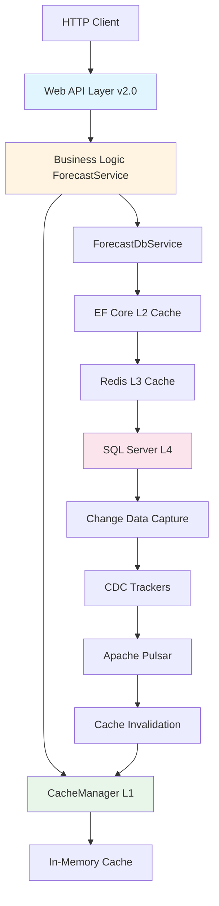
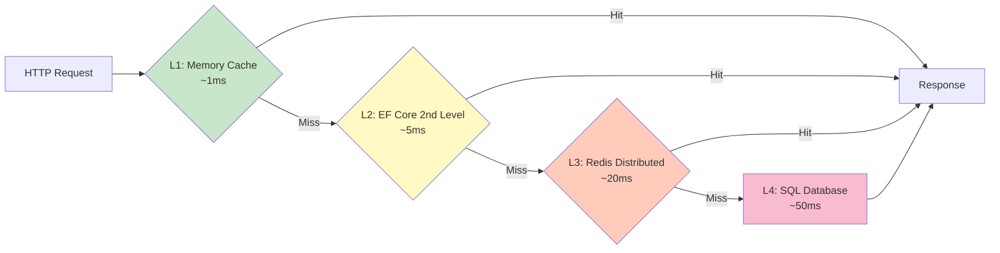
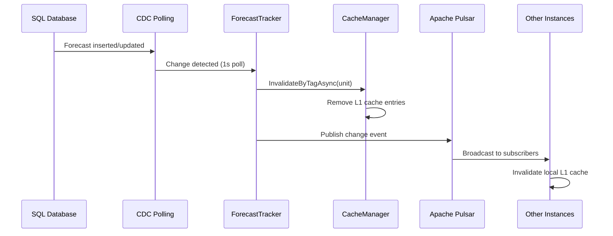
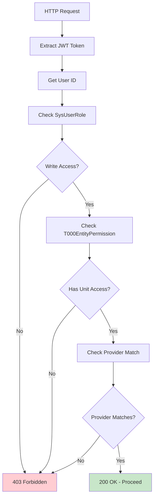
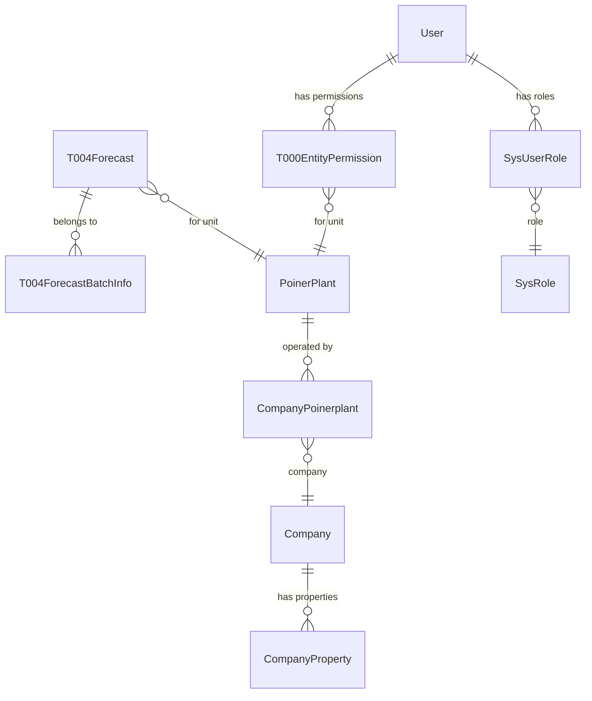

# ProductionForecast Service

**Version**: 2.0
**Framework**: .NET 9.0 SDK
**Status**: Production

## Overview

The ProductionForecast service is a high-performance, multi-tier cached microservice responsible for managing energy production forecasts for power plants, companies, and groups within the SmartPulse ecosystem. It provides REST API endpoints for saving and retrieving time-series forecast data with sophisticated caching strategies optimized for high read-throughput scenarios.

### Service Purpose

- **Forecast Management**: Save, retrieve, and manage energy production forecasts (MWh values)
- **Multi-Level Caching**: Four-tier caching architecture (L1-L4) for optimal performance
- **Authorization**: Fine-grained access control at unit and user level
- **Change Tracking**: Real-time cache invalidation using Change Data Capture (CDC)
- **API Versioning**: URL-based versioning with backward compatibility

### Key Capabilities

- **High Throughput**: 50K+ requests/sec for cached reads, 100 writes/sec
- **Multi-Tenant**: Supports multiple providers, companies, and organizational hierarchies
- **Batch Operations**: Efficient bulk insert (10K forecasts in <100ms)
- **Real-Time Invalidation**: CDC-based cache synchronization across instances
- **Compression**: GZIP compression for 40-60% payload reduction

---

## Architecture Overview



### Component Layers

1. **Web API Layer** ([web_api_layer.md](./web_api_layer.md))
   - ASP.NET Core controllers (v1.0, v2.0)
   - Middleware pipeline (context, logging, compression, caching)
   - API versioning and Swagger integration

2. **Business Logic Layer** ([business_logic_caching.md](./business_logic_caching.md))
   - ForecastService (orchestration)
   - ForecastDbService (data access)
   - CacheManager (L1 in-memory caching)
   - CDC Trackers (7 change trackers)

3. **Data Layer** ([data_layer_entities.md](./data_layer_entities.md))
   - Entity models (26 entities)
   - Repository pattern implementations
   - EF Core configuration
   - Database schema and indexes

4. **HTTP Client Layer** ([http_client_models.md](./http_client_models.md))
   - PFClient HTTP adapter
   - Request/Response DTOs
   - GZIP compression handler
   - Serialization strategy

---

## Multi-Tier Caching Strategy

The service implements a sophisticated 4-level caching hierarchy:



### Cache Levels

| Level | Technology | TTL | Scope | Invalidation |
|-------|-----------|-----|-------|--------------|
| **L1** | IMemoryCache | 5-60 min | Single instance | CDC + Tag-based |
| **L2** | EF Core 2nd Level | 1 hour | Single instance | Query cache key |
| **L3** | Redis | 1 hour | All instances | Pub/Sub broadcast |
| **L4** | SQL Server | Permanent | Database | N/A |

### Cache Keys

**Pattern 1: Global Configuration**
```
AllPoinerPlantGipConfigMemKey        → All plant GIP configurations
AllPoinerPlantHierarchiesMemKey      → Organizational hierarchies
AllPoinerPlantTimeZonesMemKey        → Plant timezone mappings
```

**Pattern 2: Unit-Specific Forecasts**
```
ForecastMemKey_{unitNo}              → Forecast data for unit
LatestForecastMemKey_{unitNo}        → Latest forecast only
forecast:{providerKey}:{unitType}:{unitNo}  → Output cache tag
```

**Pattern 3: User Access**
```
UserAccessibleUnitsMemKey_{userId}_{unitType}  → User's accessible units
UserRoleMemKey_{userId}_{roleName}             → User role assignments
```

### Invalidation Flow



**Invalidation Time**: ~100ms from database insert to all instances

---

## API Endpoints

### v2.0 Endpoints (Current)

**Base URL**: `/api/v2.0/production-forecast`

#### 1. Save Forecasts (POST)

```
POST /{providerKey}/{unitType}/{unitNo}/forecasts
```

**Parameters**:
- `shouldReturnSaves` (query): Return saved forecasts in response (default: false)
- `shouldSkipExistingCheck` (query): Skip duplicate check (default: false)

**Request Body**:
```json
{
  "forecasts": [
    {
      "deliveryStart": "2025-11-13T00:00:00Z",
      "deliveryEnd": "2025-11-13T01:00:00Z",
      "mWh": 450.5,
      "source": "PROVIDER",
      "notes": "Updated forecast",
      "validAfter": "2025-11-12T10:00:00Z"
    }
  ],
  "reason": "Daily update",
  "skipDuplicateCheck": false
}
```

**Response** (200 OK):
```json
{
  "success": true,
  "data": {
    "batchId": "3a2b1c4d-5e6f-7a8b-9c0d-1e2f3a4b5c6d",
    "savedCount": 24,
    "skippedCount": 0,
    "forecasts": []
  }
}
```

#### 2. Get Latest Forecasts (GET - Cached)

```
GET /{providerKey}/{unitType}/{unitNo}/forecasts/latest
```

**Query Parameters**:
- `from`: Start datetime (ISO8601)
- `to`: End datetime (ISO8601)
- `resolution`: Time bucket size (60, 120, 1440 minutes)

**Response** (200 OK):
```json
{
  "success": true,
  "data": {
    "unitId": "123",
    "createdAt": "2025-11-13T10:30:00Z",
    "validAfter": null,
    "forecasts": [
      {
        "deliveryStart": "2025-11-13T00:00:00Z",
        "deliveryEnd": "2025-11-13T01:00:00Z",
        "mWh": 450.5,
        "source": "PROVIDER"
      }
    ]
  }
}
```

**Cache**: 5 minutes, tag-based invalidation

#### 3. Get Latest by Date (GET - Cached)

```
GET /{providerKey}/{unitType}/{unitNo}/forecasts/latest-by-date?date={ISO8601}
```

Retrieves forecast for a specific delivery date.

#### 4. Get Latest by Production Time Offset (GET - Cached)

```
GET /{providerKey}/{unitType}/{unitNo}/forecasts/latest-by-production-time-offset?offset={minutes}
```

Retrieves forecast for delivery starting N minutes from now.

#### 5. Get Latest Multi (POST - Batch)

```
POST /GetLatestMulti
```

Batch retrieval for multiple units (max 100 units).

**Request Body**:
```json
{
  "providerKey": "PROVIDER1",
  "unitType": "PP",
  "unitIds": [123, 456, 789],
  "query": {
    "from": "2025-11-13T00:00:00Z",
    "to": "2025-11-14T00:00:00Z",
    "period": 60
  }
}
```

**Performance**: 10-50ms for 100 units (vs 500-5000ms without batching)

---

## Dependencies

### Internal Services

- **[Electric Core](../electric_core.md)**: Base infrastructure (BaseDbContext, logging, configuration)
- **[Pulsar Integration](../../integration/pulsar.md)**: Message broker for CDC events
- **[Redis Integration](../../integration/redis.md)**: Distributed L3 cache
- **[EF Core Data Access](../../data/ef_core.md)**: Database access patterns

### External Dependencies

| Dependency | Version | Purpose |
|------------|---------|---------|
| Microsoft.EntityFrameworkCore | 7.0.9 | ORM and L2 caching |
| Microsoft.AspNetCore.Mvc.Versioning | 5.1.0 | API versioning |
| Swashbuckle.AspNetCore | 8.0.0 | Swagger/OpenAPI |
| StackExchange.Redis | 2.6.0 | L3 distributed cache |
| Apache.Pulsar.Client | 2.10.0 | Event streaming |

---

## Security and Authorization

### Authentication

- **JWT Token**: Bearer token required for all write operations
- **Header Fallback**: `X-User-Id` header for internal service calls
- **Admin Default**: Admin user (ID=1) for system operations

### Authorization Levels



### Permission Model

1. **Role-Based**: SysUserRole (admin, analyst, operator)
2. **Entity-Level**: T000EntityPermission (read/write per unit)
3. **Provider-Level**: CompanyProviderSettings (provider access control)

---

## Performance Characteristics

### Read Operations

| Operation | Scenario | Throughput | Latency P50 | Latency P99 |
|-----------|----------|-----------|------------|------------|
| Get Latest | Cache HIT (L1) | 50K+/sec | <1ms | 2ms |
| Get Latest | Cache MISS | 1K+/sec | 25ms | 50ms |
| Get Latest Multi | 10 units, batch | 1K/sec | 50ms | 100ms |
| Get Latest Multi | 100 units, batch | 200/sec | 200ms | 500ms |

### Write Operations

| Operation | Scenario | Throughput | Latency P50 | Latency P99 |
|-----------|----------|-----------|------------|------------|
| Save Forecasts | 1000 items | 10/sec | 100ms | 200ms |
| Save Forecasts | 5000 items | 5/sec | 300ms | 500ms |
| Bulk Insert | 10K items (TVP) | 20/sec | 50ms | 100ms |

### Cache Operations

| Operation | Throughput | Latency |
|-----------|-----------|---------|
| L1 Cache Hit | 50K+/sec | <1ms |
| L1 Cache Store | 10K/sec | ~1ms |
| CDC Detection | 100/sec | 10-50ms |
| Cache Invalidation | 1K/sec | <5ms |

---

## Database Schema

### Core Tables

**T004Forecast** (Main forecast table)
- Composite PK: (BatchId, UnitType, UnitNo, DeliveryStart, DeliveryEnd, ProviderKey, ValidAfter)
- Temporal table with history (T004Forecast_History)
- Row versioning for optimistic concurrency
- Indexes: 5 covering indexes for query performance

**T004ForecastBatchInfo** (Batch metadata)
- Tracks batch save operations
- Audit trail (BatchId, RecordCount, CreatedBy, Status)

**T004ForecastBatchInsert** (Staging table)
- Bulk insert trigger: `trii_t004forecast_batch_insert`
- Auto-moves data to T004Forecast

### Entity Relationships



---

## Change Data Capture (CDC)

### CDC Trackers (7 Total)

| Tracker | Table | Purpose | Poll Interval |
|---------|-------|---------|--------------|
| T004ForecastLatestTracker | T004Forecast | Forecast changes | 1 second |
| PoinerPlantTracker | PoinerPlant | Plant changes | 1 second |
| SysUserRolesTracker | SysUserRole | Role changes | 1 second |
| T000EntityPermissionsTracker | T000EntityPermission | Permission changes | 1 second |
| T000EntityPropertyTracker | T000EntityProperty | Property changes | 1 second |
| T000EntitySystemHierarchyTracker | T000EntitySystemHierarchy | Hierarchy changes | 5 seconds |
| CompanyPropertyTracker | CompanyProperty | Company property changes | 5 seconds |

### CDC Flow

1. **Database Change**: INSERT/UPDATE/DELETE in tracked table
2. **Polling**: CDC tracker polls every 1-5 seconds
3. **Detection**: Change detected via SQL Server Change Tracking
4. **Processing**: HandleChangeAsync() called
5. **Cache Invalidation**: Relevant cache keys removed
6. **Event Broadcast**: Change event published to Pulsar
7. **Multi-Instance Sync**: All instances invalidate local caches

**End-to-End Latency**: ~100ms from database change to cache invalidation

---

## Error Handling

### Exception Hierarchy

- **ApiException** (500): Base exception for API errors
- **BadRequestException** (400): Validation errors, invalid parameters
- **ExistingDataException** (409): Duplicate forecasts, conflicts
- **AuthorizationException** (403): Permission denied
- **PFException**: Internal service errors

### Error Response Format

```json
{
  "success": false,
  "statusCode": 400,
  "message": "Validation failed",
  "traceId": "3a2b1c4d-5e6f-7a8b-9c0d-1e2f3a4b5c6d",
  "data": {
    "forecasts": ["Duplicate forecasts in batch"],
    "MWh": ["Field must be greater than 0.1"]
  }
}
```

---

## Configuration

### Environment Variables

```bash
# Database
ConnectionStrings__ForecastDb="Server=...;Database=SmartPulse;..."

# Caching
AppSettings__CacheSettings__OutputCache__Duration=60  # seconds
AppSettings__CacheSettings__MemoryCache__GeneralLongDuration=1440  # minutes

# CDC
LOG_CDC=false
CDCInterval=1000  # milliseconds

# Allowed Periods
ALLOWED_PERIODS=5,10,15,30,60  # minutes

# Redis
Redis__Configuration="localhost:6379"
Redis__InstanceName="SmartPulse"

# Pulsar
Pulsar__ServiceUrl="pulsar://localhost:6650"
Pulsar__TopicPrefix="smartpulse.forecast"
```

### appsettings.json

```json
{
  "AppSettings": {
    "CacheSettings": {
      "OutputCache": {
        "UseCacheInvalidationService": false,
        "UseCacheInvalidationChangeTracker": true,
        "Duration": 60
      },
      "MemoryCache": {
        "GeneralLongDuration": 1440,
        "GeneralShortDuration": 60,
        "GeneralShorterDuration": 1
      }
    }
  },
  "ConnectionStrings": {
    "ForecastDb": "Server=...;Database=SmartPulse;..."
  }
}
```

---

## Quick Start

### Local Development

```bash
# 1. Setup database
dotnet ef database update --project SmartPulse.Entities

# 2. Configure appsettings
cp appsettings.Development.json appsettings.json
# Edit connection strings

# 3. Run service
dotnet run --project SmartPulse.Web.Services

# 4. Access Swagger UI
http://localhost:5000/swagger/index.html
```

### Docker Deployment

```bash
# Build image
docker build -t smartpulse-forecast:latest .

# Run container
docker run -d \
  -p 5000:80 \
  -e ConnectionStrings__ForecastDb="..." \
  -e Redis__Configuration="redis:6379" \
  -e Pulsar__ServiceUrl="pulsar://pulsar:6650" \
  smartpulse-forecast:latest
```

---

## Monitoring and Observability

### Structured Logging

- **Request Logging**: All HTTP requests logged with method, path, query, duration
- **Cache Events**: Cache hits/misses, invalidations logged
- **CDC Events**: Change detection and processing logged
- **Errors**: All exceptions logged with trace IDs

### Health Checks

```bash
GET /health
GET /health/ready
GET /health/live
```

### Metrics

- Request count per endpoint
- Cache hit rate (L1, L2, L3)
- Average response time
- CDC processing latency
- Database query performance

---

## Best Practices

### Development

✅ **Use batch operations** for multiple units
✅ **Leverage caching** - check cache before database
✅ **Tag-based invalidation** - use specific tags
✅ **Async/await** throughout for I/O operations
✅ **Connection pooling** via IHttpClientFactory

### Production

✅ **Connection resilience** - retry policies configured
✅ **Output caching** - 5 min TTL with tag-based invalidation
✅ **CDC monitoring** - track invalidation latency
✅ **Index maintenance** - rebuild indexes monthly
✅ **Temporal table cleanup** - archive history yearly

---

## Related Documentation

### Component Documentation
- [Web API Layer](./web_api_layer.md) - Controllers, middleware, API versioning
- [Business Logic & Caching](./business_logic_caching.md) - Services, CacheManager, CDC
- [Data Layer & Entities](./data_layer_entities.md) - EF Core, repositories, schema
- [HTTP Client & Models](./http_client_models.md) - PFClient, DTOs, serialization

### Integration Documentation
- [Electric Core](../electric_core.md) - Base infrastructure
- [Apache Pulsar](../../integration/pulsar.md) - Message broker
- [Redis](../../integration/redis.md) - Distributed cache
- [EF Core Patterns](../../data/ef_core.md) - Data access patterns

### Architecture Documentation
- [System Architecture](../../architecture/00_system_overview.md)
- [Architectural Patterns](../../architecture/architectural_patterns.md)
- [Data Flow & Communication](../../architecture/data_flow_communication.md)

---

**Last Updated**: 2025-11-13
**Maintainer**: SmartPulse Development Team
**Version**: 2.0 (Current Production)
