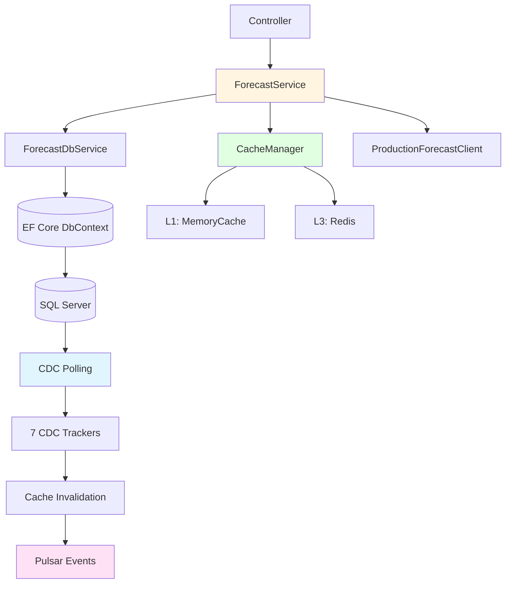
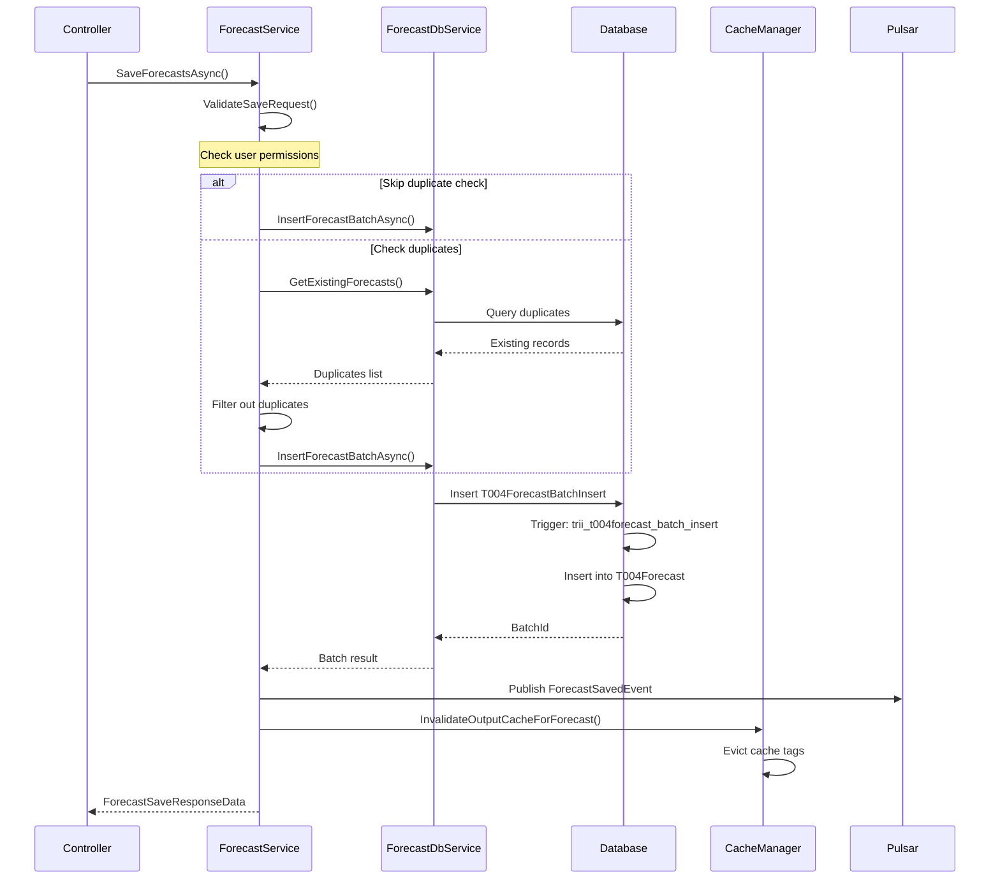
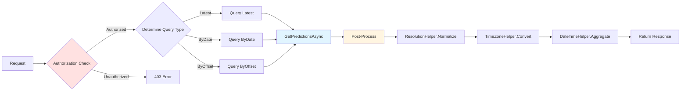
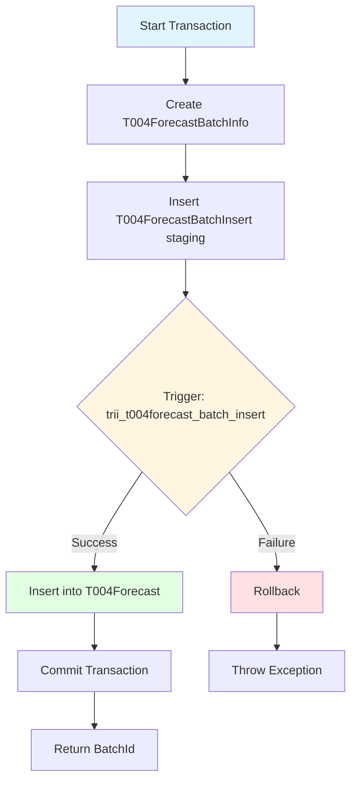
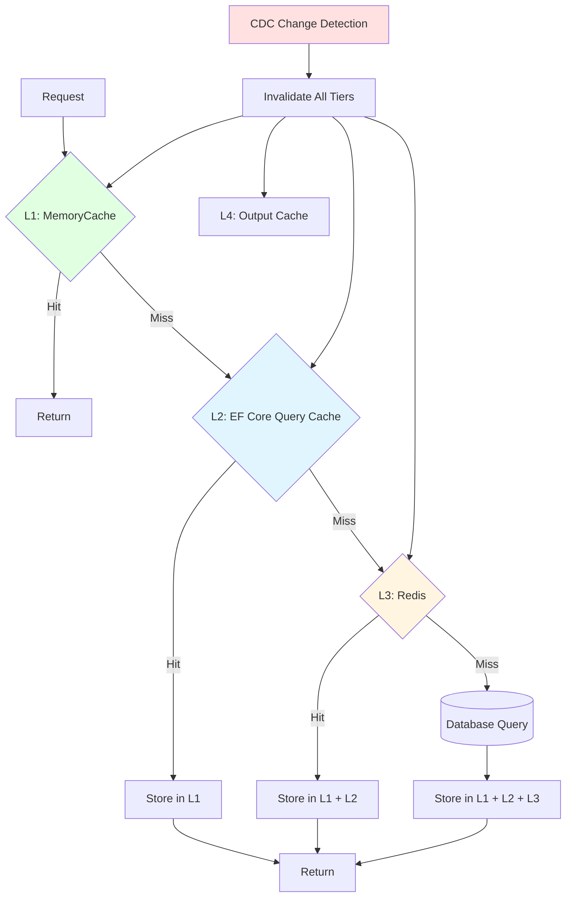
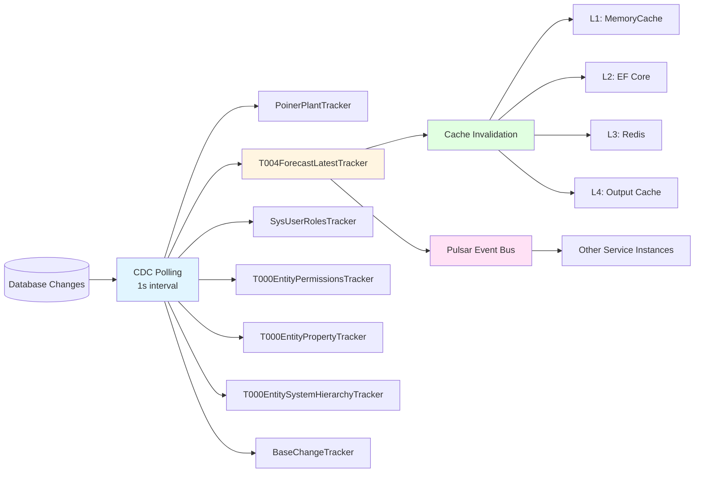
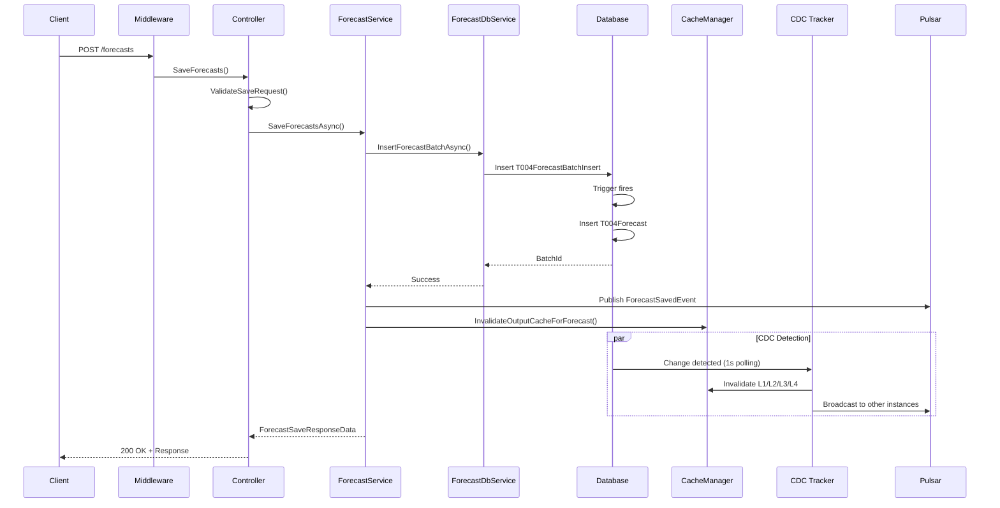
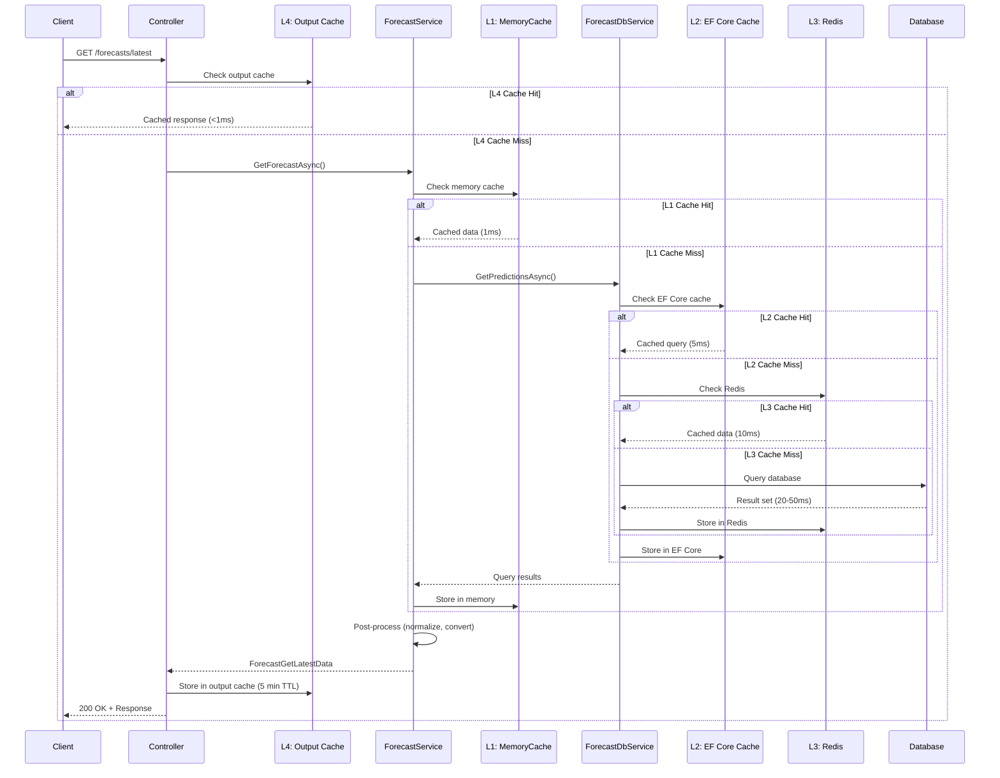

# ProductionForecast Service - Business Logic & Caching

**Component**: ProductionForecast
**Layer**: Application/Business Logic
**Assembly**: SmartPulse.Application
**Related Components**: [Electric Core](../electric_core.md), [Pulsar](../../integration/pulsar.md), [Redis](../../integration/redis.md), [EF Core](../../data/ef_core.md)

---

## Overview

The business logic layer orchestrates forecast operations, implements multi-tier caching strategy, and integrates Change Data Capture (CDC) for automatic cache invalidation. This layer coordinates between the HTTP API, database, and external services.

### Key Features

- **Multi-Tier Caching**: L1 (Memory) + L2 (EF Core) + L3 (Redis) + L4 (Output Cache)
- **CDC Integration**: Real-time database change tracking with automatic cache invalidation
- **Stampede Prevention**: Double-checked locking for cache loads
- **Authorization**: Role-based and unit-level access control
- **Transaction Safety**: Explicit transactions with rollback support

### Architecture



---

## ForecastService

### Purpose

Main orchestrator for forecast operations. Coordinates between HTTP API, business logic, database, and external services.

### Class Definition

```csharp
public class ForecastService : IForecastService
{
    private readonly IForecastDbService _dbService;
    private readonly CacheManager _cache;
    private readonly IProductionForecastClient _pfClient;
    private readonly ILogger<ForecastService> _logger;
    private readonly IHttpContextAccessor _httpContext;
}
```

**Lifestyle**: Transient (new instance per request)

---

### Key Methods

#### 1. SaveForecastsAsync

**Signature**:
```csharp
public async Task<ForecastSaveResponseData> SaveForecastsAsync(
    string providerKey,
    string unitType,
    string unitNo,
    ForecastSaveRequestBody request,
    bool shouldReturnSaves = false,
    bool shouldSkipExistingCheck = false,
    CancellationToken cancellationToken = default)
```

**Flow Diagram**:



**Implementation Steps**:

<details>
<summary>Click to expand detailed flow</summary>

```
1. Authorization check (ValidateSaveRequest)
   └─ User has write access to unit
   └─ Provider key matches user's permissions

2. Validate request data
   └─ No duplicate forecasts [DisallowDuplicateForecast]
   └─ MWh values > 0.1
   └─ Delivery period valid

3. Check for duplicates (unless shouldSkipExistingCheck=true)
   └─ Query database for existing forecasts
   └─ Calculate intersection with incoming batch
   └─ Separate into "save" and "skip" lists

4. Save new forecasts
   └─ Call IForecastDbService.InsertForecastBatchAsync()
   └─ Insert T004ForecastBatchInsert (staging)
   └─ Trigger cascade to T004ForecastBatchInfo

5. Publish event (if configured)
   └─ Pulsar: ForecastSavedEvent
   └─ Message: BatchId, Count, Timestamp

6. Invalidate output cache
   └─ Tag: forecast:{providerKey}:{unitType}:{unitNo}
   └─ Sync across instances via Redis Pub/Sub

7. Return response
   └─ BatchId (unique identifier)
   └─ SavedCount (new records)
   └─ SkippedCount (duplicates)
   └─ Optional: Full forecast list (shouldReturnSaves=true)
```

</details>

**Time Complexity**: O(n) where n = batch size
- Duplicate check: O(n log m) where m = database records
- Insert: O(n)
- Cache invalidation: O(1)
- **Total**: ~100ms for 1000-item batch

**Response Model**:
```csharp
public class ForecastSaveResponseData
{
    public string BatchId { get; set; }              // UUID
    public int SavedCount { get; set; }             // New
    public int SkippedCount { get; set; }           // Duplicates
    public List<ForecastSaveData> Forecasts { get; set; }  // Optional
    public DateTime SavedAt { get; set; }
}
```

---

#### 2. GetForecastAsync

**Signature**:
```csharp
public async Task<ForecastGetLatestData> GetForecastAsync(
    string providerKey,
    string unitType,
    string unitNo,
    DateTime? from,
    DateTime? to,
    string resolution,
    CancellationToken cancellationToken = default)
```

**Flow**:



**Implementation Steps**:
```
1. Authorization check
   └─ User has read access to unit

2. Determine query type
   ├─ Latest: Last saved forecast
   ├─ ByDate: For specific delivery date
   └─ ByOffset: For delivery starting N minutes from now

3. Query database
   └─ Call IForecastDbService.GetPredictionsAsync()
   └─ Filter by unit + delivery period
   └─ Order by DeliveryStart DESC
   └─ Limit to N latest records

4. Post-process
   └─ ResolutionHelper.Normalize(forecasts, resolution)
   └─ TimeZoneHelper.Convert(forecasts, userTimeZone)
   └─ DateTimeHelper.Aggregate(forecasts, period)

5. Return response
   └─ List of UnitForecast items
   └─ Metadata (CreatedAt, ValidAfter)
```

**Time Complexity**: O(n) where n = result set size
- Database query: 20-50ms (indexed)
- Post-processing: 5-10ms
- **Total**: ~25-60ms

**Resolution Types**:
```csharp
public enum ResolutionType
{
    Hourly = 60,      // 1 hour buckets
    TwoHourly = 120,  // 2 hour buckets
    Daily = 1440,     // 24 hour buckets
}
```

---

#### 3. GetForecastMultiAsync

**Signature**:
```csharp
public async Task<Dictionary<string, ForecastGetLatestData>> GetForecastMultiAsync(
    ForecastGetLatestMultiRequest request,
    CancellationToken cancellationToken = default)
```

**Optimization**: Batch query instead of N individual queries

**Flow**:
```
1. Extract common query parameters
2. Build unit list (max 100)
3. Single database query for all units
   └─ WHERE (ProviderKey, UnitType, UnitNo) IN (list)
   └─ Fetch all in one roundtrip

4. Group results by unit
   └─ Dictionary<UnitKey, ForecastList>

5. Post-process each unit's forecasts
6. Return dictionary of results
```

**Performance**: 10-50ms for 100 units (vs 500-5000ms without batching)

---

### Validation Methods

#### ValidateSaveRequest

**Checks**:
1. User authenticated (has valid JWT)
2. User has write role (SysUserRole)
3. User's permissions include this unit (T000EntityPermission)
4. Provider key matches user's assigned company
5. UnitType is valid (T000EntitySystemHierarchy)
6. Request model validates (custom attributes)

**Throws**:
- `AuthorizationException` (403) - No permissions
- `BadRequestException` (400) - Invalid data
- `ExistingDataException` (409) - Duplicates found

---

## ForecastDbService

### Purpose

Low-level database operations. Encapsulates EF Core queries and commands.

**Lifestyle**: Transient

### Class Definition

```csharp
public class ForecastDbService : IForecastDbService
{
    private readonly ForecastDbContext _dbContext;
    private readonly IForecastRepository _repository;
    private readonly ILogger<ForecastDbService> _logger;
}

// Partial classes:
// - ForecastDbService.cs (initialization)
// - ForecastDbService_Queries.cs (23 query methods)
// - ForecastDbService_Commands.cs (insert/update methods)
```

---

### Query Methods

#### GetPredictionsAsync

**Query Pattern**:
```csharp
var query = _dbContext.T004Forecasts
    .AsNoTracking()  // Read-only optimization
    .WithCache($"forecasts:{unitNo}", TimeSpan.FromHours(1))  // L2 cache
    .Where(f => f.ProviderKey == providerKey
        && f.UnitType == unitType
        && f.UnitNo == unitNo
        && f.DeliveryStart >= from
        && f.DeliveryEnd <= to)
    .OrderByDescending(f => f.DeliveryStart)
    .ThenByDescending(f => f.ValidAfter)
    .Take(limit);

return await query.ToListAsync(ct);
```

**Indexes Used**:
- Composite: `(ProviderKey, UnitType, UnitNo, DeliveryStart DESC)`
- Query time: 20-50ms without cache

**N+1 Prevention**: `.AsNoTracking()` + explicit `.Include()` for navigation

---

#### GetLatestForecastAsync

**Uses SQL Function**: `tb004get_munit_forecasts_latest`

```sql
SELECT TOP 1 * FROM T004Forecast
WHERE UnitNo = @unitNo
  AND (ValidAfter IS NULL OR ValidAfter <= GETUTCDATE())
ORDER BY DeliveryStart DESC, ValidAfter DESC
```

**Performance**: <10ms (indexed, cached)

---

### Command Methods

#### InsertForecastBatchAsync

**Flow Diagram**:



**Implementation**:
```csharp
public async Task<string> InsertForecastBatchAsync(
    List<ForecastSaveData> forecasts,
    string providerKey,
    string unitType,
    string unitNo,
    CancellationToken ct = default)
{
    using var transaction = await _dbContext.Database.BeginTransactionAsync(ct);

    try
    {
        // 1. Create batch info
        var batchId = Guid.NewGuid().ToString();
        var batchInfo = new T004ForecastBatchInfo
        {
            BatchId = batchId,
            RecordCount = forecasts.Count,
            CreatedAt = DateTime.UtcNow
        };
        _dbContext.T004ForecastBatchInfos.Add(batchInfo);

        // 2. Insert staging records
        var stagingRecords = forecasts.Select(f => new T004ForecastBatchInsert
        {
            BatchId = batchId,
            ForecastId = Guid.NewGuid().ToString(),
            MWh = f.MWh,
            Source = f.Source,
            Notes = f.Notes
        });
        _dbContext.T004ForecastBatchInserts.AddRange(stagingRecords);

        // 3. Save changes (triggers cascade)
        await _dbContext.SaveChangesAsync(ct);

        // 4. Commit transaction
        await transaction.CommitAsync(ct);

        return batchId;
    }
    catch
    {
        await transaction.RollbackAsync(ct);
        throw;
    }
}
```

**Database Trigger**: `trii_t004forecast_batch_insert`

<details>
<summary>Click to expand trigger definition</summary>

```sql
CREATE TRIGGER trii_t004forecast_batch_insert
ON T004ForecastBatchInsert
AFTER INSERT
AS
BEGIN
    SET NOCOUNT ON;

    INSERT INTO T004Forecast
    SELECT BatchId, ForecastId, MWh, Source, Notes, GETUTCDATE(), NULL
    FROM inserted
    WHERE NOT EXISTS (
        SELECT 1 FROM T004Forecast f
        WHERE f.ForecastId = inserted.ForecastId
    )
END
```

</details>

**Performance**: Bulk insert ~5-10ms per 1000 records

---

#### BulkInsertForecastsAsync

**Optimization**: Table-Valued Parameter (TVP) instead of individual inserts

```csharp
var tvp = new SqlParameter("@forecasts", SqlDbType.Structured)
{
    TypeName = "dbo.ForecastTableType",
    Value = forecasts.ToDataTable()
};

await _dbContext.Database.ExecuteSqlRawAsync(
    "EXEC sp_BulkInsertForecasts @forecasts",
    tvp,
    ct);
```

**Performance**: 50-100ms for 10K records (vs 500+ ms with individual inserts)

---

## CacheManager

### Purpose

Thread-safe in-memory caching with automatic invalidation via CDC.

### Multi-Tier Caching Architecture



### Class Definition

```csharp
public class CacheManager
{
    private readonly IMemoryCache _cache;
    private readonly IDistributedDataManager<CacheEntry> _distributedCache;
    private readonly ILogger<CacheManager> _logger;

    // 13 cache key constants
    public const string AllPoinerPlantGipConfigMemKey = "AllPoinerPlantGipConfig";
    public const string AllPoinerPlantHierarchiesMemKey = "AllPoinerPlantHierarchies";
    public const string AllPoinerPlantTimeZonesMemKey = "AllPoinerPlantTimeZones";
    // ... 10 more keys
}
```

**Lifetime**: Singleton (shared across all requests)

---

### Cache Keys

**Pattern 1: Global (single entry)**
```
AllPoinerPlantGipConfigMemKey
AllPoinerPlantHierarchiesMemKey
AllPoinerPlantTimeZonesMemKey
```

**Pattern 2: Keyed (one per ID)**
```
PoinerPlantRegionMemKey_{ppId}        // Region: "TR1", "TR2", etc.
GroupRegionMemKey_{groupId}
UserRoleMemKey_{userId}_{roleName}
```

**Pattern 3: User/Unit specific**
```
UserAccessibleUnitsMemKey_{userId}_{unitType}
CompanyProviderSettingsMemKey_{companyId}
CompanyLimitSettingsMemKey_{companyId}
GroupIntradaySettingsMemKey_{groupId}
```

**Pattern 4: Forecast data (L3 distributed)**
```
ForecastMemKey_{unitNo}
LatestForecastMemKey_{unitNo}
```

---

### Get Operations with Stampede Prevention

#### GetAsync with Double-Checked Locking

```csharp
public async Task<T> GetAsync<T>(
    string key,
    Func<Task<T>> factory,
    TimeSpan? ttl = null)
    where T : class
{
    // L1 Cache check
    if (_cache.TryGetValue(key, out T cached))
        return cached;

    // Double-checked locking (stampede prevention)
    var lockKey = $"lock:{key}";
    var acquired = await _distributedLock.TryAcquireAsync(lockKey, TimeSpan.FromSeconds(5));

    try
    {
        if (acquired)
        {
            // We got lock, check cache again
            if (_cache.TryGetValue(key, out cached))
                return cached;

            // Load from source
            var value = await factory();

            // Cache with TTL
            var cacheOptions = new MemoryCacheEntryOptions()
                .SetAbsoluteExpiration(ttl ?? TimeSpan.FromHours(1));

            _cache.Set(key, value, cacheOptions);
            return value;
        }
        else
        {
            // Another thread has lock, wait briefly then retry
            await Task.Delay(100);
            return await GetAsync(key, factory, ttl);
        }
    }
    finally
    {
        if (acquired)
            await _distributedLock.ReleaseAsync(lockKey);
    }
}
```

**Benefits**:
- Prevents cache stampede (thousands of simultaneous cache misses)
- Guarantees only one database query per cache miss
- Thread-safe across multiple instances (distributed lock via Redis)

---

### Invalidation Operations

#### InvalidateByTagAsync

```csharp
public async Task InvalidateByTagAsync(string tag)
{
    // Find all keys with this tag
    var keysToInvalidate = _cache.GetKeysByTag(tag);

    // Remove each key
    foreach (var key in keysToInvalidate)
    {
        _cache.Remove(key);
        _logger.LogInformation("Invalidated cache key: {Key}", key);
    }

    // Broadcast to other instances
    await _distributedCache.PublishInvalidationAsync(tag);
}
```

#### InvalidateForecastAsync

```csharp
public async Task InvalidateForecastAsync(
    string providerKey,
    string unitType,
    string unitNo)
{
    var tag = $"forecast:{providerKey}:{unitType}:{unitNo}";
    await InvalidateByTagAsync(tag);

    // Also invalidate related caches
    await InvalidateByTagAsync($"latest:{unitNo}");
    await InvalidateByTagAsync($"user:*");  // User access lists
}
```

---

### Cache Warming (Preload)

```csharp
public async Task WarmCacheAsync()
{
    // Load at startup
    var allPlants = await _dbService.GetAllPoinerPlantsAsync();
    _cache.Set(AllPoinerPlantGipConfigMemKey, allPlants,
        new MemoryCacheEntryOptions().SetAbsoluteExpiration(TimeSpan.FromHours(24)));

    var hierarchies = await _dbService.GetHierarchiesAsync();
    _cache.Set(AllPoinerPlantHierarchiesMemKey, hierarchies,
        new MemoryCacheEntryOptions().SetAbsoluteExpiration(TimeSpan.FromHours(24)));

    _logger.LogInformation("Cache warming completed");
}
```

---

## Change Data Capture (CDC)

### Architecture



### 7 CDC Trackers

#### 1. T004ForecastLatestTracker

**Purpose**: Track all T004Forecast table changes

```csharp
public class T004ForecastLatestTracker : BaseChangeTracker<T004Forecast>
{
    public T004ForecastLatestTracker(...)
    {
        TableName = "dbo.T004Forecast";
        SelectColumns = "UnitNo, DeliveryStart, ValidAfter";
    }

    protected override async Task HandleChangeAsync(ChangeItem change)
    {
        var unitNo = change.Keys[2].ToString();  // Third key component

        // Invalidate forecast caches for this unit
        await _cache.InvalidateByTagAsync($"forecast:{unitNo}");
        await _cache.InvalidateByTagAsync($"latest:{unitNo}");

        // Reset output cache tag
        await _cache.InvalidateByTagAsync("forecast");

        // Publish event
        await _pulsar.WriteObj("forecast-changes",
            new ForecastChangeEvent
            {
                UnitNo = unitNo,
                Operation = change.OperationType,
                Timestamp = DateTime.UtcNow
            });
    }
}
```

**Tracks**:
- All T004Forecast changes
- Invalidates unit-specific caches
- Triggers output cache invalidation
- Broadcasts to Pulsar

**Performance**: <50ms average processing time

---

#### 2. PoinerPlantTracker

```csharp
public class PoinerPlantTracker : BaseChangeTracker<PoinerPlant>
{
    protected override async Task HandleChangeAsync(ChangeItem change)
    {
        switch (change.OperationType)
        {
            case OperationType.Update:
                // Invalidate region cache for this plant
                var plantId = change.Keys[0].ToString();
                var plant = await GetPlantAsync(plantId);
                await _cache.InvalidateByTagAsync($"region:{plant.RegionId}");
                break;

            case OperationType.Delete:
                // Remove from all lookups
                await _cache.InvalidateByTagAsync("plants:*");
                break;
        }

        // Publish to Pulsar for other instances
        await _pulsar.WriteObj("poiner-plant-changes", change);
    }
}
```

**Polling Interval**: 1 second

---

#### 3. Other CDC Trackers

**SysUserRolesTracker**: Tracks user role assignments
- Invalidates: `UserRoleMemKey_{userId}_{roleName}`

**T000EntityPermissionsTracker**: Tracks entity-level permissions
- Invalidates: `UserAccessibleUnitsMemKey_{userId}_{unitType}`

**T000EntityPropertyTracker**: Tracks entity properties

**T000EntitySystemHierarchyTracker**: Tracks system hierarchy changes

---

#### 7. BaseChangeTracker (Abstract Base)

```csharp
public abstract class BaseChangeTracker
{
    protected ForecastDbContext Context { get; }
    protected string TableName { get; set; }
    protected string SelectColumns { get; set; }

    public async Task StartAsync(CancellationToken ct)
    {
        await foreach (var changes in
            Context.TrackChangesAsync(TableName, SelectColumns,
                delayMs: 1000,
                cancellationToken: ct))
        {
            foreach (var change in changes)
            {
                await HandleChangeAsync(change);
            }
        }
    }

    protected abstract Task HandleChangeAsync(ChangeItem change);
}
```

**Features**:
- Polling-based CDC (no triggers)
- Automatic retry with backoff
- Thread-safe async enumerable

---

### CDC Flow Example

```
1. Forecast inserted into T004Forecast table
2. Trigger: trii_t004forecast_batch_insert fires
3. CDC polling (1s interval) detects insert
4. T004ForecastLatestTracker.HandleChangeAsync() called
5. Cache invalidation:
   - forecast:{unitNo} removed from L1
   - latest:{unitNo} removed from L1
   - forecast (global) tag removed from L4
   - L2 (EF Core) cache cleared
   - L3 (Redis) cache cleared
6. Event published to Pulsar
7. Other instances subscribe and invalidate locally
8. Next GET request hits database (cache miss), fetches latest
9. Response cached for 5 minutes across all tiers
```

**End-to-End**: ~100ms from database insert to cache invalidation

---

## Business Logic Flows

### Flow 1: Save Forecast (Write Path)



**Total Time**: 50-100ms

---

### Flow 2: Get Forecast (Read Path with Multi-Tier Cache)



**Performance**:
- **L4 Cache Hit**: <1ms
- **L1 Cache Hit**: 1ms
- **L2 Cache Hit**: 5ms
- **L3 Cache Hit**: 10ms
- **Cache Miss**: 25-60ms (database query + caching all tiers)

---

## Helpers & Utilities

### ResolutionHelper

**Purpose**: Aggregate forecasts by time resolution

```csharp
public static class ResolutionHelper
{
    public static List<UnitForecast> Normalize(
        List<UnitForecast> forecasts,
        string resolution)
    {
        var resolutionMinutes = int.Parse(resolution);

        // Group by time bucket
        return forecasts
            .GroupBy(f => f.DeliveryStart.RoundDown(TimeSpan.FromMinutes(resolutionMinutes)))
            .Select(g => new UnitForecast
            {
                DeliveryStart = g.Key,
                DeliveryEnd = g.Key.AddMinutes(resolutionMinutes),
                MWh = g.Sum(f => f.MWh),  // Aggregate
                Source = g.First().Source
            })
            .ToList();
    }
}
```

**Example**: 48 hourly values → 2 daily values

---

### DateTimeHelper

**Purpose**: Timezone conversion and time manipulation

```csharp
public static class DateTimeHelper
{
    // Convert UTC to user timezone
    public static DateTime ConvertToUserTimeZone(
        DateTime utcTime,
        string timeZoneId)
    {
        var tz = TimeZoneInfo.FindSystemTimeZoneById(timeZoneId);
        return TimeZoneInfo.ConvertTimeFromUtc(utcTime, tz);
    }

    // Handle DST transitions correctly
    public static DateTime RoundDown(this DateTime dt, TimeSpan interval)
    {
        return dt.AddTicks(-(dt.Ticks % interval.Ticks));
    }
}
```

---

## Performance Metrics

| Operation | Throughput | Latency P50 | Latency P99 | Memory |
|-----------|-----------|------------|------------|--------|
| Save forecast (1000 items) | 10/sec | 100ms | 200ms | 50MB |
| Get latest (L4 cache hit) | 50K/sec | <1ms | 2ms | - |
| Get latest (L1 cache hit) | 10K/sec | 1ms | 5ms | 100MB |
| Get latest (L3 cache hit) | 5K/sec | 10ms | 20ms | - |
| Get latest (cache miss) | 1K/sec | 25ms | 50ms | - |
| CDC detection | 100/sec | 10ms | 50ms | 10MB |
| Cache invalidation | 1K/sec | <1ms | 5ms | - |

---

## Cross-References

- **Web API**: [Web API Layer](./web_api_layer.md)
- **Data Layer**: [Data Layer & Entities](./data_layer_entities.md)
- **HTTP Client**: [HTTP Client & Models](./http_client_models.md)
- **Electric Core**: [Electric Core Component](../electric_core.md)
- **Pulsar**: [Pulsar Messaging](../../integration/pulsar.md)
- **Redis**: [Redis Caching](../../integration/redis.md)
- **EF Core**: [Entity Framework Core](../../data/ef_core.md)

---

**Last Updated**: 2025-11-13
**Version**: 1.0
**Status**: Production
