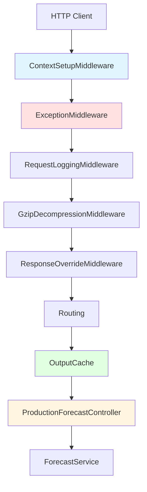
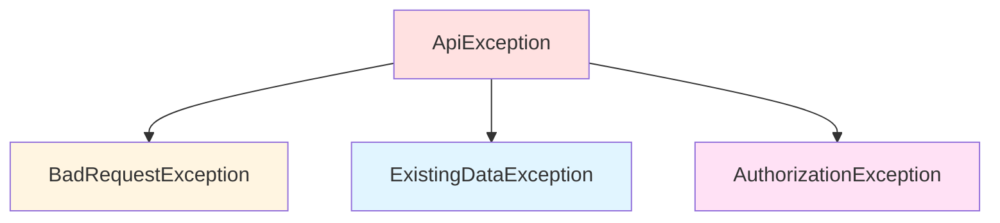

# ProductionForecast Service - Web API Layer

**Component**: ProductionForecast
**Layer**: Web API & Controllers
**Assembly**: SmartPulse.Web.Services
**Related Components**: [Electric Core](../electric_core.md), [Pulsar](../../integration/pulsar.md), [Redis](../../integration/redis.md)

---

## Overview

The Web API layer provides HTTP endpoints for production forecast operations. Built on ASP.NET Core, it implements RESTful APIs with URL-based versioning, comprehensive middleware pipeline, and output caching.

### Key Features

- **API Versioning**: URL-based versioning (v1.0, v2.0)
- **Output Caching**: Tag-based cache invalidation with 5-minute default TTL
- **Middleware Pipeline**: Request logging, GZIP compression, exception handling
- **Swagger/OpenAPI**: Interactive API documentation
- **Authorization**: JWT-based authentication with role-based access control

### Architecture



---

## API Versioning

### Configuration

```csharp
services.AddApiVersioning(options =>
{
    options.DefaultApiVersion = new ApiVersion(1, 0);
    options.AssumeDefaultVersionWhenUnspecified = true;
    options.ApiVersionReader = new UrlSegmentApiVersionReader();
});
```

### Supported Versions

| Version | Status | Route Pattern | Notes |
|---------|--------|---------------|-------|
| 1.0 | Deprecated | `/api/v1.0/production-forecast/...` | Legacy support only |
| 2.0 | Current | `/api/v2.0/production-forecast/...` | Active development |

### URL Format

```
/api/{version}/production-forecast/{providerKey}/{unitType}/{unitNo}/{action}
```

**Example:**
```
/api/v2.0/production-forecast/PROVIDER1/UNIT_TYPE_A/123/forecasts
```

---

## Controllers

### ProductionForecastController (v2.0)

**Route**: `/api/v2.0/production-forecast`

**Dependencies**:
- `IForecastService` - Business logic orchestration
- `IForecastDbService` - Database operations
- `CacheManager` - In-memory caching
- `IHttpContextAccessor` - Request context
- `ILogger<ProductionForecastController>` - Structured logging

#### Method 1: SaveForecasts (POST)

<details>
<summary>Click to expand endpoint details</summary>

**Endpoint**: `POST /api/v2.0/production-forecast/{providerKey}/{unitType}/{unitNo}/forecasts`

**Parameters**:
- `providerKey` (route) - Provider identifier
- `unitType` (route) - Unit type (THERMAL, WIND, SOLAR)
- `unitNo` (route) - Unit number
- `shouldReturnSaves` (query) - Return saved forecasts in response
- `shouldSkipExistingCheck` (query) - Skip duplicate check

**Request Body**:
```json
{
  "forecasts": [
    {
      "deliveryStart": "2025-11-13T00:00:00Z",
      "deliveryEnd": "2025-11-13T01:00:00Z",
      "mwh": 450.5,
      "source": "PROVIDER",
      "notes": "Forecast batch A",
      "validAfter": "2025-11-13T00:00:00Z"
    }
  ],
  "reason": "Scheduled update",
  "skipDuplicateCheck": false
}
```

**Response** (200 OK):
```json
{
  "success": true,
  "data": {
    "batchId": "3a2b1c4d-5e6f-7a8b-9c0d-1e2f3a4b5c6d",
    "savedCount": 100,
    "skippedCount": 5,
    "forecasts": []
  },
  "traceId": "0HN5Q0QMQGDMP:00000001",
  "timestamp": "2025-11-13T10:30:00Z"
}
```

**Authorization**: User must have write access to unit

**Performance**: ~50-100ms for typical batch (1000 items)

</details>

#### Method 2: GetLatest (GET - Cached)

<details>
<summary>Click to expand endpoint details</summary>

**Endpoint**: `GET /api/v2.0/production-forecast/{providerKey}/{unitType}/{unitNo}/forecasts/latest`

**Parameters**:
- `from` (query) - Start date (ISO8601)
- `to` (query) - End date (ISO8601)
- `resolution` (query) - Time resolution in minutes (default: 60)

**Caching**:
- **Policy**: "Forecast" (5 min default TTL)
- **Vary By**: Host
- **Tags**: `forecast:{providerKey}:{unitType}:{unitNo}`
- **Performance**: 10K+/sec in-memory hits

**Response** (200 OK):
```json
{
  "success": true,
  "data": {
    "unitId": "123",
    "unitType": "THERMAL",
    "createdAt": "2025-11-13T10:00:00Z",
    "validAfter": "2025-11-13T00:00:00Z",
    "resolution": "60",
    "forecasts": [
      {
        "deliveryStart": "2025-11-13T00:00:00Z",
        "deliveryEnd": "2025-11-13T01:00:00Z",
        "mwh": 450.5,
        "source": "PROVIDER"
      }
    ]
  }
}
```

**Performance**:
- Cache hit: <1ms
- Cache miss: 20-50ms (database query)

</details>

#### Method 3: GetLatestMulti (POST - Batch)

<details>
<summary>Click to expand endpoint details</summary>

**Endpoint**: `POST /api/v2.0/production-forecast/GetLatestMulti`

**Request Body**:
```json
{
  "providerKey": "PROVIDER1",
  "unitType": "THERMAL",
  "unitIds": ["123", "456", "789"],
  "query": {
    "from": "2025-11-13T00:00:00Z",
    "to": "2025-11-14T00:00:00Z",
    "period": 60
  }
}
```

**Response** (200 OK):
```json
{
  "success": true,
  "data": {
    "123": {
      "createdAt": "2025-11-13T10:00:00Z",
      "forecasts": [...]
    },
    "456": {
      "createdAt": "2025-11-13T10:00:00Z",
      "forecasts": [...]
    }
  }
}
```

**Performance**: ~5-10ms per unit

</details>

#### Method 4: GetLatestByDate (GET - Cached)

**Endpoint**: `GET /api/v2.0/production-forecast/{providerKey}/{unitType}/{unitNo}/forecasts/latest-by-date`

**Query Parameters**:
- `date` - Specific delivery date (ISO8601)
- `resolution` - Time resolution in minutes

**Use Case**: Get forecast for specific delivery date

#### Method 5: GetLatestByProductionTimeOffset (GET - Cached)

**Endpoint**: `GET /api/v2.0/production-forecast/{providerKey}/{unitType}/{unitNo}/forecasts/latest-by-production-time-offset`

**Query Parameters**:
- `offset` - Minutes from now
- `resolution` - Time resolution in minutes

**Use Case**: "Get forecast for delivery starting N minutes from now"

**Example**: `offset=120` → forecast for delivery starting in 2 hours

---

### CacheManagerController

**Route**: `/api/v1.0/system/cache-manager`

**Purpose**: System cache management (operational endpoints)

#### Method 1: GetCacheTypes (GET)

**Endpoint**: `GET /api/v1.0/system/cache-manager/cache-types`

**Response**:
```json
{
  "memoryCacheKeys": [
    "AllPoinerPlantGipConfig",
    "AllPoinerPlantHierarchies",
    "AllPoinerPlantTimeZones",
    "..."
  ],
  "outputCachePolicies": ["Forecast"]
}
```

#### Method 2: ExpireAll (POST)

**Endpoint**: `POST /api/v1.0/system/cache-manager/all/expire`

**Effect**: Clear all in-memory caches and output caches

**Authorization**: Admin only

#### Method 3: ExpireByKey (POST)

**Endpoint**: `POST /api/v1.0/system/cache-manager/{cacheType}/expire`

**Request Body**:
```json
{
  "uniqueKey": "PLANT_123"
}
```

**Example**:
```
POST /api/v1.0/system/cache-manager/AllPoinerPlantGipConfigMemKey/expire
```

---

## Middleware Pipeline

### Execution Order (Critical)

```
1. ContextSetupMiddleware       ← Initialize request context
2. ExceptionMiddleware          ← Catch all exceptions
3. RequestLoggingMiddleware     ← Log requests
4. GzipDecompressionMiddleware  ← Handle compressed bodies
5. ResponseOverrideMiddleware   ← Transform responses
6. Routing                      ← Route matching
7. OutputCache                  ← Cache responses
8. Controllers                  ← Execute action
```

### 1. ContextSetupMiddleware

**Purpose**: Initialize request context and user information

**Implementation**:
```csharp
public async Task InvokeAsync(HttpContext context)
{
    // Extract user from JWT claims
    var userId = context.User.FindFirst("sub")?.Value
        ?? context.Request.Headers["X-User-Id"].ToString()
        ?? SystemVariables.AdminUserId;

    // Store in context items
    context.Items["UserId"] = userId;
    context.Items["RequestId"] = context.TraceIdentifier;
    context.Items["Timestamp"] = DateTime.UtcNow;

    await _next(context);
}
```

**Performance**: <0.1ms

### 2. ExceptionMiddleware

**Purpose**: Centralized exception handling

**Exception Mapping**:
- `BadRequestException` → 400
- `ExistingDataException` → 409 (conflict)
- `AuthorizationException` → 403
- Other → 500 (internal server error)

**Response Format**:
```json
{
  "success": false,
  "message": "Forecast already exists",
  "traceId": "0HN5Q0QMQGDMP:00000001",
  "statusCode": 409
}
```

### 3. RequestLoggingMiddleware

**Purpose**: Log all HTTP requests and responses

**Logs**:
- Request method, path, query string
- Response status code
- Total elapsed time

**Performance Impact**: 1-2ms per request

### 4. GzipDecompressionMiddleware

**Purpose**: Handle GZIP-compressed request bodies

**Use Case**: Clients sending compressed POST bodies (saves bandwidth ~60%)

**Implementation**:
```csharp
if (context.Request.Headers.TryGetValue("Content-Encoding", out var encoding)
    && encoding.ToString() == "gzip")
{
    context.Request.Body = new GZipStream(
        context.Request.Body,
        CompressionMode.Decompress);
}
```

### 5. ResponseOverrideMiddleware

**Purpose**: Transform responses (wrap in ApiResponse)

---

## Request/Response Models

### Request Models

#### ForecastSaveRequestBody

```csharp
[DisallowDuplicateForecast(ErrorMessage = "Duplicate forecasts in batch")]
public class ForecastSaveRequestBody
{
    [Required]
    public List<ForecastSaveData> Forecasts { get; set; }  // Max 5000 items

    public string Reason { get; set; }  // Audit trail
    public bool SkipDuplicateCheck { get; set; } = false;
}
```

#### ForecastSaveData

```csharp
public class ForecastSaveData
{
    [Required]
    public DateTime DeliveryStart { get; set; }

    [Required]
    public DateTime DeliveryEnd { get; set; }

    [Required]
    [Range(0.1, double.MaxValue)]
    public decimal MWh { get; set; }

    public string Source { get; set; }  // "PROVIDER", "MANUAL", etc.
    public string Notes { get; set; }
    public DateTime? ValidAfter { get; set; }
}
```

### Response Models

#### ApiResponse (Generic Wrapper)

```csharp
public class ApiResponse<T>
{
    public bool Success { get; set; }
    public T Data { get; set; }
    public string Message { get; set; }
    public string TraceId { get; set; }
    public DateTime Timestamp { get; set; } = DateTime.UtcNow;
    public int StatusCode { get; set; }
}
```

### Custom Validation Attributes

<details>
<summary>Click to expand validation attributes</summary>

**DateRangeAttribute** - Validates ISO8601 date format:
```csharp
public class DateRangeAttribute : ValidationAttribute
{
    protected override ValidationResult IsValid(object value, ValidationContext context)
    {
        if (DateTime.TryParse(value?.ToString(), out var date))
            return ValidationResult.Success;

        return new ValidationResult("Invalid date format. Use ISO8601 format.");
    }
}
```

**DisallowDuplicateForecastAttribute** - Prevents duplicate items in batch:
```csharp
public class DisallowDuplicateForecastAttribute : ValidationAttribute
{
    public override bool IsValid(object value)
    {
        if (value is not ForecastSaveRequestBody body)
            return true;

        var distinct = body.Forecasts
            .Select(f => (f.DeliveryStart, f.DeliveryEnd))
            .Distinct()
            .Count();

        return distinct == body.Forecasts.Count;
    }
}
```

</details>

---

## Output Caching Strategy

### Cache Policy: "Forecast"

**Configuration**:
```csharp
services.AddOutputCache(options =>
{
    options.AddBasePolicy(builder =>
        builder.Expire(TimeSpan.FromMinutes(5))
               .VaryByHost());

    options.AddPolicy("Forecast", builder =>
        builder.Expire(TimeSpan.FromMinutes(5))
               .VaryByHost()
               .Tag("forecast")
               .Tag(context => $"forecast:{GetUnitKey(context)}"));
});
```

### Cache Key Composition

```
Cache-Key: {Host}:{Path}:{Query}:{User}
Example: localhost:5000:GET/forecasts/latest?from=2025-11-12&to=2025-11-13:user123
```

### Cache Tags

```
Tag 1: forecast (global)
Tag 2: forecast:PROVIDER1:UNIT_TYPE_A:123 (unit-specific)
```

### Cache Invalidation

**Manual Invalidation**:
```csharp
public async Task InvalidateOutputCacheForForecast(
    string providerKey, string unitType, string unitNo)
{
    var tag = $"forecast:{providerKey}:{unitType}:{unitNo}";
    await _cacheManager.EvictByTagAsync(tag);
}
```

**CDC Integration**: Automatic invalidation when database changes detected (see [CDC Documentation](./business_logic_caching.md#change-data-capture-cdc))

**Performance**:
- Memory cache hit: <1ms
- Miss triggers database query: 20-50ms
- Cache store time: 5ms

---

## Exception Handling

### Exception Hierarchy



**Exception Definitions**:
```csharp
public abstract class ApiException : Exception
{
    public int StatusCode { get; protected set; }
    public string ErrorCode { get; protected set; }
}

public class BadRequestException : ApiException
{
    public BadRequestException(string message)
        : base(message) => StatusCode = 400;
}

public class ExistingDataException : ApiException
{
    public ExistingDataException(string message)
        : base(message) => StatusCode = 409;
}

public class AuthorizationException : ApiException
{
    public AuthorizationException(string message)
        : base(message) => StatusCode = 403;
}
```

### Validation Error Response

**Example**:
```json
{
  "success": false,
  "message": "Validation failed",
  "data": [
    {
      "key": "forecasts",
      "errors": ["Duplicate forecasts in batch"]
    },
    {
      "key": "MWh",
      "errors": ["Field must be greater than 0.1"]
    }
  ],
  "traceId": "0HN5Q0QMQGDMP:00000001"
}
```

---

## Dependency Injection

### Service Registration

```csharp
var services = builder.Services;

// 1. Database
services.AddSmartPulseDbContext<ForecastDbContext>(configuration);

// 2. Business Logic
services.AddTransient<IForecastService, ForecastService>();
services.AddTransient<IForecastDbService, ForecastDbService>();

// 3. Caching
services.AddSingleton<CacheManager>();
services.AddMemoryCache();
services.AddOutputCache();

// 4. HTTP Client
services.AddProductionForecastClient(configuration, version: "2.0");

// 5. CDC Trackers
services.AddSmartpulseTableChangeTracker<T004ForecastLatestTracker>();

// 6. Background Services
services.AddHostedService<CacheInvalidationService>();

// 7. Middleware Components
services.AddHttpContextAccessor();
services.AddScoped<ContextSetupMiddleware>();
services.AddScoped<ExceptionMiddleware>();

// 8. Controllers & Routing
services.AddControllers();
services.AddApiVersioning(options => { ... });
services.AddSwaggerGen(options => { ... });
```

**Total Registrations**: 150+ services

---

## Performance Characteristics

| Operation | Throughput | Latency P50 | Latency P99 |
|-----------|-----------|------------|------------|
| GET /forecasts/latest (cache hit) | 50K+/sec | <1ms | 2ms |
| GET /forecasts/latest (cache miss) | 1K+/sec | 25ms | 50ms |
| POST /forecasts (save batch) | 100/sec | 100ms | 200ms |
| POST /GetLatestMulti (10 units) | 1K/sec | 50ms | 100ms |

---

## Cross-References

- **Business Logic**: [Business Logic & Caching](./business_logic_caching.md)
- **Data Layer**: [Data Layer & Entities](./data_layer_entities.md)
- **HTTP Client**: [HTTP Client & Models](./http_client_models.md)
- **Electric Core**: [Electric Core Component](../electric_core.md)
- **Pulsar**: [Pulsar Messaging](../../integration/pulsar.md)
- **Redis**: [Redis Caching](../../integration/redis.md)

---

**Last Updated**: 2025-11-13
**Version**: 1.0
**Status**: Production
