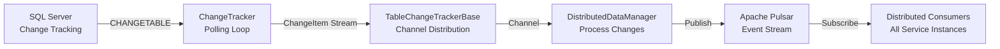

# Change Data Capture (CDC) Infrastructure

**Last Updated**: 2025-11-13
**Technology**: SQL Server Change Tracking + Custom CDC Layer
**Purpose**: Real-time database change detection for distributed synchronization.

---

## Table of Contents

1. [Overview](#overview)
2. [Architecture](#architecture)
3. [CDC Polling Mechanism](#cdc-polling-mechanism)
4. [Change Tracking Configuration](#change-tracking-configuration)
5. [Integration with Pulsar](#integration-with-pulsar)
6. [Performance Characteristics](#performance-characteristics)
7. [Best Practices](#best-practices)
8. [Troubleshooting](#troubleshooting)

---

## Overview

SmartPulse's CDC infrastructure uses SQL Server's built-in change tracking to detect row-level modifications and propagate them through the distributed system via Apache Pulsar.

### CDC Flow



### Key Components

| Component | Location | Purpose |
|-----------|----------|---------|
| `ChangeTracker` | `Electric.Core/TrackChanges/ChangeTracker.cs` | SQL polling engine |
| `TableChangeTrackerBase` | `Electric.Core/TrackChanges/TableChangeTrackerBase.cs` | Table registration and channel distribution |
| `DistributedDataManager` | `Electric.Core/DistributedData/DistributedDataManager.cs` | Change processing and publishing |
| `SmartpulsePulsarClient` | `Electric.Core/Apache_Pulsar/SmartpulsePulsarClient.cs` | Event publishing to Pulsar |

---

## Architecture

### Three-Tier Change Propagation

```
┌─────────────────────────────────────────────────┐
│ TIER 1: CHANGE DETECTION                        │
│ SQL Server → ChangeTracker → ChangeItem Stream  │
└─────────────────────────────────────────────────┘
          ↓
┌─────────────────────────────────────────────────┐
│ TIER 2: CHANGE PROCESSING                       │
│ Channel Distribution → JSON Patch Generation    │
└─────────────────────────────────────────────────┘
          ↓
┌─────────────────────────────────────────────────┐
│ TIER 3: EVENT PUBLICATION                       │
│ Pulsar Publishing → Redis Pub/Sub Broadcast     │
└─────────────────────────────────────────────────┘
```

### ChangeItem Structure

```csharp
public readonly struct ChangeItem
{
    public readonly long VersionId { get; init; }        // Change tracking version
    public readonly string? Operation { get; init; }     // INSERT, UPDATE, DELETE
    public readonly Dictionary<string, object> PkColumns { get; init; }  // Primary key values
}
```

---

## CDC Polling Mechanism

### Core Polling Implementation

**File**: `Electric.Core/TrackChanges/ChangeTracker.cs`

```csharp
public async IAsyncEnumerable<List<ChangeItem>> TrackChangesAsync(
    string tableName,
    string? selectColumns = null,
    string? extraFilter = null,
    CancellationToken cancellationToken = default,
    int expectedColumnCount = 8,
    Func<int, TimeSpan>? awaitTimeBetweenQueriesAction = null,
    string? changeVersionIdSelect = null,
    string? changeOperationSelect = null,
    string? sqlBeforeSelect = null)
{
    long lastVersionId = 0;
    int emptyCounter = 0;
    int changeCount = 0;

    // Base SQL structure
    var sql = $@"
        SELECT {selectColumns}
        FROM CHANGETABLE(CHANGES [{tableName}], @version_id) AS CT
        WHERE {extraFilter}";

    while (true)
    {
        // Connection validation every 10 queries
        if (changeCount % 10 == 0)
        {
            await using var scope = serviceProvider.CreateAsyncScope();
            // Verify connection is still open
        }

        // Execute query
        var dynList = await dbContext.DynamicListFromSqlAsync(sqlCommand, parameters);
        var resultList = new List<ChangeItem>();

        foreach (var dynamic in dynList)
        {
            resultList.Add(ConvertDynamicDataToChangeItem(dynamic));
        }

        if (resultList.Count > 0)
        {
            yield return resultList;
            lastVersionId = resultList.Max(x => x.VersionId);
            emptyCounter = 0;  // Reset on finding changes
        }
        else
        {
            // Exponential backoff for empty results
            emptyCounter++;
            if (emptyCounter > 1_000_000)
                break;

            if (awaitTimeBetweenQueriesAction != null)
                await Task.Delay(awaitTimeBetweenQueriesAction(emptyCounter), cancellationToken);
        }

        changeCount++;

        // Store current version
        parameters[VersionParameterKey] = lastVersionId;
    }
}
```

### Version ID Progression

**Version Tracking Logic**:

1. **Initial State**: `lastVersionId = 0` (start from beginning)
2. **Query Execution**: `CHANGETABLE(CHANGES table, @version_id)`
3. **Result Processing**: Extract max version from results
4. **Next Iteration**: Use max version as new baseline
5. **Guarantee**: Sequential ordering, no duplicates or gaps

**SQL Server Version Query**:

```csharp
// Retrieve current SQL Server change tracking version
var sqlVersion = "SELECT CHANGE_TRACKING_CURRENT_VERSION()";
var currentVersionId = (long)await dbContext.Database.ExecuteScalarAsync(sqlVersion);
```

### Exponential Backoff Strategy

**Purpose**: Reduce CPU and database load when no changes detected.

```csharp
public static TimeSpan CalculateBackoff(int emptyCounter)
{
    if (emptyCounter <= 5)
        return TimeSpan.FromMilliseconds(50);   // Fast polling: 50ms

    if (emptyCounter <= 20)
        return TimeSpan.FromMilliseconds(200);  // Moderate: 200ms

    if (emptyCounter <= 100)
        return TimeSpan.FromSeconds(1);         // Slow: 1s

    return TimeSpan.FromSeconds(5);             // Very slow: 5s
}
```

**Backoff Characteristics**:

| Empty Count | Delay | Polling Rate |
|-------------|-------|--------------|
| 1-5 | 50ms | 20 queries/sec |
| 6-20 | 200ms | 5 queries/sec |
| 21-100 | 1s | 1 query/sec |
| 100+ | 5s | 0.2 queries/sec |
| 1,000,000 | Stop | Polling terminated |

**Counter Reset**: On finding any changes, `emptyCounter = 0` (immediate return to fast polling).

---

## Change Tracking Configuration

### Table Registration

**File**: `Electric.Core/TrackChanges/TableChangeTrackerBase.cs`

```csharp
public abstract class TableChangeTrackerBase
{
    public abstract string TableName { get; }           // Source table name
    public abstract string ExtraSqlFilter { get; }      // Additional WHERE filter
    public abstract string SelectColumns { get; }       // Columns to retrieve
    protected virtual string? ChangeVersionIdSelect { get; }  // Version ID custom logic
    protected virtual string? ChangeOperationSelect { get; }  // Operation type custom logic
    protected virtual string? SqlBeforeSelect { get; }        // Pre-query logic
    protected virtual int ExpectedColumnCount => 8;    // Expected column count

    protected readonly ConcurrentDictionary<string, Channel<List<ChangeItem>>> listeners = new();
}
```

### Uniqueness Validation

**Prevents duplicate tracking**:

```csharp
if (TrackerRegistry.Values.Any(x => x.TableName == TableName && x != this))
    throw new Exception("Table names must be unique to track...");
```

### Channel Pattern

**Change Listener Registration**:

```csharp
public async IAsyncEnumerable<List<ChangeItem>> ListenToChangesAsync(
    string listenerKey,
    CancellationToken cancellationToken = default)
{
    var channel = listeners.GetOrAdd(listenerKey,
        _ => Channel.CreateUnbounded<List<ChangeItem>>());

    await foreach (var changeItems in channel.Reader.ReadAllAsync(cancellationToken))
    {
        yield return changeItems;
    }
}
```

**Benefits**:
- Multiple listeners per table
- Async enumeration of changes
- Backpressure handling via channels
- Automatic cancellation support

---

## Integration with Pulsar

### CDC to Pulsar Publishing Pipeline

**Change Event Publishing**:

```csharp
public ValueTask<MessageId?> WriteObj<T>(string topic, T obj)
    => WriteText(topic, JsonSerializer.Serialize(obj));

public async ValueTask<MessageId?> WriteBytes(string topic, byte[] data)
{
    if (!_producers.TryGetValue(topic, out var producer))
        throw new Exception($"Topic not found: {topic}");

    try
    {
        var messageId = await producer.Send(data).ConfigureAwait(false);
        return messageId;
    }
    catch (Exception e)
    {
        Console.WriteLine($"Pulsar write exception: {e}");
        return default;
    }
}
```

### Topic Configuration

**Producer Setup**:

```csharp
public void CreateTopicToProduce(string topic,
    bool attachTraceInfoMessages = false,
    uint maxPendingMessages = 500,
    CompressionType compressionType = CompressionType.None)
{
    _producers.GetOrAdd(topic, (_) => {
        var p = client.NewProducer(Schema.ByteArray)
            .Topic(topic)
            .AttachTraceInfoToMessages(attachTraceInfoMessages)
            .MaxPendingMessages(maxPendingMessages)
            .CompressionType(compressionType)
            .Create();
        return p;
    });
}
```

**Compression Recommendations**:

| Compression | Speed | Ratio | Best For |
|-------------|-------|-------|----------|
| None | N/A | 1.0x | Local development |
| LZ4 | Very Fast | 1.5x | Real-time CDC streams |
| Zstd | Fast | 2.5x | **Recommended** (balance) |
| Snappy | Very Fast | 1.3x | High-frequency changes |

### Message Flow

```
1. CDC detects change → ChangeItem created
2. Wrapped in Pulsar message wrapper
3. Serialized to JSON via JsonSerializer
4. Sent to Pulsar topic via producer
5. MessageId returned (null on failure)
```

See also:
- [Pulsar Integration](../integration/pulsar.md#architecture)
- [Distributed Sync Patterns](../patterns/distributed_sync.md)

---

## Performance Characteristics

### Latency & Throughput

| Operation | Latency | Throughput | Notes |
|-----------|---------|------------|-------|
| CDC polling | 50-500ms | 1-10K changes/sec | Depends on backoff state |
| CHANGETABLE query | 10-50ms | N/A | SQL Server overhead |
| Change serialization | <1ms | 100K items/sec | In-memory JSON |
| Pulsar publish | 1-5ms | 10K events/sec | Per connection |
| End-to-end | 60-600ms | 5K changes/sec | Total propagation time |

### Resource Usage

**CPU**:
- Fast polling (50ms): ~5% CPU per table
- Slow polling (5s): <1% CPU per table
- Backoff reduces load by 99% when idle

**Memory**:
- ChangeItem buffer: ~100 bytes/item
- Typical batch: 100-1000 items = 10-100 KB
- Peak memory: <10 MB per tracked table

**Database Load**:
- CHANGETABLE overhead: Minimal (indexed reads)
- Version progression: O(1) lookup
- No full table scans required

### Scaling Limits

| Metric | Limit | Notes |
|--------|-------|-------|
| Tables per instance | 100+ | Recommended: 10-20 |
| Changes per second | 10K | Per table, sustained |
| Empty polling overhead | <1% CPU | With exponential backoff |
| Version ID range | 2^63 | ~9 quintillion versions |

---

## Best Practices

### 1. Table Selection

**✅ Good candidates**:
- High-value transactional tables (Orders, Forecasts, Notifications)
- Tables requiring real-time sync across instances
- Tables with moderate update frequency (1-1000 updates/sec)

**❌ Poor candidates**:
- Audit logs (append-only, no need for sync)
- Static reference data (rarely changes)
- High-churn tables (>10K updates/sec)

### 2. Filter Configuration

**Use `ExtraSqlFilter` to limit changes**:

```csharp
public override string ExtraSqlFilter => "CT.SYS_CHANGE_OPERATION <> 'D'";  // Ignore deletes
```

**Common Filters**:
- `SYS_CHANGE_OPERATION = 'U'` - Updates only
- `SYS_CHANGE_OPERATION IN ('I', 'U')` - Inserts and updates
- `CT.Status = 'active'` - Filter by column value

### 3. Backoff Tuning

**Custom backoff function**:

```csharp
await TrackChangesAsync(
    tableName: "Orders",
    awaitTimeBetweenQueriesAction: emptyCount =>
    {
        // Custom backoff logic
        if (emptyCount < 10)
            return TimeSpan.FromMilliseconds(100);
        if (emptyCount < 100)
            return TimeSpan.FromSeconds(1);
        return TimeSpan.FromSeconds(10);
    });
```

### 4. Compression Strategy

**Recommendation by scenario**:

```csharp
// High-frequency small payloads: LZ4
CreateTopicToProduce("order-updates", compressionType: CompressionType.LZ4);

// Large JSON payloads: Zstd
CreateTopicToProduce("forecast-updates", compressionType: CompressionType.Zstd);

// Bandwidth-constrained: Snappy
CreateTopicToProduce("notification-events", compressionType: CompressionType.Snappy);
```

### 5. Error Handling

**Implement retry logic**:

```csharp
await foreach (var changes in TrackChangesAsync(tableName, cancellationToken: stoppingToken))
{
    try
    {
        await ProcessChangesAsync(changes);
    }
    catch (Exception ex)
    {
        _logger.LogError(ex, "Failed to process changes");
        // Don't break the loop - continue with next batch
    }
}
```

### 6. Monitoring

**Key metrics to track**:

```csharp
public class CdcMetrics
{
    public long ChangesDetected { get; set; }
    public long EmptyPolls { get; set; }
    public TimeSpan AverageLatency { get; set; }
    public int ActiveTables { get; set; }
    public long LastVersionId { get; set; }
}
```

---

## Troubleshooting

### CDC Not Detecting Changes

**Symptoms**: Changes made to database but no ChangeItems emitted.

**Causes**:
1. Change tracking not enabled on database
2. Change tracking not enabled on table
3. Filter too restrictive
4. Version ID already past changes

**Solutions**:

```sql
-- Enable change tracking on database
ALTER DATABASE SmartPulse
SET CHANGE_TRACKING = ON
(CHANGE_RETENTION = 2 DAYS, AUTO_CLEANUP = ON);

-- Enable change tracking on table
ALTER TABLE Orders
ENABLE CHANGE_TRACKING
WITH (TRACK_COLUMNS_UPDATED = ON);

-- Verify change tracking is enabled
SELECT name, is_tracked_by_cdc
FROM sys.tables
WHERE name = 'Orders';

-- Reset version ID to start from beginning
-- (WARNING: Causes reprocessing of all changes)
lastVersionId = 0;
```

### High CPU Usage

**Symptoms**: CDC polling consuming excessive CPU.

**Causes**:
- Fast polling (50ms) on idle tables
- Too many tracked tables
- Inefficient backoff configuration

**Solutions**:

```csharp
// Increase minimum delay
awaitTimeBetweenQueriesAction: emptyCount =>
    emptyCount < 5 ? TimeSpan.FromMilliseconds(200)  // Slower minimum
                   : TimeSpan.FromSeconds(1);

// Reduce tracked tables
// Only track high-value tables

// Stop polling after extended idle period
if (emptyCounter > 10_000)  // ~14 hours at 5s polling
    break;
```

### Duplicate Changes Detected

**Symptoms**: Same change appears multiple times.

**Causes**:
- Version ID not persisted between restarts
- Multiple trackers on same table
- Incorrect version progression logic

**Solutions**:

```csharp
// Persist version ID to durable storage
await _storage.SaveVersionIdAsync(tableName, lastVersionId);

// Load on restart
var lastVersionId = await _storage.LoadVersionIdAsync(tableName) ?? 0;

// Validate uniqueness
if (TrackerRegistry.Values.Any(x => x.TableName == TableName && x != this))
    throw new Exception("Table already tracked");
```

### Pulsar Publish Failures

**Symptoms**: Changes detected but not appearing in Pulsar.

**Causes**:
- Producer not created
- Pulsar broker unreachable
- Topic not created
- Message too large

**Solutions**:

```csharp
// Create producer before publishing
_pulsar.CreateTopicToProduce("order-updates");

// Check producer exists
if (!_producers.TryGetValue(topic, out var producer))
{
    _logger.LogError("Producer not found for topic: {Topic}", topic);
    return;
}

// Verify Pulsar broker connectivity
try
{
    await _pulsar.WriteObj("health-check", new { timestamp = DateTime.UtcNow });
}
catch (Exception ex)
{
    _logger.LogError(ex, "Pulsar connectivity check failed");
}

// Check message size
var json = JsonSerializer.Serialize(changeItem);
if (json.Length > 1_000_000)  // 1 MB limit
{
    _logger.LogWarning("Message too large: {Size} bytes", json.Length);
}
```

### Change Tracking Version Overflow

**Symptoms**: Version ID approaching maximum value.

**Causes**:
- Long-running system with high change volume
- Change retention period too long

**Solutions**:

```sql
-- Check current version
SELECT CHANGE_TRACKING_CURRENT_VERSION();

-- Reduce retention period
ALTER DATABASE SmartPulse
SET CHANGE_TRACKING (CHANGE_RETENTION = 1 DAYS);

-- Manual cleanup (forces version reset)
ALTER DATABASE SmartPulse
SET CHANGE_TRACKING = OFF;

ALTER DATABASE SmartPulse
SET CHANGE_TRACKING = ON
(CHANGE_RETENTION = 2 DAYS, AUTO_CLEANUP = ON);
```

---

## Related Documentation

- [Apache Pulsar Integration](../integration/pulsar.md)
- [Distributed Sync Patterns](../patterns/distributed_sync.md)
- [Worker Patterns](../patterns/worker_patterns.md)
- [Retry & Backoff Strategies](../patterns/retry_patterns.md)

---

**Last Updated**: 2025-11-13
**Version**: 1.0
