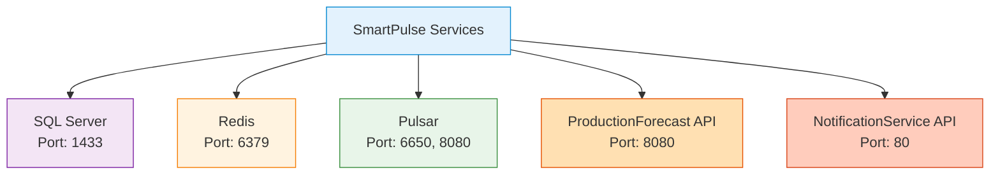
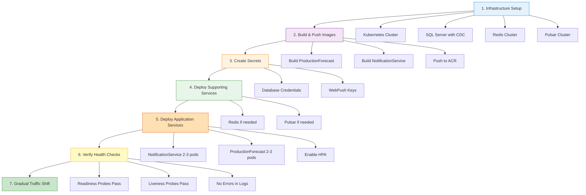

# Deployment Guide

Essential deployment configuration for Docker and Kubernetes. For comprehensive infrastructure details, see [part_3_docker_deployment_network.md](../../notes/level_0/infrastructure/part_3_docker_deployment_network.md).

## Quick Start

### Local Development (Docker Compose)

```bash
# Start all services
docker-compose -f docker-compose.local.yml up -d

# Check status
docker-compose -f docker-compose.local.yml ps

# View logs
docker-compose -f docker-compose.local.yml logs -f

# Stop all services
docker-compose -f docker-compose.local.yml down
```

### Essential Services



## Docker Compose Configuration

### Basic docker-compose.local.yml

```yaml
version: '3.4'

services:
  sqlserver:
    image: mcr.microsoft.com/mssql/server:2022-latest
    container_name: smartpulse-sqlserver
    environment:
      - ACCEPT_EULA=Y
      - MSSQL_SA_PASSWORD=DevPassword123!
      - MSSQL_PID=Developer
    ports:
      - "1433:1433"
    volumes:
      - sqlserver-data:/var/opt/mssql
    networks:
      - smartpulse-network

  redis:
    image: redis:7-alpine
    container_name: smartpulse-redis
    command: redis-server --maxmemory 512mb --maxmemory-policy allkeys-lru
    ports:
      - "6379:6379"
    volumes:
      - redis-data:/data
    networks:
      - smartpulse-network

  pulsar:
    image: apachepulsar/pulsar:3.0
    container_name: smartpulse-pulsar
    command: bin/pulsar standalone
    environment:
      PULSAR_MEM: "-Xmx512m -Xms256m"
    ports:
      - "6650:6650"  # Binary protocol
      - "8080:8080"  # HTTP Admin
    volumes:
      - pulsar-data:/pulsar/data
    networks:
      - smartpulse-network

  productionforecast-api:
    image: smartpulse.azurecr.io/smartpulse.services.productionforecast:dev
    build:
      context: ./ProductionForecast
      dockerfile: Dockerfile
    environment:
      - ASPNETCORE_ENVIRONMENT=Development
      - ASPNETCORE_URLS=http://+:8080
      - MSSQL_CONNSTR=Server=sqlserver,1433;Database=SmartPulseDb;User Id=sa;Password=DevPassword123!;TrustServerCertificate=true;
      - REDIS_CONNSTR=redis:6379
      - PULSAR_SERVICEURL=pulsar://pulsar:6650
    ports:
      - "8080:8080"
    depends_on:
      - sqlserver
      - redis
      - pulsar
    networks:
      - smartpulse-network

  notificationservice-api:
    image: smartpulse.azurecr.io/smartpulse.services.notificationservice:dev
    build:
      context: ./NotificationService
      dockerfile: Dockerfile
    environment:
      - ASPNETCORE_ENVIRONMENT=Development
      - ASPNETCORE_URLS=http://+:80
      - MSSQL_CONNSTR=Server=sqlserver,1433;Database=SmartPulseDb;User Id=sa;Password=DevPassword123!;TrustServerCertificate=true;
      - REDIS_CONNSTR=redis:6379
      - PULSAR_SERVICEURL=pulsar://pulsar:6650
      - WEBPUSH_SUBJECT=mailto:myilmaz@smartpulse.io
      - WEBPUSH_PUBLICKEY=BLdlqtm3ZbXcXD-4I7-fkAJpWP_-c2n54RYV0Qp_tUrETwOPjTLIz8Ebc6q08owlCvIE0XwryBA2wOSaOW6KCvY
      - WEBPUSH_PRIVATEKEY=EPD7bVQHFrA4EB0b4xP-99f_5hvZYrrWinR8agXaxh1z
    ports:
      - "59589:80"
    depends_on:
      - sqlserver
      - redis
      - pulsar
    networks:
      - smartpulse-network

networks:
  smartpulse-network:
    driver: bridge
    ipam:
      config:
        - subnet: 172.20.0.0/16
          gateway: 172.20.0.1

volumes:
  sqlserver-data:
  redis-data:
  pulsar-data:
```

## Docker Build Configuration

### Multi-Stage Dockerfile Pattern

```dockerfile
# Build Stage
FROM mcr.microsoft.com/dotnet/sdk:9.0-bookworm-slim AS build

WORKDIR /src

# Copy project files
COPY ["ProductionForecast.API/ProductionForecast.API.csproj", "ProductionForecast.API/"]
COPY ["ProductionForecast.Application/ProductionForecast.Application.csproj", "ProductionForecast.Application/"]
COPY ["ProductionForecast.Infrastructure/ProductionForecast.Infrastructure.csproj", "ProductionForecast.Infrastructure/"]

# Restore dependencies
RUN dotnet restore "ProductionForecast.API/ProductionForecast.API.csproj"

# Copy source code
COPY . .

# Build
WORKDIR "/src/ProductionForecast.API"
RUN dotnet build "ProductionForecast.API.csproj" -c Release -o /app/build

# Publish
FROM build AS publish
RUN dotnet publish "ProductionForecast.API.csproj" -c Release -o /app/publish

# Runtime Stage
FROM mcr.microsoft.com/dotnet/aspnet:9.0-bookworm-slim AS final

# Create non-root user (security best practice)
ARG USERNAME=smartpulse
ARG USER_UID=1000
ARG USER_GID=$USER_UID

RUN groupadd --gid $USER_GID $USERNAME \
    && useradd --uid $USER_UID --gid $USER_GID -m $USERNAME

WORKDIR /app
EXPOSE 8080

# Copy published files
COPY --from=publish /app/publish .

# Set ownership
RUN chown -R ${USER_UID}:${USER_GID} /app

# Switch to non-root user
USER ${USERNAME}

ENTRYPOINT ["dotnet", "ProductionForecast.API.dll"]
```

### .dockerignore

```
# Version control
**/.git
**/.gitignore

# IDE
**/.vs
**/.vscode
**/*.user

# Build artifacts
**/bin
**/obj

# Dependencies
**/node_modules
**/npm-debug.log

# Database
**/*.db
**/*.dbmdl

# Development
**/docker-compose*
**/.env
**/secrets.dev.yaml

# Documentation
LICENSE
README.md
**/charts
```

## Kubernetes Deployment

### Basic Deployment Manifest

```yaml
apiVersion: apps/v1
kind: Deployment
metadata:
  name: productionforecast
  namespace: smartpulse-prod
spec:
  replicas: 3
  strategy:
    type: RollingUpdate
    rollingUpdate:
      maxSurge: 1
      maxUnavailable: 0
  selector:
    matchLabels:
      app: productionforecast
  template:
    metadata:
      labels:
        app: productionforecast
        version: v1.0.0
    spec:
      containers:
      - name: productionforecast
        image: smartpulse.azurecr.io/smartpulse.services.productionforecast:v1.0.0
        ports:
        - containerPort: 8080
          name: http
        env:
        - name: ASPNETCORE_ENVIRONMENT
          value: "Production"
        - name: MSSQL_CONNSTR
          valueFrom:
            secretKeyRef:
              name: smartpulse-secrets
              key: MSSQL_CONNSTR
        - name: REDIS_CONNSTR
          value: "redis-master.smartpulse-prod.svc.cluster.local:6379"
        - name: PULSAR_SERVICEURL
          value: "pulsar://pulsar-broker.smartpulse-prod.svc.cluster.local:6650"
        livenessProbe:
          httpGet:
            path: /health
            port: 8080
          initialDelaySeconds: 30
          periodSeconds: 10
          timeoutSeconds: 5
          failureThreshold: 3
        readinessProbe:
          httpGet:
            path: /health/ready
            port: 8080
          initialDelaySeconds: 10
          periodSeconds: 5
          timeoutSeconds: 3
          failureThreshold: 2
        resources:
          requests:
            cpu: 100m
            memory: 256Mi
          limits:
            cpu: 1000m
            memory: 512Mi
---
apiVersion: v1
kind: Service
metadata:
  name: productionforecast
  namespace: smartpulse-prod
spec:
  type: LoadBalancer
  selector:
    app: productionforecast
  ports:
  - port: 80
    targetPort: 8080
    protocol: TCP
```

### Secrets Management

```yaml
apiVersion: v1
kind: Secret
metadata:
  name: smartpulse-secrets
  namespace: smartpulse-prod
type: Opaque
data:
  # Base64 encoded values
  MSSQL_CONNSTR: <base64-encoded-connection-string>
  WEBPUSH_PRIVATEKEY: <base64-encoded-key>
  WEBPUSH_PUBLICKEY: <base64-encoded-key>
```

**Create Secret from Command Line**:
```bash
# Create secret from literal values
kubectl create secret generic smartpulse-secrets \
  --from-literal=MSSQL_CONNSTR='Server=...' \
  --from-literal=WEBPUSH_PRIVATEKEY='...' \
  -n smartpulse-prod

# Or from file
kubectl create secret generic smartpulse-secrets \
  --from-env-file=.env.production \
  -n smartpulse-prod
```

### Horizontal Pod Autoscaler

```yaml
apiVersion: autoscaling/v2
kind: HorizontalPodAutoscaler
metadata:
  name: productionforecast-hpa
  namespace: smartpulse-prod
spec:
  scaleTargetRef:
    apiVersion: apps/v1
    kind: Deployment
    name: productionforecast
  minReplicas: 2
  maxReplicas: 10
  metrics:
  - type: Resource
    resource:
      name: cpu
      target:
        type: Utilization
        averageUtilization: 70
  - type: Resource
    resource:
      name: memory
      target:
        type: Utilization
        averageUtilization: 80
  behavior:
    scaleDown:
      stabilizationWindowSeconds: 300
      policies:
      - type: Percent
        value: 50
        periodSeconds: 60
    scaleUp:
      stabilizationWindowSeconds: 0
      policies:
      - type: Percent
        value: 100
        periodSeconds: 15
```

## Health Checks

### ASP.NET Core Health Check Configuration

```csharp
// Program.cs
services.AddHealthChecks()
    .AddSqlServer(
        connectionString: Configuration.GetConnectionString("DefaultConnection"),
        name: "sql-server",
        timeout: TimeSpan.FromSeconds(3))
    .AddRedis(
        redisConnectionString: Configuration.GetValue<string>("Redis:Connection"),
        name: "redis",
        timeout: TimeSpan.FromSeconds(3))
    .AddPulsar(
        serviceUrl: Configuration.GetValue<string>("Pulsar:ServiceUrl"),
        name: "pulsar",
        timeout: TimeSpan.FromSeconds(3));

// Map endpoints
app.MapHealthChecks("/health", new HealthCheckOptions
{
    Predicate = _ => true,
    ResponseWriter = UIResponseWriter.WriteHealthCheckUIResponse
});

app.MapHealthChecks("/health/ready", new HealthCheckOptions
{
    Predicate = check => check.Tags.Contains("ready"),
    ResponseWriter = UIResponseWriter.WriteHealthCheckUIResponse
});

app.MapHealthChecks("/health/live", new HealthCheckOptions
{
    Predicate = _ => false  // No checks, just returns 200 if app is running
});
```

## Environment Configuration

### Development (docker-compose.local.yml)

```yaml
Environment:
  - ASPNETCORE_ENVIRONMENT=Development
  - MSSQL_CONNSTR=Server=sqlserver,1433;Database=SmartPulseDb;...
  - REDIS_CONNSTR=redis:6379
  - PULSAR_SERVICEURL=pulsar://pulsar:6650

Characteristics:
  - Debug logging enabled
  - Short cache TTL (60 seconds)
  - Single instance per service
  - No SSL/TLS required
  - Development credentials in compose file
```

### Staging

```yaml
Environment:
  - ASPNETCORE_ENVIRONMENT=Staging
  - MSSQL_CONNSTR=Server=sql.staging.smartpulse.io:30102;...
  - REDIS_CONNSTR=redis-cluster.smartpulse-staging.svc.cluster.local:6379
  - PULSAR_SERVICEURL=pulsar://pulsar-broker.smartpulse-staging.svc.cluster.local:6650

Characteristics:
  - Information level logging
  - Medium cache TTL (5 minutes)
  - 2-3 replicas per service
  - SSL/TLS enabled
  - Secrets from Kubernetes Secrets
```

### Production

```yaml
Environment:
  - ASPNETCORE_ENVIRONMENT=Production
  - MSSQL_CONNSTR=Server=voltdb.database.windows.net;Database=SantralTakip;...
  - REDIS_CONNSTR=redis-master.smartpulse-prod.svc.cluster.local:6379
  - PULSAR_SERVICEURL=pulsar://pulsar-broker-0.pulsar.svc.cluster.local:6650

Characteristics:
  - Warning level logging only
  - Long cache TTL (1 hour)
  - 5-10 replicas per service
  - SSL/TLS required
  - Secrets from Azure Key Vault
  - Horizontal autoscaling enabled
```

## Deployment Sequence



## Deployment Commands

### Docker Commands

```bash
# Build image
docker build -t smartpulse.azurecr.io/smartpulse.services.productionforecast:v1.0.0 \
  -f ProductionForecast/Dockerfile .

# Push to registry
docker push smartpulse.azurecr.io/smartpulse.services.productionforecast:v1.0.0

# Run locally
docker run -p 8080:8080 \
  -e ASPNETCORE_ENVIRONMENT=Development \
  -e MSSQL_CONNSTR="..." \
  smartpulse.azurecr.io/smartpulse.services.productionforecast:v1.0.0

# View logs
docker logs -f <container-id>

# Execute command in container
docker exec -it <container-id> bash
```

### Kubernetes Commands

```bash
# Apply manifests
kubectl apply -f deployment.yaml -n smartpulse-prod

# Check deployment status
kubectl get deployments -n smartpulse-prod
kubectl get pods -n smartpulse-prod

# View logs
kubectl logs -f deployment/productionforecast -n smartpulse-prod

# Scale manually
kubectl scale deployment/productionforecast --replicas=5 -n smartpulse-prod

# Update image
kubectl set image deployment/productionforecast \
  productionforecast=smartpulse.azurecr.io/smartpulse.services.productionforecast:v1.1.0 \
  -n smartpulse-prod

# Rollback
kubectl rollout undo deployment/productionforecast -n smartpulse-prod

# Check rollout status
kubectl rollout status deployment/productionforecast -n smartpulse-prod

# Port forward for debugging
kubectl port-forward deployment/productionforecast 8080:8080 -n smartpulse-prod
```

## Scaling Configuration

### Kubernetes Resource Limits

```yaml
resources:
  requests:
    cpu: 100m        # Minimum guaranteed
    memory: 256Mi
  limits:
    cpu: 1000m       # Maximum allowed
    memory: 512Mi
```

**Guidelines**:
- **Requests**: Set to typical usage (enables efficient bin packing)
- **Limits**: Set to peak usage + 20% buffer
- **CPU**: 1 core = 1000m (millicores)
- **Memory**: Use Mi for mebibytes (1024-based)

### Autoscaling Behavior

```
Min Replicas: 2  (High availability)
Max Replicas: 10 (Cost control)

Scale Up:
  - Trigger: CPU >70% OR Memory >80%
  - Immediate (0 second stabilization)
  - Aggressive (double replicas per 15 seconds)

Scale Down:
  - Trigger: CPU <70% AND Memory <80%
  - Wait 5 minutes (300 second stabilization)
  - Conservative (reduce by 50% per minute)
```

## Network Configuration

### Service Discovery

```
Docker Compose (Development):
  - DNS: service name → container IP
  - Example: redis:6379 resolves to 172.20.0.4:6379

Kubernetes (Production):
  - DNS: <service>.<namespace>.svc.cluster.local
  - Example: redis-master.smartpulse-prod.svc.cluster.local:6379
```

### Port Mappings

| Service | Container Port | Host/LB Port | Protocol |
|---------|----------------|--------------|----------|
| ProductionForecast | 8080 | 80 | HTTP |
| NotificationService | 80 | 80 | HTTP |
| SQL Server | 1433 | 1433 | TCP |
| Redis | 6379 | 6379 | TCP |
| Pulsar Binary | 6650 | 6650 | TCP |
| Pulsar HTTP | 8080 | 8080 | HTTP |

## Production Readiness Checklist

### Security
```
☐ Non-root user in containers
☐ Secrets in Kubernetes Secrets or Key Vault
☐ TLS/SSL enabled for all external endpoints
☐ Network policies configured
☐ Image vulnerability scanning enabled
☐ Read-only filesystem where possible
```

### Performance
```
☐ Resource requests and limits set
☐ Horizontal Pod Autoscaler configured
☐ Liveness and readiness probes implemented
☐ Connection pooling configured
☐ Cache warming on startup
☐ Batch processing optimized
```

### Observability
```
☐ Prometheus metrics exported
☐ Structured logging configured
☐ Health check endpoints implemented
☐ Tracing enabled (OpenTelemetry)
☐ Alerts configured for critical metrics
☐ Dashboards created
```

### Reliability
```
☐ Multi-replica deployment (min 2)
☐ Rolling update strategy configured
☐ Graceful shutdown handling
☐ Circuit breakers for external calls
☐ Retry logic with exponential backoff
☐ Backup and recovery procedures documented
```

## Common Deployment Issues

### Issue: Pods CrashLoopBackOff

```bash
# Check pod events
kubectl describe pod <pod-name> -n smartpulse-prod

# Check logs
kubectl logs <pod-name> -n smartpulse-prod --previous

# Common causes:
# - Missing environment variables
# - Database connection failure
# - Invalid configuration
```

### Issue: ImagePullBackOff

```bash
# Check image pull secret
kubectl get secret -n smartpulse-prod

# Create image pull secret if missing
kubectl create secret docker-registry acr-secret \
  --docker-server=smartpulse.azurecr.io \
  --docker-username=<username> \
  --docker-password=<password> \
  -n smartpulse-prod

# Add to deployment
spec:
  template:
    spec:
      imagePullSecrets:
      - name: acr-secret
```

### Issue: ReadinessProbe Failing

```bash
# Check endpoint manually
kubectl port-forward pod/<pod-name> 8080:8080 -n smartpulse-prod
curl http://localhost:8080/health/ready

# Common causes:
# - Database not ready
# - Cache warming not complete
# - Incorrect probe configuration
```

## Related Documentation

- [Setup Guide](./setup.md) - Initial development environment
- [Troubleshooting Guide](./troubleshooting.md) - Fix deployment issues
- [Performance Guide](./performance.md) - Optimize production
- [Infrastructure Details](../../notes/level_0/infrastructure/part_3_docker_deployment_network.md) - Complete documentation

---

*For comprehensive infrastructure and networking details, see the complete infrastructure documentation.*
