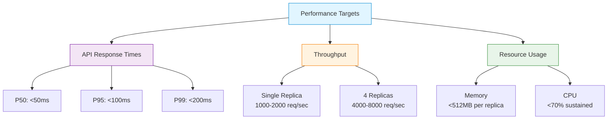
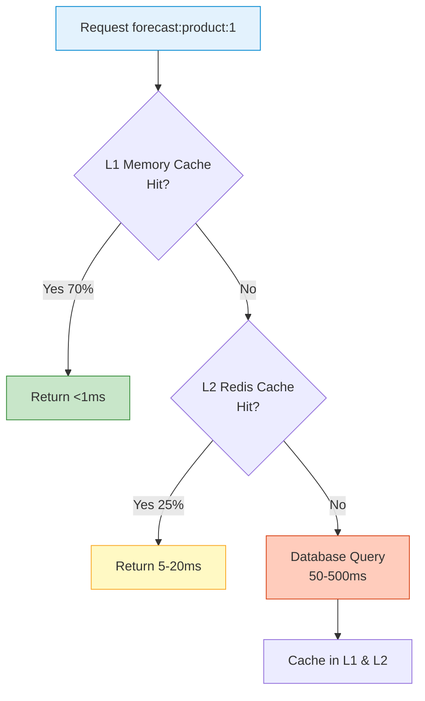

# Performance Optimization Guide

Essential performance optimization strategies for SmartPulse. For comprehensive details, see [developer_guide_performance.md](../../notes/level_1/developer_guide_performance.md).

## Performance Targets



## Quick Performance Baseline

```bash
#!/bin/bash
# Test 1: Single request latency
time curl -X GET https://localhost:5001/api/forecast/1 -k -s > /dev/null

# Test 2: 100 sequential requests
for i in {1..100}; do
    curl -X GET https://localhost:5001/api/forecast/$((i % 10)) -k -s > /dev/null
done

# Test 3: Concurrent load (requires Apache Bench)
ab -n 1000 -c 100 https://localhost:5001/api/forecast/1
```

## Top 10 Performance Optimizations

### 1. Database Indexing (Impact: 5-10× speedup)

**Create Strategic Indexes**:
```sql
-- For ProductionForecast queries
CREATE NONCLUSTERED INDEX IX_Forecast_ProductDate
ON Forecasts(ProductId, [Date] DESC)
INCLUDE (Value, Accuracy, Version)
WITH (FILLFACTOR = 90);

-- For pagination
CREATE NONCLUSTERED INDEX IX_Forecast_UserCreated
ON Forecasts(SysUserId, CreatedAt DESC)
INCLUDE (Value, Accuracy);

-- For CDC detection
CREATE NONCLUSTERED INDEX IX_Forecast_UpdatedAt
ON Forecasts(UpdatedAt DESC)
WHERE IsFailed = 0;
```

**Verify Index Usage**:
```sql
SELECT
    OBJECT_NAME(i.object_id) as TableName,
    i.name as IndexName,
    s.user_seeks + s.user_scans + s.user_lookups as TotalReads,
    s.user_updates as Writes
FROM sys.dm_db_index_usage_stats s
INNER JOIN sys.indexes i ON s.object_id = i.object_id
WHERE database_id = DB_ID()
ORDER BY TotalReads DESC;
```

### 2. Multi-Tier Caching (Impact: 50-100× speedup)

**Cache Hit Flow**:


**Implement Cache Warming**:
```csharp
public class CacheWarmupService : IHostedService
{
    private readonly ICacheManager _cache;
    private readonly IForecastRepository _repository;

    public async Task StartAsync(CancellationToken cancellationToken)
    {
        _logger.LogInformation("Starting cache warm-up...");

        // Warm up top 100 products
        var topProducts = await _repository.GetTopProductsAsync(100);

        foreach (var product in topProducts)
        {
            var forecast = await _repository.GetForecastByProductAsync(
                product.Id, DateTime.UtcNow.Date);

            if (forecast != null)
            {
                await _cache.SetAsync(
                    $"forecast:product:{product.Id}",
                    forecast,
                    TimeSpan.FromHours(1));
            }
        }

        _logger.LogInformation("Cache warm-up completed");
    }
}
```

### 3. EF Core Query Optimization (Impact: 2-5× speedup)

**Avoid N+1 Queries**:
```csharp
// ❌ N+1 Query Problem
var forecasts = await _dbContext.Forecasts
    .Where(f => f.Date == today)
    .ToListAsync();

foreach (var forecast in forecasts)
{
    var product = forecast.Product;  // Separate query per item!
}

// ✅ Use Include
var forecasts = await _dbContext.Forecasts
    .AsNoTracking()
    .Include(f => f.Product)
    .Where(f => f.Date == today)
    .ToListAsync();

// ✅ Use Projection
var summaries = await _dbContext.Forecasts
    .Where(f => f.Date == today)
    .Select(f => new ForecastSummary
    {
        ProductName = f.Product.Name,
        Value = f.Value,
        Accuracy = f.Accuracy
    })
    .ToListAsync();
```

**Use Pagination**:
```csharp
// ❌ Return all 10,000 items
var forecasts = await _repository.GetAllForecastsAsync();
return Ok(forecasts);  // 2-5MB response

// ✅ Paginate
var page = await _dbContext.Forecasts
    .OrderByDescending(f => f.CreatedAt)
    .Skip((pageNumber - 1) * pageSize)
    .Take(pageSize)
    .ToListAsync();

return Ok(new { Items = page, TotalCount = total });  // ~50KB response
```

### 4. Response Compression (Impact: 60-80% size reduction)

```csharp
// Program.cs
services.AddResponseCompression(options =>
{
    options.EnableForHttps = true;
    options.CompressionLevel = System.IO.Compression.CompressionLevel.Fastest;
    options.Providers.Add<GzipCompressionProvider>();
    options.Providers.Add<BrotliCompressionProvider>();
});

app.UseResponseCompression();
```

### 5. Redis Pipelining (Impact: 3× speedup)

```csharp
// ❌ Multiple round-trips
var db = redis.GetDatabase();
var val1 = await db.StringGetAsync("key1");
var val2 = await db.StringGetAsync("key2");
var val3 = await db.StringGetAsync("key3");

// ✅ Pipeline - single round-trip
var db = redis.GetDatabase();
var batch = db.CreateBatch();

var task1 = batch.StringGetAsync("key1");
var task2 = batch.StringGetAsync("key2");
var task3 = batch.StringGetAsync("key3");

batch.Execute();

var val1 = await task1;
var val2 = await task2;
var val3 = await task3;
```

### 6. Pulsar Batching (Impact: 10× throughput)

```csharp
public async Task PublishAsync<T>(string topicName, T message)
{
    var producer = await _pulsarClient
        .NewProducer(Schema.ByteArray)
        .Topic(topicName)
        // Batching configuration
        .EnableBatching(true)
        .BatchingMaxMessages(1000)
        .BatchingMaxPublishDelayMillis(100)
        // Compression
        .CompressionType(CompressionType.Gzip)
        // Performance
        .MaxPendingMessages(500)
        .CreateAsync();

    await producer.SendAsync(SerializeMessage(message));
}
```

### 7. Batch Processing (Impact: 8-50× throughput)

**Optimize AutoBatchWorker**:
```csharp
public class OptimizedMailAutoBatchWorker : AutoBatchWorker<NheaMailQueue>
{
    // Tune for your workload
    protected override int BatchSize => 200;          // Was 100
    protected override int MaxConcurrency => 8;       // Was 4
    protected override int ProcessingDelayMs => 500;  // Was 1000

    protected override async Task ExecuteAsync(CancellationToken stoppingToken)
    {
        while (!stoppingToken.IsCancellationRequested)
        {
            var batch = await GetBatchAsync(BatchSize, stoppingToken);

            // Adaptive delay based on queue depth
            if (batch.Count() < BatchSize / 2)
                await Task.Delay(ProcessingDelayMs * 2, stoppingToken);
            else if (batch.Count() == BatchSize)
                await Task.Delay(ProcessingDelayMs / 2, stoppingToken);
            else
                await Task.Delay(ProcessingDelayMs, stoppingToken);
        }
    }
}
```

### 8. Connection Pooling (Impact: 2-5× speedup)

```csharp
services.AddDbContext<ForecastDbContext>(options =>
{
    options.UseSqlServer(connectionString, sqlOptions =>
    {
        sqlOptions.CommandTimeout(30);
        sqlOptions.EnableRetryOnFailure(3, TimeSpan.FromSeconds(3), null);
        sqlOptions.MaxBatchSize(1000);
    });
});
```

**Connection String**:
```
Server=...;Max Pool Size=50;Min Pool Size=10;MultipleActiveResultSets=True;
```

### 9. Cache with Adaptive TTL (Impact: Varies)

```csharp
public class SmartCacheExpiration
{
    public async Task SetWithAdaptiveTTLAsync<T>(
        string key, T value, CacheDataType dataType)
    {
        var ttl = dataType switch
        {
            CacheDataType.HighlyVolatile => TimeSpan.FromMinutes(1),
            CacheDataType.Moderate => TimeSpan.FromMinutes(15),
            CacheDataType.Stable => TimeSpan.FromHours(1),
            CacheDataType.Reference => TimeSpan.FromDays(7),
            _ => TimeSpan.FromMinutes(5)
        };

        await _redis.SetAsync(key, value, ttl);
    }
}

public enum CacheDataType
{
    HighlyVolatile,   // Forecast values changing frequently
    Moderate,         // Notification lists
    Stable,           // System configuration
    Reference         // Product catalog
}
```

### 10. Performance Monitoring (Impact: Identify bottlenecks)

**Add Request Timing Middleware**:
```csharp
app.Use(async (context, next) =>
{
    var sw = Stopwatch.StartNew();
    await next();
    sw.Stop();

    if (sw.ElapsedMilliseconds > 100)
    {
        _logger.LogWarning(
            "Slow request: {Method} {Path} took {ElapsedMs}ms",
            context.Request.Method,
            context.Request.Path,
            sw.ElapsedMilliseconds);
    }

    _metrics.RecordEndpointLatency(
        context.Request.Path.ToString(),
        sw.ElapsedMilliseconds);
});
```

**Enable Prometheus Metrics**:
```csharp
services.AddOpenTelemetryMetrics(builder =>
{
    builder
        .SetResourceBuilder(
            ResourceBuilder.CreateDefault()
                .AddService("ProductionForecast"))
        .AddAspNetCoreInstrumentation()
        .AddHttpClientInstrumentation()
        .AddRuntimeInstrumentation()
        .AddPrometheusExporter();
});

app.MapPrometheusScrapingEndpoint();
// Access: http://localhost:5001/metrics
```

## Query Performance Diagnostics

### Find Slow Queries

```sql
-- Top 10 slowest queries
SELECT TOP 10
    total_elapsed_time / execution_count as avg_time_ms,
    execution_count,
    last_execution_time,
    SUBSTRING(text, 1, 200) as query_text
FROM sys.dm_exec_query_stats
CROSS APPLY sys.dm_exec_sql_text(sql_handle)
ORDER BY avg_time_ms DESC;
```

### Find Missing Indexes

```sql
SELECT
    d.equality_columns,
    d.inequality_columns,
    d.included_columns,
    s.user_seeks,
    s.avg_total_user_cost,
    s.avg_total_user_cost * s.user_seeks as improvement_measure
FROM sys.dm_db_missing_index_details d
INNER JOIN sys.dm_db_missing_index_group_stats s
    ON d.index_handle = s.index_group_handle
WHERE database_id = DB_ID()
ORDER BY improvement_measure DESC;
```

### Analyze Query Execution Plan

```sql
SET STATISTICS IO ON;
SET STATISTICS TIME ON;

-- Run your query
SELECT p.Name, AVG(f.Value) as AvgValue
FROM Forecasts f
INNER JOIN Products p ON f.ProductId = p.Id
WHERE f.CreatedAt >= '2024-11-01'
GROUP BY p.Name;

SET STATISTICS IO OFF;
SET STATISTICS TIME OFF;

-- Look for:
-- - Table Scan vs Index Seek
-- - Number of logical reads
-- - Query cost percentage
```

## Redis Optimization

### Memory Configuration

```yaml
# docker-compose.local.yml
redis:
  image: redis:7-alpine
  command: >
    redis-server
    --maxmemory 1gb
    --maxmemory-policy allkeys-lru
    --tcp-keepalive 300
```

### Memory Diagnostics

```bash
# Connect to Redis
docker-compose -f docker-compose.local.yml exec redis redis-cli -a redis-dev-password

# Check memory
> INFO memory
> DBSIZE
> --bigkeys
> MEMORY USAGE forecast:product:1
```

## Profiling Tools

### CPU Profiling

```bash
# Install tools
dotnet tool install --global dotnet-trace
dotnet tool install --global dotnet-counters

# Collect CPU trace
dotnet-trace collect -p <PID> --profile cpu-sampling

# Monitor real-time
dotnet-counters monitor -p <PID>
```

### Memory Profiling

```bash
# Capture heap dump
dotnet-dump collect -p <PID>

# Analyze dump
dotnet-dump analyze dump_<timestamp>.dmp

# In dump analysis
> dumpheap -stat
> dumpheap -min 100000  # Objects >100KB
```

## Production Configuration

### Optimized appsettings.json

```json
{
  "Pulsar": {
    "ServiceUrl": "pulsar+ssl://pulsar-cluster:6651",
    "OperationTimeoutSeconds": 30,
    "ProducerMaxPendingMessages": 500,
    "ProducerBatchingMaxMessages": 2000,
    "ProducerBatchingMaxPublishDelayMillis": 50
  },
  "Redis": {
    "Connection": "redis-prod-cluster:6379",
    "AbortOnConnectFail": false,
    "ConnectTimeout": 5000,
    "SyncTimeout": 3000
  },
  "Database": {
    "ConnectionTimeout": 30,
    "CommandTimeout": 30,
    "MaxPoolSize": 100,
    "MinPoolSize": 20
  },
  "Cache": {
    "MemoryLimitMB": 256,
    "DefaultTTLMinutes": 15,
    "WarmupOnStartup": true
  }
}
```

## Performance Testing

### Load Testing Script

```bash
#!/bin/bash
# Simple load test

echo "=== Performance Baseline Test ==="

# Test 1: Single request
echo "Test 1: Single request latency"
time curl -X GET https://localhost:5001/api/forecast/1 -k -s > /dev/null

# Test 2: 100 sequential
echo "Test 2: 100 sequential requests"
START=$(date +%s)
for i in {1..100}; do
    curl -X GET https://localhost:5001/api/forecast/$((i % 10)) -k -s > /dev/null
done
END=$(date +%s)
echo "Total time: $((END-START)) seconds"
echo "Throughput: $((100/(END-START))) req/sec"

# Test 3: Apache Bench (if available)
if command -v ab &> /dev/null; then
    echo "Test 3: 1000 requests, 100 concurrent"
    ab -n 1000 -c 100 -k https://localhost:5001/api/forecast/1
fi
```

## Performance Optimization Checklist

### Database
```
☐ Strategic indexes created
☐ Statistics updated regularly
☐ Query execution plans analyzed
☐ Stored procedures for complex queries
☐ Connection pooling configured
```

### Caching
```
☐ Multi-tier cache implemented
☐ Cache warming on startup
☐ Adaptive TTL configured
☐ Cache hit rate >90%
☐ Memory limits set
```

### API
```
☐ Response compression enabled
☐ Pagination implemented
☐ EF Core queries optimized (no N+1)
☐ AsNoTracking used for read-only
☐ Cache headers configured
```

### Messaging
```
☐ Pulsar batching enabled
☐ Compression configured
☐ Producer pooling implemented
☐ Redis pipelining used
```

### Monitoring
```
☐ Prometheus metrics enabled
☐ Performance logging configured
☐ Slow query threshold set
☐ Custom dashboards created
☐ Alerting rules defined
```

## Performance Impact Summary

| Optimization | Impact | Effort | Priority |
|--------------|--------|--------|----------|
| Add database indexes | 5-10× speedup | Low | 🔴 Critical |
| Multi-tier caching | 50-100× speedup | Medium | 🔴 Critical |
| Response compression | 60-80% smaller | Low | 🟡 High |
| Batch processing | 8-50× throughput | Medium | 🟡 High |
| EF Core optimization | 2-5× speedup | Medium | 🟡 High |
| Pulsar batching | 10× throughput | Low | 🟢 Medium |
| Redis pipelining | 3× speedup | Low | 🟢 Medium |
| Connection pooling | 2-5× speedup | Low | 🟢 Medium |

**Total Potential Improvement**: 100-500× compared to unoptimized baseline

## Most Important Optimizations (Priority Order)

1. **Database Indexes** (5-10× improvement) - Fastest wins
2. **Multi-Tier Caching** (50-100× improvement) - Biggest impact
3. **Response Compression** (60-80% reduction) - Easy implementation
4. **EF Core Query Optimization** (2-5× speedup) - Common bottleneck
5. **Performance Monitoring** - Identifies next bottleneck

## Related Documentation

- [Troubleshooting Guide](./troubleshooting.md) - Fix performance issues
- [Deployment Guide](./deployment.md) - Production configuration
- [Setup Guide](./setup.md) - Initial configuration
- [Comprehensive Performance Guide](../../notes/level_1/developer_guide_performance.md) - Full details

---

*For advanced optimization techniques, see the comprehensive performance guide.*
