# Developer Guide - Environment Setup & Configuration

Complete guide for setting up your local development environment for SmartPulse MCP Proxy.

## Table of Contents

1. [Prerequisites](#prerequisites)
2. [Local Development Environment](#local-development-environment)
3. [Database Setup](#database-setup)
4. [Pulsar Cluster Setup](#pulsar-cluster-setup)
5. [Redis Setup](#redis-setup)
6. [Project Structure & Build](#project-structure--build)
7. [Running Services Locally](#running-services-locally)
8. [Configuration Management](#configuration-management)
9. [IDE Setup](#ide-setup)
10. [First Run Checklist](#first-run-checklist)

---

## Prerequisites

### System Requirements

**Operating Systems:**
- **Windows 10+** - Professional or Home Edition (64-bit recommended)
- **macOS 10.15+** - Sonoma or later (Intel or Apple Silicon)
- **Ubuntu 20.04+** - LTS recommended (WSL2 supported on Windows)

**Runtime & Development Tools:**
- **.NET 9 SDK** - Latest stable version (`dotnet --version` to verify)
- **Node.js 16+** - For Pug template rendering (npm included)
- **Docker Desktop 20.10+** - Include Docker Compose, Linux containers mode enabled
- **Git 2.30+** - Version control system (SSH keys recommended)
- **VS Code or Visual Studio** - IDE for development (C# extensions required)

**Infrastructure & Resources:**
- **SQL Server 2019+** - Developer Edition (free), CDC must be enabled
- **Apache Pulsar 3.0+** - Distributed message broker (Docker recommended)
- **Redis 6.0+** - In-memory cache (persistence recommended)
- **Memory** - Minimum 4GB, Recommended 8GB+
- **Storage** - Minimum 20GB free space (SSD recommended)

### Visual Requirements Breakdown

```mermaid
%%{init: {'theme':'base', 'themeVariables': { 'fontSize':'20px', 'primaryColor':'#00897b', 'primaryBorderColor':'#004d40', 'primaryTextColor':'#fff'}}}%%
graph TB
    subgraph OS["🖥️ OPERATING SYSTEM"]
        B1["Windows 10+<br/>64-bit"]
        B2["macOS 10.15+<br/>Intel/Apple"]
        B3["Ubuntu 20.04+<br/>LTS"]
    end

    subgraph TOOLS["🛠️ DEVELOPMENT TOOLS"]
        C1[".NET 9 SDK"]
        C2["Node.js 16+"]
        C3["Docker 20.10+"]
        C4["Git 2.30+"]
        C5["IDE"]
    end

    subgraph INFRA["🗄️ INFRASTRUCTURE"]
        D1["SQL Server 2019+"]
        D2["Pulsar 3.0+"]
        D3["Redis 6.0+"]
    end

    subgraph RESOURCES["💾 RESOURCES"]
        E1["4GB RAM min<br/>8GB+ recommended"]
        E2["20GB disk free<br/>SSD ideal"]
    end

    style OS fill:#00897b,stroke:#004d40,color:#fff,stroke-width:3px
    style B1 fill:#e0f2f1,stroke:#00897b,stroke-width:2px,color:#000
    style B2 fill:#e0f2f1,stroke:#00897b,stroke-width:2px,color:#000
    style B3 fill:#e0f2f1,stroke:#00897b,stroke-width:2px,color:#000

    style TOOLS fill:#f57c00,stroke:#e65100,color:#fff,stroke-width:3px
    style C1 fill:#fff3e0,stroke:#f57c00,stroke-width:2px,color:#000
    style C2 fill:#fff3e0,stroke:#f57c00,stroke-width:2px,color:#000
    style C3 fill:#fff3e0,stroke:#f57c00,stroke-width:2px,color:#000
    style C4 fill:#fff3e0,stroke:#f57c00,stroke-width:2px,color:#000
    style C5 fill:#fff3e0,stroke:#f57c00,stroke-width:2px,color:#000

    style INFRA fill:#e65100,stroke:#bf360c,color:#fff,stroke-width:3px
    style D1 fill:#ffe0b2,stroke:#e65100,stroke-width:2px,color:#000
    style D2 fill:#ffe0b2,stroke:#e65100,stroke-width:2px,color:#000
    style D3 fill:#ffe0b2,stroke:#e65100,stroke-width:2px,color:#000

    style RESOURCES fill:#00796b,stroke:#004d40,color:#fff,stroke-width:3px
    style E1 fill:#b2dfdb,stroke:#00897b,stroke-width:2px,color:#000
    style E2 fill:#b2dfdb,stroke:#00897b,stroke-width:2px,color:#000
```



### Installation Commands

<details>
<summary>Windows (with Chocolatey)</summary>

```powershell
# Install .NET 9 SDK
choco install dotnet-sdk

# Install Node.js
choco install nodejs

# Install Docker Desktop
choco install docker-desktop

# Install Git
choco install git

# Install Visual Studio Community (optional)
choco install visualstudio2022community
```
</details>

<details>
<summary>macOS (with Homebrew)</summary>

```bash
# Install .NET 9 SDK
brew install dotnet

# Install Node.js
brew install node

# Install Docker Desktop
brew install docker

# Install Git
brew install git
```
</details>

<details>
<summary>Ubuntu/Linux</summary>

```bash
# Install .NET 9 SDK
wget https://dot.net/v1/dotnet-install.sh -O dotnet-install.sh
chmod +x dotnet-install.sh
./dotnet-install.sh --version latest

# Install Node.js
sudo apt-get install nodejs npm

# Install Docker
sudo apt-get install docker.io docker-compose

# Install Git
sudo apt-get install git
```
</details>

---

## Local Development Environment

### Architecture Overview


### Docker Compose Setup

Create `docker-compose.local.yml` in project root:

<details>
<summary>docker-compose.local.yml</summary>

```yaml
version: '3.8'

services:
  # SQL Server Development Database
  sqlserver:
    image: mcr.microsoft.com/mssql/server:2019-latest
    container_name: smartpulse-sqlserver-dev
    environment:
      SA_PASSWORD: "DevPassword123!"
      ACCEPT_EULA: "Y"
      MSSQL_PID: "Developer"
    ports:
      - "1433:1433"
    volumes:
      - sqlserver_data:/var/opt/mssql
    healthcheck:
      test: ["CMD", "/opt/mssql-tools/bin/sqlcmd", "-U", "sa", "-P", "DevPassword123!", "-Q", "SELECT 1"]
      interval: 10s
      timeout: 3s
      retries: 10
    networks:
      - smartpulse-network

  # Apache Pulsar (standalone for development)
  pulsar:
    image: apachepulsar/pulsar:3.0.0
    container_name: smartpulse-pulsar-dev
    command: bin/pulsar standalone
    ports:
      - "6650:6650"
      - "8080:8080"
      - "6651:6651"  # TLS port (self-signed)
    environment:
      - PULSAR_LOG_LEVEL=WARN
    volumes:
      - pulsar_data:/pulsar/data
    healthcheck:
      test: ["CMD", "curl", "-f", "http://localhost:8080/admin/v2/brokers"]
      interval: 10s
      timeout: 5s
      retries: 10
    networks:
      - smartpulse-network

  # Redis Cache
  redis:
    image: redis:7-alpine
    container_name: smartpulse-redis-dev
    command: redis-server --requirepass redis-dev-password
    ports:
      - "6379:6379"
    volumes:
      - redis_data:/data
    healthcheck:
      test: ["CMD", "redis-cli", "ping"]
      interval: 10s
      timeout: 3s
      retries: 10
    networks:
      - smartpulse-network

networks:
  smartpulse-network:
    driver: bridge

volumes:
  sqlserver_data:
  pulsar_data:
  redis_data:
```
</details>

### Start Development Environment

```bash
# Start all containers
docker-compose -f docker-compose.local.yml up -d

# Verify all services are healthy
docker-compose -f docker-compose.local.yml ps

# View logs
docker-compose -f docker-compose.local.yml logs -f

# Stop all containers
docker-compose -f docker-compose.local.yml down

# Clean everything (including volumes)
docker-compose -f docker-compose.local.yml down -v
```

---

## Database Setup

### Database Initialization Flow


### SQL Server Connection

```bash
# Create database (via migration)
cd src/Infrastructure/SmartPulse.Data

# Initial migration
dotnet ef migrations add InitialCreate --startup-project ../../Presentation/SmartPulse.API

# Apply migration
dotnet ef database update --startup-project ../../Presentation/SmartPulse.API
```

### appsettings.Development.json

```json
{
  "ConnectionStrings": {
    "DefaultConnection": "Server=localhost,1433;Database=SmartPulseDb;User Id=sa;Password=DevPassword123!;TrustServerCertificate=true;",
    "Redis": "localhost:6379,password=redis-dev-password",
    "Pulsar": "pulsar://localhost:6650"
  },
  "Logging": {
    "LogLevel": {
      "Default": "Debug",
      "Microsoft": "Information",
      "Microsoft.EntityFrameworkCore": "Debug"
    }
  },
  "Pulsar": {
    "ServiceUrl": "pulsar://localhost:6650",
    "OperationTimeoutSeconds": 30
  },
  "Redis": {
    "Connection": "localhost:6379",
    "Password": "redis-dev-password"
  }
}
```

### Enable CDC on Tables

```sql
-- Connect to SmartPulseDb as sa
USE SmartPulseDb;

-- Enable CDC on database
EXEC sys.sp_cdc_enable_db;

-- Enable CDC on Forecasts table
EXEC sys.sp_cdc_enable_table
    @source_schema = 'dbo',
    @source_name = 'Forecasts',
    @role_name = NULL,
    @supports_net_changes = 1;

-- Enable CDC on Notifications table
EXEC sys.sp_cdc_enable_table
    @source_schema = 'dbo',
    @source_name = 'Notifications',
    @role_name = NULL,
    @supports_net_changes = 1;

-- Enable CDC on SystemVariables table
EXEC sys.sp_cdc_enable_table
    @source_schema = 'dbo',
    @source_name = 'SystemVariables',
    @role_name = NULL,
    @supports_net_changes = 1;

-- Verify CDC is enabled
SELECT name, is_tracked_by_cdc
FROM sys.tables
WHERE is_tracked_by_cdc = 1;
```

---

## Pulsar Cluster Setup

### Pulsar Development Setup


### Create Pulsar Topics

```bash
# Access Pulsar container
docker-compose -f docker-compose.local.yml exec pulsar bash

# Create topics for local development
./bin/pulsar-admin topics create persistent://public/default/forecast-updated
./bin/pulsar-admin topics create persistent://public/default/notification-published
./bin/pulsar-admin topics create persistent://public/default/cache-invalidation
./bin/pulsar-admin topics create persistent://public/default/data-sync-topic
./bin/pulsar-admin topics create persistent://public/default/system-variables-refreshed
./bin/pulsar-admin topics create persistent://public/default/service-health-check

# List created topics
./bin/pulsar-admin topics list public/default

# Exit container
exit
```

---

## Redis Setup

### Redis Development Configuration


### Redis Connection Test

```bash
# Connect to Redis
docker-compose -f docker-compose.local.yml exec redis redis-cli -a redis-dev-password

# Test basic operations
PING
SET test:key "Hello World"
GET test:key
DEL test:key

# Monitor Pub/Sub
MONITOR

# Check memory usage
INFO memory

# Exit
EXIT
```

---

## Running Services Locally

### Launch Strategy


---

## Configuration Management

### Configuration Hierarchy


---

## First Run Checklist

### Step-by-Step First Run

```bash
# 1. Clone and navigate
git clone https://github.com/your-org/smartpulse.git
cd smartpulse

# 2. Verify .NET installation
dotnet --version  # Should be 9.0 or higher

# 3. Restore dependencies
dotnet restore

# 4. Start infrastructure services
docker-compose -f docker-compose.local.yml up -d

# 5. Verify Docker services are healthy (wait ~30 seconds)
docker-compose -f docker-compose.local.yml ps

# 6. Run database migrations
cd src/Infrastructure/SmartPulse.Data
dotnet ef database update --startup-project ../../Presentation/SmartPulse.API

# 7. Create Pulsar topics
docker-compose -f docker-compose.local.yml exec pulsar \
  ./bin/pulsar-admin topics create persistent://public/default/forecast-updated

# 8. Launch ProductionForecast service
cd src/Presentation/ProductionForecast.API
dotnet run

# 9. In another terminal, launch NotificationService
cd src/Presentation/NotificationService.API
dotnet run

# 10. Test services
curl -X GET https://localhost:5001/health/live -k
curl -X GET https://localhost:5002/health/live -k

# 11. Access Swagger UIs
# Open: https://localhost:5001/swagger
# Open: https://localhost:5002/swagger
```

---

## Related Guides

- [Troubleshooting Guide](./troubleshooting.md) - Common issues and solutions
- [Performance Guide](./performance.md) - Optimization techniques
- [Deployment Guide](./deployment.md) - Production deployment
- [Component Guides](../components/README.md) - Service-specific details (see Electric Core, ProductionForecast, NotificationService)

---

## Summary

This setup guide enables you to:

✅ Set up complete local development environment with Docker
✅ Configure SQL Server with CDC enabled
✅ Set up Apache Pulsar for event-driven communication
✅ Configure Redis for distributed caching
✅ Run both ProductionForecast and NotificationService locally
✅ Access all services via Swagger UI
✅ Debug and develop with full infrastructure

**Next Steps:**
1. Follow the "First Run Checklist" above
2. Proceed to [Troubleshooting Guide](./troubleshooting.md) if issues occur
3. Read [Performance Guide](./performance.md) for optimization tips
