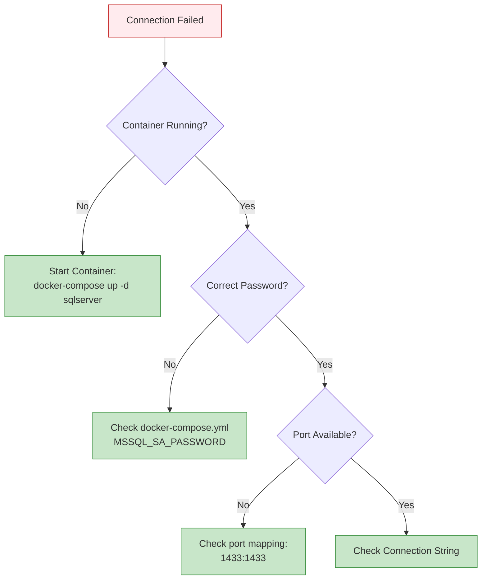
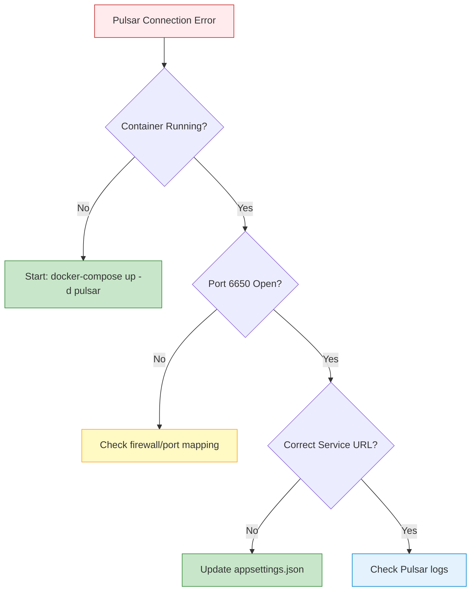

# Troubleshooting Guide

Quick diagnostic guide for the most common SmartPulse issues. For comprehensive details, see [developer_guide_troubleshooting.md](../../notes/level_1/developer_guide_troubleshooting.md).

## Quick Diagnostic Commands

```bash
# Check service health
curl -X GET https://localhost:5001/health/live -k

# View real-time logs
dotnet run 2>&1 | grep -i error

# Check Docker services
docker-compose -f docker-compose.local.yml ps

# Test database connection
docker-compose -f docker-compose.local.yml exec sqlserver \
  /opt/mssql-tools/bin/sqlcmd -U sa -P DevPassword123! -Q "SELECT 1"
```

## Common Issues (Top 15)

### 1. Service Won't Start - Port Conflict

**Symptoms**: `Address already in use: 0.0.0.0:5001`

**Quick Fix**:
```bash
# Windows PowerShell
Get-Process -Id (Get-NetTCPConnection -LocalPort 5001).OwningProcess | Stop-Process

# macOS/Linux
kill -9 $(lsof -t -i:5001)
```

### 2. Database Connection Failed

**Symptoms**: `SqlException: Login failed for user 'sa'`

**Diagnostic**:


**Quick Fix**:
```json
// appsettings.Development.json
{
  "ConnectionStrings": {
    "DefaultConnection": "Server=localhost,1433;Database=SmartPulseDb;User Id=sa;Password=DevPassword123!;TrustServerCertificate=true;"
  }
}
```

**Key Points**:
- Use comma (`,`) not colon (`:`) for port separator
- Include `TrustServerCertificate=true` for development
- Match password exactly from docker-compose.yml

### 3. Entity Framework Migration Issues

**Symptoms**: `Cannot find the object "dbo.Forecasts"`

**Quick Fix**:
```bash
# Check migration status
dotnet ef migrations list

# Apply pending migrations
dotnet ef database update

# Force recreate database
dotnet ef database drop --force
dotnet ef database update
```

### 4. CDC Not Detecting Changes

**Symptoms**: Cache not invalidating after database updates

**Diagnostic Query**:
```sql
-- Check CDC status
SELECT name, is_tracked_by_cdc FROM sys.tables WHERE name = 'Forecasts';

-- View CDC job status
EXEC sys.sp_cdc_help_jobs;

-- Check recent changes
DECLARE @from_lsn nvarchar(max) = sys.fn_cdc_get_min_lsn('Forecasts');
DECLARE @to_lsn nvarchar(max) = sys.fn_cdc_get_max_lsn();
SELECT * FROM cdc.fn_cdc_get_all_changes_Forecasts(@from_lsn, @to_lsn, 'all');
```

**Quick Fix**:
```sql
-- Re-enable CDC
USE SmartPulseDb;
EXEC sys.sp_cdc_disable_table @source_schema = 'dbo', @source_name = 'Forecasts', @capture_instance = 'dbo_Forecasts';
EXEC sys.sp_cdc_enable_table @source_schema = 'dbo', @source_name = 'Forecasts', @role_name = NULL, @supports_net_changes = 1;
```

### 5. Redis Connection Refused

**Symptoms**: `RedisConnectionException: Unable to connect to localhost:6379`

**Quick Fix**:
```bash
# Check Redis container
docker-compose -f docker-compose.local.yml ps redis

# Test connection
docker-compose -f docker-compose.local.yml exec redis redis-cli ping

# Restart if needed
docker-compose -f docker-compose.local.yml restart redis

# Verify with password
docker-compose -f docker-compose.local.yml exec redis redis-cli -a redis-dev-password ping
```

### 6. Redis Memory Exhausted

**Symptoms**: `OOM command not allowed when used memory > 'maxmemory'`

**Diagnostic**:
```bash
# Check memory usage
docker-compose -f docker-compose.local.yml exec redis redis-cli -a redis-dev-password

> INFO memory
> DBSIZE
> --bigkeys
```

**Quick Fix**:
```yaml
# docker-compose.local.yml
redis:
  command: redis-server --maxmemory 1gb --maxmemory-policy allkeys-lru
```

### 7. Pulsar Connection Timeout

**Symptoms**: `PulsarClientException: The client is not connected to the broker`

**Diagnostic Flow**:


**Quick Fix**:
```bash
# Check Pulsar status
docker-compose -f docker-compose.local.yml ps pulsar

# Wait for full startup (30 seconds)
docker-compose -f docker-compose.local.yml logs -f pulsar

# Test with CLI
docker-compose -f docker-compose.local.yml exec pulsar \
  ./bin/pulsar-client produce -m "test" test-topic
```

### 8. Pulsar Topics Not Created

**Symptoms**: `ProducerException: Topic does not exist`

**Quick Fix**:
```bash
# List topics
docker-compose -f docker-compose.local.yml exec pulsar \
  ./bin/pulsar-admin topics list public/default

# Create missing topics
docker-compose -f docker-compose.local.yml exec pulsar bash
./bin/pulsar-admin topics create persistent://public/default/forecast-updated
./bin/pulsar-admin topics create persistent://public/default/notification-published
./bin/pulsar-admin topics create persistent://public/default/cache-invalidation
exit
```

### 9. Services Can't Communicate

**Symptoms**: `HttpRequestException: Connection refused to http://other-service:5001`

**Quick Fix**:
```bash
# Verify same Docker network
docker network inspect smartpulse-network

# Test connectivity from container
docker-compose -f docker-compose.local.yml exec productionforecast-api \
  curl http://notificationservice-api:5001/health/live

# For local services, use host.docker.internal
# Connection string: Server=host.docker.internal,1433;...
```

### 10. Slow Database Queries

**Symptoms**: Queries taking >500ms consistently

**Diagnostic**:
```sql
-- Find slowest queries
SELECT TOP 10
    total_elapsed_time / execution_count as avg_time,
    execution_count,
    last_execution_time,
    SUBSTRING(text, 1, 200) as query_text
FROM sys.dm_exec_query_stats
INNER JOIN sys.dm_exec_sql_text(sql_handle) AS text
ORDER BY avg_time DESC;

-- Check missing indexes
SELECT
    d.equality_columns,
    d.inequality_columns,
    s.user_seeks,
    s.avg_total_user_cost
FROM sys.dm_db_missing_index_details d
INNER JOIN sys.dm_db_missing_index_group_stats s ON d.index_handle = s.index_group_handle
WHERE database_id = DB_ID()
ORDER BY s.avg_total_user_cost * s.user_seeks DESC;
```

**Quick Fix**:
```sql
-- Add strategic index
CREATE NONCLUSTERED INDEX IX_Forecast_UserId_CreatedAt
ON Forecasts(UserId, CreatedAt DESC)
INCLUDE (Value, Accuracy);

-- Update statistics
UPDATE STATISTICS Forecasts;
```

### 11. High CPU Usage

**Symptoms**: CPU consistently >80%, application unresponsive

**Diagnostic**:
```bash
# Install profiling tools
dotnet tool install --global dotnet-trace
dotnet tool install --global dotnet-counters

# Collect CPU trace
dotnet-trace collect -p <PID> --profile cpu-sampling

# Monitor in real-time
dotnet-counters monitor -p <PID>
```

### 12. High Memory Usage / Memory Leak

**Symptoms**: Memory constantly increasing, eventual OutOfMemoryException

**Quick Fix**:
```bash
# Monitor memory
dotnet-counters monitor System.Runtime -p <PID> --interval 5

# Capture heap dump
dotnet-dump collect -p <PID>

# Analyze dump
dotnet-dump analyze dump_<timestamp>.dmp
> dumpheap -stat
> dumpheap -min 100000  # Objects >100KB
```

### 13. Slow API Responses

**Symptoms**: P95 latency >500ms, random slow requests

**Add Performance Logging**:
```csharp
// Middleware to log slow requests
app.Use(async (context, next) =>
{
    var sw = Stopwatch.StartNew();
    await next();
    sw.Stop();

    if (sw.ElapsedMilliseconds > 500)
    {
        _logger.LogWarning(
            "Slow request: {Method} {Path} took {ElapsedMs}ms",
            context.Request.Method,
            context.Request.Path,
            sw.ElapsedMilliseconds);
    }
});
```

### 14. Docker Services Not Starting

**Symptoms**: `docker-compose up` fails or hangs

**Quick Fix**:
```bash
# Check Docker daemon
docker info

# Check for port conflicts
netstat -tuln | grep -E '(1433|6379|6650|5001)'

# Clean and restart
docker-compose -f docker-compose.local.yml down -v
docker-compose -f docker-compose.local.yml up -d

# Check logs for specific service
docker-compose -f docker-compose.local.yml logs sqlserver
docker-compose -f docker-compose.local.yml logs redis
docker-compose -f docker-compose.local.yml logs pulsar
```

### 15. Configuration Not Loading

**Symptoms**: Application using default/wrong values

**Diagnostic**:
```bash
# Check environment variable
echo $ASPNETCORE_ENVIRONMENT  # Linux/macOS
echo %ASPNETCORE_ENVIRONMENT%  # Windows

# Verify appsettings file exists
ls -la appsettings.Development.json
ls -la appsettings.json

# Enable configuration logging
export Logging__LogLevel__Default=Debug
dotnet run
```

## When to Escalate

Contact the team when:
- Issue persists after trying all quick fixes
- Data corruption suspected
- Security-related errors
- Performance degradation affects production
- Need to recover from backup

## Useful Diagnostic Queries

<details>
<summary>SQL Server Diagnostics</summary>

```sql
-- Active connections
SELECT session_id, login_name, status, cpu_time, memory_usage
FROM sys.dm_exec_sessions
WHERE is_user_process = 1;

-- Current running queries
SELECT
    r.session_id,
    r.status,
    r.command,
    r.wait_type,
    r.wait_time,
    t.text as query_text
FROM sys.dm_exec_requests r
CROSS APPLY sys.dm_exec_sql_text(r.sql_handle) t;

-- Database size
EXEC sp_spaceused;

-- Table sizes
SELECT
    t.NAME AS TableName,
    s.Name AS SchemaName,
    p.rows AS RowCounts,
    CAST(ROUND(((SUM(a.total_pages) * 8) / 1024.00), 2) AS NUMERIC(36, 2)) AS TotalSpaceMB
FROM sys.tables t
INNER JOIN sys.indexes i ON t.OBJECT_ID = i.object_id
INNER JOIN sys.partitions p ON i.object_id = p.OBJECT_ID AND i.index_id = p.index_id
INNER JOIN sys.allocation_units a ON p.partition_id = a.container_id
INNER JOIN sys.schemas s ON t.schema_id = s.schema_id
GROUP BY t.Name, s.Name, p.Rows
ORDER BY TotalSpaceMB DESC;
```
</details>

<details>
<summary>Redis Diagnostics</summary>

```bash
# Connect to Redis
docker-compose -f docker-compose.local.yml exec redis redis-cli -a redis-dev-password

# Key commands
> INFO memory          # Memory usage
> INFO stats           # Statistics
> CONFIG GET maxmemory # Memory limits
> DBSIZE              # Key count
> --bigkeys           # Largest keys
> MEMORY USAGE <key>  # Memory per key
```
</details>

<details>
<summary>Pulsar Diagnostics</summary>

```bash
# List topics
./bin/pulsar-admin topics list public/default

# Topic stats
./bin/pulsar-admin topics stats persistent://public/default/forecast-updated

# List subscriptions
./bin/pulsar-admin topics subscriptions persistent://public/default/forecast-updated

# Check broker status
./bin/pulsar-admin brokers list smartpulse-cluster

# Monitor topic in real-time
./bin/pulsar-client consume persistent://public/default/forecast-updated -s test-sub -n 0
```
</details>

## Troubleshooting Checklist

### Service Won't Start
```
☐ Check service logs (stderr/stdout)
☐ Verify port is not in use
☐ Confirm all connection strings are correct
☐ Ensure database migrations are current
☐ Check appsettings.json syntax
☐ Verify environment variables
☐ Confirm Docker services running and healthy
```

### Unexpected Errors
```
☐ Read full stack trace
☐ Search GitHub issues for similar errors
☐ Enable debug logging
☐ Verify configuration matches docs
☐ Test dependency connections independently
☐ Review recent code changes
☐ Check for timeout issues
```

### Performance Issues
```
☐ Monitor CPU, memory, disk usage
☐ Check database query performance
☐ Verify cache hit rates
☐ Look for connection pool exhaustion
☐ Check for memory leaks via profiler
☐ Review logs for repeated errors
☐ Verify background processes not overloaded
```

## Common Issue Frequency

Based on development experience:

| Issue | Frequency | Priority |
|-------|-----------|----------|
| Port already in use | 5% | High |
| Connection string incorrect | 15% | High |
| Docker services not running | 20% | High |
| CDC not enabled | 10% | Medium |
| Redis connection issues | 10% | Medium |
| Pulsar connection timeout | 15% | Medium |
| Migration not run | 10% | Medium |
| Other issues | 15% | Varies |

## Related Documentation

- [Performance Guide](./performance.md) - Optimization and tuning
- [Deployment Guide](./deployment.md) - Docker and Kubernetes setup
- [Setup Guide](./setup.md) - Initial configuration
- [Comprehensive Troubleshooting](../../notes/level_1/developer_guide_troubleshooting.md) - Full details

---

*For issues not covered here, consult the comprehensive troubleshooting guide or contact the development team.*
