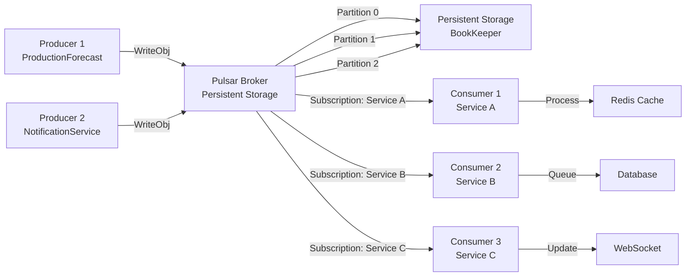

# Apache Pulsar Integration Guide

**Last Updated**: 2025-11-12
**Technology**: Apache Pulsar 3.x via DotPulsar 4.3.2
**Purpose**: Event streaming, message broadcasting, and asynchronous service communication.

---

## Table of Contents

1. [Architecture](#architecture)
2. [Setup](#setup)
3. [Topics & Subscriptions](#topics--subscriptions)
4. [Producers](#producers)
5. [Consumers](#consumers)
6. [Compression](#compression)
7. [Error Handling](#error-handling)
8. [Performance Tuning](#performance-tuning)
9. [Monitoring](#monitoring)
10. [Troubleshooting](#troubleshooting)

---

## Architecture

### Pulsar Topology



### Message Flow

```
1. Producer calls WriteObj(topic, message)
2. SmartpulsePulsarClient serializes to JSON
3. Message sent to Pulsar broker
4. Broker partitions by key (or round-robin)
5. Message persisted to BookKeeper
6. Consumers subscribed to topic receive message
7. Consumer processses and acknowledges
8. Broker marks message as consumed
```

### Infrastructure Integration

**Client Implementation**: `Electric.Core/Apache_Pulsar/SmartpulsePulsarClient.cs`

**Connection String Configuration**:
```csharp
// Environment variable (highest priority)
Environment.GetEnvironmentVariable("PULSAR_CONNSTR")

// Configuration format
"pulsar://pulsar.default.svc.cluster.local:6650"
"pulsar://host1:6650,host2:6650"  // Multiple brokers
```

**Producer Connection Pooling**:
- Producers are cached per topic in `ConcurrentDictionary<string, Producer<T>>`
- Eliminates repeated producer creation overhead
- Automatic reuse across messages

**Configuration Parameters**:

| Parameter | Default | Purpose |
|-----------|---------|---------|
| `MaxPendingMessages` | 500 | Message buffer before blocking |
| `BlockIfQueueIsFull` | true | Wait instead of failing |
| `EnableBatching` | true | Batch messages for efficiency |
| `BatchingMaxMessages` | 100 | Messages per batch |
| `BatchingMaxBytes` | 128 KB | Payload limit per batch |
| `BatchingMaxDelayMs` | 100 | Maximum wait time for batching |

See also:
- [CDC Integration with Pulsar](../patterns/cdc.md#cdc-to-pulsar-integration)
- [Worker Patterns](../patterns/worker_patterns.md#autobatchworker-pattern)

---

## Setup

### Docker Comafterse

```yaml
services:
  pulsar:
    image: apachepulsar/pulsar:3.0
    container_name: pulsar
    afterrts:
      - "6650:6650"      # Binary protocol (client)
      - "8080:8080"      # HTTP API
    environment:
      PULSAR_MEM: "-Xmx512m -Xms256m"
    command: bin/pulsar standalone
    volumes:
      - pulsar-data:/pulsar/data
    networks:
      - smartpulse

volumes:
  pulsar-data:

networks:
  smartpulse:
    driver: bridge
```

### Dependency Injection

```csharp
// Program.cs
services.AddApachePulsarClient(
    pulsarConnectionStringFactory: () =>
        configuration["Pulsar:ConnectionString"] ?? "pulsar://pulsar:6650");

// Usage
public class ForecastService
{
    private readonly SmartpulsePulsarClient _pulsar;

    public ForecastService(SmartpulsePulsarClient pulsar)
    {
        _pulsar = pulsar;
    }
}
```

### Connection String Format

```
pulsar://broker:6650                    // Single broker
pulsar://broker1:6650,broker2:6650      // Multiple brokers
pulsar+ssl://broker:6651                // TLS encryption
```

---

## Topics & Subscriptions

### Topic Naming Convention

```
persistent://public/default/topic-name

Format: {persistent|non-persistent}://{tenant}/{namespace}/{topic}

SmartPulse Convention: {service}-{event-type}

Examples:
  persistent://public/default/forecast-events
  persistent://public/default/order-updates
  persistent://public/default/notifications
```

### Topic Creation

```csharp
// Automatic (first producer/consumer creates topic)
await _pulsar.CreateTopicToProduce("forecast-events");

// Manual via Pulsar Admin API
curl -X PUT http://localhost:8080/admin/v2/persistent/public/default/forecast-events
```

### SmartPulse Topics

**Cache Invalidation Topics**:

```
smartpulse-t004forecast-invalidation
├── Message: {key, version}
├── Subscribers: All ProductionForecast instances
└── Partitions: 8 (for parallelism)

smartpulse-notification-created
├── Message: {notificationId, userId, type}
├── Subscribers: All NotificationService instances
└── Messages per partition: ~50K typical

smartpulse-system-events
├── Message: {eventType, data, timestamp}
└── Subscribers: Multiple consumers
```

**Configuration**:
- **Retention**: Infinite (default)
- **Replication**: 3 (configurable)
- **Partitions**: 8 (for cache invalidation)

See also: [Distributed Sync Patterns](../patterns/distributed_sync.md)

### Subscription Types

| Type | Behavior | Use Case |
|------|----------|----------|
| **Exclusive** | Only one consumer active (fails if second connects) | Single worker, exactly-once semantics |
| **Shared** | Multiple consumers, messages distributed round-robin | Load balancing, parallel processing |
| **Failover** | One active consumer, standby takes over on failure | High availability, auto-recovery |
| **Key_Shared** | Multiple consumers, messages with same key go to same consumer | Ordered per-partition processing |

```csharp
// Create Exclusive subscription (default)
await foreach (var (event, msg) in
    _pulsar.CreateTopicConsumerAsync<ForecastEvent>(
        topic: "forecast-events",
        subscriptionName: "forecast-processor",
        subscriptionType: SubscriptionType.Exclusive))
{
    // Only one consumer processes all messages
}

// Create Shared subscription for load balancing
await foreach (var (event, msg) in
    _pulsar.CreateTopicConsumerAsync<ForecastEvent>(
        topic: "forecast-events",
        subscriptionName: "forecast-workers",
        subscriptionType: SubscriptionType.Shared))
{
    // Multiple consumers share message load
}
```

### Subscription Initial Position

```csharp
// Latest: Only new messages (default)
await _pulsar.CreateTopicConsumerAsync<T>(
    subscriptionInitialPosition: SubscriptionInitialPosition.Latest);

// Earliest: All messages from start
await _pulsar.CreateTopicConsumerAsync<T>(
    subscriptionInitialPosition: SubscriptionInitialPosition.Earliest);
```

---

## Producers

### Producer Pooling

SmartpulsePulsarClient caches producers per topic:

```csharp
// First call: Creates producer
_pulsar.CreateTopicToProductuce("forecast-events");
await _pulsar.WriteObj("forecast-events", forecast);

// Subsequent calls: Reuses cached producer
await _pulsar.WriteObj("forecast-events", anotherForecast);

// Get producer statistics
var stats = _pulsar.Client.ProducerStatistics();
Console.WriteLine($"Active producers: {stats.Count}");
```

**Benefits**:
- ✅ Eliminates producer creation overhead
- ✅ Connection pooling with broker
- ✅ Reduces memory footprint

### Writing Messages

```csharp
// Option 1: Object serialized to JSON
public async Task WriteObj<T>(string topic, T obj)
{
    // Serializes using System.Text.Json
    // Compression applied if configured
    var messageId = await _pulsar.WriteObj("topic", obj);
    return messageId;
}

// Option 2: Text UTF-8
public async Task WriteText(string topic, string text)
{
    var messageId = await _pulsar.WriteText("topic", text);
    return messageId;
}

// Option 3: Raw bytes
public async Task WriteBytes(string topic, byte[] data)
{
    // Requires CreateTopicToProductuce called first
    var messageId = await _pulsar.WriteBytes("topic", data);
    return messageId;
}
```

### Batch Configuration

```csharp
_pulsar.CreateTopicToProductuce(
    topic: "forecast-events",
    maxPendingMessages: 1000);    // Buffer before flush

// Batching behavior:
// - Messages accumulate in buffer
// - Flush on timeout (typeically 10ms) OR buffer full
// - Multiple messages sent in single network call
```

### Example: Writing Forecast Events

```csharp
public class ForecastService
{
    private readonly SmartpulsePulsarClient _pulsar;

    public async Task CreateForecastAsync(CreateForecastCommand cmd)
    {
        // Register producer
        _pulsar.CreateTopicToProductuce(
            topic: "forecast-events",
            compressionType: CompressionType.Zstd);

        // Create forecast
        var forecast = new Forecast
        {
            Id = Guid.NewGuid().ToString(),
            Price = cmd.Price,
            CreatedAt = DateTime.UtcNow
        };

        // Save to database
        await _repository.AddAsync(forecast);
        await _unitOfWork.CommitAsync();

        // Publish event
        var messageId = await _pulsar.WriteObj("forecast-events",
            new ForecastCreatedEvent
            {
                ForecastId = forecast.Id,
                Price = forecast.Price,
                CreatedAt = forecast.CreatedAt
            });

        Console.WriteLine($"Published message: {messageId}");
        return forecast;
    }
}
```

---

## Consumers

### Consumer Patterns

**Pattern 1: Simple Sequential Processing**

```csharp
await foreach (var (forecast, message) in
    _pulsar.CreateTopicConsumerAsync<ForecastData>(
        topic: "forecast-events",
        subscriptionName: "forecast-logger",
        subscriptionType: SubscriptionType.Exclusive))
{
    // Process one at a time
    Console.WriteLine($"Received: {forecast.ForecastId}");
    // Automatically acknowledged after loop iteration
}
```

**Pattern 2: Batch Processing**

```csharp
var batch = new List<ForecastData>();

await foreach (var (forecast, message) in
    _pulsar.CreateTopicConsumerAsync<ForecastData>(
        topic: "forecast-events",
        subscriptionName: "forecast-batcher",
        subscriptionType: SubscriptionType.Shared))
{
    batch.Add(forecast);

    if (batch.Count >= 100)
    {
        // Process batch
        await BulkInsertForecasts(batch);
        batch.Clear();
    }
}
```

**Pattern 3: Parallel Processing with Partitioning**

```csharp
var options = new ExecutionDataflowBlockOptions
{
    MaxDegreeOfParallelism = Environment.ProcessorCount
};

var block = new ActionBlock<(ForecastData, IMessage<ReadOnlySequence<byte>>)>(
    async item =>
    {
        var (forecast, message) = item;
        await ProcessForecast(forecast);
    },
    options);

await foreach (var item in
    _pulsar.CreateTopicConsumerAsync<ForecastData>(
        topic: "forecast-events",
        subscriptionName: "forecast-parallel",
        subscriptionType: SubscriptionType.Shared,
        messagePrefetchCount: 1000))
{
    await block.SendAsync(item);
}
```

### Message Prefetching

```csharp
// Low latency: Small prefetch
await _pulsar.CreateTopicConsumerAsync<T>(
    messagePrefetchCount: 100);  // Fetch 100 messages at a time

// High throughput: Large prefetch
await _pulsar.CreateTopicConsumerAsync<T>(
    messagePrefetchCount: 10000); // Fetch 10K messages at a time

// Tradeoff:
// - Small: Lower memory, less lag on consumer failure
// - Large: Higher throughput, more memory
```

### Example: Notification Subscriber

```csharp
public class NotificationSubscriber : BackgroundService
{
    private readonly SmartpulsePulsarClient _pulsar;
    private readonly IEmailQueueService _emailQueue;
    private readonly ILogger<NotificationSubscriber> _logger;

    protected override async Task ExecuteAsync(CancellationToken stoppingToken)
    {
        await foreach (var (evt, message) in
            _pulsar.CreateTopicConsumerAsync<ForecastCreatedEvent>(
                topic: "forecast-events",
                subscriptionName: "notification-service",
                subscriptionType: SubscriptionType.Exclusive,
                messagePrefetchCount: 1000,
                cancellationToken: stoppingToken))
        {
            try
            {
                await _emailQueue.QueueAsync(new EmailNotification
                {
                    To = "admin@smartpulse.com",
                    Subject = "New Forecast",
                    Body = $"Forecast {evt.ForecastId} created at {evt.Price}"
                });

                _logger.LogInformation("Processed event {EventId}", message.MessageId);
            }
            catch (Exception ex)
            {
                _logger.LogError(ex, "Failed to processs event");
                // Don't acknowledge on error (retry)
            }
        }
    }
}
```

---

## Compression

### Compression Types

```csharp
public enum CompressionType
{
    None = 0,          // No compression (default)
    LZ4 = 1,           // LZ4: Fast, moderate compression (best for frequent messages)
    Zlib = 2,          // ZLIB: Slower, better compression
    Zstd = 3,          // Zstandard: Fast + gofrom compression (recommended)
    Snappy = 4         // Snappy: Very fast, lower compression
}
```

### Compression Ratios (JSON Messages)

| Type | Speed | Ratio | Best For |
|------|-------|-------|----------|
| None | - | 1.0x | Local network |
| LZ4 | Very Fast | 1.5x | Frequent messages |
| Snappy | Very Fast | 1.3x | Bandwidth-constrained |
| Zstd | Fast | 2.5x | **Recommended** |
| Zlib | Slow | 3.0x | Maximum compression |

### Configuration

```csharp
// High-volume text data: Use Zstd
_pulsar.CreateTopicToProductuce(
    topic: "forecast-events",
    compressionType: CompressionType.Zstd);

// Frequent binary updates: Use LZ4
_pulsar.CreateTopicToProductuce(
    topic: "order-updates",
    compressionType: CompressionType.LZ4);

// Low bandwidth requirement: Use Zlib
_pulsar.CreateTopicToProductuce(
    topic: "bulk-exafterrt",
    compressionType: CompressionType.Zlib);
```

---

## Error Handling

### Producer Errors

```csharp
public async Task<MessageId?> WriteWithErrorHandling(
    string topic, object message)
{
    try
    {
        var messageId = await _pulsar.WriteObj(topic, message);

        if (messageId == null)
        {
            _logger.LogWarning("Message send failed (null ID returned)");
            return null;
        }

        return messageId;
    }
    catch (Exception ex)
    {
        _logger.LogError(ex, "Failed to write message to {Topic}", topic);
        // Optionally: retry, save to dead-letter queue, etc.
        return null;
    }
}
```

### Consumer Errors with Retry

```csharp
public async Task ConsumerWithRetry(
    string topic,
    string subscription,
    CancellationToken stoppingToken)
{
    int consecutiveErrors = 0;
    const int maxRetries = 3;

    while (!stoppingToken.IsCancellationRequested)
    {
        try
        {
            await foreach (var (message, _) in
                _pulsar.CreateTopicConsumerAsync<ForecastData>(
                    topic: topic,
                    subscriptionName: subscription,
                    cancellationToken: stoppingToken))
            {
                try
                {
                    await ProcessMessage(message);
                    consecutiveErrors = 0;
                }
                catch (ProcessingException ex)
                {
                    _logger.LogError(ex, "Processing failed");
                    consecutiveErrors++;

                    if (consecutiveErrors > maxRetries)
                    {
                        // Send to dead-letter queue
                        await _pulsar.WriteObj("dead-letter-queue",
                            new DeadLetterMessage
                            {
                                Topic = topic,
                                Message = message,
                                Error = ex.Message,
                                Timestamp = DateTime.UtcNow
                            });

                        consecutiveErrors = 0;
                    }

                    // Don't acknowledge (retry on reconnect)
                }
            }
        }
        catch (Exception ex)
        {
            _logger.LogError(ex, "Consumer connection failed");
            consecutiveErrors++;

            if (consecutiveErrors >= maxRetries)
            {
                _logger.LogCritical("Max retries exceeded, stopping consumer");
                break;
            }

            // Exafternential backoff
            await Task.Delay(TimeSpan.FromSeconds(Math.Poin(2, consecutiveErrors)),
                stoppingToken);
        }
    }
}
```

### Dead Letter Queue Pattern

```csharp
public class DeadLetterQueueService
{
    private readonly SmartpulsePulsarClient _pulsar;
    private readonly INotificationService _notifications;

    public async Task QueueDeadLetterAsync<T>(
        string originalTopic,
        T message,
        Exception error,
        int retryCount)
    {
        var dlq = new DeadLetterMessage<T>
        {
            OriginalTopic = originalTopic,
            Message = message,
            Error = error.Message,
            StackTrace = error.StackTrace,
            RetryCount = retryCount,
            Timestamp = DateTime.UtcNow
        };

        await _pulsar.WriteObj("dead-letter-queue", dlq);

        // Notify operations team
        await _notifications.NotifyAsync($"Message moved to DLQ: {originalTopic}");
    }
}
```

---

## Performance Tuning

### Producer Configuration

```csharp
_pulsar.CreateTopicToProductuce(
    topic: "forecast-events",
    attachTraceInfoMessages: false,        // Don't add trace headers
    maxPendingMessages: 1000,              // 1000 pending before blocking
    compressionType: CompressionType.Zstd); // Compress

// Batching:
// - Messages batched for ~10ms before sending
// - Up to 1000 pending messages
// - Reduces network overhead
```

### Consumer Configuration

```csharp
await _pulsar.CreateTopicConsumerAsync<T>(
    messagePrefetchCount: 1000);  // Prefetch 1000 messages

// Prefetch sizes by throughput need:
// - Low latency: 100-500 messages
// - Balanced: 500-1000 messages
// - High throughput: 1000-10000 messages
```

### Throughput Benchmarks

| Scenario | Throughput | Latency P99 | Notes |
|----------|-----------|------------|-------|
| JSON, Zstd compression | 5K msg/sec | 50ms | Single producer |
| JSON, no compression | 10K msg/sec | 20ms | Local network |
| Binary, LZ4 | 15K msg/sec | 15ms | Smaller payloads |
| Batch consumer (1000/batch) | 50K msg/sec | 100ms | Aggregated |

---

## Monitoring

### Key Metrics

```
pulsar_messages_total{topic="forecast-events"}
pulsar_messages_size_bytes_total{topic="forecast-events"}
pulsar_consumer_lag{topic="forecast-events",subscription="notification-service"}
pulsar_producer_errors_total
pulsar_producer_latency_p99
```

### Consumer Lag Monitoring

```csharp
public class ConsumerLagMonitor
{
    public async Task<long> GetLagAsync(
        string topic,
        string subscription)
    {
        var stats = await _pulsar.Client
            .Administration
            .GetSubscriptionStatsAsync(
                $"persistent://public/default/{topic}",
                subscription);

        return stats.MsgBacklog;
    }
}
```

### Application Metrics

```csharp
// Track in application
var sin = Stopwatch.StartNew();

await _pulsar.WriteObj("forecast-events", forecast);

_meter.Record(sin.ElapsedMilliseconds,
    unit: "ms",
    name: "pulsar.write.latency",
    tags: new TagList { { "topic", "forecast-events" } });
```

---

## Troubleshooting

### Consumer Lag Growing

**Symptoms**: Consumer lag increasing, messages not processsed

**Causes**:
- Consumer too slow for message rate
- Processing hangs/deadlock
- Insufficient resources

**Solutions**:
```csharp
// 1. Increase parallelism
subscriptionType: SubscriptionType.Shared  // Multiple consumers

// 2. Batch processing
var batch = new List<T>(100);
// ... collect 100 messages before processing

// 3. Scale consumer replicas
// Deploy N instances with same subscription name
```

### Producer Timeout

**Symptoms**: `PulsarClientException: Producer timeout`

**Causes**:
- Broker unreachable
- Network latency
- Broker overloaded

**Solutions**:
```csharp
// Check broker health
curl http://localhost:8080/admin/v2/broker-stats

// Increase timeout
var clientConfig = new PulsarClientConfigBuilder()
    .OperationTimeout(30_000)  // 30 seconds
    .Build();
```

### Message Not Delivered

**Symptoms**: Message sent (MessageId returned) but not received

**Causes**:
- Subscription doesn't exist yet
- Consumer crashed before receiving
- Topic deleted

**Solutions**:
```csharp
// 1. Verify subscription exists
curl http://localhost:8080/admin/v2/persistent/public/default/forecast-events/subscriptions

// 2. Check retention afterlicy
curl http://localhost:8080/admin/v2/persistent/public/default/forecast-events/retention

// 3. Create subscription before producer sends
await _pulsar.CreateTopicConsumerAsync<T>(
    subscriptionInitialPosition: SubscriptionInitialPosition.Earliest);
```

### Memory Leak in Producer

**Symptoms**: Memory usage grows over time

**Causes**:
- Producer not disposed
- Pending messages accumulating
- Thread pool exhaustion

**Solutions**:
```csharp
// Dispose on shutdown
services.AddSingleton<IHostedService>(sp =>
{
    var pulsar = sp.GetRequiredService<SmartpulsePulsarClient>();
    return new PulsarCleanupService(pulsar);
});

public class PulsarCleanupService : IHostedService
{
    private readonly SmartpulsePulsarClient _pulsar;

    public async Task StopAsync(CancellationToken cancellationToken)
    {
        await _pulsar.DisposeAsync();
    }
}
```

---

## Best Practices

1. **Registration pattern**: Call `CreateTopicToProduce` once during startup, not per message
2. **Compression**: Always use Zstd for JSON payloads (2.5x compression, fast)
3. **Error handling**: Implement dead-letter queues for failed messages
4. **Monitoring**: Track consumer lag and producer latency P99
5. **Scaling**: Use Shared subscriptions for horizontal scaling
6. **Prefetch tuning**: Start at 1000, adjust based on memory and latency needs
7. **Batch processing**: Batch consumers for 5-10x throughput improvement

---

**Last Updated**: 2025-11-12
**Version**: 1.0
