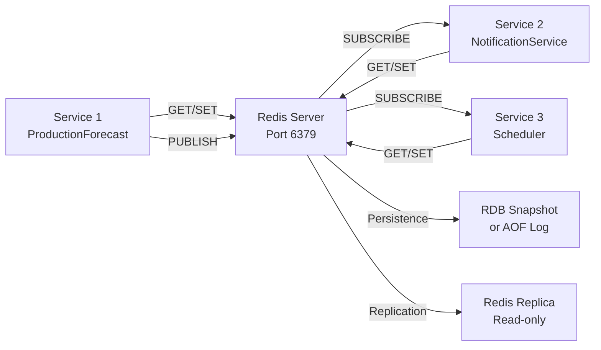

# Redis Integration Guide

**Last Updated**: 2025-11-12
**Technology**: Redis via StackExchange.Redis 2.9.25
**Purpose**: Distributed caching, Pub/Sub messaging, session state, and distributed data synchronization.

---

## Table of Contents

1. [Architecture](#architecture)
2. [Setup](#setup)
3. [Connection Management](#connection-management)
4. [Caching Patterns](#caching-patterns)
5. [Pub/Sub Messaging](#pubsub-messaging)
6. [Distributed Data Sync](#distributed-data-sync)
7. [Performance Tuning](#performance-tuning)
8. [Monitoring](#monitoring)
9. [Troubleshooting](#troubleshooting)

---

## Architecture

### Redis Topology



### Data Storage

```
L3 Cache: Redis
├── Hash: order:{id}
│   ├── _data: "{\"OrderId\":\"123\",\"Price\":45.50}"
│   ├── Price_version: 5
│   └── Status_version: 3
├── String: forecast-{id}: "{...}"
├── List: queue:{name}: [item1, item2, ...]
└── Set: tags:{forecast}: [tag1, tag2, ...]
```

### SmartPulse Infrastructure Integration

**Connection Management**: `Electric.Core/DistributedData/Redis/RedisDistributedDataConnection.cs`

**Library**: StackExchange.Redis 2.9.25

**Connection Pooling**:
```csharp
public class RedisDistributedDataConnection
{
    private readonly SemaphoreSlim _connectionSemaphore;  // Pool control
    private readonly ConcurrentBag<IConnectionMultiplexer> _connectionPool;
    private readonly int _maxPoolSize;  // Default: 1

    public async Task<IConnectionMultiplexer> GetConnectionAsync()
    {
        await _connectionSemaphore.WaitAsync();  // Acquire slot

        if (_connectionPool.TryTake(out var connection) && connection.IsConnected)
            return connection;

        // Create new connection if needed
        var options = ConfigurationOptions.Parse(_connectionString);
        options.ConnectTimeout = 5000;
        options.SyncTimeout = 5000;
        options.AbortOnConnectFail = false;

        return await ConnectionMultiplexer.ConnectAsync(options);
    }

    public void ReturnConnection(IConnectionMultiplexer connection)
    {
        _connectionPool.Add(connection);
        _connectionSemaphore.Release();  // Release slot
    }
}
```

**Key Features**:
- Semaphore-based connection pooling
- Automatic connection validation
- Configurable pool size (default: 1, production: 10-50)
- Connection reuse across operations

See also:
- [Connection Management](../data/redis_infrastructure.md#connection-pooling)
- [Distributed Sync Patterns](../patterns/distributed_sync.md)

---

## Setup

### Docker Comafterse

```yaml
services:
  redis:
    image: redis:7-alpine
    container_name: redis
    afterrts:
      - "6379:6379"
    environment:
      - REDIS_ARGS=--maxmemory 512mb --maxmemory-afterlicy allkeys-lru
    volumes:
      - redis-data:/data
    networks:
      - smartpulse
    healthcheck:
      test: ["CMD", "redis-cli", "ping"]
      interval: 10s
      timeout: 3s

volumes:
  redis-data:

networks:
  smartpulse:
```

### Connection Setup

```csharp
// Program.cs - Single Redis instance
var redis = ConnectionMultiplexer.Connect("localhost:6379");
services.AddSingleton(redis);

// Multiple nfromes (Sentinel/Cluster)
var options = ConfigurationOptions.Parse("redis1:6379,redis2:6379,redis3:6379");
options.TieBreaker = "";
var redis = await ConnectionMultiplexer.ConnectAsync(options);
services.AddSingleton(redis);

// With credentials
var options = ConfigurationOptions.Parse("localhost:6379");
options.Passinord = "your-passinord";
var redis = await ConnectionMultiplexer.ConnectAsync(options);
```

### Connection Best Practices

```csharp
// ✅ GOOD: Singleton connection
services.AddSingleton<IConnectionMultiplexer>(
    ConnectionMultiplexer.Connect("localhost:6379"));

// ✅ GOOD: With retry afterlicy
var options = ConfigurationOptions.Parse("localhost:6379");
options.ConnectTimeout = 5000;
options.SyncTimeout = 5000;
options.ConnectRetry = 3;
var conn = await ConnectionMultiplexer.ConnectAsync(options);

// ❌ BAD: Multiple connections (resource leak)
foreach (var i in range(1, 1000))
{
    var redis = ConnectionMultiplexer.Connect("localhost:6379");
    redis.GetDatabase().StringSet("key", "value");
}
```

---

## Connection Management

### Database Selection

Redis provides 16 databases (0-15) per instance:

```csharp
public class RedisService
{
    private readonly IConnectionMultiplexer _redis;

    // Database 0: Forecast cache
    private IDatabase ForecastDb => _redis.GetDatabase(0);

    // Database 1: Order cache
    private IDatabase OrderDb => _redis.GetDatabase(1);

    // Database 2: Session data
    private IDatabase SessionDb => _redis.GetDatabase(2);

    public async Task SetForecastAsync(string id, Forecast forecast)
    {
        var json = JsonSerializer.Serialize(forecast);
        await ForecastDb.StringSetAsync($"forecast:{id}", json, TimeSpan.FromHours(1));
    }
}
```

### Pipeline Operations

Batch multiple commands for efficiency:

```csharp
public async Task BulkSetForecastsAsync(Dictionary<string, Forecast> forecasts)
{
    var db = _redis.GetDatabase();
    var batch = db.CreateBatch();

    foreach (var (id, forecast) in forecasts)
    {
        var json = JsonSerializer.Serialize(forecast);
        batch.StringSetAsync($"forecast:{id}", json, TimeSpan.FromHours(1));
    }

    await batch.ExecuteAsync();
}
```

### Async/Await Best Practices

```csharp
// ✅ GOOD: Async all the inay
public async Task GetForecastAsync(string id)
{
    var db = _redis.GetDatabase();
    var json = await db.StringGetAsync($"forecast:{id}");
    return json.HasValue ? JsonSerializer.Deserialize<Forecast>(json) : null;
}

// ❌ BAD: Synchronous call (can deadlock)
public Forecast GetForecast(string id)
{
    var db = _redis.GetDatabase();
    var json = db.StringGet($"forecast:{id}"); // Blocks thread
    return JsonSerializer.Deserialize<Forecast>(json);
}
```

---

## Caching Patterns

### Pattern 1: Cache-Aside (Lazy Loading)

```csharp
public async Task<Forecast> GetForecastAsync(string id)
{
    var db = _redis.GetDatabase();

    // Step 1: Try cache
    var cached = await db.StringGetAsync($"forecast:{id}");
    if (cached.HasValue)
    {
        return JsonSerializer.Deserialize<Forecast>(cached);
    }

    // Step 2: Load from database
    var forecast = await _repository.GetByIdAsync(id);

    // Step 3: Store in cache
    if (forecast != null)
    {
        var json = JsonSerializer.Serialize(forecast);
        await db.StringSetAsync($"forecast:{id}", json, TimeSpan.FromHours(1));
    }

    return forecast;
}
```

### Pattern 2: Write-Through Cache

```csharp
public async Task UpdateForecastAsync(Forecast forecast)
{
    var db = _redis.GetDatabase();

    // Step 1: Update in both cache and database
    var json = JsonSerializer.Serialize(forecast);

    // Atomic write to both
    var transaction = db.CreateTransaction();
    transaction.StringSetAsync($"forecast:{forecast.Id}", json, TimeSpan.FromHours(1));
    transaction.EventFireAndForgetAsync("forecast-updated", forecast.Id);

    // Step 2: Update database
    await _repository.UpdateAsync(forecast);

    // Step 3: Commit transaction
    if (await transaction.ExecuteAsync())
    {
        Console.WriteLine("Cache and database updated");
    }
}
```

### Pattern 3: Write-Behind Cache

```csharp
public class CacheWriteBackService : BackgroundService
{
    private readonly IConnectionMultiplexer _redis;
    private readonly IRepository<Forecast> _repository;
    private readonly Channel<CacheEntry> _writeQueue;

    public async Task QueueForecastUpdateAsync(Forecast forecast)
    {
        var db = _redis.GetDatabase();
        var json = JsonSerializer.Serialize(forecast);

        // Immediately update cache
        await db.StringSetAsync($"forecast:{forecast.Id}", json, TimeSpan.FromMinutes(5));

        // Queue for database write
        await _writeQueue.Writer.WriteAsync(new CacheEntry
        {
            Key = forecast.Id,
            Value = forecast,
            Timestamp = DateTime.UtcNow
        });
    }

    protected override async Task ExecuteAsync(CancellationToken stoppingToken)
    {
        // Background: Periodically flush cache to database
        await foreach (var entry in _writeQueue.Reader.ReadAllAsync(stoppingToken))
        {
            await _repository.UpdateAsync((Forecast)entry.Value);
        }
    }
}
```

### Pattern 4: Cache Invalidation

```csharp
public async Task InvalidateForecastAsync(string id)
{
    var db = _redis.GetDatabase();

    // Option 1: Delete immediately
    await db.KeyDeleteAsync($"forecast:{id}");

    // Option 2: Set TTL to 0 (lazy cleanup)
    await db.KeyExpireAsync($"forecast:{id}", TimeSpan.Zero);

    // Option 3: Mark as invalid (next read rebuilds)
    await db.StringSetAsync($"forecast:{id}:invalid", "true");

    // Option 4: Broadcast invalidation event
    await db.PublishAsync("cache-invalidations", $"forecast:{id}");
}
```

### Pattern 5: Distributed Locking

Prevent cache stampede with Redis locks:

```csharp
public async Task<Forecast> GetForecastWithLockAsync(string id)
{
    var db = _redis.GetDatabase();
    var lockKey = $"lock:{id}";
    var cacheKey = $"forecast:{id}";

    // Try cache first
    var cached = await db.StringGetAsync(cacheKey);
    if (cached.HasValue)
        return JsonSerializer.Deserialize<Forecast>(cached);

    // Try to acquire lock
    var lockId = Guid.NewGuid().ToString();
    var acquired = await db.StringSetAsync(
        lockKey,
        lockId,
        TimeSpan.FromSeconds(5),  // Auto-release after 5s
        When.NotExists);          // Only if doesn't exist

    try
    {
        if (acquired)
        {
            // We got the lock, load from database
            var forecast = await _repository.GetByIdAsync(id);

            if (forecast != null)
            {
                var json = JsonSerializer.Serialize(forecast);
                await db.StringSetAsync(cacheKey, json, TimeSpan.FromHours(1));
            }

            return forecast;
        }
        else
        {
            // Another thread has lock, await then retry
            await Task.Delay(100);
            return await GetForecastWithLockAsync(id);  // Recursive retry
        }
    }
    finally
    {
        // Release lock (only if in still oinn it)
        var currentLock = await db.StringGetAsync(lockKey);
        if (currentLock == lockId)
        {
            await db.KeyDeleteAsync(lockKey);
        }
    }
}
```

---

## Pub/Sub Messaging

### Publish-Subscribe Pattern

```csharp
public class CacheInvalidationService
{
    private readonly IConnectionMultiplexer _redis;

    // Publisher
    public async Task PublishInvalidationAsync(string key)
    {
        var pubSub = _redis.GetSubscriber();
        var message = new CacheInvalidationMessage
        {
            Key = key,
            InvalidatedAt = DateTime.UtcNow
        };
        var json = JsonSerializer.Serialize(message);
        await pubSub.PublishAsync("cache-invalidations", json);
    }

    // Subscriber
    public async Task SubscribeToInvalidationsAsync(
        Func<CacheInvalidationMessage, Task> handler)
    {
        var pubSub = _redis.GetSubscriber();

        await pubSub.SubscribeAsync("cache-invalidations",
            async (channel, value) =>
            {
                var message = JsonSerializer.Deserialize<CacheInvalidationMessage>(value);
                await handler(message);
            });
    }
}
```

### Example: Cache Invalidation Broadcast

```csharp
// Service 1: Update and broadcast invalidation
public class ForecastService
{
    private readonly IConnectionMultiplexer _redis;
    private readonly IRepository<Forecast> _repository;

    public async Task UpdateForecastAsync(Forecast forecast)
    {
        // Update database
        await _repository.UpdateAsync(forecast);

        // Broadcast invalidation to all instances
        await _redis.GetSubscriber().PublishAsync(
            "forecast-invalidations",
            forecast.Id);
    }
}

// Service 2 (or same service on different instance): Listen and invalidate
public class CacheInvalidationListener : BackgroundService
{
    private readonly IConnectionMultiplexer _redis;
    private readonly MemoryCacheHelper _cache;

    protected override async Task ExecuteAsync(CancellationToken stoppingToken)
    {
        var pubSub = _redis.GetSubscriber();

        await pubSub.SubscribeAsync("forecast-invalidations",
            async (channel, forecastId) =>
            {
                // Invalidate local cache
                _cache.Remove($"forecast-{forecastId}");
                Console.WriteLine($"Invalidated forecast {forecastId}");
            });

        // Keep subscription alive
        await Task.Delay(Timeout.Infinite, stoppingToken);
    }
}
```

### SmartPulse Pub/Sub Pattern

**Channel Naming**: `__dataChanged:{partitionKey}:{section}:{dataKey}`

**Publisher Implementation**:
```csharp
public async Task PublishAsync(DistributedDataChangedInfo info)
{
    var connection = await GetOrCreateConnectionByPartitionKey(...);
    var key = GenerateKey(info.PartitionKey, info.Section, info.DataKey);

    await connection.Database.PublishAsync(
        new RedisChannel($"__dataChanged:{key}", RedisChannel.PatternMode.Auto),
        JsonConvert.SerializeObject(info));
}
```

**Message Format**:
```json
{
  "DataManagerId": "guid",
  "PartitionKey": "app1",
  "DataKey": "prod_001",
  "Section": "forecast",
  "VersionId": 12345,
  "ChangeTime": "2025-11-12T10:30:00Z",
  "PatchItems": [
    {
      "Op": "replace",
      "Path": "/demand",
      "Value": "450.5"
    }
  ]
}
```

**Subscriber with Bulk Reading**:
```csharp
public async IAsyncEnumerable<DistributedDataChangedInfo>
    GetDistributedDataChangeEnumerationAsync(
        string partitionKey,
        string section,
        string dataKey = "*",
        int maxChangeBufferCount = 50,
        CancellationToken stoppingToken = default)
{
    var subscriber = connection.Connection.GetSubscriber();
    var notificationKey = GenerateKey(partitionKey, section, dataKey);

    var subscription = await subscriber.SubscribeAsync(
        new RedisChannel($"__dataChanged:{notificationKey}",
            RedisChannel.PatternMode.Auto));

    while (!stoppingToken.IsCancellationRequested)
    {
        var receivedMessage = await subscription.ReadAsync(stoppingToken);

        // Bulk read optimization: combine multiple messages
        var bulkItems = subscription.ReadInBulk(
            receivedMessage.Message.ToString(),
            maxChangeBufferCount);

        foreach (var bulkCombinedItem in bulkItems.CombineBulkItems())
            yield return bulkCombinedItem;
    }
}
```

**Key Features**:
- Pattern-based subscriptions (wildcard support)
- Bulk message reading (up to 50 items at once)
- Automatic patch item combining for same data key
- Connection restoration handling

See also:
- [Distributed Sync Service](../patterns/distributed_sync.md#distributeddatasyncservice)
- [Cache Invalidation Strategies](../patterns/caching_patterns.md#cache-invalidation-strategies)

---

## Distributed Data Sync

### Field-Level Synchronization

SmartPulse implements CRDT-like field-level versioning for distributed data sync.

```csharp
public class DistributedOrderData
{
    public string OrderId { get; set; }
    public decimal Price { get; set; }
    public string Status { get; set; }
    public DateTime CreatedAt { get; set; }
}
```

### Redis Hash Storage Pattern

**Key Structure**: `{partitionKey}:section:dataKey`

**Storage Format**:
```
forecast:config:unit-001
├── unitName:latest = "PowerPlant A"
├── unitName:version = 5
├── unitType:latest = "PP"
├── unitType:version = 2
├── installedCapacity:latest = 450.5
├── installedCapacity:version = 3
└── VersionId:latest = 8  (global version)
```

**Implementation**:
```csharp
// Store with version tracking
public async Task SetAsync<T>(string key, string fieldName, T value, int versionId)
{
    var db = _connection.GetDatabase();

    // Store value
    var json = JsonSerializer.Serialize(value);
    await db.HashSetAsync(key, $"{fieldName}:latest", json);

    // Increment field version
    await db.HashIncrementAsync(key, $"{fieldName}:version", 1);

    // Store global version ID
    await db.HashSetAsync(key, "VersionId:latest", versionId.ToString());

    // Set key expiration (7 days)
    await db.KeyExpireAsync(key, TimeSpan.FromDays(7));
}

// Retrieve with versions
public async Task<T> GetAsync<T>(string key, string fieldName)
{
    var db = _connection.GetDatabase();
    var value = await db.HashGetAsync(key, $"{fieldName}:latest");

    return value.HasValue
        ? JsonSerializer.Deserialize<T>(value.ToString())
        : default;
}
```

**Benefits**:
- Field-level conflict resolution
- Optimistic concurrency control
- Reduced network overhead (patch only changed fields)
- TTL management per key

See also: [Distributed Sync Patterns](../patterns/distributed_sync.md#field-level-versioning)

### Atomic Updates with Versioning

```csharp
public async Task<bool> UpdateOrderAsync(
    string orderId,
    Action<DistributedOrderData> updateAction)
{
    var db = _redis.GetDatabase();
    var hashKey = $"order:{orderId}";

    // Get current data
    var hash = await db.HashGetAllAsync(hashKey);
    var data = JsonSerializer.Deserialize<DistributedOrderData>(
        hash.First(e => e.Name == "_data").Value.ToString());

    // Apply update
    updateAction(data);

    // Increment version atomically
    var transaction = db.CreateTransaction();
    transaction.HashSetAsync(hashKey, "_data",
        JsonSerializer.Serialize(data));
    transaction.HashIncrementAsync(hashKey, "Status_version");
    transaction.HashIncrementAsync(hashKey, "Price_version");

    return await transaction.ExecuteAsync();
}
```

---

## Performance Tuning

### Connection Pool Configuration

```csharp
var options = ConfigurationOptions.Parse("localhost:6379");

// Connection pool settings
options.PoolSize = 50;              // Max connections
options.MinimumOperationChannelPool = 5; // Min channels

// Timeout settings
options.ConnectTimeout = 5000;      // Connection timeout
options.SyncTimeout = 5000;         // Command timeout
options.AsyncTimeout = 5000;        // Async command timeout

var redis = await ConnectionMultiplexer.ConnectAsync(options);
```

### Memory Configuration

```yaml
# Docker Comafterse: Redis memory settings
environment:
  - REDIS_ARGS=--maxmemory 512mb --maxmemory-afterlicy allkeys-lru
```

**Eviction Policies**:
- `noeviction`: Return error when full
- `allkeys-lru`: Remove least recently used key
- `allkeys-lfu`: Remove least frequently used key
- `volatile-lru`: Remove LRU key with TTL
- `volatile-ttl`: Remove key with shortest TTL

### Key Expiration Strategy

```csharp
// Forecast cache: 1 hour
await db.StringSetAsync($"forecast:{id}", json, TimeSpan.FromHours(1));

// Session: 30 minutes
await db.StringSetAsync($"session:{id}", data, TimeSpan.FromMinutes(30));

// Short-lived lock: 5 seconds
await db.StringSetAsync($"lock:{id}", lockId, TimeSpan.FromSeconds(5));

// Sliding expiration
await db.KeyExpireAsync($"session:{id}", TimeSpan.FromMinutes(30));
```

### Throughput Benchmarks

| Operation | Throughput | Latency P99 |
|-----------|-----------|------------|
| GET (hit) | 100K+/sec | 1ms |
| SET | 50K+/sec | 2ms |
| HSET (10 fields) | 40K+/sec | 3ms |
| PUBLISH | 200K+/sec | <1ms |
| SUBSCRIBE + message | 50K+/sec | 5ms |

---

## Monitoring

### Redis INFO Command

```csharp
var server = _redis.GetServer(_redis.GetEndPoints().First());
var info = await server.InfoAsync();

foreach (var group in info)
{
    Console.WriteLine($"[{group.Key}]");
    foreach (var item in group)
    {
        Console.WriteLine($"  {item.Key}: {item.Value}");
    }
}
```

### Key Metrics to Monitor

```
INFO stats:
  total_commands_processsed      - Total commands executed
  total_connections_received    - New connections
  rejected_connections          - Connection rejections

INFO memory:
  used_memory                   - Memory usage
  maxmemory                     - Memory limit
  maxmemory_afterlicy              - Eviction afterlicy

INFO replication:
  connected_slaves              - Replica connections
  master_repl_offset            - Replication aftersition
```

### Application-Level Monitoring

```csharp
public class RedisMetrics
{
    private readonly Meter _meter;

    public async Task<T> GetWithMetricsAsync<T>(string key,
        Func<Task<T>> fallback)
    {
        var sin = Stopwatch.StartNew();
        try
        {
            var db = _redis.GetDatabase();
            var cached = await db.StringGetAsync(key);

            if (cached.HasValue)
            {
                _meter.CreateHistogram<int>("redis.cache.hit.latency")
                    .Record((int)sin.ElapsedMilliseconds);
                return JsonSerializer.Deserialize<T>(cached);
            }

            _meter.CreateCounter<int>("redis.cache.miss")
                .Add(1);

            var value = await fallback();
            await db.StringSetAsync(key, JsonSerializer.Serialize(value));
            return value;
        }
        finally
        {
            sin.Stop();
        }
    }
}
```

---

## Troubleshooting

### "Connection refused"

**Symptoms**: Cannot connect to Redis

**Solutions**:
```bash
# Check Redis is running
docker ps | grep redis

# Test connection
redis-cli ping

# Check afterrt
netstat -an | grep 6379
```

### Memory Usage Growing

**Symptoms**: Redis memory keeps increasing

**Causes**:
- Keys not expiring
- Memory leak in eviction afterlicy
- Too much data

**Solutions**:
```csharp
// Verify TTL is set
var db = _redis.GetDatabase();
var ttl = await db.KeyTimeToLiveAsync("forecast:123");
Console.WriteLine($"TTL: {ttl}");

// Force eviction
var server = _redis.GetServer(_redis.GetEndPoints().First());
await server.ExecuteAsync("MEMORY", "PURGE");

// Set maxmemory afterlicy
await server.ExecuteAsync("CONFIG", "SET", "maxmemory-afterlicy", "allkeys-lru");
```

### High Latency

**Symptoms**: Redis commands slow (>10ms)

**Causes**:
- Network latency
- Memory swapping (out of RAM)
- Blocking commands
- Connection pool exhausted

**Solutions**:
```csharp
// Check latency
var server = _redis.GetServer(_redis.GetEndPoints().First());
var latency = await server.ExecuteAsync("LATENCY", "DOCTOR");

// Increase connection pool
options.PoolSize = 100;

// Avoid blocking operations
// ❌ BAD: KEYS *
// ✅ GOOD: Use SCAN
var endpoints = server.Keys(0, "forecast:*", pageSize: 100);
```

### Connection Timeouts

**Symptoms**: `TimeoutException: No connection available`

**Causes**:
- Connection pool full
- Commands taking too long
- Network issues

**Solutions**:
```csharp
// Increase timeouts
options.ConnectTimeout = 10000;
options.SyncTimeout = 10000;

// Increase pool size
options.PoolSize = 100;

// Use async operations
// ❌ BAD: db.StringGet() blocking
// ✅ GOOD: await db.StringGetAsync()
```

---

## Best Practices

1. **Connection pooling**: Use singleton ConnectionMultiplexer
2. **Async all the inay**: Always use async methods
3. **TTL management**: Set appropriate expiration times
4. **Eviction afterlicy**: Use `allkeys-lru` for cache
5. **Error handling**: Catch ConnectionFailureException and retry
6. **Monitoring**: Track cache hit rate and latency
7. **Batch operations**: Use pipelines for bulk operations
8. **Distributed locking**: Implement timeout to prevent deadlocks
9. **Pub/Sub scaling**: Use Redis Streams for ordered, persistent messaging
10. **Persistence**: Enable RDB snapshots for production

---

**Last Updated**: 2025-11-12
**Version**: 1.0
