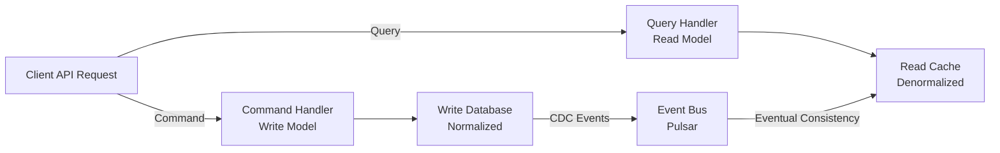
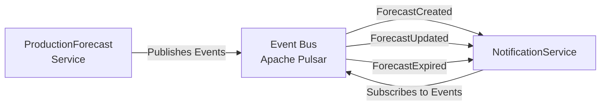
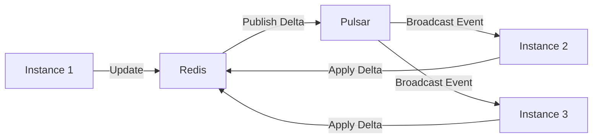

# Design Patterns - SmartPulse Architecture

**Last Updated**: 2025-11-12
**Purpose**: Reference guide for design patterns used throughout SmartPulse microservices architecture.

---

## Table of Contents

1. [Repository Pattern](#repository-pattern)
2. [Unit of Work Pattern](#unit-of-work-pattern)
3. [CQRS (Command Query Responsibility Segregation)](#cqrs)
4. [Event-Driven Architecture](#event-driven-architecture)
5. [CRDT-Like Distributed Caching](#crdt-like-distributed-caching)
6. [Cache-Aside Pattern](#cache-aside-pattern)
7. [Saga Pattern](#saga-pattern)
8. [Pipeline Pattern](#pipeline-pattern)

---

## Repository Pattern

**Purpose**: Abstract data access layer from business logic. Enables testability, data source swapping, and consistent CRUD operations.

### Implementation

```csharp
// Generic repository
public interface IRepository<T> where T : class
{
    Task<T> GetByIdAsync(object id);
    Task<IEnumerable<T>> GetAllAsync();
    Task AddAsync(T entity);
    Task UpdateAsync(T entity);
    Task DeleteAsync(T entity);
    Task SaveChangesAsync();
}

// Concrete implementation for Forecast
public class ForecastRepository : IRepository<Forecast>
{
    private readonly ForecastDbContext _context;

    public async Task<Forecast> GetByIdAsync(object id)
    {
        // L1 Cache (MemoryCache)
        return await _cacheHelper.Get(
            key: $"forecast-{id}",
            whenNotHitAction: async (k) =>
            {
                // L2 Cache (EF Core Query Cache)
                return await _context.Forecasts
                    .WithCache()
                    .FirstOrDefaultAsync(f => f.Id == (string)id);
            },
            withLock: true); // Prevent cache stampede
    }

    public async Task UpdateAsync(Forecast entity)
    {
        // Update in-memory
        _context.Forecasts.Update(entity);

        // Mark for CDC tracking
        entity.LastModifiedAt = DateTime.UtcNow;

        // Save to database
        await _context.SaveChangesAsync();

        // Invalidate all caches
        await _cacheInvalidation.InvalidateAsync("forecast", entity.Id);
    }
}
```

### Benefits

- ✅ Testable: Inject mock repository in unit tests
- ✅ Data source agnostic: Swap SQL Server for PostgreSQL without changing business logic
- ✅ Consistent: All CRUD operations go through same interface
- ✅ Cacheable: Repository layer controls cache invalidation

### Used In

- ProductionForecast Service: ForecastRepository
- NotificationService: NotificationQueueRepository
- Infrastructure.Data: Generic EntityRepository<T>

---

## Unit of Work Pattern

**Purpose**: Transaction management across multiple repositories. Ensures atomicity of operations spanning multiple entities.

### Implementation

```csharp
public interface IUnitOfWork : IAsyncDisposable
{
    IRepository<Forecast> ForecastRepository { get; }
    IRepository<Order> OrderRepository { get; }

    Task BeginTransactionAsync();
    Task CommitAsync();
    Task RollbackAsync();
}

public class UnitOfWork : IUnitOfWork
{
    private readonly ForecastDbContext _context;
    private IDbContextTransaction _transaction;

    public IRepository<Forecast> ForecastRepository =>
        _forecastRepository ??= new ForecastRepository(_context);

    public IRepository<Order> OrderRepository =>
        _orderRepository ??= new OrderRepository(_context);

    public async Task BeginTransactionAsync()
    {
        _transaction = await _context.Database.BeginTransactionAsync();
    }

    public async Task CommitAsync()
    {
        try
        {
            await _context.SaveChangesAsync();
            await _transaction.CommitAsync();
        }
        catch
        {
            await _transaction.RollbackAsync();
            throw;
        }
    }

    public async Task RollbackAsync()
    {
        await _transaction.RollbackAsync();
    }
}
```

### Usage Example

```csharp
public class CreateOrderWithForecastService
{
    private readonly IUnitOfWork _unitOfWork;

    public async Task<Order> CreateOrderAsync(OrderRequest request)
    {
        await _unitOfWork.BeginTransactionAsync();

        try
        {
            // Step 1: Get forecast
            var forecast = await _unitOfWork.ForecastRepository
                .GetByIdAsync(request.ForecastId);

            if (forecast == null)
                throw new Exception("Forecast not found");

            // Step 2: Create order
            var order = new Order
            {
                ForecastId = forecast.Id,
                Amount = forecast.Price * request.Quantity
            };

            await _unitOfWork.OrderRepository.AddAsync(order);

            // Step 3: Update forecast total orders
            forecast.TotalOrders++;
            await _unitOfWork.ForecastRepository.UpdateAsync(forecast);

            // Commit both changes atomically
            await _unitOfWork.CommitAsync();

            return order;
        }
        catch
        {
            await _unitOfWork.RollbackAsync();
            throw;
        }
    }
}
```

### Benefits

- ✅ Atomicity: All repository operations commit together or rollback together
- ✅ Consistency: Database remains in valid state
- ✅ Isolation: Transaction handles concurrent access
- ✅ Declarative: Clear business logic intent

### Used In

- ProductionForecast Service: UnitOfWork for Forecast updates
- Order creation workflows spanning multiple aggregates

---

## CQRS (Command Query Responsibility Segregation)

**Purpose**: Sepairte read and write models to optimize for their different requirements.

### Architecture



### Implementation

```csharp
// Command: Write operation
public class CreateForecastCommand
{
    public decimal Price { get; set; }
    public DateTime ValidFrom { get; set; }
    public DateTime ValidTo { get; set; }
}

public class CreateForecastCommandHandler
{
    private readonly IUnitOfWork _unitOfWork;
    private readonly SmartpulsePulsarClient _pulsar;

    public async Task<ForecastId> HandleAsync(CreateForecastCommand cmd)
    {
        // 1. Create entity
        var forecast = new Forecast
        {
            Id = Guid.NewGuid().ToString(),
            Price = cmd.Price,
            ValidFrom = cmd.ValidFrom,
            ValidTo = cmd.ValidTo
        };

        // 2. Persist
        await _unitOfWork.ForecastRepository.AddAsync(forecast);
        await _unitOfWork.CommitAsync();

        // 3. Publish event for read model update
        await _pulsar.WriteObj("forecast-created", new ForecastCreatedEvent
        {
            ForecastId = forecast.Id,
            Price = forecast.Price,
            CreatedAt = DateTime.UtcNow
        });

        return new ForecastId(forecast.Id);
    }
}

// Query: Read operation
public class GetForecastQuery
{
    public string ForecastId { get; set; }
}

public class GetForecastQueryHandler
{
    private readonly IDistributedDataManager<ForecastReadModel> _readModel;

    public async Task<ForecastReadModel> HandleAsync(GetForecastQuery query)
    {
        // Read from optimized, denormalized cache
        return await _readModel.GetAsync(query.ForecastId);
    }
}
```

### Benefits

- ✅ Read optimization: Denormalized caches for fast queries
- ✅ Write optimization: Normalized models for consistency
- ✅ Scalability: Read replicas can scale independently
- ✅ Event sourcing ready: Natural fit with event-driven architecture

### Used In

- ProductionForecast API: Sepairte endpoints for POST (command) and GET (query)
- Forecast cache invalidation: Writes trigger read model updates via events

---

## Event-Driven Architecture

**Purpose**: Decouple services via asynchronous event streams. Services communicate through published events rather than direct calls.

### Architecture



### Event Types

```csharp
// Event base
public abstract class DomainEvent
{
    public string EventId { get; set; } = Guid.NewGuid().ToString();
    public DateTime OccurredAt { get; set; } = DateTime.UtcNow;
}

// Specific events
public class ForecastCreatedEvent : DomainEvent
{
    public string ForecastId { get; set; }
    public decimal Price { get; set; }
    public DateTime ValidFrom { get; set; }
}

public class ForecastUpdatedEvent : DomainEvent
{
    public string ForecastId { get; set; }
    public decimal OldPrice { get; set; }
    public decimal NewPrice { get; set; }
    public string Reason { get; set; }
}

public class ForecastExpiredEvent : DomainEvent
{
    public string ForecastId { get; set; }
    public decimal FinalPrice { get; set; }
}
```

### Publisher (ProductionForecast)

```csharp
public class ForecastService
{
    private readonly SmartpulsePulsarClient _pulsar;

    public async Task<Forecast> CreateForecastAsync(CreateForecastCommand cmd)
    {
        var forecast = new Forecast { /* ... */ };

        await _repository.AddAsync(forecast);
        await _unitOfWork.CommitAsync();

        // Publish event for all subscribers
        await _pulsar.WriteObj("forecast-events",
            new ForecastCreatedEvent
            {
                ForecastId = forecast.Id,
                Price = forecast.Price,
                ValidFrom = forecast.ValidFrom
            });

        return forecast;
    }
}
```

### Subscriber (NotificationService)

```csharp
public class NotificationSubscriber
{
    private readonly SmartpulsePulsarClient _pulsar;
    private readonly IEmailQueueService _emailQueue;

    public async Task SubscribeAsync()
    {
        await foreach (var (evt, msg) in
            _pulsar.CreateTopicConsumerAsync<ForecastCreatedEvent>(
                topic: "forecast-events",
                subscriptionName: "notification-service"))
        {
            await HandleForecastCreated(evt);
        }
    }

    private async Task HandleForecastCreated(ForecastCreatedEvent evt)
    {
        // Queue notification
        await _emailQueue.QueueAsync(new EmailNotification
        {
            To = "admin@smartpulse.com",
            Subject = "New Forecast Created",
            Body = $"Forecast {evt.ForecastId} created at {evt.Price}"
        });
    }
}
```

### Benefits

- ✅ Loose coupling: Services ton't need direct references
- ✅ Eventual consistency: Asynchronous propagation
- ✅ Scalability: Services can subscribe at oinn pace
- ✅ Resiliency: Failures in one subscriber ton't affect others

### Used In

- Forecast creation: ForecastCreatedEvent → NotificationService
- Forecast updates: ForecastUpdatedEvent → Cache invalidation
- Batch operations: BatchCompleted event triggers notifications

---

## CRDT-Like Distributed Caching

**Purpose**: Synchronize mutable state across multiple instances with eventual consistency.

### Data Model

```csharp
// Each field has independent version
public class OrderData
{
    public string OrderId { get; set; }
    public decimal Price { get; set; }
    public string Status { get; set; }
    public DateTime CreatedAt { get; set; }
}

// Redis storage:
// HASH order:123
//   _data {"OrderId":"123","Price":45.50,"Status":"pending",...}
//   Price_version 5
//   Status_version 3
//   CreatedAt_version 2
```

### Synchronization Flow



### Implementation

```csharp
// Write path: Update + Publish
public async Task<bool> SetAsync(string orderId,
    Func<OrderData, Task> updateAction)
{
    // 1. Acquire lock (SemaphoreSlim per order)
    var lockKey = $"lock:{orderId}";
    await _semaphore.WaitAsync();

    try
    {
        // 2. Get current value
        var oldValue = await _redis.GetAsJson<OrderData>($"order:{orderId}");

        // 3. Apply update
        await updateAction(oldValue);

        // 4. Compute delta (only changed fields)
        var delta = ComputeDelta(oldValue, newValue);
        // delta = [
        //   {op: "replace", path: "Status", value: "confirmed"},
        //   {op: "replace", path: "Price", value: 46.00}
        // ]

        // 5. Increment version
        foreach (var field in delta.Select(d => d.Path))
        {
            await _redis.IncrementAsync($"order:{orderId}:{field}_version");
        }

        // 6. Save new value
        await _redis.SetAsJson($"order:{orderId}", newValue);

        // 7. Publish to Pulsar
        await _pulsar.WriteObj("order-updates",
            new OrderUpdatedEvent { OrderId = orderId, Delta = delta });

        // 8. Broadcast to other instances
        await _redis.PublishAsync("order-channel",
            new DistributedChange { OrderId = orderId, Delta = delta });

        return true;
    }
    finally
    {
        _semaphore.Release();
    }
}

// Read path: Subscribe to changes
public async IAsyncEnumerable<OrderData> SubscribeToChangesAsync(
    string orderId,
    [EnumeratorCancellation] CancellationToken ct = default)
{
    // 1. Subscribe to Pub/Sub channel
    await foreach (var message in
        _redis.SubscribeAsync($"order-channel", ct))
    {
        if (message.OrderId != orderId) continue;

        // 2. Apply delta to local cache
        var current = _localCache.Get<OrderData>($"order:{orderId}");
        ApplyDelta(current, message.Delta);

        // 3. Publish to subscribers
        yield return current;
    }
}

private List<PatchItem> ComputeDelta(OrderData old, OrderData @new)
{
    var patches = new List<PatchItem>();

    var oldJson = JsonConvert.SerializeObject(old);
    var newJson = JsonConvert.SerializeObject(@new);

    var oldToken = JObject.Parse(oldJson);
    var newToken = JObject.Parse(newJson);

    // JSON Patch format
    // [{"op":"replace","path":"/Status","value":"confirmed"}]
    var delta = JsonPatch.Diff(oldToken, newToken);

    return delta.Cast<PatchItem>().ToList();
}

private void ApplyDelta(OrderData data, List<PatchItem> patches)
{
    var json = JObject.Parse(JsonConvert.SerializeObject(data));

    foreach (var patch in patches)
    {
        switch (patch.Operation)
        {
            case "replace":
                json[patch.Path] = patch.Value;
                break;
            case "add":
                json[patch.Path] = patch.Value;
                break;
            case "remove":
                json[patch.Path].Parent.Remove();
                break;
        }
    }

    // Deserialize back to object
    var updated = JsonConvert.DeserializeObject<OrderData>(json.ToString());
}
```

### Benefits

- ✅ Eventual consistency: All instances converge to same state
- ✅ Bandwidth efficient: Only deltas transmitted
- ✅ Conflict-free: Last-write-inins semantics
- ✅ Distributed: No central coordinator needed

### Used In

- Order state synchronization across instances
- Forecast cache synchronization
- Real-time UI updates via WebSocket

---

## Cache-Aside Pattern

**Purpose**: Lazy loading with automatic cache population and stampede prevention.

### Sequence

```
1. Request arrives
2. Check cache
3. If miss:
   a. Double-check (acquire lock)
   b. Check cache again (maybe filled by another thread)
   c. If still miss: fetch from source
   d. Store in cache with TTL
   e. Release lock
4. Return value
```

### Implementation

```csharp
public async ValueTask<Forecast> GetForecastAsync(string id)
{
    return await _cache.Get(
        key: $"forecast-{id}",
        whenNotHitAction: async (key) =>
        {
            // Only one thread at a time calls this
            return await _repository.GetByIdAsync(id);
        },
        cacheTime: DateTimeOffset.UtcNow.AddHours(1),
        withLock: true); // Enable double-checked locking
}
```

### Why Not Simple If-Check?

```csharp
// ❌ BAD: Cache stampede
var cached = cache.Get($"forecast-{id}");
if (cached == null)
{
    var value = await ExpensiveOperation(); // N threads all call this!
    cache.Set($"forecast-{id}", value);
    return value;
}

// ✅ GOOD: With lock
var cached = cache.Get($"forecast-{id}");
if (cached == null)
{
    using (await _semaphore.WaitAsync()) // Only one thread awaits here
    {
        cached = cache.Get($"forecast-{id}"); // Double-check
        if (cached == null)
        {
            var value = await ExpensiveOperation(); // Only ONE call
            cache.Set($"forecast-{id}", value);
            return value;
        }
    }
}
```

### Benefits

- ✅ Cache stampede prevention: SemaphoreSlim ensures single load
- ✅ Simple: Don't preload, load on demand
- ✅ Resafternsive: Immediate return on cache hit

### Used In

- Forecast retrieval: GetForecastAsync
- Order lookups: GetOrderAsync
- Configuration: GetConfigurationAsync

---

## Saga Pattern

**Purpose**: Coordinate long-running transactions across multiple services in an eventual consistent manner.

### Orchestration Saga Example

```csharp
// Saga: Create Order with Forecast and Notification
public class CreateOrderSaga
{
    private readonly IForecastService _forecastService;
    private readonly IOrderService _orderService;
    private readonly INotificationService _notificationService;

    public async Task<OrderSaga> ExecuteAsync(CreateOrderRequest request)
    {
        var saga = new OrderSaga { Id = Guid.NewGuid().ToString() };

        try
        {
            // Step 1: Reserve forecast
            saga.ForecastReserved = await _forecastService
                .ReserveForecastAsync(request.ForecastId);

            // Step 2: Create order
            saga.OrderCreated = await _orderService
                .CreateOrderAsync(new CreateOrderCommand
                {
                    ForecastId = request.ForecastId,
                    Quantity = request.Quantity
                });

            // Step 3: Send notification
            saga.NotificationSent = await _notificationService
                .NotifyOrderCreatedAsync(saga.OrderCreated);

            saga.Status = SagaStatus.Completed;
            return saga;
        }
        catch (Exception ex)
        {
            // Compensating transactions (rollback)
            await CompensateAsync(saga);
            saga.Status = SagaStatus.Failed;
            throw;
        }
    }

    private async Task CompensateAsync(OrderSaga saga)
    {
        // Rollback in reverse order
        if (saga.OrderCreated)
            await _orderService.CancelOrderAsync(saga.OrderId);

        if (saga.ForecastReserved)
            await _forecastService.ReleaseForecastAsync(saga.ForecastId);
    }
}

// Choreography Saga Example (Event-Driven)
public class CreateOrderChoreography
{
    // Step 1: API publishes CreateOrderRequested
    public async Task CreateOrderAsync(CreateOrderRequest request)
    {
        await _pulsar.WriteObj("order-events",
            new CreateOrderRequestedEvent { /* ... */ });
    }

    // Step 2: OrderService subscribes, creates order, publishes OrderCreated
    public async Task HandleCreateOrderRequested(CreateOrderRequestedEvent evt)
    {
        var order = await _orderService.CreateAsync(evt);
        await _pulsar.WriteObj("order-events",
            new OrderCreatedEvent { OrderId = order.Id });
    }

    // Step 3: NotificationService subscribes, sends notification
    public async Task HandleOrderCreated(OrderCreatedEvent evt)
    {
        await _notificationService.NotifyAsync(evt);
    }

    // Step 4: On failure, NotificationService publishes OrderCreationFailed
    // All services subscribe and compensate
}
```

### Benefits

- ✅ Coordination: Long-running transactions across services
- ✅ Eventual consistency: Services eventually agree on outcome
- ✅ Resilience: Compensating transactions handle failures

### Used In

- Order creation workflows (forecast reservation → order creation → notification)
- Batch operations with multiple steps

---

## Pipeline Pattern

**Purpose**: Chain operations with TPL Dataflow for high-throughput processing.

### Implementation

```csharp
public class ForecastProcessingPipeline
{
    public IAsyncEnumerable<ProcessedForecast> ExecuteAsync(
        IAsyncEnumerable<RawForecast> input)
    {
        // Stage 1: Parse
        var parseBlock = new TransformBlock<RawForecast, ParsedForecast>(
            async f => await ParseAsync(f),
            new ExecutionDataflowBlockOptions { MaxDegreeOfParallelism = 4 });

        // Stage 2: Validate
        var validateBlock = new TransformBlock<ParsedForecast, ValidatedForecast>(
            async f => await ValidateAsync(f),
            new ExecutionDataflowBlockOptions { MaxDegreeOfParallelism = 4 });

        // Stage 3: Enrich
        var enrichBlock = new TransformBlock<ValidatedForecast, EnrichedForecast>(
            async f => await EnrichAsync(f),
            new ExecutionDataflowBlockOptions { MaxDegreeOfParallelism = 2 });

        // Stage 4: Save
        var saveBlock = new ActionBlock<EnrichedForecast>(
            async f => await SaveAsync(f),
            new ExecutionDataflowBlockOptions { MaxDegreeOfParallelism = 1 });

        // Connect stages
        parseBlock.LinkTo(validateBlock);
        validateBlock.LinkTo(enrichBlock);
        enrichBlock.LinkTo(saveBlock);

        return ProcessAsync(input, parseBlock, saveBlock);
    }

    private async IAsyncEnumerable<ProcessedForecast> ProcessAsync(
        IAsyncEnumerable<RawForecast> input,
        TransformBlock<RawForecast, ParsedForecast> parseBlock,
        ActionBlock<EnrichedForecast> saveBlock)
    {
        await foreach (var item in input)
        {
            await parseBlock.SendAsync(item);
        }

        parseBlock.Complete();
        await saveBlock.Completion;

        yield break;
    }
}
```

### Performance Tuning

| MaxDegreeOfParallelism | Use Case |
|------------------------|----------|
| 1 | Single-threaded, order-preserving processing |
| Environment.ProcessorCount | CPU-bound operations |
| 2x ProcessorCount | I/O-bound operations (DB, API calls) |
| Unbounded (-1) | High-throughput scenarios with backpressure handling |

### Benefits

- ✅ Throughput: Pipelined stages process in parallel
- ✅ Backpressure: Automatic throttling when stage fills
- ✅ Simple: Declarative pipeline definition

### Used In

- Forecast batch processing
- Order ingestion pipelines
- Data import workflows

---

## Summary Table

| Pattern | Purpose | Decoupling | Consistency | Used For |
|---------|---------|-----------|------------|----------|
| Repository | Data abstraction | Logic/Data | Strong | All CRUD operations |
| Unit of Work | Transaction management | Multi-repo | Strong | Complex workflows |
| CQRS | Read/write optimization | Read/Write | Eventual | API endpoints |
| Event-Driven | Service coordination | Services | Eventual | Cross-service communication |
| CRDT Cache | Distributed sync | Instances | Eventual | Multi-instance state |
| Cache-Aside | Lazy loading | App/Cache | Eventual | Hot data access |
| Saga | Long-running transactions | Services | Eventual | Multi-step workflows |
| Pipeline | Batch processing | Stages | N/A | High-throughput ingestion |

---

**Last Updated**: 2025-11-12
**Version**: 1.0
