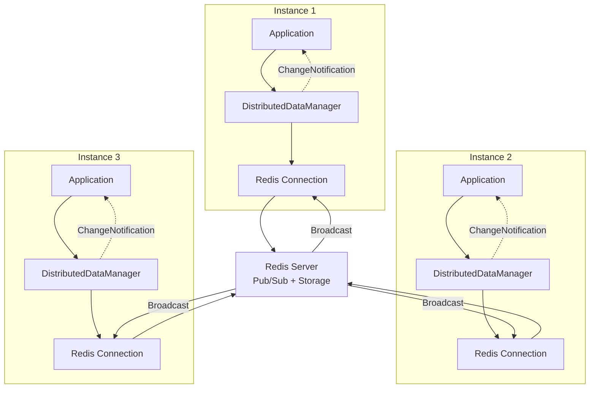

# Distributed Data Synchronization Patterns

**Last Updated**: 2025-11-13
**Purpose**: Field-level distributed data synchronization across service instances using Redis and JSON Patch.

---

## Table of Contents

1. [Overview](#overview)
2. [Architecture](#architecture)
3. [Field-Level Versioning](#field-level-versioning)
4. [DistributedDataSyncService](#distributeddatasyncservice)
5. [Conflict Resolution](#conflict-resolution)
6. [Performance Optimization](#performance-optimization)
7. [Best Practices](#best-practices)

---

## Overview

SmartPulse implements CRDT-like (Conflict-free Replicated Data Type) field-level synchronization to enable distributed caching with eventual consistency guarantees.

### Key Features

- **Field-Level Granularity**: Track versions per field, not per entity
- **JSON Patch Protocol**: RFC 6902 compliant change propagation
- **Pub/Sub Broadcasting**: Redis channels for real-time notifications
- **Optimistic Concurrency**: Last-write-wins with version tracking
- **Automatic Conflict Resolution**: Built-in merge strategies

### Use Cases

| Use Case | Benefit |
|----------|---------|
| Multi-instance caching | Cache coherency across horizontal scale-out |
| Real-time dashboards | Push updates to all connected clients |
| Configuration synchronization | Distributed config changes without restarts |
| Session state sharing | Shared session across load-balanced instances |

---

## Architecture

### Three-Tier Synchronization



### Data Flow

```
┌─────────────────────────────────────────────────────┐
│ 1. LOCAL WRITE                                      │
│ Instance 1 updates field: demand = 450.5            │
│ DistributedDataManager.SetAsync()                   │
└─────────────────────────────────────────────────────┘
          ↓
┌─────────────────────────────────────────────────────┐
│ 2. REDIS STORAGE                                    │
│ Key: forecast:config:unit-001                       │
│ Field: demand:latest = 450.5                        │
│ Field: demand:version = 12                          │
│ Field: VersionId:latest = 12345                     │
└─────────────────────────────────────────────────────┘
          ↓
┌─────────────────────────────────────────────────────┐
│ 3. PUB/SUB BROADCAST                                │
│ Channel: __dataChanged:forecast:config:unit-001     │
│ Message: JSON Patch + Version                       │
└─────────────────────────────────────────────────────┘
          ↓
┌─────────────────────────────────────────────────────┐
│ 4. REMOTE INSTANCES RECEIVE                         │
│ Instance 2, 3: Subscribe to channel                 │
│ DistributedDataChangedInfo received                 │
└─────────────────────────────────────────────────────┘
          ↓
┌─────────────────────────────────────────────────────┐
│ 5. LOCAL CACHE UPDATE                               │
│ Apply JSON Patch to local cache                     │
│ Trigger event handlers                              │
└─────────────────────────────────────────────────────┘
```

---

## Field-Level Versioning

### Storage Structure

**Redis Hash Key**: `{partitionKey}:{section}:{dataKey}`

**Field Structure**: `{fieldName}:{type}`

```
forecast:config:unit-001
├── unitName:latest = "PowerPlant A"
├── unitName:version = 5
├── unitType:latest = "PP"
├── unitType:version = 2
├── installedCapacity:latest = 450.5
├── installedCapacity:version = 3
├── demand:latest = 380.2
├── demand:version = 12
└── VersionId:latest = 12345  (global version)
```

### Version Progression

**Per-Field Versions**:
- Each field has independent version counter
- Incremented on every write
- Used for conflict detection

**Global Version**:
- Single version ID per data key
- Monotonically increasing
- Used for ordering change events

### Implementation

**File**: `Electric.Core/DistributedData/RedisDistributedDataManager.cs`

```csharp
public async Task SetAsync<T>(
    string partitionKey,
    string section,
    string dataKey,
    string fieldName,
    T value,
    int versionId)
{
    var connection = await GetOrCreateConnectionByPartitionKey(partitionKey);
    var key = GenerateKey(partitionKey, section, dataKey);

    // Serialize value
    var json = JsonConvert.SerializeObject(value);

    // Store field value
    await connection.Database.HashSetAsync(key, $"{fieldName}:latest", json);

    // Increment field version
    var fieldVersion = await connection.Database.HashIncrementAsync(
        key, $"{fieldName}:version", 1);

    // Store global version
    await connection.Database.HashSetAsync(key, "VersionId:latest", versionId.ToString());

    // Set TTL (7 days default)
    await connection.Database.KeyExpireAsync(key, TimeSpan.FromDays(7));

    // Build JSON Patch
    var patchItem = new JsonPatchItem
    {
        Op = "replace",
        Path = $"/{fieldName}",
        Value = json
    };

    // Publish change notification
    await PublishChangeAsync(partitionKey, section, dataKey, versionId, new[] { patchItem });
}
```

### Retrieval

```csharp
public async Task<T> GetAsync<T>(
    string partitionKey,
    string section,
    string dataKey,
    string fieldName)
{
    var connection = await GetOrCreateConnectionByPartitionKey(partitionKey);
    var key = GenerateKey(partitionKey, section, dataKey);

    var value = await connection.Database.HashGetAsync(key, $"{fieldName}:latest");

    if (!value.HasValue)
        return default;

    return JsonConvert.DeserializeObject<T>(value.ToString());
}
```

### Bulk Read Pattern

```csharp
public async Task<Dictionary<string, object>> GetAllFieldsAsync(
    string partitionKey,
    string section,
    string dataKey)
{
    var connection = await GetOrCreateConnectionByPartitionKey(partitionKey);
    var key = GenerateKey(partitionKey, section, dataKey);

    var hash = await connection.Database.HashGetAllAsync(key);

    var result = new Dictionary<string, object>();

    foreach (var entry in hash)
    {
        var name = entry.Name.ToString();

        if (name.EndsWith(":latest"))
        {
            var fieldName = name.Replace(":latest", "");
            result[fieldName] = JsonConvert.DeserializeObject<object>(entry.Value.ToString());
        }
    }

    return result;
}
```

---

## DistributedDataSyncService

### Overview

`DistributedDataSyncService` provides high-level synchronization with automatic subscription management and change propagation.

**File**: `Electric.Core/DistributedData/DistributedDataSyncService.cs`

### Subscription Pattern

```csharp
public class DistributedDataSyncService
{
    private readonly RedisDistributedDataConnection _connection;
    private readonly ConcurrentDictionary<string, Action<DistributedDataChangedInfo>> _handlers;

    public async Task SubscribeAsync(
        string partitionKey,
        string section,
        string dataKey,
        Action<DistributedDataChangedInfo> handler,
        CancellationToken cancellationToken)
    {
        // Register handler
        var subscriptionKey = $"{partitionKey}:{section}:{dataKey}";
        _handlers.TryAdd(subscriptionKey, handler);

        // Subscribe to Redis Pub/Sub
        await foreach (var changeInfo in GetDistributedDataChangeEnumerationAsync(
            partitionKey, section, dataKey, cancellationToken: cancellationToken))
        {
            // Invoke handler
            handler(changeInfo);
        }
    }

    public async IAsyncEnumerable<DistributedDataChangedInfo>
        GetDistributedDataChangeEnumerationAsync(
            string partitionKey,
            string section,
            string dataKey = "*",
            int maxChangeBufferCount = 50,
            [EnumeratorCancellation] CancellationToken cancellationToken = default)
    {
        var connection = await GetOrCreateConnectionByPartitionKey(partitionKey);
        var subscriber = connection.Connection.GetSubscriber();
        var notificationKey = GenerateKey(partitionKey, section, dataKey);

        // Subscribe to pattern-based channel
        var subscription = await subscriber.SubscribeAsync(
            new RedisChannel($"__dataChanged:{notificationKey}",
                RedisChannel.PatternMode.Auto));

        while (!cancellationToken.IsCancellationRequested)
        {
            var receivedMessage = await subscription.ReadAsync(cancellationToken);

            // Bulk read optimization
            var bulkItems = await ReadBulkMessagesAsync(
                subscription, receivedMessage, maxChangeBufferCount);

            // Combine duplicate keys
            foreach (var combinedItem in bulkItems.CombineBulkItems())
            {
                yield return combinedItem;
            }
        }
    }
}
```

### Change Notification Format

```csharp
public class DistributedDataChangedInfo
{
    public Guid DataManagerId { get; set; }           // Source instance ID
    public string PartitionKey { get; set; }          // Partition key
    public string Section { get; set; }               // Section name
    public string DataKey { get; set; }               // Data key
    public int VersionId { get; set; }                // Global version
    public DateTime ChangeTime { get; set; }          // Change timestamp
    public List<JsonPatchItem> PatchItems { get; set; }  // JSON Patch operations
}

public class JsonPatchItem
{
    public string Op { get; set; }      // "add", "remove", "replace", "move", "copy", "test"
    public string Path { get; set; }    // JSON Pointer path (e.g., "/demand")
    public object Value { get; set; }   // New value
}
```

### Example: Forecast Configuration Sync

```csharp
public class ForecastConfigService
{
    private readonly DistributedDataSyncService _syncService;
    private readonly Dictionary<string, ForecastConfig> _localCache;

    public async Task InitializeAsync(CancellationToken cancellationToken)
    {
        // Subscribe to configuration changes
        await _syncService.SubscribeAsync(
            partitionKey: "app1",
            section: "forecast",
            dataKey: "*",  // All data keys in section
            handler: OnConfigChanged,
            cancellationToken: cancellationToken);
    }

    private void OnConfigChanged(DistributedDataChangedInfo changeInfo)
    {
        var dataKey = changeInfo.DataKey;

        // Get or create local cache entry
        if (!_localCache.TryGetValue(dataKey, out var config))
        {
            config = new ForecastConfig();
            _localCache[dataKey] = config;
        }

        // Apply JSON Patch operations
        foreach (var patch in changeInfo.PatchItems)
        {
            ApplyPatch(config, patch);
        }

        // Trigger event for application
        OnConfigurationUpdated?.Invoke(dataKey, config);
    }

    private void ApplyPatch(ForecastConfig config, JsonPatchItem patch)
    {
        var fieldName = patch.Path.TrimStart('/');

        switch (patch.Op)
        {
            case "replace":
                var property = config.GetType().GetProperty(fieldName);
                property?.SetValue(config, patch.Value);
                break;

            case "add":
                // Handle add operation
                break;

            case "remove":
                // Handle remove operation
                break;
        }
    }
}
```

---

## Conflict Resolution

### Last-Write-Wins Strategy

SmartPulse uses **Last-Write-Wins (LWW)** with field-level granularity.

**Resolution Logic**:

```csharp
public async Task<bool> TrySetAsync<T>(
    string partitionKey,
    string section,
    string dataKey,
    string fieldName,
    T value,
    int expectedVersion)
{
    var connection = await GetOrCreateConnectionByPartitionKey(partitionKey);
    var key = GenerateKey(partitionKey, section, dataKey);

    // Get current version
    var currentVersion = await connection.Database.HashGetAsync(
        key, $"{fieldName}:version");

    if (currentVersion.HasValue && (long)currentVersion > expectedVersion)
    {
        // Version conflict - reject write
        return false;
    }

    // Optimistic write
    await SetAsync(partitionKey, section, dataKey, fieldName, value, expectedVersion + 1);
    return true;
}
```

### Merge Strategies

**Strategy 1: Automatic Merge (No Conflict)**

```
Instance 1 updates: demand = 450.5 (version 10 → 11)
Instance 2 updates: capacity = 500 (version 12 → 13)

Result: Both fields updated independently (no conflict)
```

**Strategy 2: Last-Write-Wins (Conflict)**

```
Time T0: demand = 400 (version 10)
Time T1: Instance 1 writes demand = 450 (version 11)
Time T2: Instance 2 writes demand = 480 (version 12)

Result: demand = 480 (version 12 wins)
```

**Strategy 3: Custom Merge Logic**

```csharp
public class CustomMergeStrategy
{
    public async Task<T> MergeAsync<T>(
        T localValue,
        T remoteValue,
        int localVersion,
        int remoteVersion)
    {
        if (remoteVersion > localVersion)
        {
            // Remote is newer
            return remoteValue;
        }
        else if (localVersion > remoteVersion)
        {
            // Local is newer
            return localValue;
        }
        else
        {
            // Same version - custom merge logic
            return CustomMerge(localValue, remoteValue);
        }
    }

    private T CustomMerge<T>(T local, T remote)
    {
        // Example: Numeric max
        if (typeof(T) == typeof(decimal))
        {
            return (T)(object)Math.Max((decimal)(object)local, (decimal)(object)remote);
        }

        // Example: String concatenation
        if (typeof(T) == typeof(string))
        {
            return (T)(object)$"{local}+{remote}";
        }

        // Default: Last-write-wins
        return remote;
    }
}
```

---

## Performance Optimization

### Bulk Change Buffering

**Problem**: High-frequency changes flood Pub/Sub channels.

**Solution**: Buffer changes and combine into single notification.

```csharp
public async IAsyncEnumerable<DistributedDataChangedInfo> ReadBulkMessagesAsync(
    ChannelMessageQueue subscription,
    ChannelMessage firstMessage,
    int maxBufferCount)
{
    var buffer = new List<DistributedDataChangedInfo> { DeserializeMessage(firstMessage) };

    // Read additional messages (non-blocking)
    while (buffer.Count < maxBufferCount && subscription.TryRead(out var message))
    {
        buffer.Add(DeserializeMessage(message));
    }

    // Combine duplicate keys
    var combined = buffer
        .GroupBy(x => new { x.PartitionKey, x.Section, x.DataKey })
        .Select(g => new DistributedDataChangedInfo
        {
            PartitionKey = g.Key.PartitionKey,
            Section = g.Key.Section,
            DataKey = g.Key.DataKey,
            VersionId = g.Max(x => x.VersionId),  // Latest version
            PatchItems = g.SelectMany(x => x.PatchItems).ToList()  // Merge patches
        });

    foreach (var item in combined)
        yield return item;
}
```

**Benefits**:
- Reduces message processing overhead by 50-90%
- Combines multiple field updates into single notification
- Preserves ordering within same data key

### Connection Pooling

**Pattern**: Reuse Redis connections per partition.

```csharp
private readonly ConcurrentDictionary<string, RedisConnection> _connectionPool = new();

public async Task<RedisConnection> GetOrCreateConnectionByPartitionKey(string partitionKey)
{
    return _connectionPool.GetOrAdd(partitionKey, _ =>
    {
        var connectionString = GetConnectionStringForPartition(partitionKey);
        return new RedisConnection(connectionString);
    });
}
```

### TTL Management

**Pattern**: Automatic key expiration to prevent memory leaks.

```csharp
// Set 7-day TTL on all keys
await connection.Database.KeyExpireAsync(key, TimeSpan.FromDays(7));

// Sliding expiration: Reset TTL on read
public async Task<T> GetWithSlidingExpirationAsync<T>(...)
{
    var value = await GetAsync<T>(...);

    if (value != null)
    {
        // Reset TTL
        await connection.Database.KeyExpireAsync(key, TimeSpan.FromDays(7));
    }

    return value;
}
```

---

## Best Practices

### 1. Partition Key Selection

**Good partition keys**:
- ✅ Application instance ID
- ✅ Geographic region
- ✅ Tenant ID (multi-tenant)
- ✅ Service name

**Poor partition keys**:
- ❌ Random GUID (no locality)
- ❌ User ID (too granular)
- ❌ Timestamp (unbalanced distribution)

### 2. Section Organization

**Pattern**: Group related fields into sections.

```
forecast:config:unit-001    - Configuration fields
forecast:runtime:unit-001   - Runtime state fields
forecast:metrics:unit-001   - Performance metrics
```

**Benefits**:
- Selective subscription (subscribe only to needed sections)
- Independent TTL per section
- Clearer data organization

### 3. Change Frequency Management

**High-frequency fields** (>10 updates/sec):
- Use bulk buffering (maxChangeBufferCount: 50-100)
- Consider local caching with periodic sync
- Aggregate updates before publishing

**Low-frequency fields** (<1 update/sec):
- Real-time propagation
- Small buffer size (maxChangeBufferCount: 10)

### 4. Error Handling

**Pattern**: Graceful degradation on sync failures.

```csharp
try
{
    await _syncService.SetAsync(partitionKey, section, dataKey, fieldName, value, versionId);
}
catch (RedisConnectionException ex)
{
    _logger.LogWarning(ex, "Failed to sync to Redis, using local cache only");

    // Fallback to local cache
    _localCache[dataKey] = value;

    // Queue for retry
    await _retryQueue.EnqueueAsync(new RetryItem { ... });
}
```

### 5. Monitoring

**Key metrics to track**:

```csharp
public class SyncMetrics
{
    public long TotalChanges { get; set; }
    public long ConflictCount { get; set; }
    public double ConflictRate => ConflictCount / (double)TotalChanges;
    public TimeSpan AveragePropagationLatency { get; set; }
    public int ActiveSubscriptions { get; set; }
    public long MessagesBuffered { get; set; }
}
```

---

## Related Documentation

- [Redis Integration](../integration/redis.md)
- [Caching Patterns](./caching_patterns.md)
- [Change Data Capture](../data/cdc.md)
- [Worker Patterns](./worker_patterns.md)

---

**Last Updated**: 2025-11-13
**Version**: 1.0
