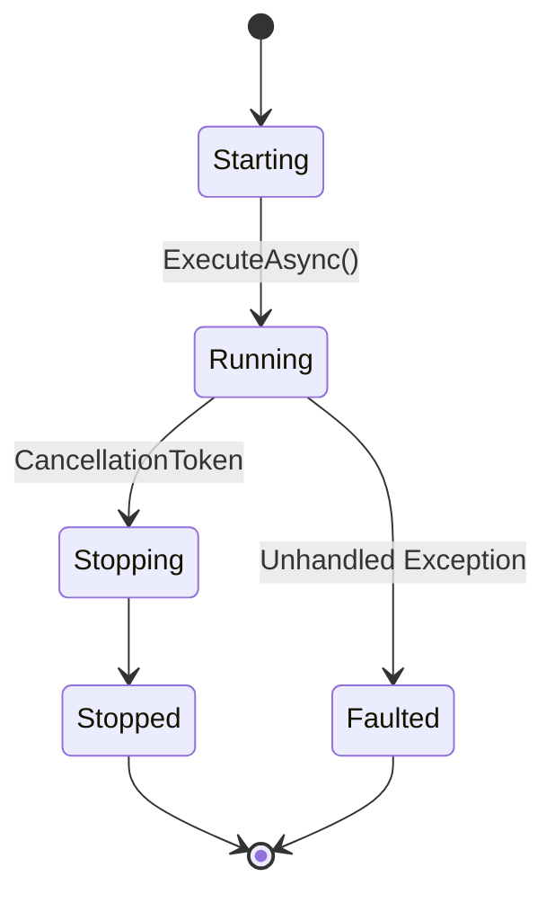

# Worker Patterns

**Last Updated**: 2025-11-13
**Purpose**: Background worker patterns for long-running tasks, batch processing, and message consumption.

---

## Table of Contents

1. [Overview](#overview)
2. [BackgroundService Pattern](#backgroundservice-pattern)
3. [AutoBatchWorker Pattern](#autobatchworker-pattern)
4. [Message Consumer Workers](#message-consumer-workers)
5. [CDC Worker Pattern](#cdc-worker-pattern)
6. [Health Monitoring](#health-monitoring)
7. [Best Practices](#best-practices)

---

## Overview

SmartPulse uses several worker patterns for background processing, all based on ASP.NET Core's `BackgroundService` infrastructure.

### Worker Lifecycle



### Worker Types

| Worker Type | Purpose | Example |
|-------------|---------|---------|
| **Message Consumer** | Process messages from queues/topics | Pulsar subscriber |
| **CDC Polling** | Poll database change tracking | ChangeTracker worker |
| **Batch Processor** | Aggregate and process batches | AutoBatchWorker |
| **Scheduled Task** | Execute on timer | Cleanup job |
| **Event Listener** | React to distributed events | Cache invalidation listener |

---

## BackgroundService Pattern

### Basic Structure

```csharp
public class BasicWorker : BackgroundService
{
    private readonly ILogger<BasicWorker> _logger;

    public BasicWorker(ILogger<BasicWorker> logger)
    {
        _logger = logger;
    }

    protected override async Task ExecuteAsync(CancellationToken stoppingToken)
    {
        _logger.LogInformation("Worker starting");

        try
        {
            while (!stoppingToken.IsCancellationRequested)
            {
                await DoWorkAsync(stoppingToken);
                await Task.Delay(TimeSpan.FromSeconds(5), stoppingToken);
            }
        }
        catch (OperationCanceledException) when (stoppingToken.IsCancellationRequested)
        {
            // Normal shutdown
            _logger.LogInformation("Worker stopping gracefully");
        }
        catch (Exception ex)
        {
            _logger.LogCritical(ex, "Worker crashed");
            throw;  // Crash application
        }
    }

    private async Task DoWorkAsync(CancellationToken cancellationToken)
    {
        // Work logic here
        _logger.LogDebug("Performing work iteration");
    }
}
```

### Registration

```csharp
// Program.cs
services.AddHostedService<BasicWorker>();
```

### Graceful Shutdown

**Pattern**: Respond to cancellation token for graceful shutdown.

```csharp
protected override async Task ExecuteAsync(CancellationToken stoppingToken)
{
    var currentBatch = new List<WorkItem>();

    while (!stoppingToken.IsCancellationRequested)
    {
        try
        {
            // Process with cancellation support
            await ProcessBatchAsync(currentBatch, stoppingToken);
        }
        catch (OperationCanceledException) when (stoppingToken.IsCancellationRequested)
        {
            // Graceful shutdown initiated
            _logger.LogInformation("Shutdown requested, finishing current batch");

            // Complete in-flight work
            if (currentBatch.Any())
            {
                await ProcessBatchAsync(currentBatch, CancellationToken.None);
            }

            break;
        }
    }
}
```

---

## AutoBatchWorker Pattern

### Architecture

**File**: `Electric.Core/Workers/AutoBatchWorker.cs`

```csharp
public abstract class AutoBatchWorker<T> : BackgroundService
{
    private readonly Channel<T> _channel;
    private readonly int _maxBatchSize;
    private readonly TimeSpan _maxWaitTime;

    public AutoBatchWorker(
        int maxBatchSize = 100,
        TimeSpan? maxWaitTime = null,
        int channelCapacity = 10000)
    {
        _maxBatchSize = maxBatchSize;
        _maxWaitTime = maxWaitTime ?? TimeSpan.FromMilliseconds(100);

        _channel = Channel.CreateBounded<T>(new BoundedChannelOptions(channelCapacity)
        {
            FullMode = BoundedChannelFullMode.Wait,
            SingleReader = true,
            SingleWriter = false
        });
    }

    public async Task EnqueueAsync(T item, CancellationToken cancellationToken = default)
    {
        await _channel.Writer.WriteAsync(item, cancellationToken);
    }

    protected override async Task ExecuteAsync(CancellationToken stoppingToken)
    {
        await foreach (var batch in ReadBatchesAsync(stoppingToken))
        {
            try
            {
                await ProcessBatchAsync(batch, stoppingToken);
            }
            catch (Exception ex)
            {
                _logger.LogError(ex, "Failed to process batch of {Count} items", batch.Count);
                // Continue processing next batch
            }
        }
    }

    private async IAsyncEnumerable<IReadOnlyCollection<T>> ReadBatchesAsync(
        [EnumeratorCancellation] CancellationToken cancellationToken)
    {
        var batch = new List<T>(_maxBatchSize);
        var timer = new CancellationTokenSource();

        while (!cancellationToken.IsCancellationRequested)
        {
            try
            {
                timer.CancelAfter(_maxWaitTime);

                // Collect items until batch full or timeout
                while (batch.Count < _maxBatchSize)
                {
                    if (!await _channel.Reader.WaitToReadAsync(timer.Token))
                        break;

                    if (_channel.Reader.TryRead(out var item))
                        batch.Add(item);
                }

                // Yield batch if not empty
                if (batch.Count > 0)
                {
                    yield return batch.AsReadOnly();
                    batch.Clear();
                }

                timer = new CancellationTokenSource();
            }
            catch (OperationCanceledException) when (timer.IsCancellationRequested)
            {
                // Timeout - yield partial batch
                if (batch.Count > 0)
                {
                    yield return batch.AsReadOnly();
                    batch.Clear();
                }

                timer = new CancellationTokenSource();
            }
        }

        // Final batch on shutdown
        if (batch.Count > 0)
            yield return batch.AsReadOnly();
    }

    protected abstract Task ProcessBatchAsync(
        IReadOnlyCollection<T> batch,
        CancellationToken cancellationToken);
}
```

### Example: Order Processing Worker

```csharp
public class OrderProcessingWorker : AutoBatchWorker<OrderEvent>
{
    private readonly IOrderRepository _repository;
    private readonly ILogger<OrderProcessingWorker> _logger;

    public OrderProcessingWorker(
        IOrderRepository repository,
        ILogger<OrderProcessingWorker> logger)
        : base(maxBatchSize: 100, maxWaitTime: TimeSpan.FromMilliseconds(200))
    {
        _repository = repository;
        _logger = logger;
    }

    protected override async Task ProcessBatchAsync(
        IReadOnlyCollection<OrderEvent> batch,
        CancellationToken cancellationToken)
    {
        var sw = Stopwatch.StartNew();

        try
        {
            // Bulk insert to database
            var orders = batch.Select(e => e.ToOrder()).ToList();
            await _repository.BulkInsertAsync(orders, cancellationToken);

            _logger.LogInformation(
                "Processed batch of {Count} orders in {ElapsedMs}ms",
                batch.Count, sw.ElapsedMilliseconds);
        }
        catch (Exception ex)
        {
            _logger.LogError(ex, "Failed to process order batch");

            // Retry individual items
            foreach (var order in batch)
            {
                try
                {
                    await _repository.InsertAsync(order.ToOrder(), cancellationToken);
                }
                catch (Exception itemEx)
                {
                    _logger.LogError(itemEx, "Failed to process order {OrderId}", order.OrderId);
                }
            }
        }
    }
}
```

### Configuration

```csharp
// Program.cs - Register worker
services.AddSingleton<OrderProcessingWorker>();
services.AddHostedService(sp => sp.GetRequiredService<OrderProcessingWorker>());

// Usage - Enqueue from API endpoint
public class OrderController : ControllerBase
{
    private readonly OrderProcessingWorker _worker;

    [HttpPost]
    public async Task<IActionResult> CreateOrder([FromBody] CreateOrderRequest request)
    {
        var orderEvent = new OrderEvent { ... };

        // Non-blocking enqueue
        await _worker.EnqueueAsync(orderEvent);

        return Accepted();  // Return immediately
    }
}
```

---

## Message Consumer Workers

### Pulsar Consumer Worker

**Pattern**: Continuously consume messages from Pulsar topic.

```csharp
public class ForecastEventConsumer : BackgroundService
{
    private readonly SmartpulsePulsarClient _pulsar;
    private readonly IForecastService _forecastService;
    private readonly ILogger<ForecastEventConsumer> _logger;

    public ForecastEventConsumer(
        SmartpulsePulsarClient pulsar,
        IForecastService forecastService,
        ILogger<ForecastEventConsumer> logger)
    {
        _pulsar = pulsar;
        _forecastService = forecastService;
        _logger = logger;
    }

    protected override async Task ExecuteAsync(CancellationToken stoppingToken)
    {
        _logger.LogInformation("Starting Pulsar consumer for forecast-events");

        try
        {
            await foreach (var (evt, message) in _pulsar.CreateTopicConsumerAsync<ForecastEvent>(
                topic: "forecast-events",
                subscriptionName: "forecast-processor",
                subscriptionType: SubscriptionType.Shared,
                messagePrefetchCount: 1000,
                cancellationToken: stoppingToken))
            {
                try
                {
                    await _forecastService.ProcessEventAsync(evt, stoppingToken);

                    _logger.LogDebug("Processed event {MessageId}", message.MessageId);
                }
                catch (Exception ex)
                {
                    _logger.LogError(ex, "Failed to process event {MessageId}", message.MessageId);
                    // Message not acknowledged - will be redelivered
                }
            }
        }
        catch (OperationCanceledException) when (stoppingToken.IsCancellationRequested)
        {
            _logger.LogInformation("Consumer stopping gracefully");
        }
        catch (Exception ex)
        {
            _logger.LogCritical(ex, "Consumer crashed");
            throw;
        }
    }
}
```

### Parallel Message Processing

**Pattern**: Process messages in parallel using ActionBlock.

```csharp
public class ParallelForecastConsumer : BackgroundService
{
    private readonly SmartpulsePulsarClient _pulsar;
    private readonly IForecastService _forecastService;

    protected override async Task ExecuteAsync(CancellationToken stoppingToken)
    {
        var options = new ExecutionDataflowBlockOptions
        {
            MaxDegreeOfParallelism = Environment.ProcessorCount,
            BoundedCapacity = 1000,  // Backpressure
            CancellationToken = stoppingToken
        };

        var block = new ActionBlock<(ForecastEvent evt, IMessage<ReadOnlySequence<byte>> msg)>(
            async item =>
            {
                var (evt, msg) = item;
                await _forecastService.ProcessEventAsync(evt, stoppingToken);
            },
            options);

        await foreach (var item in _pulsar.CreateTopicConsumerAsync<ForecastEvent>(
            topic: "forecast-events",
            subscriptionName: "forecast-parallel-processor",
            subscriptionType: SubscriptionType.Shared,
            messagePrefetchCount: 10000,
            cancellationToken: stoppingToken))
        {
            await block.SendAsync(item, stoppingToken);
        }

        block.Complete();
        await block.Completion;
    }
}
```

---

## CDC Worker Pattern

### Change Tracking Worker

**Pattern**: Poll database change tracking and propagate changes.

```csharp
public class ForecastCdcWorker : BackgroundService
{
    private readonly ChangeTracker _changeTracker;
    private readonly DistributedDataManager _dataManager;
    private readonly ILogger<ForecastCdcWorker> _logger;

    protected override async Task ExecuteAsync(CancellationToken stoppingToken)
    {
        _logger.LogInformation("Starting CDC worker for Forecasts table");

        try
        {
            await foreach (var changeBatch in _changeTracker.TrackChangesAsync(
                tableName: "Forecasts",
                selectColumns: "Id, Price, ValidFrom, ValidTo, Status",
                extraFilter: "CT.SYS_CHANGE_OPERATION IN ('I', 'U')",  // Inserts and updates only
                awaitTimeBetweenQueriesAction: CalculateBackoff,
                cancellationToken: stoppingToken))
            {
                try
                {
                    await ProcessChangeBatchAsync(changeBatch, stoppingToken);

                    _logger.LogDebug("Processed {Count} changes", changeBatch.Count);
                }
                catch (Exception ex)
                {
                    _logger.LogError(ex, "Failed to process change batch");
                }
            }
        }
        catch (OperationCanceledException) when (stoppingToken.IsCancellationRequested)
        {
            _logger.LogInformation("CDC worker stopping gracefully");
        }
        catch (Exception ex)
        {
            _logger.LogCritical(ex, "CDC worker crashed");
            throw;
        }
    }

    private async Task ProcessChangeBatchAsync(
        List<ChangeItem> changes,
        CancellationToken cancellationToken)
    {
        foreach (var change in changes)
        {
            // Build JSON Patch from change
            var patch = BuildPatchFromChange(change);

            // Publish to distributed data manager
            await _dataManager.PublishChangeAsync(
                partitionKey: "app1",
                section: "forecasts",
                dataKey: change.PkColumns["Id"].ToString(),
                versionId: (int)change.VersionId,
                patchItems: patch);
        }
    }

    private TimeSpan CalculateBackoff(int emptyCounter)
    {
        if (emptyCounter <= 5)
            return TimeSpan.FromMilliseconds(50);   // Fast polling

        if (emptyCounter <= 20)
            return TimeSpan.FromMilliseconds(200);  // Moderate

        if (emptyCounter <= 100)
            return TimeSpan.FromSeconds(1);         // Slow

        return TimeSpan.FromSeconds(5);             // Very slow
    }
}
```

### CDC with AutoBatchWorker

**Pattern**: Combine CDC polling with batch processing.

```csharp
public class ForecastCdcBatchWorker : BackgroundService
{
    private readonly ChangeTracker _changeTracker;
    private readonly AutoBatchWorker<ChangeItem> _batchWorker;

    protected override async Task ExecuteAsync(CancellationToken stoppingToken)
    {
        // Start batch processor
        _ = Task.Run(() => _batchWorker.ExecuteAsync(stoppingToken), stoppingToken);

        // Feed changes into batch worker
        await foreach (var changeBatch in _changeTracker.TrackChangesAsync(
            tableName: "Forecasts",
            cancellationToken: stoppingToken))
        {
            foreach (var change in changeBatch)
            {
                await _batchWorker.EnqueueAsync(change, stoppingToken);
            }
        }
    }
}
```

---

## Health Monitoring

### Worker Health Checks

**Pattern**: Implement health checks for background workers.

```csharp
public class WorkerHealthCheck : IHealthCheck
{
    private readonly ForecastEventConsumer _consumer;

    public async Task<HealthCheckResult> CheckHealthAsync(
        HealthCheckContext context,
        CancellationToken cancellationToken = default)
    {
        if (!_consumer.IsRunning)
        {
            return HealthCheckResult.Unhealthy("Consumer is not running");
        }

        var lastProcessedTime = _consumer.LastProcessedTime;
        var timeSinceLastProcess = DateTime.UtcNow - lastProcessedTime;

        if (timeSinceLastProcess > TimeSpan.FromMinutes(5))
        {
            return HealthCheckResult.Degraded(
                $"No messages processed in {timeSinceLastProcess.TotalMinutes:F1} minutes");
        }

        return HealthCheckResult.Healthy("Consumer is running normally");
    }
}

// Registration
services.AddHealthChecks()
    .AddCheck<WorkerHealthCheck>("forecast-consumer");
```

### Heartbeat Pattern

**Pattern**: Emit heartbeat signals for monitoring.

```csharp
public abstract class HeartbeatWorker : BackgroundService
{
    private DateTime _lastHeartbeat = DateTime.UtcNow;
    private readonly TimeSpan _heartbeatInterval = TimeSpan.FromSeconds(30);

    protected override async Task ExecuteAsync(CancellationToken stoppingToken)
    {
        // Start heartbeat timer
        _ = Task.Run(() => EmitHeartbeatsAsync(stoppingToken), stoppingToken);

        // Main work loop
        await DoWorkAsync(stoppingToken);
    }

    private async Task EmitHeartbeatsAsync(CancellationToken stoppingToken)
    {
        while (!stoppingToken.IsCancellationRequested)
        {
            _lastHeartbeat = DateTime.UtcNow;

            // Emit heartbeat (e.g., to monitoring system)
            await EmitHeartbeatAsync();

            await Task.Delay(_heartbeatInterval, stoppingToken);
        }
    }

    protected abstract Task DoWorkAsync(CancellationToken stoppingToken);
    protected abstract Task EmitHeartbeatAsync();

    public DateTime LastHeartbeat => _lastHeartbeat;
}
```

---

## Best Practices

### 1. Graceful Shutdown

**Always respect cancellation token**:

```csharp
protected override async Task ExecuteAsync(CancellationToken stoppingToken)
{
    while (!stoppingToken.IsCancellationRequested)
    {
        try
        {
            await DoWorkAsync(stoppingToken);
        }
        catch (OperationCanceledException) when (stoppingToken.IsCancellationRequested)
        {
            // Normal shutdown - complete in-flight work
            await CompleteInFlightWorkAsync();
            break;
        }
    }
}
```

### 2. Error Handling

**Don't crash on transient errors**:

```csharp
protected override async Task ExecuteAsync(CancellationToken stoppingToken)
{
    int consecutiveErrors = 0;
    const int maxConsecutiveErrors = 10;

    while (!stoppingToken.IsCancellationRequested)
    {
        try
        {
            await DoWorkAsync(stoppingToken);
            consecutiveErrors = 0;  // Reset on success
        }
        catch (Exception ex) when (!stoppingToken.IsCancellationRequested)
        {
            consecutiveErrors++;
            _logger.LogError(ex, "Worker error (consecutive: {Count})", consecutiveErrors);

            if (consecutiveErrors >= maxConsecutiveErrors)
            {
                _logger.LogCritical("Max consecutive errors reached, stopping worker");
                throw;  // Crash application
            }

            // Exponential backoff
            await Task.Delay(TimeSpan.FromSeconds(Math.Pow(2, consecutiveErrors)), stoppingToken);
        }
    }
}
```

### 3. Resource Management

**Dispose resources properly**:

```csharp
public class ResourceAwareWorker : BackgroundService
{
    private readonly IDisposable _resource;

    protected override async Task ExecuteAsync(CancellationToken stoppingToken)
    {
        try
        {
            await DoWorkAsync(stoppingToken);
        }
        finally
        {
            _resource?.Dispose();
        }
    }

    public override void Dispose()
    {
        _resource?.Dispose();
        base.Dispose();
    }
}
```

### 4. Metrics Collection

**Track worker performance**:

```csharp
public class MetricsWorker : BackgroundService
{
    private readonly Counter<long> _processedCounter;
    private readonly Histogram<double> _processingTimeHistogram;

    protected override async Task ExecuteAsync(CancellationToken stoppingToken)
    {
        while (!stoppingToken.IsCancellationRequested)
        {
            var sw = Stopwatch.StartNew();

            await DoWorkAsync(stoppingToken);

            sw.Stop();

            _processedCounter.Add(1);
            _processingTimeHistogram.Record(sw.ElapsedMilliseconds);
        }
    }
}
```

### 5. Backpressure Handling

**Use bounded channels**:

```csharp
var channel = Channel.CreateBounded<WorkItem>(new BoundedChannelOptions(10000)
{
    FullMode = BoundedChannelFullMode.Wait  // Block producer when full
});

// Producer
public async Task EnqueueAsync(WorkItem item)
{
    // Blocks if channel is full (backpressure)
    await channel.Writer.WriteAsync(item);
}
```

### 6. Worker Configuration

**Externalize configuration**:

```csharp
public class WorkerOptions
{
    public int MaxBatchSize { get; set; } = 100;
    public int MaxWaitTimeMs { get; set; } = 200;
    public int ChannelCapacity { get; set; } = 10000;
    public int MaxDegreeOfParallelism { get; set; } = 4;
}

// Configuration
services.Configure<WorkerOptions>(configuration.GetSection("Worker"));

// Usage
public class ConfigurableWorker : AutoBatchWorker<WorkItem>
{
    public ConfigurableWorker(IOptions<WorkerOptions> options)
        : base(
            maxBatchSize: options.Value.MaxBatchSize,
            maxWaitTime: TimeSpan.FromMilliseconds(options.Value.MaxWaitTimeMs),
            channelCapacity: options.Value.ChannelCapacity)
    {
    }
}
```

---

## Related Documentation

- [Batch Processing Patterns](./batch_processing.md)
- [CDC Infrastructure](../data/cdc.md)
- [Pulsar Integration](../integration/pulsar.md)
- [Health Checks Guide](../guides/health_checks.md)

---

**Last Updated**: 2025-11-13
**Version**: 1.0
