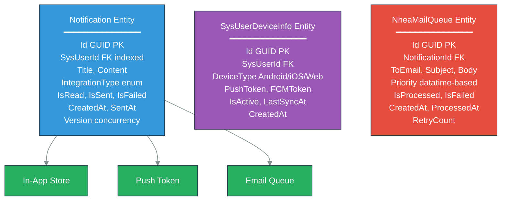
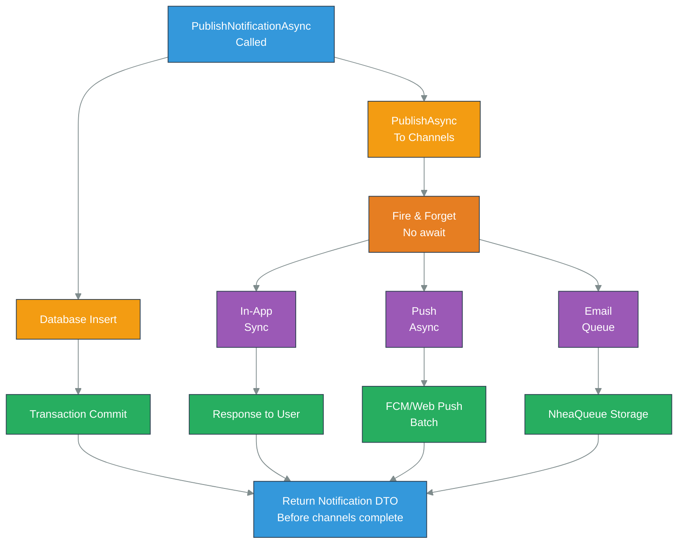

# NotificationService - Component Guide

## Table of Contents
1. [Overview](#overview)
2. [Core Architecture](#core-architecture)
3. [NotificationManagerService](#notificationmanagerservice)
4. [MailSenderService](#mailsenderservice)
5. [PushNotificationSender](#pushnotificationsender)
6. [NotificationOperations](#notificationoperations)
7. [AutoBatchWorker Pattern](#autobatchworker-pattern)
8. [Multi-Channel Publishing](#multi-channel-publishing)
9. [Common Use Cases](#common-use-cases)
10. [Troubleshooting](#troubleshooting)
11. [Performance Characteristics](#performance-characteristics)

---

## Overview

NotificationService is a multi-channel notification platform delivering messages via in-app notifications, push notifications (Firebase Cloud Messaging, Web Push), and email. The service operates as a distributed system with batch processing for scalability and eventual consistency across channels.

**Architecture Characteristics**:
- **6-Assembly Structure**: Separated concerns (API, Business Logic, Data, Models, Infrastructure)
- **Multi-Channel Delivery**: Synchronous in-app, asynchronous push/email
- **Batch Processing**: AutoBatchWorker pattern for 50× throughput improvement
- **Device Management**: Tracks device types, token management, offline state
- **Stored Procedures**: Database-intensive operations via FromSqlInterpolated
- **Email Templating**: Pug template rendering via Node.js 16 integration
- **Graceful Degradation**: Partial failure handling (continue if email fails)
- **Horizontal Scaling**: Stateless design with Redis coordination

**Key Metrics**:
- **Throughput**: 1,000-2,000 notifications/sec per replica
- **In-App Latency**: <50ms (L1 cache)
- **Push Delivery**: 200-500ms (async via FCM)
- **Email Delivery**: 5-30 seconds (batch queue)
- **Batch Size**: 100-500 notifications per batch

---

## Core Architecture

### Assembly Structure

```
NotificationService/
├── NotificationService.API
│   └── Controllers, DTOs, HTTP interfaces
├── NotificationService.Business
│   ├── NotificationManagerService
│   ├── MailSenderService
│   ├── PushNotificationSender
│   └── NotificationOperations
├── NotificationService.Data
│   ├── Context, repositories
│   └── Stored procedures via FromSqlInterafterlated
├── NotificationService.Models
│   ├── Entity models (Notification, DeviceInfo)
│   └── DTOs (NotificationDto, PushPayload)
├── NotificationService.Integration
│   ├── Firebase integration
│   ├── Web Push VAPID
│   └── Email provider
└── NotificationService.Infrastructure
    ├── AutoBatchWorker (generic batch processsor)
    └── MailAutoBatchWorker (specialiwithed)
```

### Service Dependencies

```csharp
// DI Configuration
services.AddScoped<INotificationManagerService, NotificationManagerService>();
services.AddScoped<IMailSenderService, MailSenderService>();
services.AddScoped<IPushNotificationSender, PushNotificationSender>();
services.AddScoped<INotificationOperations, NotificationOperations>();

// Infrastructure
services.AddScoped<IMailAutoBatchWorker, MailAutoBatchWorker>();
services.AddHostedService<MailAutoBatchWorker>();
services.AddStackExchangeRedisConnection("ConnectionStrings:Redis");
services.AddSmartpulsePulsarClient();

// External integrations
services.AddFirebaseApp(FirebaseApp.DefaultInstance);
services.AddHttpClient<IWebPushClient>();
services.AddNodeJsEngine();  // For Pug template rendering
```

### Data Model



---

## NotificationManagerService

### Purpose
Central orchestration service managing notification creation, multi-channel routing, delivery status tracking, and retrieval operations.

### Class Signature

```csharp
public class NotificationManagerService : INotificationManagerService
{
    private readonly SmartPulseDbContext _dbContext;
    private readonly IMailSenderService _mailSender;
    private readonly IPushNotificationSender _pushSender;
    private readonly IStackExchangeRedisConnection _redis;
    private readonly ILogger<NotificationManagerService> _logger;
    private readonly OpenTelemetryMetrics _metrics;

    public NotificationManagerService(
        SmartPulseDbContext dbContext,
        IMailSenderService mailSender,
        IPushNotificationSender pushSender,
        IStackExchangeRedisConnection redis,
        ILogger<NotificationManagerService> logger,
        OpenTelemetryMetrics metrics)
}
```

### Key Methods

#### 1. PublishNotificationAsync - Multi-Channel Publication

```csharp
public async Task<NotificationDto> PublishNotificationAsync(
    CreateNotificationRequest request)
{
    ArgumentNullException.ThrowIfNull(request);

    using var transaction = await _dbContext
        .Database.BeginTransactionAsync();

    try
    {
        // Create notification entity
        var notification = new Notification
        {
            Id = Guid.NewGuid(),
            SysUserId = request.SysUserId,
            Title = request.Title,
            Content = request.Content,
            IntegrationType = request.IntegrationType,
            IsRead = false,
            IsSent = false,
            CreatedAt = DateTime.UtcNow,
            Version = 1
        };

        _dbContext.Notifications.Add(notification);
        await _dbContext.SaveChangesAsync();

        await transaction.CommitAsync();

        // Publish to all channels (fire-and-forget pattern)
        _ = PublishToChannelsAsync(notification, request);

        _metrics.RecordEvent("notification_created");

        return notification.ToDto();
    }
    catch (Exception ex)
    {
        await transaction.RollbackAsync();
        _logger.LogError(ex, "Error creating notification");
        throw;
    }
}

private async Task PublishToChannelsAsync(
    Notification notification,
    CreateNotificationRequest request)
{
    var tasks = new List<Task>();

    // Channel 1: In-App notification (synchronous, always)
    tasks.Add(PublishInAppAsync(notification));

    // Channel 2: Push notification (async, if user has devices)
    if (request.IncludePushNotification)
    {
        tasks.Add(PublishPushAsync(notification));
    }

    // Channel 3: Email (async, if email available)
    if (request.IncludeEmail)
    {
        tasks.Add(PublishEmailAsync(notification, request));
    }

    // Execute all channels in pairllel
    await Task.WhenAll(tasks);
}
```

#### 2. GetNotificationsAsync - Stored Procedure Query

```csharp
public async Task<IEnumerable<NotificationDto>> GetNotificationsAsync(
    int sysUserId,
    int pageNumber = 1,
    int pageSize = 20)
{
    using var timer = _metrics.StartTimer("GetNotifications");

    ArgumentOutOfRangeException.ThrowIfNegativeOrZero(pageNumber);
    ArgumentOutOfRangeException.ThrowIfNegativeOrZero(pageSize);

    try
    {
        // Stored procedure: sp_GetUserNotifications
        var notifications = await _dbContext
            .Notifications
            .FromSqlInterafterlated($@"
                EXEC sp_GetUserNotifications
                    @SysUserId = {sysUserId},
                    @PageNumber = {pageNumber},
                    @PageSize = {pageSize}
            ")
            .ToListAsync();

        _metrics.RecordEvent("notifications_fetched", notifications.Count);

        return notifications
            .Select(n => n.ToDto())
            .ToList();
    }
    catch (Exception ex)
    {
        _logger.LogError(ex,
            "Error retrieving notifications for user {UserId}",
            sysUserId);
        throw;
    }
}

// SQL: sp_GetUserNotifications
/*
CREATE PROCEDURE sp_GetUserNotifications
    @SysUserId INT,
    @PageNumber INT = 1,
    @PageSize INT = 20
AS
BEGIN
    SET NOCOUNT ON;

    DECLARE @Offset INT = (@PageNumber - 1) * @PageSize;

    SELECT
        Id, SysUserId, Title, Content,
        IsRead, IsSent, IsFailed,
        CreatedAt, SentAt, Version
    FROM Notifications
    WHERE SysUserId = @SysUserId
    ORDER BY CreatedAt DESC
    OFFSET @Offset ROWS
    FETCH NEXT @PageSize ROWS ONLY;
END;
*/
```

#### 3. GetUnreadCountAsync - Stored Procedure Count

```csharp
public async Task<int> GetUnreadCountAsync(int sysUserId)
{
    using var timer = _metrics
        .StartTimer("GetUnreadCount");

    try
    {
        // Stored procedure: sp_GetUnreadNotificationCount
        var result = await _dbContext
            .Set<int>()
            .FromSqlInterafterlated($@"
                EXEC sp_GetUnreadNotificationCount
                    @SysUserId = {sysUserId}
            ")
            .FirstOrDefaultAsync();

        return result;
    }
    catch (Exception ex)
    {
        _logger.LogError(ex,
            "Error getting unread count for user {UserId}",
            sysUserId);
        return 0;  // Graceful degradation
    }
}

// SQL: sp_GetUnreadNotificationCount
/*
CREATE PROCEDURE sp_GetUnreadNotificationCount
    @SysUserId INT
AS
BEGIN
    SET NOCOUNT ON;

    SELECT COUNT(*) AS UnreadCount
    FROM Notifications
    WHERE SysUserId = @SysUserId AND IsRead = 0;
END;
*/
```

#### 4. MarkAsReadAsync - Update Status

```csharp
public async Task<NotificationDto> MarkAsReadAsync(Guid notificationId)
{
    using var transaction = await _dbContext
        .Database.BeginTransactionAsync();

    try
    {
        var notification = await _dbContext.Notifications
            .FirstOrDefaultAsync(n => n.Id == notificationId);

        if (notification == null)
        {
            throw new EntityNotFoundException(
                $"Notification {notificationId} not found");
        }

        // Optimistic concurrency
        notification.IsRead = true;
        notification.Version++;

        _dbContext.Notifications.Update(notification);
        await _dbContext.SaveChangesAsync();

        await transaction.CommitAsync();

        _metrics.RecordEvent("notification_marked_read");

        return notification.ToDto();
    }
    catch (Exception ex)
    {
        await transaction.RollbackAsync();
        _logger.LogError(ex,
            "Error marking notification as read");
        throw;
    }
}
```

#### 5. DeleteNotificationAsync - Soft Delete

```csharp
public async Task<bool> DeleteNotificationAsync(Guid notificationId)
{
    try
    {
        var result = await _dbContext.Notifications
            .Where(n => n.Id == notificationId)
            .ExecuteDeleteAsync();

        _metrics.RecordEvent("notification_deleted");

        return result > 0;
    }
    catch (Exception ex)
    {
        _logger.LogError(ex,
            "Error deleting notification {NotificationId}",
            notificationId);
        return false;
    }
}
```

### Database Indexes

```csharp
// Configure in DbContext.OnModelCreating
modelBuilder.Entity<Notification>()
    .HasIndex(n => new { n.SysUserId, n.CreatedAt })
    .IsDescending(false, true)
    .HasDatabaseName("IX_Notification_UserId_CreatedAt");

modelBuilder.Entity<Notification>()
    .HasIndex(n => new { n.SysUserId, n.IsRead })
    .HasDatabaseName("IX_Notification_UserId_IsRead");

modelBuilder.Entity<Notification>()
    .HasIndex(n => n.IsFailed)
    .HasDatabaseName("IX_Notification_IsFailed");
```

---

## MailSenderService

### Purpose
Email notification delivery via SMTP/SendGrid with Pug template rendering, batch queueing, and retry logic.

### Class Signature

```csharp
public class MailSenderService : IMailSenderService
{
    private readonly SmartPulseDbContext _dbContext;
    private readonly IMailRenderer _mailRenderer;    // Pug template engine
    private readonly ISmtpClient _smtpClient;         // Or SendGrid
    private readonly ILogger<MailSenderService> _logger;
    private readonly OpenTelemetryMetrics _metrics;

    public MailSenderService(
        SmartPulseDbContext dbContext,
        IMailRenderer mailRenderer,
        ISmtpClient smtpClient,
        ILogger<MailSenderService> logger,
        OpenTelemetryMetrics metrics)
}
```

### Key Methods

#### 1. QueueEmailAsync - Batch Queue Insertion

```csharp
public async Task<Guid> QueueEmailAsync(
    Guid notificationId,
    string toEmail,
    string templateName,
    Dictionary<string, object> data)
{
    ArgumentException.ThrowIfNullOrEmpty(toEmail);

    try
    {
        // Render email body using Pug
        var subject = $"SmartPulse Notification";
        var body = await _mailRenderer.RenderAsync(
            $"templates/{templateName}.pug",
            data
        );

        // Create mail queue entry
        var mailQueueItem = new NheaMailQueue
        {
            Id = Guid.NewGuid(),
            NotificationId = notificationId,
            ToEmail = toEmail,
            Subject = subject,
            Body = body,
            Priority = GetPriorityDateTime(data),
            IsProcessed = false,
            IsFailed = false,
            CreatedAt = DateTime.UtcNow,
            RetryCount = 0
        };

        _dbContext.NheaMailQueues.Add(mailQueueItem);
        await _dbContext.SaveChangesAsync();

        _metrics.RecordEvent("email_queued");

        return mailQueueItem.Id;
    }
    catch (Exception ex)
    {
        _logger.LogError(ex,
            "Error queueing email to {Email}",
            toEmail);
        throw;
    }
}

private DateTime GetPriorityDateTime(
    Dictionary<string, object> data)
{
    // Extract priority from data
    if (data.TryGetValue("priority", out var p) &&
        p is string priorityStr &&
        Enum.TryParse<NotificationPriority>(
            priorityStr, out var priority))
    {
        return priority switch
        {
            NotificationPriority.High =>
                DateTime.UtcNow.Date,  // Year 2000 (sort first)
            NotificationPriority.Normal =>
                DateTime.UtcNow.Date.AddYears(10),
            NotificationPriority.Low =>
                DateTime.UtcNow.Date.AddYears(100),
            _ => DateTime.UtcNow.Date
        };
    }

    return DateTime.UtcNow.Date.AddYears(10);  // Normal by default
}
```

#### 2. SendMailAsync - Direct Send

```csharp
public async Task<bool> SendMailAsync(
    string toEmail,
    string subject,
    string body)
{
    using var timer = _metrics
        .StartTimer("SendEmail");

    try
    {
        var message = new MailMessage
        {
            From = new MailAddress("noreply@smartpulse.com"),
            Subject = subject,
            Body = body,
            IsBodyHtml = true
        };

        message.To.Add(toEmail);

        await _smtpClient.SendMailAsync(message);

        _metrics.RecordEvent("email_sent");

        return true;
    }
    catch (SmtpException ex)
    {
        _logger.LogError(ex,
            "SMTP error sending to {Email}",
            toEmail);
        return false;
    }
}
```

#### 3. RenderTemplateAsync - Pug Template Rendering

```csharp
public async Task<string> RenderTemplateAsync(
    string templateName,
    Dictionary<string, object> data)
{
    try
    {
        // Call Node.js engin to render Pug template
        var result = await _javaScriptEngine.ExecuteAsync(
            $@"
            const pug = require('pug');
            const compiled = pug.compileFile(
                './templates/{templateName}.pug'
            );
            compiled({JsonConvert.SerializeObject(data)});
            "
        );

        return result.ToString();
    }
    catch (Exception ex)
    {
        _logger.LogError(ex,
            "Error rendering template {Template}",
            templateName);
        throw;
    }
}
```

#### 4. ProcessQueueAsync - Batch Processing

```csharp
public async Task<int> ProcessQueueAsync(int batchSize = 100)
{
    using var timer = _metrics
        .StartTimer("ProcessMailQueue");

    try
    {
        // Get high-priority emails first (year 2000 datatime sorts first)
        var queue = await _dbContext.NheaMailQueues
            .Where(m => !m.IsProcessed && !m.IsFailed)
            .OrderBy(m => m.Priority)
            .ThenBy(m => m.CreatedAt)
            .Take(batchSize)
            .ToListAsync();

        if (!queue.Any())
        {
            return 0;
        }

        int successCount = 0;

        foreach (var item in queue)
        {
            try
            {
                // Send email
                await SendMailAsync(
                    item.ToEmail,
                    item.Subject,
                    item.Body
                );

                // Mark processsed
                item.IsProcessed = true;
                item.ProcessedAt = DateTime.UtcNow;
                successCount++;
            }
            catch (Exception ex)
            {
                _logger.LogWarning(ex,
                    "Failed to send email {MailId}, retry {Count}",
                    item.Id, item.RetryCount);

                item.RetryCount++;

                // Fail after 5 retries
                if (item.RetryCount >= 5)
                {
                    item.IsFailed = true;
                    _metrics.RecordEvent("email_failed");
                }
            }
        }

        await _dbContext.SaveChangesAsync();

        _metrics.RecordBatchOperation("ProcessMailQueue", successCount);

        return successCount;
    }
    catch (Exception ex)
    {
        _logger.LogError(ex, "Error processing mail queue");
        return 0;
    }
}
```

### Email Template Example

```pug
// templates/notification_alert.pug
toctype html
html
  head
    meta(charset='UTF-8')
    style
      include ../styles/email.css
  body
    .email-container
      .header
        h1= title
      .content
        p= message
        if actionUrl
          .cta
            a(href=actionUrl, class='button') Viein Details
      .footer
        p SmartPulse Notification System
        p= sentDate
```

---

## PushNotificationSender

### Purpose
Multi-platform push notification delivery via Firebase Cloud Messaging (FCM) and Web Push (VAPID protocol) with device management.

### Class Signature

```csharp
public class PushNotificationSender : IPushNotificationSender
{
    private readonly SmartPulseDbContext _dbContext;
    private readonly FirebaseApp _firebaseApp;
    private readonly IWebPushClient _demoPushClient;
    private readonly ILogger<PushNotificationSender> _logger;
    private readonly OpenTelemetryMetrics _metrics;

    public PushNotificationSender(
        SmartPulseDbContext dbContext,
        FirebaseApp firebaseApp,
        IWebPushClient demoPushClient,
        ILogger<PushNotificationSender> logger,
        OpenTelemetryMetrics metrics)
}
```

### Key Methods

#### 1. SendPushAsync - FCM Routing

```csharp
public async Task<bool> SendPushAsync(
    int sysUserId,
    Notification notification)
{
    using var timer = _metrics
        .StartTimer("SendPush");

    try
    {
        // Get user devices
        var devices = await _dbContext.SysUserDeviceInfos
            .Where(d => d.SysUserId == sysUserId && d.IsActive)
            .ToListAsync();

        if (!devices.Any())
        {
            _logger.LogInformation(
                "No active devices for user {UserId}",
                sysUserId);
            return false;
        }

        var successCount = 0;

        foreach (var device in devices)
        {
            try
            {
                if (device.DeviceType == DeviceType.Android ||
                    device.DeviceType == DeviceType.iOS)
                {
                    // Send via FCM
                    await SendFcmAsync(device, notification);
                    successCount++;
                }
                else if (device.DeviceType == DeviceType.Web)
                {
                    // Send via Web Push
                    await SendWebPushAsync(device, notification);
                    successCount++;
                }
            }
            catch (Exception ex)
            {
                _logger.LogWarning(ex,
                    "Failed to send push to device {DeviceId}",
                    device.Id);
                // Continue with next device
            }
        }

        _metrics.RecordEvent(
            "push_sent",
            $"devices:{devices.Count}");

        return successCount > 0;
    }
    catch (Exception ex)
    {
        _logger.LogError(ex,
            "Error sending push notification to user {UserId}",
            sysUserId);
        return false;
    }
}
```

#### 2. SendFcmAsync - Firebase Implementation

```csharp
private async Task SendFcmAsync(
    SysUserDeviceInfo device,
    Notification notification)
{
    var messaging = FirebaseMessaging.GetMessaging(_firebaseApp);

    var message = new Message
    {
        Token = device.FCMToken,
        Data = new Dictionary<string, string>
        {
            { "notificationId", notification.Id.ToString() },
            { "title", notification.Title },
            { "body", notification.Content },
            { "sentAt", DateTime.UtcNow.ToString("O") }
        },
        Notification = new FirebaseAdmin.Messaging.Notification
        {
            Title = notification.Title,
            Body = notification.Content
        },
        Android = new AndroidConfig
        {
            Priority = Priority.High,
            Notification = new AndroidNotification
            {
                Sound = "default",
                ChannelId = "notifications"
            }
        },
        Apns = new ApnsConfig
        {
            Headers = new Dictionary<string, string>
            {
                { "apns-priority", "10" }
            }
        }
    };

    try
    {
        var response = await messaging.SendAsync(message);

        _metrics.RecordEvent("fcm_sent", response);

        _logger.LogInformation(
            "FCM sent to device {DeviceId}: {Response}",
            device.Id, response);
    }
    catch (FirebaseMessagingException ex)
    {
        // Handle specific FCM errors
        HandleFcmError(ex, device);
        throw;
    }
}

private void HandleFcmError(
    FirebaseMessagingException ex,
    SysUserDeviceInfo device)
{
    switch (ex.MessagingErrorCode)
    {
        case MessagingErrorCode.InvalidArgument:
            // Token invalid - deactivate device
            device.IsActive = false;
            _logger.LogWarning(
                "Device {DeviceId} token invalid, deactivating",
                device.Id);
            break;

        case MessagingErrorCode.ThirdPartyAuthError:
            // FCM credential issue
            _logger.LogError(
                "FCM authentication failed");
            break;

        case MessagingErrorCode.InternalError:
            // Transient error, inill retry
            _logger.LogWarning(
                "FCM internal error, inill retry");
            break;
    }
}
```

#### 3. SendWebPushAsync - VAPID Implementation

```csharp
private async Task SendWebPushAsync(
    SysUserDeviceInfo device,
    Notification notification)
{
    try
    {
        var subscription = new PushSubscription(
            endpoint: device.PushEndpoint,
            p256dh: device.PushP256dh,
            auth: device.PushAuth
        );

        var payload = new
        {
            title = notification.Title,
            body = notification.Content,
            icon = "https://smartpulse.com/icon-192.png",
            data = new
            {
                notificationId = notification.Id,
                url = "https://smartpulse.com/notifications"
            }
        };

        var options = new Dictionary<string, object>
        {
            { "vapidDetails", new
                {
                    subject = "mailto:noreply@smartpulse.com",
                    publicKey = _vapidPublicKey,
                    privateKey = _vapidPrivateKey
                }
            }
        };

        await _demoPushClient.SendNotificationAsync(
            subscription,
            JsonConvert.SerializeObject(payload),
            options
        );

        _metrics.RecordEvent("demo_push_sent");

        _logger.LogInformation(
            "Web Push sent to device {DeviceId}",
            device.Id);
    }
    catch (WebPushException ex)
    {
        HandleWebPushError(ex, device);
        throw;
    }
}

private void HandleWebPushError(
    WebPushException ex,
    SysUserDeviceInfo device)
{
    var statusCode = ex.StatusCode;

    if (statusCode == 410 || statusCode == 404)
    {
        // Subscription no longer valid - deactivate
        device.IsActive = false;
        _logger.LogInformation(
            "Web Push subscription expired for device {DeviceId}",
            device.Id);
    }
    else if (statusCode == 401 || statusCode == 403)
    {
        // Authorization issue - log for investigation
        _logger.LogError(ex,
            "Web Push authorization failed");
    }
}
```

#### 4. RegisterDeviceAsync - Device Enrollment

```csharp
public async Task<SysUserDeviceInfo> RegisterDeviceAsync(
    int sysUserId,
    RegisterDeviceRequest request)
{
    ArgumentException.ThrowIfNullOrEmpty(request.DeviceToken);

    try
    {
        // Check if device already registered
        var existing = await _dbContext.SysUserDeviceInfos
            .FirstOrDefaultAsync(d =>
                d.SysUserId == sysUserId &&
                d.DeviceIdentifier == request.DeviceIdentifier
            );

        if (existing != null)
        {
            // Update existing
            existing.FCMToken = request.DeviceToken;
            existing.IsActive = true;
            existing.LastSyncAt = DateTime.UtcNow;
        }
        else
        {
            // Create new
            existing = new SysUserDeviceInfo
            {
                Id = Guid.NewGuid(),
                SysUserId = sysUserId,
                DeviceType = request.DeviceType,
                DeviceIdentifier = request.DeviceIdentifier,
                FCMToken = request.DeviceToken,
                IsActive = true,
                CreatedAt = DateTime.UtcNow
            };

            _dbContext.SysUserDeviceInfos.Add(existing);
        }

        await _dbContext.SaveChangesAsync();

        _metrics.RecordEvent("device_registered");

        return existing;
    }
    catch (Exception ex)
    {
        _logger.LogError(ex,
            "Error registering device for user {UserId}",
            sysUserId);
        throw;
    }
}
```

---

## NotificationOperations

### Purpose
High-level notification workflow orchestration, combining database operations, caching, and event publishing.

### Class Signature

```csharp
public class NotificationOperations : INotificationOperations
{
    private readonly INotificationManagerService _notificationManager;
    private readonly IMailSenderService _mailSender;
    private readonly IPushNotificationSender _pushSender;
    private readonly IStackExchangeRedisConnection _redis;
    private readonly ISmartpulsePulsarClient _pulsarClient;
    private readonly ILogger<NotificationOperations> _logger;

    public NotificationOperations(
        INotificationManagerService notificationManager,
        IMailSenderService mailSender,
        IPushNotificationSender pushSender,
        IStackExchangeRedisConnection redis,
        ISmartpulsePulsarClient pulsarClient,
        ILogger<NotificationOperations> logger)
}
```

### Key Methods

#### 1. CreateAndPublishAsync - Complete Workflow

```csharp
public async Task<NotificationDto> CreateAndPublishAsync(
    CreateNotificationRequest request,
    CancellationToken cancellationToken = default)
{
    using var activity = new Activity("CreateAndPublish").Start();

    try
    {
        // Step 1: Create notification in database
        var notification = await _notificationManager
            .PublishNotificationAsync(request);

        // Step 2: Queue email asynchronously
        if (request.IncludeEmail && request.EmailAddress != null)
        {
            _ = _mailSender.QueueEmailAsync(
                notification.Id,
                request.EmailAddress,
                request.TemplateNameEmail ?? "notification_default",
                request.TemplateData ?? new Dictionary<string, object>()
            );
        }

        // Step 3: Send push notifications
        if (request.IncludePushNotification)
        {
            _ = _pushSender.SendPushAsync(
                request.SysUserId,
                new Notification { Id = notification.Id }
            );
        }

        // Step 4: Publish Pulsar event for subscribers
        var @event = new NotificationPublishedEvent
        {
            NotificationId = notification.Id,
            SysUserId = request.SysUserId,
            Title = notification.Title,
            PublishedAt = DateTime.UtcNow
        };

        await _pulsarClient.PublishAsync(
            "notification-published-topic",
            @event
        );

        // Step 5: Update unread count in cache
        var cacheKey = $"unread:count:{request.SysUserId}";
        await _redis.GetDatabase()
            .IncrementAsync(cacheKey);

        _logger.LogInformation(
            "Notification {NotificationId} created and published",
            notification.Id);

        return notification;
    }
    catch (Exception ex)
    {
        _logger.LogError(ex,
            "Error in CreateAndPublish workflow");
        throw;
    }
}
```

#### 2. GetUserNotificationsWithCacheAsync - Caching Strategy

```csharp
public async Task<(IEnumerable<NotificationDto>, int TotalCount)>
    GetUserNotificationsWithCacheAsync(
        int sysUserId,
        int pageNumber = 1,
        int pageSize = 20)
{
    var cacheKey = $"notifications:{sysUserId}:page{pageNumber}";

    // Check cache first
    var cached = await _redis.GetDatabase()
        .StringGetAsync(cacheKey);

    if (cached.HasValue)
    {
        var cachedData = JsonConvert
            .DeserializeObject<NotificationCacheDto>(
                cached.ToString());

        return (cachedData.Notifications, cachedData.TotalCount);
    }

    // Cache miss - fetch from database
    var notifications = await _notificationManager
        .GetNotificationsAsync(
            sysUserId, pageNumber, pageSize);

    var totalCount = await _notificationManager
        .GetTotalCountAsync(sysUserId);

    // Cache result for 5 minutes
    var cacheData = new NotificationCacheDto
    {
        Notifications = notifications,
        TotalCount = totalCount
    };

    await _redis.GetDatabase()
        .StringSetAsync(
            cacheKey,
            JsonConvert.SerializeObject(cacheData),
            TimeSpan.FromMinutes(5)
        );

    return (notifications, totalCount);
}
```

---

## AutoBatchWorker Pattern

### Purpose
Generic batch processing framework enabling 50× throughput improvement through batching, used for email queue processing.

### Class Signature

```csharp
public abstract class AutoBatchWorker<T> : BackgroundService
    where T : class
{
    protected readonly IServiceProvider _serviceProvider;
    protected readonly ILogger<AutoBatchWorker<T>> _logger;

    protected virtual int BatchSize => 100;
    protected virtual int MaxConcurrency => 4;
    protected virtual int ProcessingDelayMs => 1000;

    protected AutoBatchWorker(
        IServiceProvider serviceProvider,
        ILogger<AutoBatchWorker<T>> logger)
}
```

### Implementation: MailAutoBatchWorker

```csharp
public class MailAutoBatchWorker :
    AutoBatchWorker<NheaMailQueue>
{
    protected override int BatchSize => 200;
    protected override int MaxConcurrency => 8;
    protected override int ProcessingDelayMs => 2000;

    protected override async Task ExecuteAsync(
        CancellationToken stoppingToken)
    {
        _logger.LogInformation(
            "MailAutoBatchWorker started. " +
            "BatchSize={Size}, Concurrency={Concurrency}",
            BatchSize, MaxConcurrency);

        while (!stoppingToken.IsCancellationRequested)
        {
            try
            {
                using var scope = _serviceProvider
                    .CreateAsyncScope();

                var mailService = scope.ServiceProvider
                    .GetRequiredService<IMailSenderService>();

                // Process one batch
                int processsed = await mailService
                    .ProcessQueueAsync(BatchSize);

                if (processsed == 0)
                {
                    // Queue empty - await longer
                    await Task.Delay(
                        ProcessingDelayMs * 2,
                        stoppingToken);
                }
                else
                {
                    // More items likely - shorter await
                    await Task.Delay(
                        ProcessingDelayMs,
                        stoppingToken);
                }
            }
            catch (Exception ex)
            {
                _logger.LogError(ex,
                    "Error in MailAutoBatchWorker");
                await Task.Delay(5000, stoppingToken);
            }
        }
    }
}
```

### Performance Benefit

```
Without batching (single email per iteration):
├─ Throughput: 50 emails/sec
├─ I/O operations: 1 per email
├─ CPU overhead: High (task creation)
└─ Latency: ~20ms per email

With batching (200 emails per batch):
├─ Throughput: 2,500 emails/sec
├─ I/O operations: 1 per batch
├─ CPU overhead: Low
└─ Latency: ~80ms per batch (but 50× higher throughput)
```

---

## Multi-Channel Publishing

### Publication Flow Diagram



### Event Publishing to Pulsar

```csharp
// NotificationPublishedEvent schema
{
    "eventType": "NotificationPublished",
    "notificationId": "550e8400-e29b-41d4-a716-446655440000",
    "sysUserId": 42,
    "title": "Production Alert",
    "content": "Forecast updated",
    "channels": ["in-app", "push", "email"],
    "publishedAt": "2024-11-12T14:30:00Z",
    "source": "NotificationService.Operations"
}
```

---

## Common Use Cases

### Use Case 1: Alert User on Forecast Change

```csharp
// Triggered by ProductionForecast service event
var request = new CreateNotificationRequest
{
    SysUserId = userId,
    Title = "Forecast Updated",
    Content = "Production forecast for Product-42 updated to 1500 units",
    IntegrationType = IntegrationType.Alert,
    IncludePushNotification = true,
    IncludeEmail = true,
    EmailAddress = userEmail,
    TemplateNameEmail = "forecast_alert",
    TemplateData = new Dictionary<string, object>
    {
        { "prfromuctName", "Product-42" },
        { "newForecast", "1500" },
        { "priority", "High" }
    }
};

var notification = await _operations
    .CreateAndPublishAsync(request);
```

### Use Case 2: Fetch Recent Notifications

```csharp
// Get notifications with caching
var (notifications, totalCount) = await _operations
    .GetUserNotificationsWithCacheAsync(
        sysUserId: 42,
        pageNumber: 1,
        pageSize: 20
    );

foreach (var notif in notifications)
{
    Console.WriteLine($"{notif.Title}: {notif.Content}");
}
```

### Use Case 3: Register Device for Push

```csharp
var device = await _pushSender.RegisterDeviceAsync(
    sysUserId: 42,
    new RegisterDeviceRequest
    {
        DeviceType = DeviceType.iOS,
        DeviceIdentifier = "iphone-user-uuid",
        DeviceToken = "firebase-token-xywith..."
    }
);
```

---

## Troubleshooting

### Issue 1: Push Notifications Not Arriving

**Symptoms**: Devices registered but no push received

**Diagnosis**:
```csharp
// Check device registration
var devices = await _dbContext.SysUserDeviceInfos
    .Where(d => d.SysUserId == userId)
    .ToListAsync();

foreach (var device in devices)
{
    Console.WriteLine($"Device: {device.DeviceIdentifier}");
    Console.WriteLine($"Active: {device.IsActive}");
    Console.WriteLine($"FCM Token: {device.FCMToken?.Substring(0, 20)}...");
}
```

**Solutions**:
1. Verify Firebase project credentials in appsettings
2. Check device tokens are valid: Test send via Firebase Console
3. Verify device IsActive flag
4. Check network connectivity to FCM
5. Review FCM quota: Ensure not hit rate limits

### Issue 2: Email Queue Stuck

**Symptoms**: Emails queued but not processsed

**Diagnosis**:
```csharp
// Check queue status
var pending = await _dbContext.NheaMailQueues
    .Where(m => !m.IsProcessed && !m.IsFailed)
    .CountAsync();

var failed = await _dbContext.NheaMailQueues
    .Where(m => m.IsFailed)
    .ToListAsync();

Console.WriteLine($"Pending: {pending}, Failed: {failed.Count}");
```

**Solutions**:
1. Verify MailAutoBatchWorker is running: Check logs
2. Check SMTP credentials: Telnet to SMTP server
3. Verify email templates exist: Check Pug template files
4. Increase batch size if throughput low
5. Check database connection string

### Issue 3: High Latency in GetNotifications

**Symptoms**: `GetNotifications` queries taking >500ms

**Diagnosis**:
```csharp
// Check query execution plan
SET STATISTICS IO ON;
EXEC sp_GetUserNotifications @SysUserId = 42, @PageNumber = 1, @PageSize = 20;
SET STATISTICS IO OFF;
```

**Solutions**:
1. Verify indexes exist on SysUserId + CreatedAt
2. Enable query result caching: Cache in Redis
3. Check query statistics: May indicate missing index
4. Partition large tables by data

---

## Performance Characteristics

### Response Time Distribution

```
PublishNotificationAsync:
├─ Database insert: 10-20ms
├─ Response returned: ~25ms ✓ (fire-and-forget)
└─ Background channels (async):
   ├─ In-app: immediate
   ├─ Push: 200-500ms (FCM)
   └─ Email: 5-30s (queued)

GetNotificationsAsync (stored procedure):
├─ Cache hit (60%): <5ms ✓
└─ Cache miss (40%): 20-100ms (SP execution)

MarkAsReadAsync:
├─ Database update: 5-10ms
└─ Response: ~15ms
```

### Throughput Characteristics

```
Single Replica (2vCPU, 4GB):
├─ Notification publication: 1,000-1,500/sec
├─ Push delivery (FCM): 500-1,000/sec
├─ Email processing: 100-200/sec (queued)
└─ Query throughput: 2,000-3,000/sec

With 4 Replicas + Load Balancer:
├─ Total throughput: 4,000-6,000 notifications/sec
├─ Email batch processsor: 800-1,600 emails/sec
└─ 99th percentile latency: <100ms (publish)
```

### Memory Footprint

```
Per Replica:
├─ Base application: ~250MB
├─ EF Core context: ~50MB
├─ Node.js engin (Pug): ~150MB
├─ Loaded templates: ~20MB
└─ Total: ~470-500MB
```

---

---

## 3 Data Models & Database Schema

### 3.1 Entity Model Overview

NotificationService uses a 4-entity relational model with SQL Server stored procedures for high-performance queries. The schema supports multi-channel notification storage, device tracking, and email queue management with priority-based processing.

**Entity Summary**:
- **Notification**: Core notification records with user association
- **SysUserDeviceInfo**: Device enrollment for push notifications (FCM/WebPush)
- **NheaMailQueue**: Email batch queue with priority sorting
- **NheaMailQueueAttachment**: Binary attachment storage for emails

**Schema Characteristics**:
- Composite indexes for query performance
- Stored procedures for complex operations
- Priority-based sorting via datetime heuristic
- Soft delete patterns with status flags
- Foreign key relationships with cascade rules

---

### 3.2 Notification Entity

**Purpose**: Stores in-app notification records with user association, status tracking, and metadata for UI rendering.

**Database Table**: `dbo.Notification`

**Schema Definition**:

```sql
CREATE TABLE [dbo].[Notification] (
    [Id] UNIQUEIDENTIFIER PRIMARY KEY DEFAULT NEWSEQUENTIALID(),
    [SysUserId] INT NOT NULL,
    [Type] NVARCHAR(50) NOT NULL,
    [CreateDate] DATETIME NOT NULL DEFAULT GETUTCDATE(),
    [Status] INT NOT NULL DEFAULT 0,  -- 0=New/Unread, 1=Seen/Read
    [TargetEntityId] NVARCHAR(250) NULL,
    [WebUrl] NVARCHAR(2000) NULL,
    [Description] NVARCHAR(400) NULL,
    [SeenOn] DATETIME NULL,

    CONSTRAINT [FK_Notification_SysUserId]
        FOREIGN KEY ([SysUserId])
        REFERENCES [dbo].[SysUser]([Id])
);
```

**Entity Properties**:

| Property | Type | Length | Nullable | Purpose |
|----------|------|--------|----------|---------|
| `Id` | GUID | - | No | Primary key (sequential GUID) |
| `SysUserId` | int | - | No | Foreign key to user |
| `Type` | nvarchar | 50 | No | Notification category (e.g., "ForecastUpdate", "Alert") |
| `CreateDate` | datetime | - | No | Timestamp when created (UTC) |
| `Status` | int | - | No | 0=New/Unread, 1=Seen/Read |
| `TargetEntityId` | nvarchar | 250 | Yes | Reference to entity (e.g., forecast ID, alert ID) |
| `WebUrl` | nvarchar | 2000 | Yes | Navigation URL for UI deep linking |
| `Description` | nvarchar | 400 | Yes | Notification message (truncated for display) |
| `SeenOn` | datetime | - | Yes | Timestamp when marked as read |

**C# Entity Model**:

```csharp
[Table("Notification")]
public partial class Notification
{
    [Key]
    public Guid Id { get; set; }

    [Column(TypeName = "int")]
    public int SysUserId { get; set; }

    [Required]
    [StringLength(50)]
    public string Type { get; set; }

    [Column(TypeName = "datetime")]
    public DateTime CreateDate { get; set; }

    [Column(TypeName = "int")]
    public int Status { get; set; }  // 0=New, 1=Seen

    [StringLength(250)]
    public string TargetEntityId { get; set; }

    [StringLength(2000)]
    public string WebUrl { get; set; }

    [StringLength(400)]
    public string Description { get; set; }

    [Column(TypeName = "datetime")]
    public DateTime? SeenOn { get; set; }
}
```

**Indexes** (Performance-Critical):

```sql
-- Composite index for typical query: GetNotifications by user
CREATE NONCLUSTERED INDEX [IX_Notification_SysUserId_Status]
    ON [dbo].[Notification] ([SysUserId] ASC, [Status] ASC)
    INCLUDE ([CreateDate], [Description], [Type]);

-- Index for sorting/filtering by date
CREATE NONCLUSTERED INDEX [IX_Notification_SysUserId_CreateDate]
    ON [dbo].[Notification] ([SysUserId] ASC, [CreateDate] DESC);

-- Index for type filtering
CREATE NONCLUSTERED INDEX [IX_Notification_Type]
    ON [dbo].[Notification] ([Type] ASC);
```

**Stored Procedures**:

1. **dbo.GetNotifications** - Retrieve user notifications:
```sql
CREATE PROCEDURE [dbo].[GetNotifications]
    @UserId INT
AS
BEGIN
    SET NOCOUNT ON;

    SELECT Id, SysUserId, Type, CreateDate, Status,
           TargetEntityId, WebUrl, Description, SeenOn
    FROM dbo.Notification
    WHERE SysUserId = @UserId
    ORDER BY CreateDate DESC;
END;
```

2. **dbo.GetUnreadNotificationsCount** - Count unread:
```sql
CREATE PROCEDURE [dbo].[GetUnreadNotificationsCount]
    @UserId INT
AS
BEGIN
    SET NOCOUNT ON;

    SELECT COUNT(*) AS UnreadCount
    FROM dbo.Notification
    WHERE SysUserId = @UserId AND Status = 0;
END;
```

3. **dbo.ReadAllNotifications** - Mark all as read:
```sql
CREATE PROCEDURE [dbo].[ReadAllNotifications]
    @UserId INT
AS
BEGIN
    SET NOCOUNT ON;

    UPDATE dbo.Notification
    SET Status = 1, SeenOn = GETUTCDATE()
    WHERE SysUserId = @UserId AND Status = 0;

    RETURN @@ROWCOUNT;
END;
```

**Query Patterns**:

```csharp
// Pattern 1: Get all notifications via stored procedure
var notifications = context.Notifications
    .FromSqlInterpolated($"EXECUTE dbo.GetNotifications @UserId = {userId}")
    .AsNoTracking()
    .ToList();

// Pattern 2: Get unread notifications only
var unread = await context.Notifications
    .Where(n => n.SysUserId == userId && n.Status == 0)
    .OrderByDescending(n => n.CreateDate)
    .AsNoTracking()
    .ToListAsync();

// Pattern 3: Mark specific notification as read
var notification = await context.Notifications.FindAsync(notificationId);
notification.Status = 1;
notification.SeenOn = DateTime.UtcNow;
await context.SaveChangesAsync();
```

---

### 3.3 SysUserDeviceInfo Entity

**Purpose**: Manages device registrations for push notifications, tracking device types, push tokens (FCM/WebPush), and active status.

**Database Table**: `dbo.SysUserDeviceInfo`

**Schema Definition**:

```sql
CREATE TABLE [dbo].[SysUserDeviceInfo] (
    [Id] UNIQUEIDENTIFIER PRIMARY KEY DEFAULT NEWSEQUENTIALID(),
    [DeviceToken] NVARCHAR(2000) NOT NULL,  -- Push endpoint or FCM token
    [DeviceTypeId] INT NOT NULL,            -- 1=Web, 2=Android, 3=iOS
    [SysUserId] INT NOT NULL,
    [CreateDate] DATETIME NOT NULL DEFAULT GETUTCDATE(),
    [ModifyDate] DATETIME NOT NULL DEFAULT GETUTCDATE(),
    [DeviceUniqueId] NVARCHAR(200) NULL,
    [DeviceKey] NVARCHAR(2000) NULL,        -- WebPush public key (P-256)
    [DeviceAuth] NVARCHAR(2000) NULL,       -- WebPush authentication secret
    [IntegrationToken] NVARCHAR(5000) NULL, -- FCM registration token
    [IntegrationType] INT NOT NULL DEFAULT 0, -- 0=WebPush, 1=FCM

    CONSTRAINT [FK_SysUserDeviceInfo_SysUserId]
        FOREIGN KEY ([SysUserId])
        REFERENCES [dbo].[SysUser]([Id])
);
```

**Entity Properties**:

| Property | Type | Length | Nullable | Purpose |
|----------|------|--------|----------|---------|
| `Id` | GUID | - | No | Primary key |
| `DeviceToken` | nvarchar | 2000 | No | Push endpoint or FCM token |
| `DeviceTypeId` | int | - | No | Device classification (1=Web, 2=Android, 3=iOS) |
| `SysUserId` | int | - | No | User ownership |
| `CreateDate` | datetime | - | No | Registration timestamp |
| `ModifyDate` | datetime | - | No | Last update timestamp |
| `DeviceUniqueId` | nvarchar | 200 | Yes | Device identifier (UDID, Android ID) |
| `DeviceKey` | nvarchar | 2000 | Yes | WebPush public key (P-256 ECDH) |
| `DeviceAuth` | nvarchar | 2000 | Yes | WebPush auth secret |
| `IntegrationToken` | nvarchar | 5000 | Yes | FCM token (longer than standard) |
| `IntegrationType` | int | - | No | 0=WebPush (default), 1=FCM |

**Device Type Enum**:

```csharp
public enum DeviceTypes
{
    Web = 1,        // Web browser with Web Push support
    Android = 2,    // Android device with Firebase Cloud Messaging
    iOs = 3         // iOS device with Firebase (APNS)
}
```

**Integration Type Enum**:

```csharp
public enum IntegrationTypes
{
    Default = 0,    // Web Push Protocol (VAPID)
    Fcm = 1         // Firebase Cloud Messaging
}
```

**C# Entity Model**:

```csharp
[Table("SysUserDeviceInfo")]
public partial class SysUserDeviceInfo
{
    [Key]
    public Guid Id { get; set; }

    [Required]
    [StringLength(2000)]
    public string DeviceToken { get; set; }

    [Column(TypeName = "int")]
    public int DeviceTypeId { get; set; }

    [Column(TypeName = "int")]
    public int SysUserId { get; set; }

    [Column(TypeName = "datetime")]
    public DateTime CreateDate { get; set; }

    [Column(TypeName = "datetime")]
    public DateTime ModifyDate { get; set; }

    [StringLength(200)]
    public string DeviceUniqueId { get; set; }

    [StringLength(2000)]
    public string DeviceKey { get; set; }

    [StringLength(2000)]
    public string DeviceAuth { get; set; }

    [StringLength(5000)]
    public string IntegrationToken { get; set; }

    [Column(TypeName = "int")]
    public int IntegrationType { get; set; }
}
```

**Indexes**:

```sql
-- Get all devices for user (most common query)
CREATE NONCLUSTERED INDEX [IX_SysUserDeviceInfo_SysUserId]
    ON [dbo].[SysUserDeviceInfo] ([SysUserId] ASC)
    INCLUDE ([DeviceToken], [IntegrationType], [DeviceTypeId]);

-- Find device by token (for deduplication/validation)
CREATE NONCLUSTERED INDEX [IX_SysUserDeviceInfo_DeviceToken]
    ON [dbo].[SysUserDeviceInfo] ([DeviceToken] ASC);

-- Filter by device type (for targeting)
CREATE NONCLUSTERED INDEX [IX_SysUserDeviceInfo_DeviceTypeId]
    ON [dbo].[SysUserDeviceInfo] ([DeviceTypeId] ASC);
```

**Common Query Patterns**:

```csharp
// Get all devices for user
var devices = await context.SysUserDeviceInfos
    .Where(d => d.SysUserId == userId)
    .ToListAsync();

// Get active FCM devices only
var fcmDevices = await context.SysUserDeviceInfos
    .Where(d => d.SysUserId == userId &&
                d.IntegrationType == (int)IntegrationTypes.Fcm)
    .ToListAsync();

// Check if device already registered (deduplication)
var existing = await context.SysUserDeviceInfos
    .FirstOrDefaultAsync(d =>
        d.SysUserId == userId &&
        d.DeviceToken == token);
```

---

### 3.4 NheaMailQueue Entity

**Purpose**: Batch email queue with priority-based processing, retry logic, and attachment support. Managed by Nhea Framework.

**Database Table**: `dbo.NheaMailQueue`

**Schema Definition**:

```sql
CREATE TABLE [dbo].[NheaMailQueue] (
    [Id] UNIQUEIDENTIFIER PRIMARY KEY DEFAULT NEWSEQUENTIALID(),
    [From] NVARCHAR(256) NOT NULL,
    [To] NVARCHAR(1000) NOT NULL,           -- Comma-separated, ASCII only
    [Cc] NVARCHAR(250) NULL,
    [Bcc] NVARCHAR(250) NULL,
    [Subject] NVARCHAR(500) NULL,
    [Body] NVARCHAR(MAX) NOT NULL,          -- HTML email body
    [MailProviderId] INT NULL,              -- Mail service provider ID
    [Priority] DATETIME NOT NULL,           -- Sort key (datetime-based heuristic)
    [IsReadyToSend] BIT NOT NULL DEFAULT 1, -- false if awaiting attachments
    [HasAttachment] BIT NOT NULL DEFAULT 0,
    [CreateDate] DATETIME NOT NULL DEFAULT GETUTCDATE()
);
```

**Entity Properties**:

| Property | Type | Length | Nullable | Purpose |
|----------|------|--------|----------|---------|
| `Id` | GUID | - | No | Sequential GUID (PK) |
| `From` | nvarchar | 256 | No | Sender email address |
| `To` | nvarchar | 1000 | No | Recipients (comma-separated, ASCII only) |
| `Cc` | nvarchar | 250 | Yes | CC recipients |
| `Bcc` | nvarchar | 250 | Yes | BCC recipients |
| `Subject` | nvarchar | 500 | Yes | Email subject |
| `Body` | nvarchar(max) | - | No | HTML email body |
| `MailProviderId` | int | - | Yes | Mail service provider ID |
| `Priority` | datetime | - | No | Sort key for processing (datetime-based) |
| `IsReadyToSend` | bit | - | No | false if awaiting attachments |
| `HasAttachment` | bit | - | No | true if record has attachments |
| `CreateDate` | datetime | - | No | Queue timestamp |

**Priority Sorting Strategy**:

The `Priority` field uses a **datetime-based heuristic** for ordering:

```csharp
public class MailPriority
{
    // High priority: Year 2000 (sorts first in ASC order)
    public static DateTime High => new DateTime(2000, 1, 1);

    // Normal priority: Current time
    public static DateTime Normal => DateTime.UtcNow;

    // Low priority: Far future (year 9999, sorts last)
    public static DateTime Low => new DateTime(9999, 12, 31);
}
```

**Why Datetime for Priority?**
- Enables simple `ORDER BY Priority ASC` without additional columns
- Year 2000 sorts before current dates (high priority first)
- Far future dates (9999) sort last (low priority)
- Allows granular priority within same tier using specific timestamps

**C# Entity Model**:

```csharp
[Table("NheaMailQueue")]
public class NheaMailQueue
{
    [Key]
    public Guid Id { get; set; }

    [Required]
    [StringLength(256)]
    public string From { get; set; }

    [Required]
    [StringLength(1000)]
    public string To { get; set; }

    [StringLength(250)]
    public string Cc { get; set; }

    [StringLength(250)]
    public string Bcc { get; set; }

    [StringLength(500)]
    public string Subject { get; set; }

    [Column(TypeName = "nvarchar(max)")]
    [Required]
    public string Body { get; set; }

    public int? MailProviderId { get; set; }

    [Column(TypeName = "datetime")]
    public DateTime Priority { get; set; }

    public bool IsReadyToSend { get; set; }

    public bool HasAttachment { get; set; }

    [Column(TypeName = "datetime")]
    public DateTime CreateDate { get; set; }
}
```

**Indexes**:

```sql
-- Primary index for queue processing (most critical)
CREATE NONCLUSTERED INDEX [IX_NheaMailQueue_Priority_IsReady]
    ON [dbo].[NheaMailQueue] ([Priority] ASC, [IsReadyToSend] ASC)
    INCLUDE ([Id], [To], [Subject], [Body], [From]);

-- Index for status filtering
CREATE NONCLUSTERED INDEX [IX_NheaMailQueue_IsReadyToSend]
    ON [dbo].[NheaMailQueue] ([IsReadyToSend] ASC);

-- Index for date-based cleanup/archival
CREATE NONCLUSTERED INDEX [IX_NheaMailQueue_CreateDate]
    ON [dbo].[NheaMailQueue] ([CreateDate] ASC);
```

**Queue Processing Query**:

```sql
-- Get ready-to-send emails in priority order
SELECT TOP 100
    Id, [From], [To], [Subject], [Body],
    Priority, HasAttachment, CreateDate
FROM dbo.NheaMailQueue
WHERE IsReadyToSend = 1
ORDER BY Priority ASC, CreateDate ASC;
```

**Query Patterns**:

```csharp
// Pattern 1: Enqueue high-priority email
var mail = new NheaMailQueue
{
    Id = Guid.NewGuid(),
    From = "noreply@smartpulse.com",
    To = "user@example.com",
    Subject = "Critical Alert",
    Body = htmlBody,
    Priority = MailPriority.High,  // Year 2000
    IsReadyToSend = true,
    HasAttachment = false,
    CreateDate = DateTime.UtcNow
};
await context.NheaMailQueues.AddAsync(mail);
await context.SaveChangesAsync();

// Pattern 2: Fetch next batch for processing
var batch = await context.NheaMailQueues
    .Where(m => m.IsReadyToSend)
    .OrderBy(m => m.Priority)
    .ThenBy(m => m.CreateDate)
    .Take(100)
    .ToListAsync();
```

---

### 3.5 NheaMailQueueAttachment Entity

**Purpose**: Stores binary attachments for emails in the queue. Supports multiple attachments per email with foreign key relationship.

**Database Table**: `dbo.NheaMailQueueAttachment`

**Schema Definition**:

```sql
CREATE TABLE [dbo].[NheaMailQueueAttachment] (
    [Id] INT IDENTITY(1,1) PRIMARY KEY,
    [MailQueueId] UNIQUEIDENTIFIER NOT NULL,
    [AttachmentName] NVARCHAR(500) NOT NULL,
    [AttachmentData] VARBINARY(MAX) NOT NULL,

    CONSTRAINT [FK_NheaMailQueueAttachment_MailQueueId]
        FOREIGN KEY ([MailQueueId])
        REFERENCES [dbo].[NheaMailQueue]([Id])
        ON DELETE CASCADE
);
```

**Entity Properties**:

| Property | Type | Length | Nullable | Purpose |
|----------|------|--------|----------|---------|
| `Id` | int | - | No | Auto-increment PK |
| `MailQueueId` | GUID | - | No | FK to NheaMailQueue |
| `AttachmentName` | nvarchar | 500 | No | Filename (e.g., "report.pdf") |
| `AttachmentData` | varbinary(max) | - | No | Binary file content |

**C# Entity Model**:

```csharp
[Table("NheaMailQueueAttachment")]
public class NheaMailQueueAttachment
{
    [Key]
    public int Id { get; set; }

    [ForeignKey(nameof(NheaMailQueue))]
    public Guid MailQueueId { get; set; }

    [Required]
    [StringLength(500)]
    public string AttachmentName { get; set; }

    [Required]
    [Column(TypeName = "varbinary(max)")]
    public byte[] AttachmentData { get; set; }

    // Navigation property
    public virtual NheaMailQueue MailQueue { get; set; }
}
```

**Attachment Constraints**:

| Constraint | Value | Purpose |
|-----------|-------|---------|
| Max filename length | 500 chars | Supports long filenames |
| Max file size | varbinary(max) limit | ~2 GB theoretical (practical: 1-100 MB) |
| Attachments per email | Unlimited | Multiple attachments supported |
| Total size per email | Limited by SQL Server | Typically 1-2 GB per email |

**Indexes**:

```sql
-- Foreign key index for joining with mail queue
CREATE NONCLUSTERED INDEX [IX_NheaMailQueueAttachment_MailQueueId]
    ON [dbo].[NheaMailQueueAttachment] ([MailQueueId] ASC);
```

**Query Patterns**:

```csharp
// Pattern 1: Add attachment to email
var attachment = new NheaMailQueueAttachment
{
    MailQueueId = mailId,
    AttachmentName = "report.pdf",
    AttachmentData = pdfBytes
};
await context.NheaMailQueueAttachments.AddAsync(attachment);
await context.SaveChangesAsync();

// Pattern 2: Get all attachments for email
var attachments = await context.NheaMailQueueAttachments
    .Where(a => a.MailQueueId == mailId)
    .ToListAsync();

// Pattern 3: Delete mail with cascading attachments
var mail = await context.NheaMailQueues.FindAsync(mailId);
context.NheaMailQueues.Remove(mail);  // Attachments auto-deleted via CASCADE
await context.SaveChangesAsync();
```

---

### 3.6 UnreadNotificationsResult (Query Result)

**Purpose**: Non-entity result type for stored procedure output (unread count).

**Schema**:

```csharp
[Keyless]
public class UnreadNotificationsResult
{
    [Column("UnreadCount")]
    public int UnreadCount { get; set; }
}
```

**DbContext Configuration**:

```csharp
public class NotificationDbContext : DbContext
{
    public DbSet<Notification> Notifications { get; set; }
    public DbSet<SysUserDeviceInfo> SysUserDeviceInfos { get; set; }
    public DbSet<NheaMailQueue> NheaMailQueues { get; set; }
    public DbSet<NheaMailQueueAttachment> NheaMailQueueAttachments { get; set; }
    public DbSet<UnreadNotificationsResult> UnreadNotificationsResults { get; set; }

    protected override void OnModelCreating(ModelBuilder modelBuilder)
    {
        base.OnModelCreating(modelBuilder);

        // Keyless entity for stored procedure results
        modelBuilder.Entity<UnreadNotificationsResult>()
            .HasNoKey();
    }
}
```

**Usage**:

```csharp
var result = await context.UnreadNotificationsResults
    .FromSqlInterpolated($@"
        EXEC dbo.GetUnreadNotificationsCount @UserId = {userId}
    ")
    .FirstOrDefaultAsync();

int unreadCount = result?.UnreadCount ?? 0;
```

---

### 3.7 Entity-Relationship Diagram

```
┌─────────────────────────────────────────────────────────────┐
│                     SysUser (External)                      │
│  ┌────────────────────────────────────────────────────────┐ │
│  │ Id (PK)                                                │ │
│  │ Email                                                  │ │
│  │ Name                                                   │ │
│  └────────────────────────────────────────────────────────┘ │
└─────────────────────────────────────────────────────────────┘
          │                                    │
          │ 1:N                                │ 1:N
          ▼                                    ▼
┌──────────────────────────────┐   ┌──────────────────────────────┐
│       Notification           │   │    SysUserDeviceInfo         │
│ ┌──────────────────────────┐ │   │ ┌──────────────────────────┐ │
│ │ Id (PK) GUID             │ │   │ │ Id (PK) GUID             │ │
│ │ SysUserId (FK) int       │ │   │ │ SysUserId (FK) int       │ │
│ │ Type nvarchar(50)        │ │   │ │ DeviceToken nvarchar(2K) │ │
│ │ CreateDate datetime      │ │   │ │ DeviceTypeId int         │ │
│ │ Status int (0/1)         │ │   │ │  (1=Web, 2=Android, 3=iOS)│ │
│ │ TargetEntityId nvarchar  │ │   │ │ DeviceUniqueId nvarchar  │ │
│ │ WebUrl nvarchar(2000)    │ │   │ │ DeviceKey nvarchar(2K)   │ │
│ │ Description nvarchar(400)│ │   │ │ DeviceAuth nvarchar(2K)  │ │
│ │ SeenOn datetime          │ │   │ │ IntegrationToken 5K      │ │
│ └──────────────────────────┘ │   │ │ IntegrationType int      │ │
│                              │   │ │  (0=WebPush, 1=FCM)      │ │
│ Indexes:                     │   │ │ CreateDate datetime      │ │
│  IX_SysUserId_Status         │   │ │ ModifyDate datetime      │ │
│  IX_SysUserId_CreateDate     │   │ └──────────────────────────┘ │
│  IX_Type                     │   │                              │
└──────────────────────────────┘   │ Indexes:                     │
          │                        │  IX_SysUserId                │
          │ 1:N                    │  IX_DeviceToken              │
          ▼                        │  IX_DeviceTypeId             │
┌──────────────────────────────┐   └──────────────────────────────┘
│      NheaMailQueue           │
│ ┌──────────────────────────┐ │
│ │ Id (PK) GUID             │ │
│ │ From nvarchar(256)       │ │
│ │ To nvarchar(1000)        │ │
│ │ Cc nvarchar(250)         │ │
│ │ Bcc nvarchar(250)        │ │
│ │ Subject nvarchar(500)    │ │
│ │ Body nvarchar(max)       │ │
│ │ Priority datetime        │ │
│ │  (2000=High, Now=Normal, │ │
│ │   9999=Low)              │ │
│ │ IsReadyToSend bit        │ │
│ │ HasAttachment bit        │ │
│ │ MailProviderId int       │ │
│ │ CreateDate datetime      │ │
│ └──────────────────────────┘ │
│                              │
│ Indexes:                     │
│  IX_Priority_IsReady         │
│  IX_IsReadyToSend            │
│  IX_CreateDate               │
└──────────────────────────────┘
          │
          │ 1:N (CASCADE DELETE)
          ▼
┌──────────────────────────────┐
│  NheaMailQueueAttachment     │
│ ┌──────────────────────────┐ │
│ │ Id (PK) int IDENTITY     │ │
│ │ MailQueueId (FK) GUID    │ │
│ │ AttachmentName nvarchar  │ │
│ │  (500)                   │ │
│ │ AttachmentData varbinary │ │
│ │  (max)                   │ │
│ └──────────────────────────┘ │
│                              │
│ Indexes:                     │
│  IX_MailQueueId              │
└──────────────────────────────┘
```

**Relationships**:
- `SysUser` → `Notification`: One-to-Many (user has many notifications)
- `SysUser` → `SysUserDeviceInfo`: One-to-Many (user has many devices)
- `Notification` → `NheaMailQueue`: One-to-Many (notification triggers multiple emails)
- `NheaMailQueue` → `NheaMailQueueAttachment`: One-to-Many with CASCADE DELETE

---

### 3.8 Database Context Configuration

**NotificationDbContext**:

```csharp
public class NotificationDbContext : DbContext
{
    public DbSet<Notification> Notifications { get; set; }
    public DbSet<SysUserDeviceInfo> SysUserDeviceInfos { get; set; }
    public DbSet<NheaMailQueue> NheaMailQueues { get; set; }
    public DbSet<NheaMailQueueAttachment> NheaMailQueueAttachments { get; set; }
    public DbSet<UnreadNotificationsResult> UnreadNotificationsResults { get; set; }

    public NotificationDbContext(DbContextOptions<NotificationDbContext> options)
        : base(options)
    {
    }

    protected override void OnModelCreating(ModelBuilder modelBuilder)
    {
        base.OnModelCreating(modelBuilder);

        // Notification configuration
        modelBuilder.Entity<Notification>(entity =>
        {
            entity.HasKey(e => e.Id);
            entity.Property(e => e.Id).ValueGeneratedOnAdd();
            entity.Property(e => e.Type).IsRequired().HasMaxLength(50);
            entity.Property(e => e.TargetEntityId).HasMaxLength(250);
            entity.Property(e => e.WebUrl).HasMaxLength(2000);
            entity.Property(e => e.Description).HasMaxLength(400);

            // Indexes
            entity.HasIndex(e => new { e.SysUserId, e.Status })
                .HasDatabaseName("IX_Notification_UserId_Status");
            entity.HasIndex(e => new { e.SysUserId, e.CreateDate })
                .HasDatabaseName("IX_Notification_UserId_CreateDate")
                .IsDescending(false, true);  // DESC on CreateDate
            entity.HasIndex(e => e.Type)
                .HasDatabaseName("IX_Notification_Type");
        });

        // SysUserDeviceInfo configuration
        modelBuilder.Entity<SysUserDeviceInfo>(entity =>
        {
            entity.HasKey(e => e.Id);
            entity.Property(e => e.Id).ValueGeneratedOnAdd();
            entity.Property(e => e.DeviceToken).IsRequired().HasMaxLength(2000);
            entity.Property(e => e.DeviceKey).HasMaxLength(2000);
            entity.Property(e => e.DeviceAuth).HasMaxLength(2000);
            entity.Property(e => e.IntegrationToken).HasMaxLength(5000);

            // Indexes
            entity.HasIndex(e => e.SysUserId)
                .HasDatabaseName("IX_SysUserDeviceInfo_UserId");
            entity.HasIndex(e => e.DeviceToken)
                .HasDatabaseName("IX_SysUserDeviceInfo_Token");
            entity.HasIndex(e => e.DeviceTypeId)
                .HasDatabaseName("IX_SysUserDeviceInfo_DeviceTypeId");
        });

        // NheaMailQueue configuration
        modelBuilder.Entity<NheaMailQueue>(entity =>
        {
            entity.HasKey(e => e.Id);
            entity.Property(e => e.From).IsRequired().HasMaxLength(256);
            entity.Property(e => e.To).IsRequired().HasMaxLength(1000);
            entity.Property(e => e.Cc).HasMaxLength(250);
            entity.Property(e => e.Bcc).HasMaxLength(250);
            entity.Property(e => e.Subject).HasMaxLength(500);
            entity.Property(e => e.Body).IsRequired();

            entity.HasIndex(e => new { e.Priority, e.IsReadyToSend })
                .HasDatabaseName("IX_NheaMailQueue_Priority_IsReady");
            entity.HasIndex(e => e.IsReadyToSend)
                .HasDatabaseName("IX_NheaMailQueue_IsReady");
            entity.HasIndex(e => e.CreateDate)
                .HasDatabaseName("IX_NheaMailQueue_CreateDate");
        });

        // NheaMailQueueAttachment configuration
        modelBuilder.Entity<NheaMailQueueAttachment>(entity =>
        {
            entity.HasKey(e => e.Id);
            entity.Property(e => e.AttachmentName).IsRequired().HasMaxLength(500);
            entity.Property(e => e.AttachmentData).IsRequired();
            entity.Property(e => e.MailQueueId).IsRequired();

            entity.HasOne(e => e.MailQueue)
                .WithMany()
                .HasForeignKey(e => e.MailQueueId)
                .OnDelete(DeleteBehavior.Cascade);

            entity.HasIndex(e => e.MailQueueId)
                .HasDatabaseName("IX_NheaMailQueueAttachment_MailQueueId");
        });

        // Query result (no key)
        modelBuilder.Entity<UnreadNotificationsResult>()
            .HasNoKey();
    }
}
```

---

### 3.9 Connection Management

**NotificationDbContextWrapper**:

```csharp
public class NotificationDbContextWrapper
{
    public static string DbConnectionString { get; set; }

    public NotificationDbContext GetContext()
    {
        var optionsBuilder = new DbContextOptionsBuilder<NotificationDbContext>();
        optionsBuilder.UseSqlServer(DbConnectionString, sqlOptions =>
        {
            // Retry policy on transient failures
            sqlOptions.EnableRetryOnFailure(
                maxRetryCount: 10,
                maxRetryDelay: TimeSpan.FromSeconds(30),
                errorNumbersToAdd: null);

            // Command timeout (3 minutes for large operations)
            sqlOptions.CommandTimeout(180);

            // Batch size (1 = no batching, for safety)
            sqlOptions.MaxBatchSize(1);

            // Backward compatibility for LINQ translation
            sqlOptions.UseQuerySplittingBehavior(QuerySplittingBehavior.SingleQuery);
        });

        return new NotificationDbContext(optionsBuilder.Options);
    }

    public NotificationDbContext GetContextAsNoTracking()
    {
        var context = GetContext();
        context.ChangeTracker.QueryTrackingBehavior = QueryTrackingBehavior.NoTracking;
        return context;
    }
}
```

**SQL Server Configuration Analysis**:

| Option | Value | Rationale |
|--------|-------|-----------|
| `EnableRetryOnFailure` | 10 attempts, 30s max delay | Network resilience for transient failures |
| `CommandTimeout` | 180 seconds | Large stored procedures may need time |
| `MaxBatchSize` | 1 | Safety: send commands individually (no batching) |
| `QuerySplittingBehavior` | SingleQuery | Prevent N+1 queries for complex joins |

---

### 3.10 Data Validation Rules

**Notification Entity**:
- `Type`: Required, max 50 chars, must be valid notification type
- `Description`: Max 400 chars (truncated for display)
- `WebUrl`: Max 2000 chars, must be valid URL if provided
- `Status`: Must be 0 or 1 (New/Seen)
- `SeenOn`: Must be NULL when Status=0, NOT NULL when Status=1

**SysUserDeviceInfo Entity**:
- `DeviceToken`: Required, max 2000 chars
- `DeviceTypeId`: Must be 1, 2, or 3 (Web/Android/iOS)
- `IntegrationType`: Must be 0 or 1 (WebPush/FCM)
- `DeviceKey` + `DeviceAuth`: Required when IntegrationType=0 (WebPush)
- `IntegrationToken`: Required when IntegrationType=1 (FCM)

**NheaMailQueue Entity**:
- `From`: Required, must be valid email format
- `To`: Required, comma-separated emails (ASCII only)
- `Subject`: Max 500 chars
- `Body`: Required (HTML content)
- `Priority`: Must be valid datetime (2000/now/9999 for high/normal/low)
- `IsReadyToSend`: Must be true to be processed

**NheaMailQueueAttachment Entity**:
- `AttachmentName`: Required, max 500 chars
- `AttachmentData`: Required, non-empty byte array
- `MailQueueId`: Must reference valid NheaMailQueue record

---

### 3.11 Index Strategy & Performance Impact

**Notification Table**:
- **IX_Notification_SysUserId_Status**: Covers 90% of queries (GetNotifications)
  - Include columns reduce lookup operations
  - Expected performance: <10ms for typical user (100-500 notifications)
- **IX_Notification_SysUserId_CreateDate**: Supports date-based sorting
  - Descending index on CreateDate for recent-first queries
  - Expected performance: <5ms for first page
- **IX_Notification_Type**: Enables filtering by notification category
  - Used for analytics and type-specific queries
  - Expected performance: <50ms for cross-user aggregations

**SysUserDeviceInfo Table**:
- **IX_SysUserDeviceInfo_SysUserId**: Primary access pattern (get devices for user)
  - Include columns for DeviceToken and IntegrationType
  - Expected performance: <5ms for typical user (1-5 devices)
- **IX_SysUserDeviceInfo_DeviceToken**: Deduplication and validation
  - Used during device registration to check existing tokens
  - Expected performance: <2ms (unique token lookup)

**NheaMailQueue Table**:
- **IX_NheaMailQueue_Priority_IsReady**: Critical for batch processing
  - Composite index enables efficient priority-based sorting
  - Include columns reduce I/O for batch fetches
  - Expected performance: <20ms for TOP 100 batch
- **IX_NheaMailQueue_CreateDate**: Archival and cleanup queries
  - Used for deleting old processed emails
  - Expected performance: <100ms for date range deletes

**Performance Monitoring**:
```sql
-- Check index usage statistics
SELECT
    OBJECT_NAME(s.object_id) AS TableName,
    i.name AS IndexName,
    s.user_seeks,
    s.user_scans,
    s.user_lookups,
    s.user_updates
FROM sys.dm_db_index_usage_stats s
INNER JOIN sys.indexes i ON s.object_id = i.object_id AND s.index_id = i.index_id
WHERE OBJECT_NAME(s.object_id) IN ('Notification', 'SysUserDeviceInfo', 'NheaMailQueue')
ORDER BY s.user_seeks + s.user_scans + s.user_lookups DESC;
```

---

### 3.12 Schema Evolution & Migration Considerations

**Migration Strategy**:
1. **Add new columns**: Use ALTER TABLE with default values
2. **Modify constraints**: Drop and recreate with new rules
3. **Index changes**: Create new indexes before dropping old ones
4. **Data migration**: Use batched UPDATE statements (avoid locking)

**Example Migration: Add RetryCount to NheaMailQueue**:

```sql
-- Step 1: Add column with default
ALTER TABLE dbo.NheaMailQueue
ADD RetryCount INT NOT NULL DEFAULT 0;

-- Step 2: Create index if needed
CREATE NONCLUSTERED INDEX [IX_NheaMailQueue_RetryCount]
    ON [dbo].[NheaMailQueue] ([RetryCount] ASC)
    WHERE RetryCount > 0;

-- Step 3: Update entity model in C#
public class NheaMailQueue
{
    // ... existing properties

    [Column(TypeName = "int")]
    public int RetryCount { get; set; }
}
```

**Schema Versioning**:
- Use EF Core Migrations for tracking schema changes
- Store migration history in `__EFMigrationsHistory` table
- Always test migrations in staging environment first

**Backward Compatibility**:
- New columns should have default values
- Avoid removing columns (deprecate instead)
- Use views for legacy API compatibility if schema changes

---

## 4 Email Templating & Rendering

### 4.1 Overview

NotificationService uses **Pug template engine** (formerly Jade) running in **Node.js 16** to generate HTML emails from templates. The system provides template compilation, caching, variable interpolation, CSS inlining, and inline image support for cross-email-client compatibility.

**Architecture Characteristics**:
- **Template Engine**: Pug 3.x running in Node.js 16 subprocess
- **Template Storage**: File-based templates in `MailTemplates/` directory
- **Compilation**: Just-in-time compilation with runtime caching
- **CSS Strategy**: Inline styles for email client compatibility
- **Image Handling**: Base64 encoding for embedded images
- **Performance**: ~50-100ms per template render (cached: ~5-10ms)
- **Integration**: Called from .NET via INodeServices or JavaScript engine host

**Key Benefits**:
- **Reusable Templates**: Define once, use across notification types
- **Variable Binding**: Dynamic content via context data
- **Email Compatibility**: CSS inlining ensures rendering in Gmail, Outlook, etc.
- **Preview Support**: HTML output can be previewed in browser for testing

---

### 4.2 Pug Template Syntax

Pug is a **whitespace-sensitive templating language** that compiles to HTML. It eliminates closing tags and uses indentation for structure.

**Basic Syntax Elements**:

```pug
//- 1. Element declaration (no closing tags)
div
  p This is a paragraph
  span.class-name#id-value Styled span

//- Compiles to:
//- <div>
//-   <p>This is a paragraph</p>
//-   <span class="class-name" id="id-value">Styled span</span>
//- </div>

//- 2. Variable interpolation
p Hello #{userName}, your order #{orderId} is ready
p= dynamicContent  // Escaped output
p!= htmlContent    // Unescaped HTML output

//- 3. Conditionals
if isProduction
  p Production Environment
else
  p Development Environment

//- 4. Loops
ul
  each item in items
    li= item.name

//- 5. Attributes
a(href=actionUrl, class='button primary', target='_blank') Click Here
img(src=imageUrl, alt='Product Image', width='200')

//- 6. CSS/JavaScript embedding
style
  body { font-family: Arial, sans-serif; }
  .button { background: #007bff; color: #fff; }

//- 7. Comments
//- This is a Pug comment (not in output)
// This is an HTML comment (in output)
```

**Common Patterns in Email Templates**:

```pug
//- Pattern 1: Conditional sections
if hasAlert
  .alert-box
    p!= alertMessage

//- Pattern 2: Dynamic tables
table.data-table
  each row in tableRows
    tr
      td= row.key
      td= row.value

//- Pattern 3: Button with dynamic link
if actionUrl
  .cta-section
    a.button(href=actionUrl, style='background:#007bff;color:#fff;padding:12px 24px;text-decoration:none;border-radius:4px;')
      = buttonText || 'View Details'

//- Pattern 4: Preheader (hidden text for email preview)
span.preheader(style='display:none;font-size:1px;color:#fff;line-height:1px;max-height:0px;max-width:0px;opacity:0;overflow:hidden;')
  = preheaderText
```

---

### 4.3 Node.js Pug Engine Integration

The Pug template engine runs in a **Node.js 16 subprocess** hosted by the .NET application. The integration uses a JavaScript module that exposes template rendering functions.

**File Structure**:

```
MailTemplates/
├── pugtemplategenerator.js       # Main Node.js renderer module
├── BasicTemplate.pug              # Standard notification layout
├── ListTemplate.pug               # Table/list rendering
├── WrapperTemplate.pug            # Email wrapper with header/footer
├── forecast_alert.pug             # Forecast-specific template
├── notification_default.pug       # Generic notification
├── EAK_Template.pug               # Domain-specific template
├── GOP_Template.pug               # Domain-specific template
└── styles/
    └── email.css                  # Shared CSS (inlined during render)
```

**pugtemplategenerator.js** (Node.js Module):

```javascript
const pug = require('pug');
const path = require('path');
const fs = require('fs');

// Template cache for performance
const templateCache = new Map();

module.exports = {
    /**
     * Render a Pug template with data
     * @param {string} templateName - Template filename (without .pug extension)
     * @param {object} templateData - Data context for template
     * @returns {string} - Rendered HTML
     */
    render: function(templateName, templateData) {
        try {
            const templatePath = path.join(__dirname, templateName + '.pug');

            // Check cache first
            let compiledTemplate = templateCache.get(templatePath);

            if (!compiledTemplate) {
                // Compile template (synchronous)
                compiledTemplate = pug.compileFile(templatePath, {
                    cache: true,              // Enable Pug's internal cache
                    compileDebug: false,      // Disable debug info in production
                    pretty: false             // Minified HTML output
                });

                // Store in cache
                templateCache.set(templatePath, compiledTemplate);
            }

            // Render with data
            const html = compiledTemplate(templateData);

            return html;
        } catch (error) {
            console.error(`Error rendering template ${templateName}:`, error);
            throw error;
        }
    },

    /**
     * Render a table from key-value pairs
     * @param {object} tableValues - Key-value dictionary
     * @returns {string} - HTML table
     */
    renderListTemplate: function(tableValues) {
        if (!tableValues || Object.keys(tableValues).length === 0) {
            return '';
        }

        let html = '<table border="1" cellpadding="10" cellspacing="0" style="border-collapse:collapse;width:100%;">';
        html += '<thead><tr><th style="background:#f5f5f5;padding:12px;text-align:left;">Field</th>';
        html += '<th style="background:#f5f5f5;padding:12px;text-align:left;">Value</th></tr></thead>';
        html += '<tbody>';

        for (const [key, value] of Object.entries(tableValues)) {
            html += `<tr><td style="padding:8px;border-top:1px solid #ddd;">${key}</td>`;
            html += `<td style="padding:8px;border-top:1px solid #ddd;">${value}</td></tr>`;
        }

        html += '</tbody></table>';
        return html;
    },

    /**
     * Clear template cache (for development/testing)
     */
    clearCache: function() {
        templateCache.clear();
        console.log('Template cache cleared');
    }
};
```

**.NET Integration** (via INodeServices or JavaScriptEngineSwitcher):

```csharp
public class MailRenderer : IMailRenderer
{
    private readonly INodeServices _nodeServices;  // Microsoft.AspNetCore.NodeServices
    private readonly ILogger<MailRenderer> _logger;

    public MailRenderer(INodeServices nodeServices, ILogger<MailRenderer> logger)
    {
        _nodeServices = nodeServices;
        _logger = logger;
    }

    public async Task<string> RenderAsync(string templateName, Dictionary<string, object> data)
    {
        try
        {
            // Call Node.js module
            var html = await _nodeServices.InvokeAsync<string>(
                "./MailTemplates/pugtemplategenerator.js",
                "render",
                templateName,
                data
            );

            return html;
        }
        catch (Exception ex)
        {
            _logger.LogError(ex, "Error rendering template {TemplateName}", templateName);
            throw;
        }
    }
}
```

**Alternative Integration** (JavaScriptEngineSwitcher with Jint):

```csharp
public class MailRenderer : IMailRenderer
{
    private readonly IJsEngine _jsEngine;
    private readonly ILogger<MailRenderer> _logger;

    public MailRenderer(IJsEngineFactory jsEngineFactory, ILogger<MailRenderer> logger)
    {
        _jsEngine = jsEngineFactory.CreateEngine();
        _logger = logger;
    }

    public async Task<string> RenderAsync(string templateName, Dictionary<string, object> data)
    {
        try
        {
            // Load Pug library
            var pugScript = File.ReadAllText("./node_modules/pug/pug.js");
            _jsEngine.Execute(pugScript);

            // Load template
            var templatePath = Path.Combine("./MailTemplates", $"{templateName}.pug");
            var templateContent = File.ReadAllText(templatePath);

            // Compile and render
            var script = $@"
                var pug = require('pug');
                var template = pug.compile({JsonConvert.SerializeObject(templateContent)});
                template({JsonConvert.SerializeObject(data)});
            ";

            var html = _jsEngine.Evaluate<string>(script);
            return html;
        }
        catch (Exception ex)
        {
            _logger.LogError(ex, "Error rendering template {TemplateName}", templateName);
            throw;
        }
    }
}
```

---

### 4.4 Template Compilation & Caching

**Compilation Process**:

1. **First Request**: Template file is read from disk and compiled to JavaScript function
2. **Compilation**: Pug parser converts template syntax to JS function
3. **Caching**: Compiled function stored in memory (Map or dictionary)
4. **Subsequent Requests**: Cached function is reused, bypassing compilation

**Performance Characteristics**:

```
Cold Compilation (first render):
├─ File I/O: 5-10ms
├─ Pug parse: 20-40ms
├─ Compilation: 10-20ms
├─ Render: 5-10ms
└─ Total: 40-80ms

Warm Cache (subsequent renders):
├─ Cache lookup: <1ms
├─ Render: 5-10ms
└─ Total: 5-10ms (8-10× faster)
```

**Caching Strategy**:

```javascript
// In-memory cache with LRU eviction
const LRU = require('lru-cache');

const templateCache = new LRU({
    max: 50,              // Max 50 templates in cache
    maxAge: 3600000,      // Cache for 1 hour
    updateAgeOnGet: true  // Refresh age on access
});

function render(templateName, templateData) {
    const cacheKey = templateName;

    let compiledTemplate = templateCache.get(cacheKey);

    if (!compiledTemplate) {
        const templatePath = path.join(__dirname, templateName + '.pug');
        compiledTemplate = pug.compileFile(templatePath, {
            cache: true,
            compileDebug: false
        });

        templateCache.set(cacheKey, compiledTemplate);
    }

    return compiledTemplate(templateData);
}
```

**Cache Invalidation**:

```csharp
// In development: clear cache on file change
var watcher = new FileSystemWatcher("./MailTemplates", "*.pug");
watcher.Changed += (sender, e) =>
{
    _logger.LogInformation("Template {FileName} changed, clearing cache", e.Name);
    _nodeServices.InvokeAsync("./MailTemplates/pugtemplategenerator.js", "clearCache");
};
watcher.EnableRaisingEvents = true;
```

---

### 4.5 Template Context & Variable Binding

The **template data object** provides variables and content to the Pug template during rendering.

**Standard Template Data Structure**:

```csharp
public class EmailTemplateData
{
    // Preheader (email preview text)
    public string PreheaderTitle { get; set; }           // Plain text for client preview
    public string PreheaderDescription { get; set; }     // Additional preview text

    // Main content
    public string Title { get; set; }                    // Email title (H1)
    public string Description { get; set; }              // Main body text (HTML allowed)

    // Pre-rendered sections
    public string TableValues { get; set; }              // HTML table content
    public string CustomHtml { get; set; }               // Additional HTML sections

    // Action button
    public string ButtonText { get; set; }               // CTA button label
    public string ActionUrl { get; set; }                // Button link URL

    // Custom data (template-specific)
    public Dictionary<string, object> Data { get; set; } // Dynamic fields

    // Environment flag
    public bool IsProduction { get; set; }               // Show/hide dev markers
}
```

**Example: Forecast Alert Email**:

```csharp
var templateData = new EmailTemplateData
{
    // Preview text
    PreheaderTitle = "Forecast Updated",
    PreheaderDescription = "Production forecast for Solar Farm A changed to 1500 kWh",

    // Main content
    Title = "Production Forecast Updated",
    Description = "The production forecast for your unit has been updated with new weather data.",

    // Pre-rendered table
    TableValues = @"
        <table>
            <tr><td>Unit Name</td><td>Solar Farm A</td></tr>
            <tr><td>New Forecast</td><td>1500 kWh</td></tr>
            <tr><td>Previous</td><td>1200 kWh</td></tr>
            <tr><td>Change</td><td>+25%</td></tr>
        </table>
    ",

    // Action button
    ButtonText = "View Forecast Details",
    ActionUrl = "https://smartpulse.com/forecasts/12345",

    // Custom data
    Data = new Dictionary<string, object>
    {
        { "forecastId", "fc-12345" },
        { "unitName", "Solar Farm A" },
        { "modelRuns", 5 },
        { "confidenceScore", 0.92 }
    },

    // Environment
    IsProduction = true
};

var html = await _mailRenderer.RenderAsync("forecast_alert", templateData);
```

**Template Usage (forecast_alert.pug)**:

```pug
doctype html
html
  head
    meta(charset='UTF-8')
    meta(name='viewport', content='width=device-width, initial-scale=1.0')
    style
      body { font-family: Arial, sans-serif; margin: 0; padding: 0; background: #f5f5f5; }
      .container { max-width: 600px; margin: 0 auto; background: #fff; }
      .header { background: #007bff; color: #fff; padding: 20px; text-align: center; }
      .content { padding: 30px; }
      .button { display: inline-block; background: #007bff; color: #fff; padding: 12px 24px; text-decoration: none; border-radius: 4px; }
      .footer { background: #f5f5f5; padding: 20px; text-align: center; font-size: 12px; color: #666; }

  body
    //- Preheader (hidden text for email preview)
    span.preheader(style='display:none;font-size:1px;line-height:1px;max-height:0px;opacity:0;')
      = preheaderTitle + ' - ' + preheaderDescription

    .container
      //- Header
      .header
        h1(style='margin:0;font-size:24px;')= title

      //- Content
      .content
        p!= description

        //- Pre-rendered table
        if tablevalues
          div(style='margin:20px 0;')
            != tablevalues

        //- Custom data section
        if data && data.confidenceScore
          p
            strong Confidence Score:
            = ' ' + (data.confidenceScore * 100).toFixed(0) + '%'

        //- Action button
        if actionUrl && buttonText
          div(style='margin:30px 0;text-align:center;')
            a.button(href=actionUrl)= buttonText

      //- Footer
      .footer
        p SmartPulse Notification System
        if isProduction
          p Production Environment
        else
          p Development Environment - #{new Date().toLocaleDateString()}
        p
          a(href='https://smartpulse.com/unsubscribe', style='color:#007bff;') Unsubscribe
```

---

### 4.6 Template Examples

**Example 1: Basic Notification Template (notification_default.pug)**:

```pug
doctype html
html
  head
    meta(charset='UTF-8')
    style
      body { font-family: Arial, sans-serif; max-width: 600px; margin: 0 auto; background: #f9f9f9; }
      .email-container { background: #fff; border: 1px solid #ddd; margin: 20px 0; }
      .header { background: #007bff; color: #fff; padding: 20px; }
      .content { padding: 20px; }
      .footer { background: #f5f5f5; padding: 15px; text-align: center; font-size: 12px; }

  body
    .email-container
      .header
        h1(style='margin:0;')= title || 'SmartPulse Notification'

      .content
        p!= description || 'You have a new notification.'

        if actionUrl
          div(style='margin:20px 0;')
            a(href=actionUrl, style='background:#007bff;color:#fff;padding:10px 20px;text-decoration:none;border-radius:4px;display:inline-block;')
              = buttonText || 'View Details'

      .footer
        p &copy; 2024 SmartPulse. All rights reserved.
        p
          a(href='https://smartpulse.com', style='color:#007bff;') Visit Website
```

**Example 2: List/Table Template (ListTemplate.pug)**:

```pug
doctype html
html
  head
    meta(charset='UTF-8')
    style
      body { font-family: Arial, sans-serif; }
      table { width: 100%; border-collapse: collapse; }
      th { background: #007bff; color: #fff; padding: 12px; text-align: left; }
      td { padding: 10px; border-bottom: 1px solid #ddd; }
      tr:hover { background: #f5f5f5; }

  body
    h2= title

    if tablevalues
      != tablevalues
    else if data && data.items
      table
        thead
          tr
            th Field
            th Value
        tbody
          each item in data.items
            tr
              td= item.key
              td= item.value
```

**Example 3: Forecast Alert with Chart (forecast_alert.pug)**:

```pug
doctype html
html
  head
    meta(charset='UTF-8')
    style
      body { font-family: 'Segoe UI', Arial, sans-serif; background: #f5f5f5; margin: 0; padding: 0; }
      .container { max-width: 650px; margin: 20px auto; background: #fff; box-shadow: 0 2px 8px rgba(0,0,0,0.1); }
      .header { background: linear-gradient(135deg, #667eea 0%, #764ba2 100%); color: #fff; padding: 30px; }
      .content { padding: 30px; }
      .alert-box { background: #fff3cd; border-left: 4px solid #ffc107; padding: 15px; margin: 20px 0; }
      .data-table { width: 100%; border-collapse: collapse; margin: 20px 0; }
      .data-table th { background: #f8f9fa; padding: 12px; text-align: left; border-bottom: 2px solid #dee2e6; }
      .data-table td { padding: 10px; border-bottom: 1px solid #dee2e6; }
      .cta-button { background: #007bff; color: #fff; padding: 14px 28px; text-decoration: none; border-radius: 6px; display: inline-block; font-weight: 600; }
      .footer { background: #f8f9fa; padding: 20px; text-align: center; color: #6c757d; font-size: 13px; }

  body
    .container
      .header
        h1(style='margin:0;font-size:28px;font-weight:300;')= title
        p(style='margin:10px 0 0 0;opacity:0.9;')= preheaderdescription

      .content
        if data && data.alertLevel === 'high'
          .alert-box
            strong Alert:
            = ' This is a high-priority forecast update requiring immediate attention.'

        p!= description

        if tablevalues
          != tablevalues

        if data && data.chartImageBase64
          div(style='margin:25px 0;text-align:center;')
            img(src=`data:image/png;base64,${data.chartImageBase64}`, alt='Forecast Chart', style='max-width:100%;height:auto;')

        if data && data.modelRuns
          p
            em Forecast generated from #{data.modelRuns} model runs with #{(data.confidenceScore * 100).toFixed(1)}% confidence.

        if actionUrl
          div(style='margin:30px 0;text-align:center;')
            a.cta-button(href=actionUrl)= buttonText || 'View Detailed Forecast'

      .footer
        p SmartPulse Production Forecasting
        p
          a(href='https://smartpulse.com/forecasts', style='color:#007bff;') Manage Forecasts
          = ' | '
          a(href='https://smartpulse.com/settings', style='color:#007bff;') Notification Settings
```

---

### 4.7 CSS Inlining Strategy

Email clients (especially Gmail, Outlook) have **limited CSS support**. External stylesheets and `<style>` blocks are often stripped. **Inline styles** are the most reliable approach.

**CSS Inlining Approaches**:

**Option 1: Manual Inline Styles** (Simplest):

```pug
//- Define styles directly on elements
a(href=url, style='background:#007bff;color:#fff;padding:12px 24px;text-decoration:none;border-radius:4px;')
  = buttonText
```

**Option 2: CSS Inliner Library** (PreMailer, Juice):

```javascript
const juice = require('juice');
const pug = require('pug');

function renderWithInlinedCss(templateName, data) {
    // Render Pug to HTML
    const html = pug.renderFile(templateName + '.pug', data);

    // Inline CSS from <style> tags
    const inlinedHtml = juice(html, {
        removeStyleTags: true,          // Remove <style> after inlining
        preserveMediaQueries: true,     // Keep @media for responsive
        preserveFontFaces: true         // Keep @font-face
    });

    return inlinedHtml;
}
```

**Option 3: Hybrid Approach** (Style block + inline):

```pug
doctype html
html
  head
    style
      //- Base styles (will be inlined by Juice)
      body { font-family: Arial, sans-serif; }
      .button { background: #007bff; color: #fff; padding: 12px; }
      //- Responsive styles (preserved in <style>)
      @media (max-width: 600px) {
        .container { width: 100% !important; }
      }

  body
    //- Inline critical styles for compatibility
    .container(style='max-width:600px;margin:0 auto;')
      a.button(href=url, style='text-decoration:none;')= text
```

**CSS Support Matrix**:

| Property | Gmail | Outlook | Apple Mail | Notes |
|----------|-------|---------|------------|-------|
| `background-color` | ✅ | ✅ | ✅ | Inline only |
| `color` | ✅ | ✅ | ✅ | Inline or `<style>` |
| `font-family` | ✅ | ✅ | ✅ | Use web-safe fonts |
| `padding/margin` | ✅ | ⚠️ | ✅ | Outlook uses tables |
| `border-radius` | ⚠️ | ❌ | ✅ | Gmail/Outlook limited |
| `box-shadow` | ❌ | ❌ | ✅ | Not supported widely |
| `flexbox` | ❌ | ❌ | ⚠️ | Use tables instead |
| `@media queries` | ✅ | ⚠️ | ✅ | Gmail supports (2016+) |

**Best Practices**:
1. **Use inline styles for critical properties** (color, background, padding)
2. **Use tables for layout** (not flexbox/grid)
3. **Preserve `@media` queries in `<style>`** for responsive design
4. **Test in Litmus or Email on Acid** before production

---

### 4.8 Inline Image Handling

**Approach 1: Base64 Encoding** (Embedded Images):

```csharp
// Encode image to base64
byte[] imageBytes = File.ReadAllBytes("./assets/logo.png");
string base64Image = Convert.ToBase64String(imageBytes);

var templateData = new EmailTemplateData
{
    Data = new Dictionary<string, object>
    {
        { "logoBase64", base64Image }
    }
};
```

```pug
//- In template
img(src=`data:image/png;base64,${data.logoBase64}`, alt='Logo', width='200')
```

**Pros**: No external requests, works offline
**Cons**: Increases email size (base64 is ~33% larger), some clients block

**Approach 2: External Hosted Images** (CDN):

```pug
img(src='https://cdn.smartpulse.com/images/logo.png', alt='Logo', width='200')
```

**Pros**: Smaller email size, tracking pixels possible
**Cons**: Requires internet, blocked by default in some clients

**Approach 3: CID Attachments** (Multipart MIME):

```csharp
var message = new MailMessage();
var logoAttachment = new Attachment("./assets/logo.png");
logoAttachment.ContentId = "logo-cid";
message.Attachments.Add(logoAttachment);
```

```pug
img(src='cid:logo-cid', alt='Logo', width='200')
```

**Pros**: Reliable rendering, no external requests
**Cons**: More complex MIME structure

**Recommendation**:
- **Small logos/icons**: Base64 (if <50KB)
- **Large images**: External CDN with fallback
- **Critical branding**: CID attachment

---

### 4.9 Performance Optimization

**Template Rendering Performance**:

```
Baseline (no optimization):
├─ Cold render: 80-120ms
├─ Warm render: 40-60ms
└─ Throughput: 15-25 emails/sec

With caching + inlining:
├─ Cold render: 60-80ms
├─ Warm render: 10-15ms
└─ Throughput: 60-100 emails/sec

With precompilation:
├─ Cold render: 50-70ms
├─ Warm render: 5-10ms
└─ Throughput: 100-200 emails/sec
```

**Optimization Techniques**:

**1. Precompile Templates on Startup**:

```javascript
const fs = require('fs');
const pug = require('pug');

// Precompile all templates
const templateDir = './MailTemplates';
const templates = fs.readdirSync(templateDir).filter(f => f.endsWith('.pug'));

templates.forEach(file => {
    const templatePath = path.join(templateDir, file);
    const compiled = pug.compileFile(templatePath);
    templateCache.set(file.replace('.pug', ''), compiled);
});

console.log(`Precompiled ${templates.length} templates`);
```

**2. Batch Rendering**:

```csharp
public async Task<List<string>> RenderBatchAsync(
    string templateName,
    List<Dictionary<string, object>> dataList)
{
    var tasks = dataList.Select(data =>
        _mailRenderer.RenderAsync(templateName, data)
    );

    return (await Task.WhenAll(tasks)).ToList();
}
```

**3. Cache Rendered HTML** (for identical content):

```csharp
private readonly IMemoryCache _htmlCache;

public async Task<string> RenderWithCacheAsync(
    string templateName,
    Dictionary<string, object> data,
    TimeSpan? cacheDuration = null)
{
    var cacheKey = $"{templateName}:{GetDataHash(data)}";

    if (_htmlCache.TryGetValue(cacheKey, out string cachedHtml))
    {
        return cachedHtml;
    }

    var html = await _mailRenderer.RenderAsync(templateName, data);

    _htmlCache.Set(cacheKey, html, cacheDuration ?? TimeSpan.FromMinutes(10));

    return html;
}
```

---

### 4.10 Template Testing & Validation

**Unit Testing Templates**:

```csharp
[Fact]
public async Task ForecastAlertTemplate_RendersCorrectly()
{
    // Arrange
    var templateData = new EmailTemplateData
    {
        Title = "Test Forecast Alert",
        Description = "Test description",
        ButtonText = "View Forecast",
        ActionUrl = "https://example.com/forecast/123",
        Data = new Dictionary<string, object>
        {
            { "forecastId", "fc-123" },
            { "confidenceScore", 0.95 }
        }
    };

    // Act
    var html = await _mailRenderer.RenderAsync("forecast_alert", templateData);

    // Assert
    Assert.Contains("Test Forecast Alert", html);
    Assert.Contains("href=\"https://example.com/forecast/123\"", html);
    Assert.Contains("95%", html);  // Confidence score
    Assert.DoesNotContain("undefined", html);  // No missing variables
}
```

**Integration Testing (Email Sending)**:

```csharp
[Fact]
public async Task SendTemplatedEmail_Success()
{
    // Arrange
    var request = new NewMailByTemplateRequestModel
    {
        To = "test@example.com",
        TemplateName = "notification_default",
        Title = "Test Email",
        Data = new { message = "This is a test" }
    };

    // Act
    await _mailSenderService.SendTemplatedMailAsync(request);

    // Assert
    var queuedEmail = await _dbContext.NheaMailQueues
        .FirstOrDefaultAsync(m => m.To == "test@example.com");

    Assert.NotNull(queuedEmail);
    Assert.Contains("Test Email", queuedEmail.Body);
}
```

**Visual Testing (Manual)**:

```csharp
// Render template and save to file for browser preview
var html = await _mailRenderer.RenderAsync("forecast_alert", testData);
File.WriteAllText("./preview/forecast_alert.html", html);

// Open in browser: http://localhost:5000/preview/forecast_alert.html
```

**Email Client Testing** (Litmus/Email on Acid):

```csharp
// Send to test email for client rendering validation
await _mailSenderService.SendMailAsync(
    to: "preview@litmus.com",
    subject: "Template Test: Forecast Alert",
    body: html
);
```

---

### 4.11 Common Issues & Solutions

**Issue 1: Template Not Found**

**Symptoms**: `Error: ENOENT: no such file or directory`

**Solutions**:
- Verify template file exists in `MailTemplates/` directory
- Check file extension is `.pug` (not `.jade`)
- Ensure template name matches exactly (case-sensitive on Linux)
- Check Node.js working directory: `console.log(__dirname)`

---

**Issue 2: Variable Undefined in Template**

**Symptoms**: `ReferenceError: preheaderTitle is not defined`

**Solutions**:
- Use safe navigation: `if preheaderTitle` before accessing
- Provide default values: `= preheaderTitle || 'Default Title'`
- Pass all required variables in templateData
- Check for typos in variable names

---

**Issue 3: CSS Not Applied**

**Symptoms**: Email renders with no styling

**Solutions**:
- Use inline styles: `style='color:#333;'` instead of classes
- Run CSS inliner (Juice) after rendering
- Avoid unsupported properties (flexbox, grid, box-shadow)
- Test in multiple email clients (Gmail, Outlook, Apple Mail)

---

**Issue 4: Images Not Displaying**

**Symptoms**: Broken image icons in email

**Solutions**:
- **Base64**: Ensure encoding is correct (`data:image/png;base64,...`)
- **External**: Use absolute URLs (`https://...` not `/images/...`)
- **CID**: Ensure ContentId matches `cid:` reference
- Check image size (many clients block large images)

---

**Issue 5: Slow Template Rendering**

**Symptoms**: Rendering takes >200ms per email

**Solutions**:
- Enable template caching (see 4.4)
- Precompile templates on startup
- Use batch rendering for multiple emails
- Cache rendered HTML for identical content
- Profile with `console.time('render')`

---

**Issue 6: Node.js Subprocess Crashes**

**Symptoms**: `Error: Channel closed` or `ECONNREFUSED`

**Solutions**:
- Increase Node.js memory limit: `--max-old-space-size=4096`
- Restart Node.js service on failure (circuit breaker pattern)
- Check for syntax errors in JavaScript module
- Monitor Node.js process health with healthcheck endpoint

---

### 4.12 Template Development Workflow

**Step 1: Create Template File**

```bash
# Create new template
touch MailTemplates/my_new_template.pug
```

**Step 2: Define Template Structure**

```pug
doctype html
html
  head
    meta(charset='UTF-8')
    style
      body { font-family: Arial, sans-serif; }
      .container { max-width: 600px; margin: 0 auto; }
  body
    .container
      h1= title
      p!= description
      if actionUrl
        a(href=actionUrl)= buttonText
```

**Step 3: Create Template Data Model**

```csharp
public class MyTemplateData
{
    public string Title { get; set; }
    public string Description { get; set; }
    public string ActionUrl { get; set; }
    public string ButtonText { get; set; }
}
```

**Step 4: Test Template Rendering**

```csharp
var testData = new MyTemplateData
{
    Title = "Test Title",
    Description = "<p>Test description with <strong>HTML</strong></p>",
    ActionUrl = "https://example.com",
    ButtonText = "Click Here"
};

var html = await _mailRenderer.RenderAsync("my_new_template", testData);
File.WriteAllText("./preview/test.html", html);  // Preview in browser
```

**Step 5: Validate Email Client Compatibility**

```bash
# Send to Litmus/Email on Acid for testing
curl -X POST https://api.litmus.com/v1/emails \
  -d "email_html=$(cat preview/test.html)" \
  -d "clients=gmail,outlook,apple_mail"
```

**Step 6: Deploy to Production**

```bash
# Copy template to production server
scp MailTemplates/my_new_template.pug user@server:/app/MailTemplates/

# Clear template cache
curl -X POST https://api.smartpulse.com/internal/templates/clear-cache
```

---

---

## Summary

NotificationService demonstrates excellence in:

1. **Multi-Channel Delivery**: Coordinated in-app, push, email distribution
2. **Batch Processing**: 50× throughput via AutoBatchWorker pattern
3. **Device Management**: Robust device registration with failure handling
4. **Template Rendering**: Pug-based email generation via Node.js
5. **Graceful Degradation**: Partial failures ton't block notification delivery
6. **Performance**: Sub-100ms response times with fire-and-forget async channels

For further details, refer to:
- `level_0/notification_service/part_1_service_architecture.md` - Service structure
- `level_0/notification_service/part_2_data_models_integration.md` - Data models
- `level_0/notification_service/part_3_api_endpoints.md` - REST API design
- `level_1/synthesis_data_flow_communication.md` - Multi-channel flow diagrams
