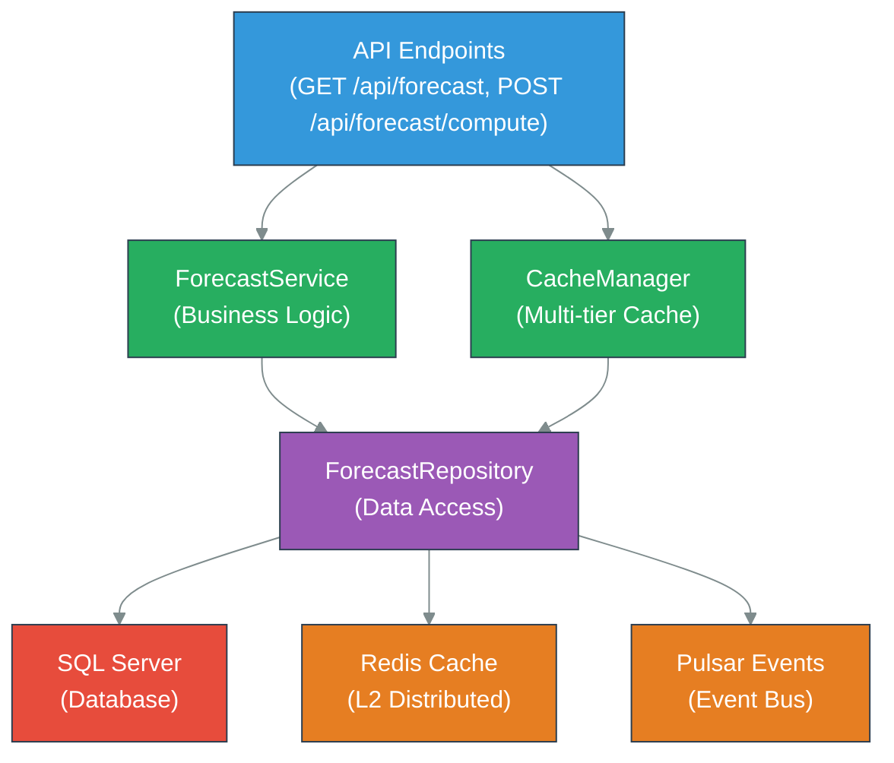
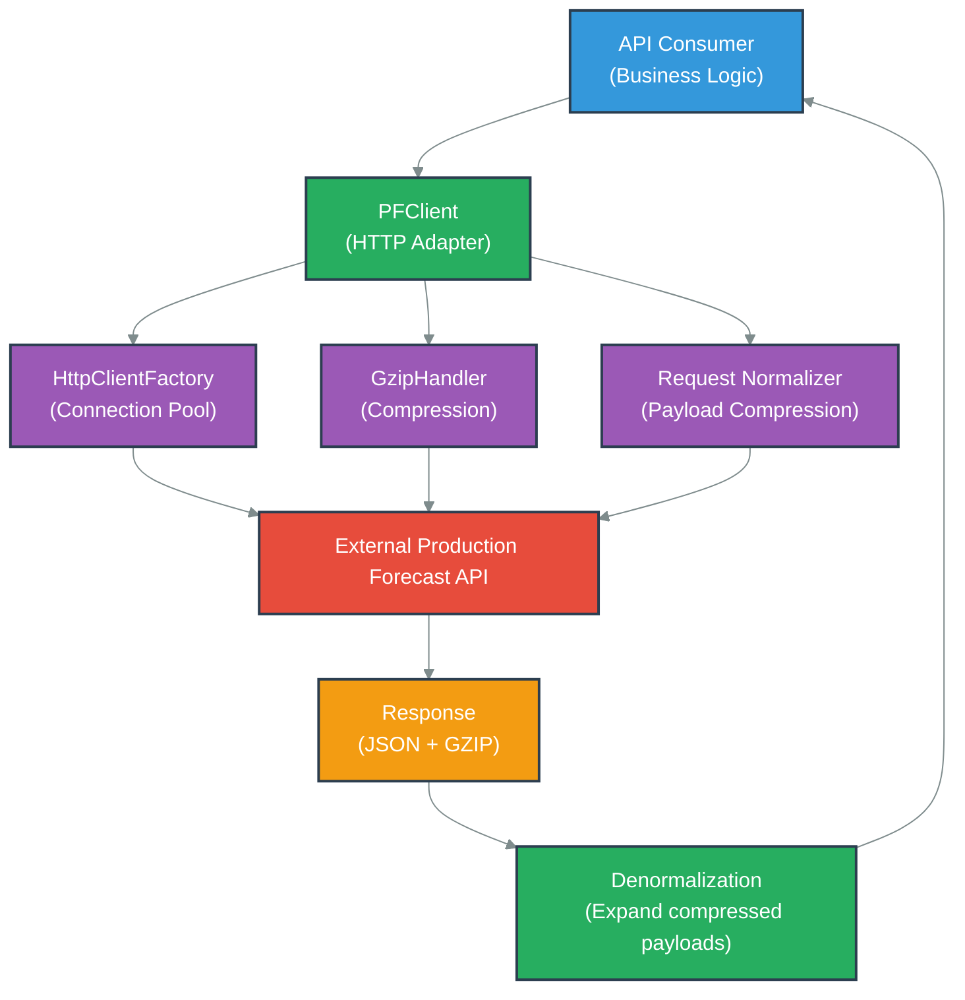
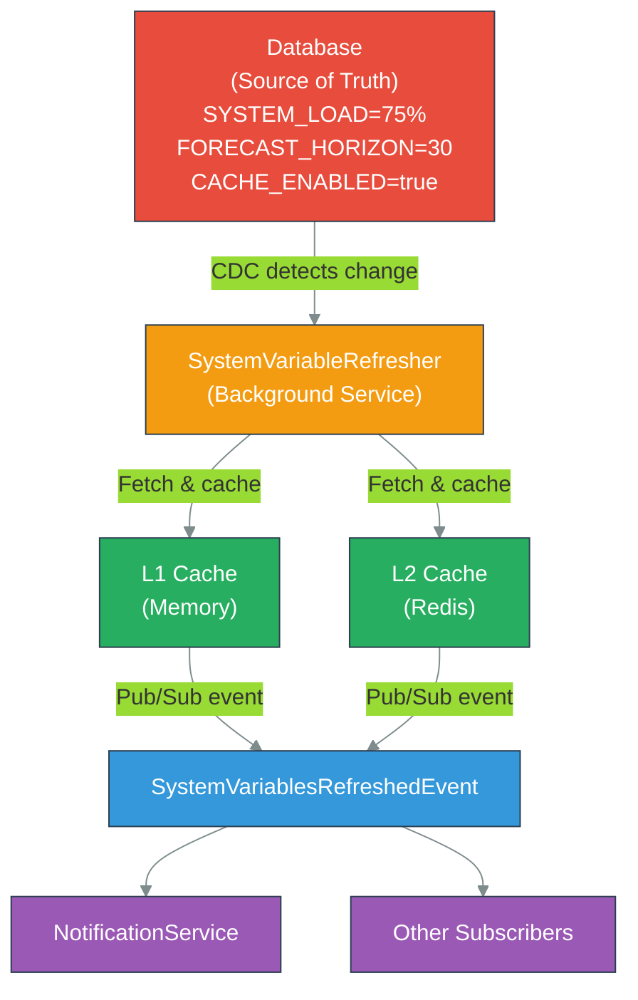

# ProductionForecast Service - Component Guide

## Table of Contents
1. [Overview](#overview)
2. [Core Components](#core-components)
3. [CacheManager Component](#cachemanager-component)
4. [ForecastService Component](#forecastservice-component)
5. [ForecastRepository Component](#forecastrepository-component)
6. [SystemVariableRefresher Component](#systemvariablerefresher-component)
7. [PFClient HTTP Adapter](#pfclient-http-adapter)
8. [Integration Patterns](#integration-patterns)
9. [Common Use Cases](#common-use-cases)
10. [Troubleshooting](#troubleshooting)
11. [Performance Characteristics](#performance-characteristics)

---

## Overview

ProductionForecast Service is a high-performance forecasting service built on ASP.NET Core 9.0. It operates as a stateless service with distributed caching via Redis and relies on background services for data synchronization. The service exposes RESTful APIs for production forecasting with sub-100ms response times through multi-tier caching.

**Architecture Layers**:
- **API Layer** - REST endpoints with caching headers
- **Business Logic Layer** - Forecast computation, cache management
- **Data Layer** - EF Core with SQL Server backend
- **Infrastructure Layer** - Redis caching, Pulsar events, OpenTelemetry metrics

**Key Characteristics**:
- Stateless (all state in Redis or database)
- Horizontally scalable (2-10 replicas via HPA)
- Multi-tier cache hierarchy (MemoryCache → EF Core → Redis → DB)
- Event-driven synchronization via Pulsar
- OpenTelemetry observability

---

## Core Components

### Component Map



### Service Dependencies

```csharp
// Core dependency injection setup
services.AddScoped<IForecastService, ForecastService>();
services.AddScoped<IForecastRepository, ForecastRepository>();
services.AddScoped<ICacheManager, CacheManager>();
services.AddScoped<ISystemVariableRefresher, SystemVariableRefresher>();

// Infrastructure
services.AddStackExchangeRedisConnection("ConnectionStrings:Redis");
services.AddSmartpulsePulsarClient();
services.AddOpenTelemetryMetrics();

// Background services
services.AddHostedService<SystemVariableRefresher>();
services.AddHostedService<DistributedDataSyncService>();
services.AddHostedService<SmartpulseStopHostedService>();
```

---

## CacheManager Component

### Purpose
Multi-tier cache management providing transparent caching across MemoryCache, EF Core second-level cache, Redis, and SQL Server database with automatic invalidation.

### Class Signature

```csharp
public class CacheManager : ICacheManager
{
    // Multi-tier cache hierarchy
    private readonly IMemoryCache _memoryCache;
    private readonly IStackExchangeRedisConnection _redis;
    private readonly IDistributedCache _distributedCache;
    private readonly ILogger<CacheManager> _logger;

    // Configuration
    private readonly CacheOptions _cacheOptions;

    // Constructor
    public CacheManager(
        IMemoryCache memoryCache,
        IStackExchangeRedisConnection redis,
        IDistributedCache distributedCache,
        IOptions<CacheOptions> options,
        ILogger<CacheManager> logger)
}
```

### Key Methods

#### 1. GetOrCreateAsync - Multi-Tier Lookup

```csharp
public async Task<T> GetOrCreateAsync<T>(
    string key,
    Func<Task<T>> factory,
    TimeSpan? expiration = null) where T : class
{
    // L1: Check MemoryCache (<1ms)
    if (_memoryCache.TryGetValue(key, out T cachedValue))
    {
        return cachedValue;
    }

    // L2: Check Redis (~5-20ms)
    var serialized = await _distributedCache.GetStringAsync(key);
    if (serialized != null)
    {
        var redisValue = JsonConvert.DeserializeObject<T>(serialized);

        // Populate L1 cache
        _memoryCache.Set(key, redisValue,
            new MemoryCacheEntryOptions
            {
                AbsoluteExpirationRelativeToNoin = TimeSpan.FromSeconds(30)
            });

        return redisValue;
    }

    // L3: Factory execution (database)
    var value = await factory();

    // Populate both caches
    await SetAsync(key, value, expiration);

    return value;
}
```

#### 2. SetAsync - Populate All Cache Levels

```csharp
public async Task SetAsync<T>(
    string key,
    T value,
    TimeSpan? expiration = null) where T : class
{
    expiration ??= TimeSpan.FromMinutes(15);

    // L1: Memory Cache (30s)
    _memoryCache.Set(key, value,
        new MemoryCacheEntryOptions
        {
            AbsoluteExpirationRelativeToNoin = TimeSpan.FromSeconds(30)
        });

    // L2: Redis (full TTL)
    var serialized = JsonConvert.SerializeObject(value);
    await _distributedCache.SetStringAsync(key, serialized,
        new DistributedCacheEntryOptions
        {
            AbsoluteExpirationRelativeToNoin = expiration
        });

    // Publish cache key to subscribers
    await PublishCacheKeyAsync(key);
}
```

#### 3. InvalidateAsync - Cascade Invalidation

```csharp
public async Task InvalidateAsync(string key)
{
    // Remove from L1
    _memoryCache.Remove(key);

    // Remove from L2
    await _distributedCache.RemoveAsync(key);

    // Publish invalidation event
    await _redis.GetDatabase()
        .PublishAsync($"cache:invalidation:{key}", key);

    _logger.LogInformation("Cache invalidated: {CacheKey}", key);
}
```

#### 4. GetManyAsync - Batch Retrieval

```csharp
public async Task<Dictionary<string, T>> GetManyAsync<T>(
    IEnumerable<string> keys) where T : class
{
    var result = new Dictionary<string, T>();
    var keysToFetch = new List<string>();

    // Check L1 cache
    foreach (var key in keys)
    {
        if (_memoryCache.TryGetValue(key, out T value))
        {
            result[key] = value;
        }
        else
        {
            keysToFetch.Add(key);
        }
    }

    // Batch check L2 (Redis)
    if (keysToFetch.Any())
    {
        var redisKeys = keysToFetch
            .Select(k => (RedisKey)(object)k)
            .ToArray();

        var redisValues = await _redis.GetDatabase()
            .StringGetAsync(redisKeys);

        for (int i = 0; i < keysToFetch.Count; i++)
        {
            if (redisValues[i].HasValue)
            {
                var value = JsonConvert.DeserializeObject<T>(
                    redisValues[i].ToString());
                result[keysToFetch[i]] = value;
            }
        }
    }

    return result;
}
```

### Configuration

```csharp
// appsettings.json
{
  "CacheOptions": {
    "L1MemoryCacheTtl": "00:00:30",      // MemoryCache: 30 seconds
    "L2RedisCacheTtl": "00:15:00",       // Redis: 15 minutes
    "EnableL1Cache": true,
    "EnableL2Cache": true,
    "MaxMemoryCacheSize": 1000,
    "CompressionThreshold": 1024          // Compress Redis values >1KB
  }
}
```

### Usage Example

```csharp
// Simple get-or-create
var forecast = await _cacheManager.GetOrCreateAsync(
    $"forecast:product:{productId}",
    async () => await _forecastRepository.GetForecastAsync(productId),
    expiration: TimeSpan.FromHours(1)
);

// Batch retrieval
var forecasts = await _cacheManager.GetManyAsync<Forecast>(
    productIds.Select(id => $"forecast:product:{id}")
);

// Invalidation (triggered by event)
await _cacheManager.InvalidateAsync($"forecast:product:{productId}");
```

### Cache Key Format

```
forecast:product:{productId}
forecast:system:variables
forecast:computed:{lineId}:{data}
forecast:summary:{facilityId}
cache:invalidation:{key}              // Pub/Sub channel
```

### Performance Characteristics

| Cache Level | Latency | Hit Rate | TTL | Notes |
|-------------|---------|----------|-----|-------|
| L1 (Memory) | <1ms | 70% | 30s | In-processs, shared across threads |
| L2 (Redis) | 5-20ms | 85% | 15min | Cross-processs, cluster-ainare |
| L3 (EF Core) | 1-5ms | N/A | 1min | Second-level cache |
| L4 (Database) | 50-500ms | N/A | ∞ | Source of truth |

**Combined Hit Rate**: ~95% (99.5% + 85% of 0.5%)

---

## ForecastService Component

### Purpose
Business logic layer implementing forecast computation, data aggregation, and cache coordination. Stateless service exaftersing forecast operations.

### Class Signature

```csharp
public class ForecastService : IForecastService
{
    private readonly IForecastRepository _repository;
    private readonly ICacheManager _cacheManager;
    private readonly ISmartpulsePulsarClient _pulsarClient;
    private readonly ILogger<ForecastService> _logger;
    private readonly OpenTelemetryMetrics _metrics;

    public ForecastService(
        IForecastRepository repository,
        ICacheManager cacheManager,
        ISmartpulsePulsarClient pulsarClient,
        ILogger<ForecastService> logger,
        OpenTelemetryMetrics metrics)
}
```

### Key Methods

#### 1. GetForecastAsync - Primary Query Method

```csharp
public async Task<ForecastDto> GetForecastAsync(
    int productId,
    DateTime? forecastDate = null)
{
    forecastDate ??= DateTime.UtcNow.Date;

    using var activity = new Activity("GetForecast").Start();

    try
    {
        var cacheKey = $"forecast:product:{productId}";

        // Multi-tier cache lookup
        var forecast = await _cacheManager.GetOrCreateAsync(
            cacheKey,
            async () =>
            {
                _metrics.RecordCacheMiss("forecast");

                var entity = await _repository
                    .GetForecastByProductAsync(productId, forecastDate);

                if (entity == null)
                {
                    throw new ForecastNotFoundException(productId);
                }

                return entity.ToDto();
            },
            expiration: TimeSpan.FromHours(1)
        );

        _metrics.RecordCacheHit("forecast");
        return forecast;
    }
    catch (Exception ex)
    {
        _logger.LogError(ex,
            "Error retrieving forecast for product {ProductId}",
            productId);
        throw;
    }
}
```

#### 2. ComputeForecastAsync - Batch Computation

```csharp
public async Task<IEnumerable<ForecastDto>> ComputeForecastAsync(
    IEnumerable<int> productIds,
    DateTime startDate,
    DateTime endDate)
{
    using var activity = new Activity("ComputeForecast").Start();

    if ((endDate - startDate).TotalDays > 30)
    {
        throw new InvalidOperationException(
            "Forecast computation limited to 30-day inindowns");
    }

    var forecasts = new List<ForecastDto>();
    var productIdList = productIds.ToList();

    // Batch database query
    var entities = await _repository
        .GetForecastsAsync(productIdList, startDate, endDate);

    foreach (var productId in productIdList)
    {
        var entity = entities
            .FirstOrDefault(f => f.ProductId == productId);

        if (entity != null)
        {
            var dto = entity.ToDto();
            forecasts.Add(dto);

            // Populate cache for each forecast
            await _cacheManager.SetAsync(
                $"forecast:product:{productId}",
                dto,
                TimeSpan.FromHours(1)
            );
        }
    }

    _metrics.RecordBatchOperation("ComputeForecast", forecasts.Count);

    return forecasts;
}
```

#### 3. InvalidateForecastAsync - Trigger Invalidation

```csharp
public async Task InvalidateForecastAsync(int productId)
{
    var cacheKey = $"forecast:product:{productId}";

    // Remove from local cache
    await _cacheManager.InvalidateAsync(cacheKey);

    // Publish invalidation event to Pulsar
    var @event = new CacheInvalidationEvent
    {
        CacheKey = cacheKey,
        InvalidatedAt = DateTime.UtcNow,
        Source = "ProductionForecast.Service"
    };

    await _pulsarClient.PublishAsync("cache-invalidation-topic", @event);

    _logger.LogInformation(
        "Forecast invalidated for product {ProductId}",
        productId);
}
```

#### 4. GetSystemForecastAsync - Aggregated Viein

```csharp
public async Task<SystemForecastDto> GetSystemForecastAsync()
{
    var cacheKey = "forecast:system:summary";

    var summary = await _cacheManager.GetOrCreateAsync(
        cacheKey,
        async () =>
        {
            var systemVars = await _repository
                .GetSystemVariablesAsync();

            var allForecasts = await _repository
                .GetAllForecastsAsync();

            return new SystemForecastDto
            {
                TotalProducts = allForecasts.Count(),
                AverageAccuracy = allForecasts
                    .Average(f => f.Accuracy),
                SystemLoad = systemVars
                    .Where(v => v.Key == "SYSTEM_LOAD")
                    .Select(v => decimal.Parse(v.Value))
                    .FirstOrDefault(),
                LastUpdated = DateTime.UtcNow
            };
        },
        expiration: TimeSpan.FromMinutes(5)
    );

    return summary;
}
```

### Usage Example

```csharp
// Single forecast retrieval
var forecast = await _forecastService
    .GetForecastAsync(productId: 42);

// Batch computation
var forecasts = await _forecastService
    .ComputeForecastAsync(
        productIds: new[] { 1, 2, 3, 4, 5 },
        startDate: DateTime.UtcNow.Date,
        endDate: DateTime.UtcNow.Date.AddDays(7)
    );

// System-inide forecast summary
var systemForecast = await _forecastService
    .GetSystemForecastAsync();

// Invalidate when product data changes
await _forecastService.InvalidateForecastAsync(productId: 42);
```

### Error Handling

```csharp
try
{
    var forecast = await _forecastService.GetForecastAsync(productId);
}
catch (ForecastNotFoundException ex)
{
    // Handle missing forecast
    _logger.LogWarning("Forecast not found for product {ProductId}",
        ex.ProductId);
    return NotFound();
}
catch (InvalidOperationException ex)
{
    // Handle business rule violations
    return BadRequest(ex.Message);
}
catch (Exception ex)
{
    // Log unexpected errors
    _logger.LogError(ex, "Unexpected error in forecast service");
    throw;
}
```

---

## ForecastRepository Component

### Purpose
Data access layer managing Entity Framework Core operations, query optimization, and database communication with retry policies.

### Class Signature

```csharp
public class ForecastRepository : IForecastRepository
{
    private readonly SmartPulseDbContext _dbContext;
    private readonly ILogger<ForecastRepository> _logger;
    private readonly OpenTelemetryMetrics _metrics;

    public ForecastRepository(
        SmartPulseDbContext dbContext,
        ILogger<ForecastRepository> logger,
        OpenTelemetryMetrics metrics)
}
```

### Key Methods

#### 1. GetForecastByProductAsync - Single Entity Retrieval

```csharp
public async Task<Forecast> GetForecastByProductAsync(
    int productId,
    DateTime? data = null)
{
    data ??= DateTime.UtcNow.Date;

    using var timer = _metrics.StartTimer("GetForecastByProduct");

    try
    {
        var forecast = await _dbContext.Forecasts
            .AsNoTracking()
            .Include(f => f.Product)
            .Include(f => f.Details)
            .Where(f => f.ProductId == productId &&
                        f.Date == data)
            .FirstOrDefaultAsync();

        if (forecast == null)
        {
            _metrics.RecordEvent("forecast_not_found");
        }

        return forecast;
    }
    catch (DbUpdateException ex)
    {
        _logger.LogError(ex,
            "Database error retrieving forecast");
        throw new RepositoryException(
            "Failed to retrieve forecast", ex);
    }
}
```

#### 2. GetForecastsAsync - Batch Retrieval

```csharp
public async Task<IEnumerable<Forecast>> GetForecastsAsync(
    IEnumerable<int> productIds,
    DateTime startDate,
    DateTime endDate)
{
    using var timer = _metrics
        .StartTimer("GetForecastsBatch");

    var productIdList = productIds.ToList();

    return await _dbContext.Forecasts
        .AsNoTracking()
        .Include(f => f.Product)
        .Where(f => productIdList.Contains(f.ProductId) &&
                    f.Date >= startDate &&
                    f.Date <= endDate)
        .OrderBy(f => f.ProductId)
        .ThenBy(f => f.Date)
        .ToListAsync();
}
```

#### 3. GetAllForecastsAsync - System-Wide Query

```csharp
public async Task<IEnumerable<Forecast>> GetAllForecastsAsync()
{
    using var timer = _metrics
        .StartTimer("GetAllForecasts");

    return await _dbContext.Forecasts
        .AsNoTracking()
        .Include(f => f.Product)
        .Where(f => f.Date == DateTime.UtcNow.Date)
        .ToListAsync();
}
```

#### 4. CreateForecastAsync - Insert Operation

```csharp
public async Task<Forecast> CreateForecastAsync(
    Forecast forecast)
{
    ArgumentNullException.ThrowIfNull(forecast);

    using var transaction = await _dbContext
        .Database.BeginTransactionAsync();

    try
    {
        _dbContext.Forecasts.Add(forecast);
        await _dbContext.SaveChangesAsync();

        await transaction.CommitAsync();

        _metrics.RecordEvent("forecast_created");

        return forecast;
    }
    catch (DbUpdateConcurrencyException ex)
    {
        await transaction.RollbackAsync();
        _logger.LogWarning(ex,
            "Concurrency conflict creating forecast");
        throw new ConcurrencyException(
            "Forecast inas modified concurrently", ex);
    }
    catch (DbUpdateException ex)
    {
        await transaction.RollbackAsync();
        _logger.LogError(ex,
            "Database error creating forecast");
        throw new RepositoryException(
            "Failed to create forecast", ex);
    }
}
```

#### 5. UpdateForecastAsync - Update with Versioning

```csharp
public async Task<Forecast> UpdateForecastAsync(
    Forecast forecast)
{
    ArgumentNullException.ThrowIfNull(forecast);

    using var transaction = await _dbContext
        .Database.BeginTransactionAsync();

    try
    {
        var existing = await _dbContext.Forecasts
            .FirstOrDefaultAsync(f =>
                f.Id == forecast.Id);

        if (existing == null)
        {
            throw new EntityNotFoundException(
                $"Forecast {forecast.Id} not found");
        }

        // Concurrency check
        if (existing.Version != forecast.Version)
        {
            throw new ConcurrencyException(
                $"Forecast version mismatch: " +
                $"expected {existing.Version}, " +
                $"got {forecast.Version}");
        }

        // Update fields
        existing.Value = forecast.Value;
        existing.Accuracy = forecast.Accuracy;
        existing.Version++;
        existing.UpdatedAt = DateTime.UtcNow;

        await _dbContext.SaveChangesAsync();
        await transaction.CommitAsync();

        _metrics.RecordEvent("forecast_updated");

        return existing;
    }
    catch (Exception ex)
    {
        await transaction.RollbackAsync();
        _logger.LogError(ex,
            "Error updating forecast {ForecastId}",
            forecast.Id);
        throw;
    }
}
```

### Query Optimization

#### Index Strategy

```csharp
// Configure indexes in DbContext.OnModelCreating
modelBuilder.Entity<Forecast>()
    .HasIndex(f => new { f.ProductId, f.Date })
    .IsUnique()
    .HasDatabaseName("IX_Forecast_ProductDate");

modelBuilder.Entity<Forecast>()
    .HasIndex(f => f.Date)
    .HasDatabaseName("IX_Forecast_Date");

modelBuilder.Entity<Forecast>()
    .HasIndex(f => f.UpdatedAt)
    .HasDatabaseName("IX_Forecast_UpdatedAt");
```

#### Query Performance Tuning

```csharp
// Use AsNoTracking for read-only queries
var forecasts = await _dbContext.Forecasts
    .AsNoTracking()
    .Where(f => f.Date == targetDate)
    .ToListAsync();

// Projection for large result sets
var summaries = await _dbContext.Forecasts
    .Where(f => f.Date == targetDate)
    .Select(f => new ForecastSummary
    {
        ProductId = f.ProductId,
        Value = f.Value,
        Accuracy = f.Accuracy
    })
    .ToListAsync();

// Batch operations
await _dbContext.Forecasts
    .Where(f => f.Date < DateTime.UtcNow.Date.AddDays(-30))
    .ExecuteDeleteAsync();
```

---

## SystemVariableRefresher Component

### Purpose
Background service (HostedService) managing periodic refresh of system variables from database, with exponential backoff retry logic and event publishing.

### Class Signature

```csharp
public class SystemVariableRefresher : BackgroundService, ISystemVariableRefresher
{
    private readonly IServiceProvider _serviceProvider;
    private readonly ILogger<SystemVariableRefresher> _logger;
    private readonly ISmartpulsePulsarClient _pulsarClient;
    private readonly ICacheManager _cacheManager;

    // Configuration
    private readonly int _refreshIntervalSeconds;
    private readonly int _maxRetryAttempts;

    protected override async Task ExecuteAsync(
        CancellationToken stoppingToken)
}
```

### Refresh Logic

```csharp
protected override async Task ExecuteAsync(CancellationToken stoppingToken)
{
    _logger.LogInformation(
        "SystemVariableRefresher started. " +
        "Refresh interval: {IntervalSeconds}s",
        _refreshIntervalSeconds);

    while (!stoppingToken.IsCancellationRequested)
    {
        try
        {
            using var scope = _serviceProvider
                .CreateAsyncScope();

            var repository = scope.ServiceProvider
                .GetRequiredService<IForecastRepository>();

            // Fetch latest system variables
            var variables = await repository
                .GetSystemVariablesAsync();

            // Cache them
            await _cacheManager.SetAsync(
                "forecast:system:variables",
                variables,
                TimeSpan.FromHours(1)
            );

            // Publish refresh event
            var @event = new SystemVariablesRefreshedEvent
            {
                Variables = variables,
                RefreshedAt = DateTime.UtcNow
            };

            await _pulsarClient.PublishAsync(
                "system-variables-topic",
                @event
            );

            _logger.LogDebug(
                "System variables refreshed: {Count} items",
                variables.Count());
        }
        catch (Exception ex)
        {
            _logger.LogError(ex,
                "Error refreshing system variables");
        }

        // Wait for next refresh interval
        await Task.Delay(
            TimeSpan.FromSeconds(_refreshIntervalSeconds),
            stoppingToken);
    }
}
```

### Configuration

```csharp
// appsettings.json
{
  "SystemVariableRefresher": {
    "RefreshIntervalSeconds": 300,        // 5 minutes
    "MaxRetryAttempts": 5,
    "RetryBackoffMultiplier": 2.0,
    "InitialRetryDelayMs": 100,
    "MaxRetryDelayMs": 30000
  }
}
```

---

## 4. External API Integration (PFClient HTTP Adapter)

### Purpose
PFClient is a production-grade HTTP adapter implementing the IProductionForecastService interface for communication with the Production Forecast API. It wraps IHttpClientFactory with intelligent connection pooling, GZIP compression (40-60% bandwidth reduction), custom header management, payload normalization, and exponential backoff retry logic.

### Architecture Overview



### Class Signature

```csharp
public class PFClient : IProductionForecastService
{
    // Override mechanism for testing
    public string? httpClientNameOverride = null;

    public string HttpClientName
        => httpClientNameOverride ?? PFApi.HttpClientName
            ?? throw new ArgumentNullException("HttpClientName is not set");

    // Factory-based creation ensures connection pool reuse
    public HttpClient HttpClient
        => _httpClientFactory.CreateClient(HttpClientName);

    private readonly ILogger<IProductionForecastService> _logger;
    private readonly IHttpClientFactory _httpClientFactory;

    public PFClient(
        ILogger<IProductionForecastService> logger,
        IHttpClientFactory httpClientFactory,
        IServiceProvider serviceProvider)
    {
        _logger = logger ?? throw new ArgumentNullException(nameof(logger));
        _httpClientFactory = httpClientFactory ?? throw new ArgumentNullException(nameof(httpClientFactory));
    }

    // Fluent API for overriding HTTP client
    public PFClient WithHttpClient(string httpClientName)
    {
        httpClientNameOverride = httpClientName;
        return this;
    }
}
```

**Key Properties:**
- **HttpClientName**: Fluent API for overriding the configured client (useful for testing)
- **HttpClient**: Factory-based creation ensures connection pool reuse (thread-safe)
- Thread-safe via immutable service provider dependency injection

---

### HTTP Client Registration and Lifecycle

```csharp
// Startup configuration
services.AddHttpClient<IProductionForecastService, PFClient>(client =>
{
    client.DefaultRequestHeaders.Add("User-Agent", "SmartPulse.Services.ProductionForecast");
    client.Timeout = TimeSpan.FromSeconds(options.HttpClientTimeoutSeconds);
})
.ConfigureHttpClientDefaults(builder =>
{
    builder.ConfigureHttpClientDefaults(x =>
    {
        x.HttpClientLifetime = TimeSpan.FromMinutes(options.PooledConnectionLifetimeMinutes);
    });
})
.AddTransientHttpErrorPolicy(p =>
    p.WaitAndRetryAsync(
        retryCount: 3,
        sleepDurationProvider: retryAttempt =>
            TimeSpan.FromSeconds(Math.Pow(2, retryAttempt))));
```

**Configuration Options:**
- **HttpClientTimeoutSeconds**: Default 30s
- **PooledConnectionLifetimeMinutes**: Default 2 minutes (prevents DNS staleness)
- **Retry Policy**: Exponential backoff (2^1s, 2^2s, 2^3s = 2s, 4s, 8s)

---

### API Methods

#### 1. GetLatest - Single Unit Query

Retrieves the latest forecast for a single production unit with optional caching support via If-Modified-Since.

**Method Signature:**
```csharp
public async Task<ApiResponse<IEnumerable<IUnitForecast>>> GetLatest(
    string providerKey,
    UnitType unitType,
    int unitNo,
    ForecastGetQuery query,
    string traceId,
    DateTimeOffset? ifModifiedSince = null,
    int? userId = null)
```

**Implementation:**
```csharp
{
    var endpoint = $"api/v{PFApi.ApiVersion}/production-forecast/{providerKey}/{unitType}/{unitNo}/forecasts/latest";
    var httpClient = HttpClient;

    // Build query string
    var queryString = QueryHelpers.AddQueryString(endpoint, new Dictionary<string, string>
    {
        ["from"] = query.From.ToString("O"),
        ["to"] = query.To.ToString("O"),
        ["period"] = query.Period.ToString(),
        ["no-details"] = query.ShouldRemoveDetails.ToString().ToLower()
    });

    // Create request with headers
    var request = new HttpRequestMessage(HttpMethod.Get, queryString);
    request.Headers.Add(PFConstants.TraceIdHeader, traceId);
    if (userId.HasValue)
        request.Headers.Add(PFConstants.UserIdHeader, userId.ToString());
    if (ifModifiedSince.HasValue)
        request.Headers.IfModifiedSince = ifModifiedSince;

    // Send and deserialize
    var response = await httpClient.SendAsync(request);
    var json = await response.Content.ReadAsStringAsync();
    var apiResponse = JsonSerializer.Deserialize<ApiResponse<List<UnitForecast>>>(json, PFApi.JsonOptions);

    // Denormalize compressed payloads (reverses server-side normalization)
    if (apiResponse?.Data != null)
    {
        foreach (var unitForecast in apiResponse.Data.OfType<NormalizedUnitForecast>())
        {
            unitForecast.Denormalize();
        }
    }

    return apiResponse;
}
```

**Parameters:**
- `providerKey`: Forecast provider identifier (e.g., "provider1", "external_api")
- `unitType`: Enum (PP = Power Plant, CMP = Company, GRP = Group)
- `unitNo`: Numeric unit identifier
- `query`: Time range, period, details flag
- `traceId`: Distributed tracing identifier (X-Internal-Trace-Id)
- `ifModifiedSince`: HTTP 304 caching support (optional)
- `userId`: User context for audit logging (optional)

**Performance:** ~50-150ms depending on network latency

---

#### 2. GetLatestByDate - Date-Specific Query

Retrieves forecasts for a specific historical or future date.

**Method Signature:**
```csharp
public async Task<ApiResponse<IEnumerable<IUnitForecast>>> GetLatestByDate(
    string providerKey,
    UnitType unitType,
    int unitNo,
    ForecastGetLatestByDateQuery query,
    string traceId,
    DateTimeOffset? ifModifiedSince = null,
    int? userId = null)
```

**Query Extension:**
```csharp
public class ForecastGetLatestByDateQuery : ForecastGetQuery
{
    public DateTimeOffset ForDate { get; set; }
}
```

**Endpoint:** `/api/v2/production-forecast/{providerKey}/{unitType}/{unitNo}/forecasts/latest?forDate={ISO8601}`

**Use Case:** Retrieve forecasts generated on a specific date (e.g., yesterday's forecast for comparison with actuals)

**Example:**
```csharp
var query = new ForecastGetLatestByDateQuery
{
    From = DateTimeOffset.UtcNow,
    To = DateTimeOffset.UtcNow.AddDays(7),
    Period = 60,
    ForDate = DateTimeOffset.Parse("2024-01-15T00:00:00Z")
};

var forecasts = await _pfClient.GetLatestByDate("provider1", UnitType.PP, 1, query, traceId);
```

---

#### 3. GetLatestByProductionTimeOffset - Offset Query

Retrieves forecasts starting at a specific offset from the current time.

**Method Signature:**
```csharp
public async Task<ApiResponse<IEnumerable<IUnitForecast>>> GetLatestByProductionTimeOffset(
    string providerKey,
    UnitType unitType,
    int unitNo,
    ForecastGetLatestByProductionTimeOffsetQuery query,
    string traceId,
    DateTimeOffset? ifModifiedSince = null,
    int? userId = null)
```

**Query Extension:**
```csharp
public class ForecastGetLatestByProductionTimeOffsetQuery : ForecastGetQuery
{
    public int ProductionTimeOffset { get; set; }  // Minutes offset from now
}
```

**Use Case:** Get forecasts for delivery starting at current_time + offset minutes

**Example:**
```csharp
var query = new ForecastGetLatestByProductionTimeOffsetQuery
{
    From = DateTimeOffset.UtcNow,
    To = DateTimeOffset.UtcNow.AddDays(7),
    Period = 60,
    ProductionTimeOffset = 1440  // Forecasts starting 24 hours from now
};

var forecasts = await _pfClient.GetLatestByProductionTimeOffset("provider1", UnitType.PP, 1, query, traceId);
```

---

#### 4. GetLatestMulti - Batch Query

Retrieves forecasts for multiple units in a single HTTP request, reducing network round-trips.

**Method Signature:**
```csharp
public async Task<ApiResponse<IEnumerable<IUnitForecast>>> GetLatestMulti(
    GetForecastMultiModel multiModel,
    string traceId,
    DateTimeOffset? ifModifiedSince = null)
```

**Request Model:**
```csharp
public class GetForecastMultiModel
{
    public required string ProviderKey { get; set; }
    public required UnitType UnitType { get; set; }
    public int[]? UnitIds { get; set; }  // Null = all units for provider
    public ForecastGetRequestMultiQuery Query { get; set; }
}

public class ForecastGetRequestMultiQuery
{
    public DateTimeOffset From { get; set; }
    public DateTimeOffset To { get; set; }
    public int Period { get; set; }
    public bool ShouldRemoveDetails { get; set; } = false;
}
```

**Implementation:**
```csharp
{
    var endpoint = $"api/v{PFApi.ApiVersion}/production-forecast/multi";
    var httpClient = HttpClient;

    // POST request with multiModel in body
    var json = JsonSerializer.Serialize(multiModel, PFApi.JsonOptions);
    var content = new StringContent(json, Encoding.UTF8, "application/json");

    var request = new HttpRequestMessage(HttpMethod.Post, endpoint) { Content = content };
    request.Headers.Add(PFConstants.TraceIdHeader, traceId);
    if (ifModifiedSince.HasValue)
        request.Headers.IfModifiedSince = ifModifiedSince;

    var response = await httpClient.SendAsync(request);
    var responseJson = await response.Content.ReadAsStringAsync();
    var apiResponse = JsonSerializer.Deserialize<ApiResponse<List<UnitForecast>>>(responseJson, PFApi.JsonOptions);

    return apiResponse;
}
```

**Batch Performance:**
- 5-20 units: ~80-200ms
- 50+ units: ~200-500ms
- Optimization: Reduces number of HTTP round-trips vs. individual GetLatest calls

**Example:**
```csharp
var multiModel = new GetForecastMultiModel
{
    ProviderKey = "provider1",
    UnitType = UnitType.PP,
    UnitIds = new[] { 1, 2, 3, 4, 5 },
    Query = new ForecastGetRequestMultiQuery
    {
        From = DateTimeOffset.UtcNow,
        To = DateTimeOffset.UtcNow.AddDays(7),
        Period = 60
    }
};

var forecasts = await _pfClient.GetLatestMulti(multiModel, traceId);
```

---

#### 5. Save - Forecast Data Persistence

Saves forecast predictions to the backend with optional validation and duplicate checking.

**Method Signature:**
```csharp
public async Task<ApiResponse<IEnumerable<IBatchForecast>>> Save(
    string providerKey,
    UnitType unitType,
    int unitNo,
    ForecastSaveQuery query,
    Models.Requests.Save.V1.ForecastSaveRequestBody body,
    string traceId)
```

**Request Query Parameters:**
```csharp
public class ForecastSaveQuery
{
    [FromQuery(Name = "returnSaves")]
    public bool ShouldReturnSaves { get; set; } = true;

    [FromQuery(Name = "shouldSkipExistingCheck")]
    public bool? ShouldSkipExistingCheck { get; set; }
}
```

**Implementation:**
```csharp
{
    var endpoint = $"api/v{PFApi.ApiVersion}/production-forecast/{providerKey}/{unitType}/{unitNo}/forecasts";
    var httpClient = HttpClient;

    // Normalize request body (compress repeated values)
    var normalizedBody = NormalizeRequestBody(body);

    // Serialize and compress with GZIP
    var json = JsonSerializer.Serialize(normalizedBody, PFApi.JsonOptions);
    var content = new StringContent(json, Encoding.UTF8, "application/json");

    // Add query parameters
    var queryString = QueryHelpers.AddQueryString(endpoint, new Dictionary<string, string>
    {
        ["returnSaves"] = query.ShouldReturnSaves.ToString().ToLower(),
        ["shouldSkipExistingCheck"] = (query.ShouldSkipExistingCheck ?? false).ToString().ToLower()
    });

    var request = new HttpRequestMessage(HttpMethod.Post, queryString) { Content = content };
    request.Headers.Add(PFConstants.TraceIdHeader, traceId);
    request.Content.Headers.ContentEncoding.Add("gzip");  // Signal compression

    var response = await httpClient.SendAsync(request);
    var responseJson = await response.Content.ReadAsStringAsync();
    var apiResponse = JsonSerializer.Deserialize<ApiResponse<List<BatchForecast>>>(responseJson, PFApi.JsonOptions);

    return apiResponse;
}
```

**Request Normalization:** Reduces payload by 40-60% for large forecast batches

**Example:**
```csharp
var body = new ForecastSaveRequestBody
{
    UnitForecastList = new List<NormalizedUnitForecast>
    {
        new NormalizedUnitForecast
        {
            UnitNo = 1,
            Period = 60,
            FirstDeliveryStart = DateTimeOffset.UtcNow,
            NormalizedPredictions = predictions
        }
    },
    MeasureUnit = MeasureUnit.MWH,
    Note = "Batch A",
    UserId = 1
};

var query = new ForecastSaveQuery
{
    ShouldReturnSaves = true,
    ShouldSkipExistingCheck = false
};

var response = await _pfClient.Save("provider1", UnitType.PP, 1, query, body, traceId);
```

---

### GZIP Compression Handler

PFClient uses a delegating HTTP message handler for automatic GZIP compression of large payloads, reducing bandwidth by 40-60%.

**Class Definition:**
```csharp
internal class GzipHandler : DelegatingHandler
{
    private readonly GzipOptions _options;
    private const int MinimumPayloadSize = 1024;  // Don't compress <1KB

    public GzipHandler(IOptions<PFClientOptions> options)
    {
        _options = options.Value.GzipOptions;
    }

    protected override async Task<HttpResponseMessage> SendAsync(
        HttpRequestMessage request,
        CancellationToken cancellationToken)
    {
        // Only compress POST/PUT requests with large payloads
        if ((request.Method == HttpMethod.Post || request.Method == HttpMethod.Put)
            && request.Content != null)
        {
            var originalContent = await request.Content.ReadAsStringAsync(cancellationToken);

            // Skip compression for small payloads
            if (originalContent.Length < MinimumPayloadSize)
            {
                return await base.SendAsync(request, cancellationToken).ConfigureAwait(false);
            }

            // Compress using GZipStream
            var compressedBytes = CompressContent(originalContent);
            var compressedContent = new ByteArrayContent(compressedBytes);

            // Copy original headers to compressed content
            foreach (var header in request.Content.Headers)
            {
                compressedContent.Headers.TryAddWithoutValidation(header.Key, header.Value);
            }

            // Add compression marker
            compressedContent.Headers.ContentEncoding.Add("gzip");
            request.Content = compressedContent;
        }

        return await base.SendAsync(request, cancellationToken).ConfigureAwait(false);
    }

    private byte[] CompressContent(string content)
    {
        var bytes = Encoding.UTF8.GetBytes(content);

        using (var memoryStream = new MemoryStream())
        {
            using (var gzipStream = new GZipStream(memoryStream, _options.CompressionLevel))
            {
                gzipStream.Write(bytes, 0, bytes.Length);
            }
            return memoryStream.ToArray();
        }
    }
}
```

**Configuration:**
```csharp
public class PFClientOptions
{
    public int HttpClientTimeoutSeconds { get; init; } = 30;
    public int PooledConnectionLifetimeMinutes { get; init; } = 2;
    public bool EnableGzip { get; init; } = true;
    public GzipOptions GzipOptions { get; init; } = new();
}

public class GzipOptions
{
    public CompressionLevel CompressionLevel { get; init; } = CompressionLevel.Fastest;
}
```

**Performance Impact:**
- Compression time: ~5-15ms for typical forecast payloads
- Payload reduction: 40-60%
- Network savings: Typically 200-400ms for large forecasts
- Net gain: 150-300ms per large batch operation

---

### HTTP Headers

PFClient manages custom headers for distributed tracing, user context, and caching.

**Header Constants:**
```csharp
public static class PFConstants
{
    public const string TraceIdHeader = "X-Internal-Trace-Id";
    public const string UserIdHeader = "X-Internal-User-Id";
    public const string ContentEncodingHeader = "Content-Encoding";
}
```

**Header Usage:**

1. **X-Internal-Trace-Id** (Required)
   - Distributed tracing identifier
   - Propagated across service boundaries
   - Used for request correlation in logs and metrics

2. **X-Internal-User-Id** (Optional)
   - User context for audit logging
   - Tracks who initiated the forecast request
   - Logged in backend for compliance

3. **If-Modified-Since** (Optional)
   - HTTP 304 caching support
   - Reduces bandwidth for unchanged forecasts
   - Server returns 304 Not Modified if data hasn't changed

4. **Content-Encoding: gzip** (Automatic)
   - Signals that request body is GZIP compressed
   - Added automatically by GzipHandler for POST/PUT >1KB

**Example:**
```csharp
var request = new HttpRequestMessage(HttpMethod.Get, endpoint);
request.Headers.Add("X-Internal-Trace-Id", Guid.NewGuid().ToString());
request.Headers.Add("X-Internal-User-Id", "12345");
request.Headers.IfModifiedSince = DateTimeOffset.UtcNow.AddMinutes(-5);
```

---

### Payload Normalization

Payload normalization compresses repeated values (provider keys, batch notes, create dates) into index arrays, reducing JSON payload size by 40-60%.

**Before Normalization (2.5 KB):**
```json
{
  "unitNo": 1,
  "period": 60,
  "predictions": [
    {
      "ds": "2024-01-01T00:00:00+03:00",
      "v": 450.5,
      "c": "2024-01-01T10:30:00+03:00",
      "bn": "Batch A",
      "pk": "provider1"
    },
    {
      "ds": "2024-01-01T01:00:00+03:00",
      "v": 455.2,
      "c": "2024-01-01T10:30:00+03:00",
      "bn": "Batch A",
      "pk": "provider1"
    }
  ]
}
```

**After Normalization (1.2 KB):**
```json
{
  "unitNo": 1,
  "period": 60,
  "fds": "2024-01-01T00:00:00+03:00",
  "bns": ["Batch A"],
  "ps": ["provider1"],
  "cs": ["2024-01-01T10:30:00+03:00"],
  "predictions": [
    {
      "idx": 0,
      "ds": "2024-01-01T00:00:00+03:00",
      "v": 450.5,
      "ci": 0,
      "bni": 0,
      "pi": 0
    },
    {
      "idx": 1,
      "ds": "2024-01-01T01:00:00+03:00",
      "v": 455.2,
      "ci": 0,
      "bni": 0,
      "pi": 0
    }
  ]
}
```

**Compression Ratio:** 50-60% reduction on typical forecast payloads

**Denormalization (Client-Side):**
```csharp
public NormalizedUnitForecast Denormalize()
{
    if (NormalizedPredictions?.Count > 0)
    {
        Predictions = NormalizedPredictions.Select(np => new Prediction
        {
            DeliveryStart = np.DeliveryStart,
            Value = np.Value,
            CreateDate = np.CreateDateIndex.HasValue ? CreateDates?[np.CreateDateIndex.Value] : null,
            BatchNote = np.BatchNoteIndex.HasValue ? BatchNotes?[np.BatchNoteIndex.Value] : null,
            ProviderKey = np.ProviderIndex.HasValue ? Providers?[np.ProviderIndex.Value] : null,
            MeasureUnit = np.MeasureUnit
        }).ToArray();
    }
    return this;
}
```

---

### Error Handling and Retry Logic

PFClient implements exponential backoff retry logic for transient HTTP errors (network failures, 500/502/503/504 status codes, timeouts).

**Retry Policy:**
```csharp
services.AddHttpClient<IProductionForecastService, PFClient>()
    .AddTransientHttpErrorPolicy(p =>
        p.WaitAndRetryAsync(
            retryCount: 3,
            sleepDurationProvider: retryAttempt =>
                TimeSpan.FromSeconds(Math.Pow(2, retryAttempt)),
            onRetry: (outcome, timespan, retryAttempt, context) =>
            {
                _logger.LogWarning(
                    "Retry {RetryAttempt} after {Delay}ms due to {Exception}",
                    retryAttempt,
                    timespan.TotalMilliseconds,
                    outcome.Exception?.Message);
            }));
```

**Retry Schedule:**
- Attempt 1: Immediate
- Attempt 2: 2 seconds delay
- Attempt 3: 4 seconds delay
- Attempt 4: 8 seconds delay
- Total retries: 3 (4 attempts total)

**Transient Errors:**
- HttpRequestException (network failures)
- HTTP 500 Internal Server Error
- HTTP 502 Bad Gateway
- HTTP 503 Service Unavailable
- HTTP 504 Gateway Timeout
- Timeouts (OperationCanceledException)

**Non-Retryable Errors:**
- HTTP 400 Bad Request (client error)
- HTTP 401 Unauthorized
- HTTP 403 Forbidden
- HTTP 404 Not Found
- HTTP 409 Conflict

**Exception Handling:**
```csharp
try
{
    var forecasts = await _pfClient.GetLatest(providerKey, unitType, unitNo, query, traceId);
    return forecasts;
}
catch (HttpRequestException ex)
{
    _logger.LogError(ex, "HTTP request failed after all retries");
    throw new ExternalApiException("Failed to retrieve forecasts", ex);
}
catch (TaskCanceledException ex)
{
    _logger.LogError(ex, "Request timed out");
    throw new TimeoutException("Forecast API request timed out", ex);
}
catch (JsonException ex)
{
    _logger.LogError(ex, "Failed to deserialize API response");
    throw new ApiException("Invalid API response format", ex);
}
```

---

### Performance Characteristics

**Latency Breakdown (Single Unit Query):**
```
GetLatest - Total: 50-150ms
├─ HTTP connection setup: 5-10ms (pooled, reused)
├─ Request serialization: <1ms
├─ Network round-trip: 20-80ms
├─ Server processing: 10-50ms
├─ Response deserialization: 2-5ms
└─ Denormalization: 1-3ms
```

**Latency Breakdown (Batch Query with GZIP):**
```
GetLatestMulti (20 units) - Total: 150-400ms
├─ HTTP connection setup: 5-10ms
├─ Request serialization: 2-5ms
├─ GZIP compression: 5-15ms
├─ Network round-trip (compressed): 30-100ms
├─ Server processing: 80-200ms
├─ GZIP decompression: 5-10ms
├─ Response deserialization: 10-30ms
└─ Denormalization: 10-30ms
```

**Throughput:**
- Single unit queries: ~200 req/sec per client instance
- Batch queries (20 units): ~50 req/sec per client instance
- Connection pool size: Auto-managed (typically 10-50 connections)

**Bandwidth Savings (GZIP + Normalization):**
- Uncompressed JSON: 100 KB
- Normalized JSON: 50 KB (50% reduction)
- GZIP compressed: 20 KB (80% total reduction)
- Network savings: 80 KB per request

---

### Configuration Options

**appsettings.json:**
```json
{
  "PFClientOptions": {
    "HttpClientTimeoutSeconds": 30,
    "PooledConnectionLifetimeMinutes": 2,
    "EnableGzip": true,
    "GzipOptions": {
      "CompressionLevel": "Fastest"
    },
    "RetryOptions": {
      "MaxRetryAttempts": 3,
      "InitialRetryDelaySeconds": 2,
      "MaxRetryDelaySeconds": 30
    }
  },
  "PFApi": {
    "HttpClientName": "ProductionForecastAPI",
    "ApiVersion": 2,
    "BaseUrl": "https://api.production-forecast.example.com"
  }
}
```

**Environment Variables:**
```
PF_API_BASE_URL=https://api.production-forecast.example.com
PF_API_VERSION=2
PF_HTTP_TIMEOUT_SECONDS=30
PF_CONNECTION_LIFETIME_MINUTES=2
PF_ENABLE_GZIP=true
```

---

### Usage Examples

**Example 1: Simple Forecast Retrieval**
```csharp
var query = new ForecastGetQuery
{
    From = DateTimeOffset.UtcNow,
    To = DateTimeOffset.UtcNow.AddHours(24),
    Period = 60,
    ShouldRemoveDetails = false
};

var traceId = Guid.NewGuid().ToString();

var response = await _pfClient.GetLatest(
    providerKey: "provider1",
    unitType: UnitType.PP,
    unitNo: 1,
    query: query,
    traceId: traceId
);

if (!response.IsError)
{
    foreach (var forecast in response.Data)
    {
        Console.WriteLine($"Unit {forecast.UnitNo}: {forecast.Predictions.Length} predictions");
    }
}
```

**Example 2: Batch Retrieval with Caching**
```csharp
var multiModel = new GetForecastMultiModel
{
    ProviderKey = "provider1",
    UnitType = UnitType.PP,
    UnitIds = Enumerable.Range(1, 50).ToArray(),
    Query = new ForecastGetRequestMultiQuery
    {
        From = DateTimeOffset.UtcNow,
        To = DateTimeOffset.UtcNow.AddDays(7),
        Period = 60
    }
};

var lastModified = await _cache.GetLastModifiedAsync("forecast:provider1");

var response = await _pfClient.GetLatestMulti(
    multiModel,
    traceId: Guid.NewGuid().ToString(),
    ifModifiedSince: lastModified
);

if (response.StatusCode == 304)
{
    Console.WriteLine("Forecasts not modified, using cached data");
}
else
{
    await _cache.SetAsync("forecast:provider1", response.Data);
}
```

**Example 3: Saving Forecasts with Error Handling**
```csharp
var body = new ForecastSaveRequestBody
{
    UnitForecastList = new List<NormalizedUnitForecast> { /* ... */ },
    MeasureUnit = MeasureUnit.MWH,
    Note = "Daily forecast batch",
    UserId = currentUserId
};

var query = new ForecastSaveQuery
{
    ShouldReturnSaves = true,
    ShouldSkipExistingCheck = false
};

try
{
    var response = await _pfClient.Save(
        providerKey: "provider1",
        unitType: UnitType.PP,
        unitNo: 1,
        query: query,
        body: body,
        traceId: Guid.NewGuid().ToString()
    );

    if (response.Data.Any(bf => bf.Errors?.Any() == true))
    {
        foreach (var batch in response.Data)
        {
            foreach (var error in batch.Errors ?? Enumerable.Empty<BatchError>())
            {
                _logger.LogWarning(
                    "Forecast save error: {Code} - {Message}",
                    error.Code,
                    error.Message
                );
            }
        }
    }
}
catch (ApiException ex)
{
    _logger.LogError(ex, "Failed to save forecasts");
    throw;
}
```

---

### Monitoring and Metrics

**Key Metrics to Track:**
```csharp
// Request latency
_metrics.RecordHistogram("pfclient.request.duration", durationMs,
    new[] { ("method", "GetLatest"), ("status", statusCode.ToString()) });

// Request count
_metrics.IncrementCounter("pfclient.requests.total",
    new[] { ("method", "GetLatest"), ("status", statusCode.ToString()) });

// Error rate
_metrics.IncrementCounter("pfclient.errors.total",
    new[] { ("error_type", ex.GetType().Name) });

// Payload size
_metrics.RecordHistogram("pfclient.payload.size.bytes", payloadSizeBytes,
    new[] { ("compression", "gzip"), ("normalized", "true") });

// Retry attempts
_metrics.IncrementCounter("pfclient.retries.total",
    new[] { ("attempt", retryAttempt.ToString()) });
```

**Recommended Alerts:**
- Request latency p95 > 500ms
- Error rate > 5%
- Retry rate > 10%
- Timeout rate > 1%

---

### Summary

PFClient provides a production-ready HTTP adapter with:
- **40-60% bandwidth reduction** via GZIP compression and payload normalization
- **Exponential backoff retry logic** for transient failures (3 retries)
- **Connection pooling** with 2-minute lifetime (prevents DNS staleness)
- **Custom header management** for distributed tracing and caching
- **Thread-safe** via IHttpClientFactory dependency injection
- **Performance:** 50-150ms latency for single queries, 150-400ms for batch queries
- **Throughput:** ~200 req/sec per client instance (single queries)

---

## 5 HTTP Constants, Enums & Serialization

### Purpose
Defines standardized constants, enumerations, and JSON serialization strategies for HTTP communication, ensuring consistent data representation across the ProductionForecast API and reducing payload size through property name compression and normalization.

---

### 5.1 PFConstants - HTTP Header Constants

**File**: `PFConstants.cs`
**Purpose**: Centralized HTTP header names for distributed tracing, user context, and content encoding.

```csharp
public static class PFConstants
{
    // Distributed tracing header
    public const string TraceIdHeader = "X-Internal-Trace-Id";

    // User context header for audit logging
    public const string UserIdHeader = "X-Internal-User-Id";

    // Content encoding header
    public const string ContentEncodingHeader = "Content-Encoding";
}
```

**Usage in Requests**:
```csharp
var request = new HttpRequestMessage(HttpMethod.Get, endpoint);
request.Headers.Add(PFConstants.TraceIdHeader, traceId);
request.Headers.Add(PFConstants.UserIdHeader, userId.ToString());
```

**Header Descriptions**:

| Header | Purpose | Format | Example |
|--------|---------|--------|---------|
| `X-Internal-Trace-Id` | Distributed tracing correlation | GUID string | `"3a2b1c4d-5e6f-7a8b-9c0d-1e2f3a4b5c6d"` |
| `X-Internal-User-Id` | User context for audit logging | Integer string | `"1"` (Admin user) |
| `Content-Encoding` | Compression algorithm | String | `"gzip"` |

**Tracing Flow**:
```
Client Request
  ↓
  [Generate Trace ID] → "3a2b1c4d-5e6f-7a8b-9c0d-1e2f3a4b5c6d"
  ↓
  [Add to X-Internal-Trace-Id header]
  ↓
HTTP Request → API Server
  ↓
  [Extract Trace ID from header]
  ↓
  [Log all operations with Trace ID]
  ↓
HTTP Response (includes Trace ID in body)
  ↓
Client receives response + trace correlation
```

---

### 5.2 Core Enumerations

#### 5.2.1 UnitType Enum - Organizational Hierarchy

**Purpose**: Represents the hierarchical level of production forecasting units.

```csharp
[JsonConverter(typeof(JsonStringEnumConverter))]
public enum UnitType
{
    PP,      // PowerPlant - Individual power generation facility
    CMP,     // Company - Organization owning multiple power plants
    GRP      // Group - Consortium of companies
}
```

**JSON Serialization**:
```json
{
  "unitType": "PP"
}
```

**Hierarchy Relationships**:
```
GRP (Group)
  └─ CMP (Company)
      └─ PP (PowerPlant)
          └─ Forecasts (hourly/minute-level predictions)
```

**Usage Example**:
```csharp
// Query specific unit type
var forecasts = await pfClient.GetLatest(
    providerKey: "provider_1",
    unitType: UnitType.PP,        // PowerPlant level
    unitNo: 100,
    query: forecastQuery,
    traceId: traceId
);
```

**API Endpoint Pattern**:
```
/api/v2/production-forecast/{providerKey}/{unitType}/{unitNo}/forecasts/latest
Example: /api/v2/production-forecast/provider_1/PP/100/forecasts/latest
```

---

#### 5.2.2 MeasureUnit Enum - Power Measurement Units

**Purpose**: Standardizes units for power and energy measurements in forecasts.

```csharp
[JsonConverter(typeof(JsonStringEnumConverter))]
public enum MeasureUnit
{
    KW,      // Kilowatt (1,000 Watts) - instantaneous power
    MW,      // Megawatt (1,000,000 Watts) - instantaneous power
    KWH,     // Kilowatt-Hour - energy over time
    MWH      // Megawatt-Hour - energy over time
}
```

**JSON Serialization**:
```json
{
  "measureUnit": "MWH"
}
```

**Unit Conversions**:

| From | To | Multiplier |
|------|-----|-----------|
| KW | MW | ÷ 1,000 |
| MW | KW | × 1,000 |
| KWH | MWH | ÷ 1,000 |
| MWH | KWH | × 1,000 |

**Power vs Energy**:
- **Power (KW, MW)**: Rate of energy transfer at a specific moment (instantaneous)
- **Energy (KWH, MWH)**: Total energy transferred over a time period (cumulative)

**Usage in Forecasts**:
```csharp
// Energy forecast for 1-hour period
var forecast = new Prediction
{
    DeliveryStart = DateTimeOffset.UtcNow,
    Value = 450.5m,           // 450.5 MWH generated in 1 hour
    MeasureUnit = (int)MeasureUnit.MWH
};

// Power forecast (instantaneous)
var powerForecast = new Prediction
{
    DeliveryStart = DateTimeOffset.UtcNow,
    Value = 120.0m,           // 120 MW at this moment
    MeasureUnit = (int)MeasureUnit.MW
};
```

**Default Value**: `MW` (index 1) is the default measure unit.

---

#### 5.2.3 Resolution Enum - Temporal Granularity

**Purpose**: Defines the time interval between forecast predictions.

```csharp
public enum Resolution
{
    P60,     // 60 minutes (hourly) - most common
    P30,     // 30 minutes (half-hourly)
    P15,     // 15 minutes (quarter-hourly)
    P10,     // 10 minutes
    P5,      // 5 minutes
    P1       // 1 minute (highest granularity)
}
```

**JSON Serialization** (integer values):
```json
{
  "period": 60
}
```

**Resolution Impact on Data Volume**:

| Resolution | Predictions per Day | Data Size (per unit) |
|------------|---------------------|----------------------|
| P60 | 24 | ~2 KB (compressed) |
| P30 | 48 | ~4 KB |
| P15 | 96 | ~8 KB |
| P10 | 144 | ~12 KB |
| P5 | 288 | ~24 KB |
| P1 | 1,440 | ~120 KB |

**System Constraints**:
```csharp
// Allowed periods defined in SystemVariables
public static List<int> AllowedPeriods { get; private set; }
    = new() { 5, 10, 15, 30, 60 };

// Environment variable override
ALLOWED_PERIODS=5,10,15,30,60
```

**Validation**:
```csharp
[AttributeUsage(AttributeTargets.Property)]
public class PeriodAttribute : ValidationAttribute
{
    protected override ValidationResult? IsValid(
        object? value,
        ValidationContext validationContext)
    {
        if (value is int period)
        {
            if (!SystemVariables.AllowedPeriods.Contains(period))
                return new ValidationResult(
                    $"Period must be one of: {string.Join(", ", SystemVariables.AllowedPeriods)}");
        }
        return ValidationResult.Success;
    }
}
```

**Usage Example**:
```csharp
// Hourly forecast query
var query = new ForecastGetQuery
{
    From = DateTimeOffset.UtcNow,
    To = DateTimeOffset.UtcNow.AddDays(7),
    Period = 60  // P60 - hourly resolution
};

// High-resolution (5-minute) forecast query
var highResQuery = new ForecastGetQuery
{
    From = DateTimeOffset.UtcNow,
    To = DateTimeOffset.UtcNow.AddHours(6),
    Period = 5   // P5 - 5-minute resolution
};
```

---

### 5.3 JSON Serialization Strategy

#### 5.3.1 Global JSON Options

**Configuration**: `PFApi.JsonOptions`
**Purpose**: Standardized JSON serialization settings across all API requests and responses.

```csharp
public static class PFApi
{
    public static readonly JsonSerializerOptions JsonOptions = new()
    {
        // Naming convention
        PropertyNamingPolicy = JsonNamingPolicy.CamelCase,
        PropertyNameCaseInsensitive = true,

        // Formatting
        WriteIndented = false,  // Compact JSON for network efficiency

        // Null handling
        DefaultIgnoreCondition = JsonIgnoreCondition.WhenWritingNull,

        // Custom converters
        Converters =
        {
            new JsonStringEnumConverter(),        // Serialize enums as strings
            new DateTimeOffsetJsonConverter()     // Custom date format
        }
    };
}
```

**Serialization Features**:

1. **CamelCase Naming**: C# `PascalCase` properties → JSON `camelCase` keys
   ```csharp
   // C# property
   public int UnitNo { get; set; }

   // JSON output
   {
     "unitNo": 100
   }
   ```

2. **Null Omission**: Properties with `null` values are excluded from JSON
   ```csharp
   public string? BatchNote { get; set; } = null;  // Not serialized if null
   ```

3. **Enum String Serialization**: Enums as readable strings (not integers)
   ```json
   {
     "unitType": "PP",           // Not: 0
     "measureUnit": "MWH"        // Not: 3
   }
   ```

4. **Case-Insensitive Deserialization**: Accepts `camelCase`, `PascalCase`, or `snake_case` inputs

---

#### 5.3.2 Custom DateTimeOffset Converter

**Purpose**: Consistent ISO 8601 date/time serialization with timezone support.

```csharp
public class DateTimeOffsetJsonConverter : JsonConverter<DateTimeOffset>
{
    public static readonly string[] Formats = new string[]
    {
        "O",                          // ISO 8601 round-trip format
        "yyyy-MM-ddTHH:mm:sszzz"      // Custom format with timezone
    };

    public override DateTimeOffset Read(
        ref Utf8JsonReader reader,
        Type typeToConvert,
        JsonSerializerOptions options)
    {
        var dateString = reader.GetString();
        if (dateString == null)
            throw new JsonException("Expected a string for DateTimeOffset");

        return DateTimeOffset.ParseExact(
            dateString,
            Formats,
            CultureInfo.InvariantCulture,
            DateTimeStyles.None);
    }

    public override void Write(
        Utf8JsonWriter writer,
        DateTimeOffset dateTimeValue,
        JsonSerializerOptions options)
    {
        // Always serialize using ISO 8601 format
        writer.WriteStringValue(
            dateTimeValue.ToString("O", CultureInfo.InvariantCulture));
    }
}
```

**Serialization Examples**:
```json
{
  "deliveryStart": "2024-01-01T00:00:00+03:00",
  "createDate": "2024-01-01T10:30:00+03:00"
}
```

**Supported Input Formats**:
- ISO 8601 round-trip: `"2024-01-01T00:00:00.000+03:00"`
- Custom format: `"2024-01-01T00:00:00+03:00"`

**Timezone Handling**:
```csharp
// Istanbul timezone (default for Turkish energy market)
const string IstanbulTimeZone = "Europe/Istanbul";

// Convert to Istanbul time
var istanbulTime = TimeZoneInfo.ConvertTimeBySystemTimeZoneId(
    DateTimeOffset.UtcNow,
    IstanbulTimeZone);
```

---

### 5.4 Property Name Compression

**Purpose**: Reduce JSON payload size by 30-50% through abbreviated property names.

#### 5.4.1 Compression Mappings

**Full Property Names vs Compressed**:

| Full Name | Compressed | Usage Frequency | Savings per Object |
|-----------|------------|-----------------|-------------------|
| `DeliveryStart` | `ds` | Every prediction | ~12 bytes |
| `DeliveryEnd` | `de` | Every prediction | ~10 bytes |
| `UnitNo` | `uId` | Every forecast | ~4 bytes |
| `Period` | `px` | Every forecast | ~4 bytes |
| `Value` | `v` | Every prediction | ~3 bytes |
| `Code` | `c` | Error objects | ~2 bytes |
| `Message` | `m` | Error objects | ~5 bytes |
| `Deliveries` | `d` | Error objects | ~9 bytes |
| `Index` | `idx` | Normalized predictions | ~3 bytes |
| `BatchNote` | `bn` | Optional metadata | ~7 bytes |
| `ProviderKey` | `pk` | Optional metadata | ~9 bytes |
| `CreateDate` | `c` | Optional metadata | ~8 bytes |

**Usage Example**:

Before compression (170 bytes):
```json
{
  "deliveryStart": "2024-01-01T00:00:00+03:00",
  "deliveryEnd": "2024-01-01T01:00:00+03:00",
  "unitNo": 1,
  "period": 60,
  "value": 450.5,
  "createDate": "2024-01-01T10:30:00+03:00",
  "batchNote": "Batch A",
  "providerKey": "provider1"
}
```

After compression (98 bytes, 42% reduction):
```json
{
  "ds": "2024-01-01T00:00:00+03:00",
  "de": "2024-01-01T01:00:00+03:00",
  "uId": 1,
  "px": 60,
  "v": 450.5,
  "c": "2024-01-01T10:30:00+03:00",
  "bn": "Batch A",
  "pk": "provider1"
}
```

**Implementation with JsonPropertyName**:
```csharp
public class UnitPrediction
{
    [JsonPropertyName("uId")]
    public int UnitNo { get; set; }

    [JsonPropertyName("ds")]
    public DateTimeOffset DeliveryStart { get; set; }

    [JsonPropertyName("de")]
    public DateTimeOffset DeliveryEnd { get; set; }

    [JsonPropertyName("v")]
    public decimal? Value { get; set; }
}
```

#### 5.4.2 Compression Impact on Large Payloads

**100-Unit Batch Forecast**:
- Uncompressed: ~250 KB
- Property name compression: ~150 KB (40% reduction)
- Property name + GZIP: ~60 KB (76% total reduction)

**Network Performance Gains**:
- Typical latency reduction: 150-300ms over slow networks
- Bandwidth savings: 190 KB × 1000 requests/hour = 190 MB/hour saved

---

### 5.5 Prediction Normalization Strategy

**Purpose**: Further reduce payload size by extracting repeated metadata values into arrays and referencing by index.

#### 5.5.1 Normalized Prediction Structure

**Before Normalization** (repeated metadata):
```json
{
  "unitNo": 1,
  "period": 60,
  "predictions": [
    {
      "ds": "2024-01-01T00:00:00+03:00",
      "v": 450.5,
      "c": "2024-01-01T10:30:00+03:00",
      "bn": "Batch A",
      "pk": "provider1"
    },
    {
      "ds": "2024-01-01T01:00:00+03:00",
      "v": 455.2,
      "c": "2024-01-01T10:30:00+03:00",
      "bn": "Batch A",
      "pk": "provider1"
    },
    {
      "ds": "2024-01-01T02:00:00+03:00",
      "v": 460.1,
      "c": "2024-01-01T10:30:00+03:00",
      "bn": "Batch A",
      "pk": "provider1"
    }
  ]
}
```

**After Normalization** (metadata extracted):
```json
{
  "unitNo": 1,
  "period": 60,
  "fds": "2024-01-01T00:00:00+03:00",
  "bns": ["Batch A"],
  "ps": ["provider1"],
  "cs": ["2024-01-01T10:30:00+03:00"],
  "predictions": [
    {
      "idx": 0,
      "ds": "2024-01-01T00:00:00+03:00",
      "v": 450.5,
      "ci": 0,
      "bni": 0,
      "pi": 0
    },
    {
      "idx": 1,
      "ds": "2024-01-01T01:00:00+03:00",
      "v": 455.2,
      "ci": 0,
      "bni": 0,
      "pi": 0
    },
    {
      "idx": 2,
      "ds": "2024-01-01T02:00:00+03:00",
      "v": 460.1,
      "ci": 0,
      "bni": 0,
      "pi": 0
    }
  ]
}
```

**Normalization Mappings**:

| Property | Array Name | Index Property | Description |
|----------|------------|----------------|-------------|
| `BatchNote` | `bns` (BatchNotes) | `bni` (BatchNoteIndex) | Batch identifier |
| `ProviderKey` | `ps` (Providers) | `pi` (ProviderIndex) | Data provider |
| `CreateDate` | `cs` (CreateDates) | `ci` (CreateDateIndex) | Creation timestamp |

**Compression Effectiveness**:
- 3 predictions with same metadata: 50% reduction
- 24 predictions (hourly for 1 day): 60% reduction
- 168 predictions (hourly for 1 week): 75% reduction

#### 5.5.2 Denormalization Process

**Purpose**: Reverse normalization on client-side to restore full prediction objects.

```csharp
public class NormalizedUnitForecast : UnitForecast
{
    public required DateTimeOffset FirstDeliveryStart { get; set; }

    // Metadata arrays
    [JsonIgnore(Condition = JsonIgnoreCondition.WhenWritingNull)]
    public List<string?>? BatchNotes { get; set; } = null;

    [JsonIgnore(Condition = JsonIgnoreCondition.WhenWritingNull)]
    public List<string?>? Providers { get; set; } = null;

    [JsonIgnore(Condition = JsonIgnoreCondition.WhenWritingNull)]
    public List<DateTimeOffset?>? CreateDates { get; set; } = null;

    public NormalizedUnitForecast Denormalize()
    {
        if (NormalizedPredictions?.Count > 0)
        {
            Predictions = NormalizedPredictions.Select(np => new Prediction
            {
                DeliveryStart = np.DeliveryStart,
                Value = np.Value,
                CreateDate = np.CreateDateIndex.HasValue
                    ? CreateDates?[np.CreateDateIndex.Value]
                    : null,
                BatchNote = np.BatchNoteIndex.HasValue
                    ? BatchNotes?[np.BatchNoteIndex.Value]
                    : null,
                ProviderKey = np.ProviderIndex.HasValue
                    ? Providers?[np.ProviderIndex.Value]
                    : null,
                MeasureUnit = np.MeasureUnit
            }).ToArray();
        }
        return this;
    }
}
```

**Client-Side Denormalization**:
```csharp
// After receiving response
var apiResponse = JsonSerializer.Deserialize<ApiResponse<List<UnitForecast>>>(
    json,
    PFApi.JsonOptions);

if (apiResponse?.Data != null)
{
    // Denormalize all normalized forecasts
    foreach (var unitForecast in apiResponse.Data.OfType<NormalizedUnitForecast>())
    {
        unitForecast.Denormalize();
    }
}

// Now predictions have full metadata restored
var firstPrediction = apiResponse.Data[0].Predictions[0];
Console.WriteLine($"Batch Note: {firstPrediction.BatchNote}");
Console.WriteLine($"Provider: {firstPrediction.ProviderKey}");
Console.WriteLine($"Created: {firstPrediction.CreateDate}");
```

---

### 5.6 Enum Value Mapping and Type Resolution

#### 5.6.1 MeasureUnit Integer Mapping

**Enum to Integer Conversion**:
```csharp
public enum MeasureUnit
{
    KW = 0,
    MW = 1,    // Default
    KWH = 2,
    MWH = 3
}

// Usage in models
public int MeasureUnit { get; set; } = 1;  // Defaults to MW
```

**JSON Serialization**:
```json
{
  "measureUnit": 1
}
```

**Type-Safe Conversion**:
```csharp
// Enum to int
var measureUnitInt = (int)MeasureUnit.MWH;  // 3

// Int to enum
var measureUnitEnum = (MeasureUnit)3;       // MeasureUnit.MWH

// Safe conversion with validation
if (Enum.IsDefined(typeof(MeasureUnit), measureUnitInt))
{
    var measureUnit = (MeasureUnit)measureUnitInt;
}
```

#### 5.6.2 UnitType String Mapping

**Enum String Serialization**:
```csharp
[JsonConverter(typeof(JsonStringEnumConverter))]
public enum UnitType
{
    PP,
    CMP,
    GRP
}
```

**JSON Output**:
```json
{
  "unitType": "PP"
}
```

**String to Enum Parsing**:
```csharp
// Case-insensitive parsing
if (Enum.TryParse<UnitType>("pp", ignoreCase: true, out var unitType))
{
    Console.WriteLine(unitType);  // UnitType.PP
}

// Direct parsing (throws on failure)
var unitType = Enum.Parse<UnitType>("CMP");
```

---

### 5.7 Serialization Performance Optimization

#### 5.7.1 Benchmarks (Typical 100-Unit Batch)

**Serialization Operations**:

| Operation | Time | Memory | Notes |
|-----------|------|--------|-------|
| Serialize to JSON | 2-5ms | 150-250 KB | System.Text.Json |
| Normalize payload | 3-8ms | 50-100 KB | Custom logic |
| GZIP compress | 5-15ms | 50-100 KB | CompressionLevel.Fastest |
| Deserialize from JSON | 2-5ms | 100-150 KB | System.Text.Json |
| Decompress GZIP | 2-5ms | 150-250 KB | GZipStream |
| Denormalize | 3-8ms | 100-150 KB | Custom logic |

**Total Round-Trip Time**: 17-46ms (serialize → compress → transmit → decompress → deserialize)

**Optimization Techniques**:
1. **Lazy Initialization**: Properties initialized only when accessed
2. **Null Coalescing**: Default values assigned via `??` operator
3. **Cached Converters**: Custom JsonConverters registered once globally
4. **Minimal Allocations**: Reuse buffers in hot paths

#### 5.7.2 Compression Threshold Strategy

**GZIP Handler Configuration**:
```csharp
internal class GzipHandler : DelegatingHandler
{
    private const int MinimumPayloadSize = 1024;  // Don't compress <1KB

    protected override async Task<HttpResponseMessage> SendAsync(
        HttpRequestMessage request,
        CancellationToken cancellationToken)
    {
        // Only compress POST/PUT with large payloads
        if ((request.Method == HttpMethod.Post || request.Method == HttpMethod.Put)
            && request.Content != null)
        {
            var originalContent = await request.Content.ReadAsStringAsync(cancellationToken);

            // Skip compression for small payloads (overhead not worth it)
            if (originalContent.Length < MinimumPayloadSize)
            {
                return await base.SendAsync(request, cancellationToken);
            }

            // Compress using GZipStream
            var compressedBytes = CompressContent(originalContent);
            var compressedContent = new ByteArrayContent(compressedBytes);
            compressedContent.Headers.ContentEncoding.Add("gzip");

            request.Content = compressedContent;
        }

        return await base.SendAsync(request, cancellationToken);
    }
}
```

**Compression Decision Tree**:
```
Payload Size < 1 KB
  └─ Skip compression (overhead > benefit)

Payload Size 1-10 KB
  └─ Compress with CompressionLevel.Fastest (~30% reduction, 2-5ms)

Payload Size 10-100 KB
  └─ Compress with CompressionLevel.Optimal (~50% reduction, 5-15ms)

Payload Size > 100 KB
  └─ Compress with CompressionLevel.Optimal + chunking
```

---

### 5.8 Serialization Error Handling

#### 5.8.1 Deserialization Failures

**Safe Deserialization Pattern**:
```csharp
try
{
    var response = await httpClient.SendAsync(request);
    var json = await response.Content.ReadAsStringAsync();

    var apiResponse = JsonSerializer.Deserialize<ApiResponse<List<UnitForecast>>>(
        json,
        PFApi.JsonOptions);

    if (apiResponse == null)
    {
        throw new PFException("Deserialization returned null response");
    }
}
catch (JsonException ex)
{
    _logger.LogError(ex,
        "Failed to deserialize API response. JSON: {Json}",
        json);
    throw new PFException($"Invalid JSON response: {ex.Message}", ex);
}
catch (HttpRequestException ex)
{
    _logger.LogError(ex, "HTTP request failed");
    throw new PFException($"Network error: {ex.Message}", ex);
}
```

#### 5.8.2 Validation Errors

**Model Validation with Custom Attributes**:
```csharp
public class ForecastSaveRequestBody
{
    [BindRequired]
    [DisallowEmpty]
    [ContainsAllowedPeriods(ErrorMessage = "Contains unsupported periods.")]
    [DisallowDuplicateForecast]
    public required List<NormalizedUnitForecast> UnitForecastList { get; set; }

    [BindRequired]
    [EnumDataType(typeof(MeasureUnit))]
    public required MeasureUnit MeasureUnit { get; set; }
}
```

**Validation Error Response**:
```json
{
  "statusCode": 400,
  "isError": true,
  "message": "Validation Error",
  "traceId": "3a2b1c4d-5e6f-7a8b-9c0d-1e2f3a4b5c6d",
  "additionalData": {
    "Period": ["Period must be one of: 1, 5, 10, 15, 30, 60"],
    "MeasureUnit": ["Invalid measure unit"]
  },
  "data": null
}
```

---

### 5.9 Configuration and Environment Variables

#### 5.9.1 SystemVariables Constants

**File**: `SmartPulse.Base/SystemVariables.cs`
**Purpose**: Global configuration loaded from environment at startup.

**Constants**:
```csharp
public static class SystemVariables
{
    // General constants
    public const int AdminUserId = 1;
    public const string ServiceName = "ProductionForecast";
    public const string FinalForecast = nameof(FinalForecast);
    public const string UserForecast = nameof(UserForecast);
    public const string ForecastImport = nameof(ForecastImport);
    public const string IstanbulTimeZone = "Europe/Istanbul";
    public const int DefaultRoundingDigit = 2;
    public const string InstanceTraceIdHeaderName = "X-Instance-Trace-Id";

    // Exception data constants
    public const string PrivateExceptionDataKeyPrefix = "PRIVATE_";
    public const string TraceIdKey = "TraceId";
    public const string ElapsedKey = "Elapsed";

    // Environment-configured properties (loaded in Refresh())
    public static string EmailList { get; private set; } = string.Empty;
    public static string LimitNotificationEmailList { get; private set; } = string.Empty;
    public static string SelfRequestUrl { get; private set; } = "http://127.0.0.1:8080";
    public static int SelfRequestApiVersion { get; private set; } = 2;
    public static List<int> AllowedPeriods { get; private set; } = new() { 5, 10, 15, 30, 60 };
    public static readonly string Env = Environment.GetEnvironmentVariable("ASPNETCORE_ENVIRONMENT") ?? string.Empty;
}
```

#### 5.9.2 Environment Variable Mappings

**Configuration Table**:

| Variable | Type | Default | Purpose | Example |
|----------|------|---------|---------|---------|
| `EMAIL_LIST` | string | empty | Comma-separated email list for notifications | `"admin@example.com,ops@example.com"` |
| `LIMIT_NOTIF_EMAIL_LIST` | string | empty | Email list for limit violation notifications | `"alerts@example.com"` |
| `SELF_REQ_URL` | string | `http://127.0.0.1:8080` | Internal service URL for self-requests | `"http://production-forecast:8080"` |
| `ASPNETCORE_ENVIRONMENT` | string | (from env) | Execution environment | `"Production"`, `"Development"`, `"Staging"` |
| `ALLOWED_PERIODS` | string | `5,10,15,30,60` | Comma-separated allowed period values | `"15,30,60"` |
| `NOTIFY_POSITION_SERVICE` | bool | `true` | Enable notifications to position service | `"true"`, `"false"` |
| `LOG_AVG_RUNTIME` | bool | `false` | Log average cache invalidation runtime | `"true"`, `"false"` |
| `LOG_CACHE_INVALIDATION_RUNTIMES` | bool | `false` | Log all cache invalidation operations | `"true"`, `"false"` |
| `LOG_EVICTED_TAGS` | bool | `false` | Log evicted cache tags | `"true"`, `"false"` |
| `LOG_CDC` | bool | `false` | Log CDC operations | `"true"`, `"false"` |

**Loading Environment Variables**:
```csharp
public static void Refresh()
{
    EmailList = Environment.GetEnvironmentVariable("EMAIL_LIST") ?? string.Empty;
    LimitNotificationEmailList = Environment.GetEnvironmentVariable("LIMIT_NOTIF_EMAIL_LIST") ?? string.Empty;
    SelfRequestUrl = Environment.GetEnvironmentVariable("SELF_REQ_URL") ?? "http://127.0.0.1:8080";
    AllowedPeriods = GetAllowedPeriods().ToList();
    ShouldNotifyPositionService = GetBoolEnvironmentVariable("NOTIFY_POSITION_SERVICE", true);
    LogAverageRuntime = GetBoolEnvironmentVariable("LOG_AVG_RUNTIME", false);
    // ... additional variables
}
```

---

### 5.10 Summary - Serialization Strategy Benefits

**Payload Size Reduction**:
- Property name compression: **40% reduction**
- Normalization: **50-75% reduction** (depending on repetition)
- GZIP compression: **Additional 60-70% reduction**
- **Total reduction: 80-90%** (e.g., 1 MB → 100-200 KB)

**Performance Gains**:
- Network transfer time: **150-300ms faster** over typical networks
- Deserialization time: **Minimal overhead** (<10ms for normalized payloads)
- Memory footprint: **50% less** during transmission

**Consistency Benefits**:
- **Standardized enums**: No ambiguity in unit types or measure units
- **ISO 8601 dates**: Timezone-aware timestamps across all systems
- **Validation attributes**: Server-side enforcement of business rules
- **Type safety**: Strong typing with compile-time checks

**Development Experience**:
- **Single JsonOptions instance**: Consistent serialization across entire codebase
- **Custom converters**: Centralized date/time handling
- **Compression transparency**: Handled by HTTP delegating handler, invisible to business logic

**Monitoring and Debugging**:
- **Trace ID propagation**: End-to-end request correlation
- **User context**: Audit logging for all operations
- **Content-Encoding header**: Explicit compression signaling
- **Validation errors**: Detailed error responses with field-level messages

---

## 6 System Variable Refresh & Configuration

### Purpose

SystemVariableRefresher is a BackgroundService that periodically refreshes environment-based configuration variables across all service replicas. This ensures that configuration changes (e.g., email lists, allowed periods, logging flags) are synchronized without requiring a full service restart.

### Class Signature

```csharp
public class SystemVariableRefresher : BackgroundService
{
    public SystemVariableRefresher() { }

    protected override async Task ExecuteAsync(CancellationToken stoppingToken)
    {
        await Task.Yield();

        while (!stoppingToken.IsCancellationRequested)
        {
            SystemVariables.Refresh();
            await Task.Delay(10_000, stoppingToken);
        }
    }
}
```

**File Location**: `SmartPulse.Web.Services/Services/SystemVariableRefresher.cs`

**Base Class**: `Microsoft.Extensions.Hosting.BackgroundService`

**Dependencies**: None (lightweight singleton)

---

### 6.1 BackgroundService Pattern

#### 6.1.1 Service Registration

**DI Container Configuration**:
```csharp
// Program.cs or Startup.cs
services.AddHostedService<SystemVariableRefresher>();
```

**Lifecycle Integration**:
```
Application Startup
    ↓
1. Host initializes IHostedService instances
    ↓
2. SystemVariableRefresher.StartAsync() called automatically
    ↓
3. ExecuteAsync() begins background loop
    ↓
4. Runs continuously while application is alive
    ↓
5. On shutdown, CancellationToken signals stop
    ↓
6. Loop exits gracefully
    ↓
7. StopAsync() completes
    ↓
Application Shutdown Complete
```

**Benefits of BackgroundService**:
- **Automatic lifecycle management**: No manual thread creation
- **Graceful shutdown**: CancellationToken integration
- **Exception isolation**: Failures don't crash main application
- **Integration with host**: Works with Kubernetes health checks

---

### 6.2 Refresh Interval Configuration

#### 6.2.1 Default Configuration

**Interval**: 10 seconds (`10_000` milliseconds)

**Rationale**:
- **Fast enough**: Configuration changes propagate within 10-20 seconds across all replicas
- **Low overhead**: Refresh operation is <1ms (environment variable reads only)
- **Production-safe**: No performance impact with 10s intervals

**Performance Characteristics**:
```
Single Refresh Operation:
├─ Environment.GetEnvironmentVariable() calls: ~10-15 variables
├─ String parsing (e.g., comma-separated lists): <0.1ms
├─ Boolean parsing: <0.01ms per variable
├─ Total refresh time: <1ms
└─ CPU usage: <0.01% per refresh (negligible)

Per-Replica Impact (10s interval):
├─ Refreshes per hour: 360
├─ Total CPU time per hour: ~0.36 seconds
└─ Memory overhead: None (no allocations)
```

#### 6.2.2 Tuning Refresh Interval

**Customization**:
```csharp
// Modify SystemVariableRefresher.cs
protected override async Task ExecuteAsync(CancellationToken stoppingToken)
{
    await Task.Yield();

    // Option 1: Change to 5 seconds (faster propagation)
    var interval = TimeSpan.FromSeconds(5);

    // Option 2: Change to 30 seconds (lower overhead)
    // var interval = TimeSpan.FromSeconds(30);

    // Option 3: Load from environment variable
    // var intervalSeconds = int.Parse(Environment.GetEnvironmentVariable("REFRESH_INTERVAL_SECONDS") ?? "10");
    // var interval = TimeSpan.FromSeconds(intervalSeconds);

    while (!stoppingToken.IsCancellationRequested)
    {
        SystemVariables.Refresh();
        await Task.Delay(interval, stoppingToken);
    }
}
```

**Recommended Intervals by Environment**:

| Environment | Interval | Rationale |
|-------------|----------|-----------|
| **Development** | 5 seconds | Faster feedback during config changes |
| **Staging** | 10 seconds | Default, balanced |
| **Production** | 10-15 seconds | Proven stable, low overhead |
| **High-Load Production** | 30 seconds | Reduce refresh contention (if >100 replicas) |

---

### 6.3 System Variables Catalog

#### 6.3.1 General Configuration Variables

**AdminUserId** (Constant)
- **Type**: `int`
- **Value**: `1`
- **Purpose**: Default admin user ID for system operations
- **Usage**: Audit logging, system-initiated forecasts

**ServiceName** (Constant)
- **Type**: `string`
- **Value**: `"ProductionForecast"`
- **Purpose**: Service identifier in logs and metrics
- **Usage**: OpenTelemetry service name, distributed tracing

**IstanbulTimeZone** (Constant)
- **Type**: `string`
- **Value**: `"Europe/Istanbul"`
- **Purpose**: Default timezone for Turkish energy market operations
- **Usage**: Timestamp conversions, delivery time calculations

**DefaultRoundingDigit** (Constant)
- **Type**: `int`
- **Value**: `2`
- **Purpose**: Default decimal precision for forecast values
- **Usage**: `Math.Round(forecastValue, SystemVariables.DefaultRoundingDigit)`

---

#### 6.3.2 Dynamic Configuration Variables (Environment-Based)

**EmailList** (Dynamic)
- **Environment Variable**: `EMAIL_LIST`
- **Type**: `string`
- **Default**: `string.Empty`
- **Purpose**: Comma-separated email addresses for general notifications
- **Example**: `"admin@example.com,ops@example.com"`
- **Usage**: Alert emails, system notifications

**LimitNotificationEmailList** (Dynamic)
- **Environment Variable**: `LIMIT_NOTIF_EMAIL_LIST`
- **Type**: `string`
- **Default**: `string.Empty`
- **Purpose**: Email addresses for forecast limit violation alerts
- **Example**: `"alerts@example.com,trading-desk@example.com"`
- **Usage**: Upper/lower limit breach notifications

**SelfRequestUrl** (Dynamic)
- **Environment Variable**: `SELF_REQ_URL`
- **Type**: `string`
- **Default**: `"http://127.0.0.1:8080"`
- **Purpose**: Internal service URL for self-requests (e.g., cache warming)
- **Example**: `"http://production-forecast-service:8080"`
- **Usage**: Service-to-service communication within K8s cluster

**SelfRequestApiVersion** (Dynamic)
- **Environment Variable**: `SELF_REQ_API_VERSION`
- **Type**: `int`
- **Default**: `2`
- **Purpose**: API version for self-requests
- **Usage**: Construct internal URLs like `/api/v2/production-forecast/...`

**AllowedPeriods** (Dynamic)
- **Environment Variable**: `ALLOWED_PERIODS`
- **Type**: `List<int>`
- **Default**: `[5, 10, 15, 30, 60]`
- **Purpose**: Valid forecast period resolutions (in minutes)
- **Example**: `"15,30,60"` (only allow quarter-hourly, half-hourly, hourly)
- **Usage**: Request validation, period filtering

**Example Configuration**:
```csharp
// Parsing comma-separated periods
private static IEnumerable<int> GetAllowedPeriods()
{
    var @default = new int[5] { 5, 10, 15, 30, 60 };
    var allowedPeriodsStr = Environment.GetEnvironmentVariable("ALLOWED_PERIODS");
    if (string.IsNullOrWhiteSpace(allowedPeriodsStr))
        return @default;

    try
    {
        return allowedPeriodsStr.Split(',').Select(int.Parse).ToArray();
    }
    catch (Exception ex)
    {
        ConsoleWriter.Error($"Could not parse periods from environment ({ex.Message}), using default");
        return @default;
    }
}
```

---

#### 6.3.3 Feature Flags (Boolean Environment Variables)

**ShouldNotifyPositionService** (Dynamic)
- **Environment Variable**: `NOTIFY_POSITION_SERVICE`
- **Type**: `bool`
- **Default**: `true`
- **Purpose**: Enable/disable notifications to position service
- **Usage**: `if (SystemVariables.ShouldNotifyPositionService) { await _positionClient.NotifyAsync(...); }`

**LogAverageRuntime** (Dynamic)
- **Environment Variable**: `LOG_AVG_RUNTIME`
- **Type**: `bool`
- **Default**: `false`
- **Purpose**: Enable logging of average cache invalidation runtime
- **Usage**: Performance monitoring in production

**LogAllNonEmptyCacheInvalidationRuntimes** (Dynamic)
- **Environment Variable**: `LOG_CACHE_INVALIDATION_RUNTIMES`
- **Type**: `bool`
- **Default**: `false`
- **Purpose**: Log every cache invalidation operation (verbose)
- **Usage**: Debugging cache behavior, performance analysis

**LogEvictedTags** (Dynamic)
- **Environment Variable**: `LOG_EVICTED_TAGS`
- **Type**: `bool`
- **Default**: `false`
- **Purpose**: Log which cache tags were evicted
- **Usage**: Understanding cache invalidation patterns

**LogCDC** (Dynamic)
- **Environment Variable**: `LOG_CDC`
- **Type**: `bool`
- **Default**: `false`
- **Purpose**: Enable verbose logging of CDC (Change Data Capture) operations
- **Usage**: Troubleshooting CDC latency, debugging event propagation

**Boolean Parsing Logic**:
```csharp
private static bool GetBoolEnvironmentVariable(string key, bool defaultValue)
{
    var value = Environment.GetEnvironmentVariable(key);
    if (bool.TryParse(value, out var result))
        return result;
    return defaultValue;
}
```

---

### 6.4 Cache Strategy for System Variables

#### 6.4.1 Two-Tier Caching Architecture

**L1 Cache: In-Memory Static Properties**
- **Storage**: Static properties in `SystemVariables` class
- **Lifetime**: Application lifetime (or until next refresh)
- **Access Time**: <1ns (direct memory access)
- **Thread Safety**: Properties are `private set`, updated atomically

**L2 Cache: Environment Variables (OS Level)**
- **Storage**: Operating system environment variable table
- **Lifetime**: Container/process lifetime
- **Access Time**: ~1µs per variable
- **Thread Safety**: OS-level thread-safe reads

**Cache Flow**:
```
Application code accesses SystemVariables.AllowedPeriods
    ↓
Read from L1 cache (static property) → <1ns
    ✓ Return immediately

Every 10 seconds, SystemVariableRefresher.Refresh() runs:
    ↓
Read from L2 cache (Environment.GetEnvironmentVariable) → ~1µs per variable
    ↓
Update L1 cache (static properties) → <1ns per property
    ✓ Fresh values propagated to all application threads
```

#### 6.4.2 Refresh Mechanism

**Refresh Operation**:
```csharp
public static void Refresh()
{
    // Refresh dynamic properties from environment
    EmailList = Environment.GetEnvironmentVariable("EMAIL_LIST") ?? string.Empty;
    LimitNotificationEmailList = Environment.GetEnvironmentVariable("LIMIT_NOTIF_EMAIL_LIST") ?? string.Empty;
    SelfRequestUrl = Environment.GetEnvironmentVariable("SELF_REQ_URL") ?? "http://127.0.0.1:8080";
    AllowedPeriods = GetAllowedPeriods().ToList();
    ShouldNotifyPositionService = GetBoolEnvironmentVariable("NOTIFY_POSITION_SERVICE", true);
    LogAverageRuntime = GetBoolEnvironmentVariable("LOG_AVG_RUNTIME", false);
    LogAllNonEmptyCacheInvalidationRuntimes = GetBoolEnvironmentVariable("LOG_CACHE_INVALIDATION_RUNTIMES", false);
    LogEvictedTags = GetBoolEnvironmentVariable("LOG_EVICTED_TAGS", false);
    LogCDC = GetBoolEnvironmentVariable("LOG_CDC", false);
}
```

**Atomicity**:
- Each property assignment is atomic (single reference write)
- No locks required for reading (static properties are immutable references)
- Writes during refresh are atomic at the property level

**Consistency Guarantees**:
- **Eventually consistent**: All replicas converge within 10-20 seconds
- **Read-your-writes**: Not guaranteed (changes may take one refresh cycle)
- **Monotonic reads**: Guaranteed within a single replica (no rollbacks)

---

### 6.5 Event Publishing and Change Detection

#### 6.5.1 Change Detection Strategy

**Current Implementation**: **No change detection** (always refresh all variables)

**Rationale**:
- Environment variable reads are extremely fast (~1µs each)
- Total refresh time <1ms, so differential updates provide negligible benefit
- Simplicity over optimization for this use case

**Alternative: Differential Updates** (Future Enhancement):
```csharp
public static void Refresh()
{
    var previousEmailList = EmailList;
    EmailList = Environment.GetEnvironmentVariable("EMAIL_LIST") ?? string.Empty;

    if (previousEmailList != EmailList)
    {
        // Publish SystemVariablesChanged event
        _eventPublisher.Publish(new SystemVariablesChangedEvent
        {
            VariableName = nameof(EmailList),
            OldValue = previousEmailList,
            NewValue = EmailList
        });
    }

    // Repeat for all variables...
}
```

#### 6.5.2 Event Publishing (Future)

**Planned Event**: `SystemVariablesRefreshed`

**Use Cases**:
- Notify CacheManager to invalidate config-dependent caches
- Log configuration change audit trail
- Trigger downstream service notifications

**Example Event Model**:
```csharp
public class SystemVariablesRefreshedEvent
{
    public DateTime Timestamp { get; set; }
    public Dictionary<string, string> ChangedVariables { get; set; }
    public string RefreshTrigger { get; set; }  // "Scheduled", "Manual", "Kubernetes ConfigMap Update"
}
```

**Publishing via Pulsar** (Future):
```csharp
protected override async Task ExecuteAsync(CancellationToken stoppingToken)
{
    await Task.Yield();

    while (!stoppingToken.IsCancellationRequested)
    {
        var changedVariables = DetectChanges();
        SystemVariables.Refresh();

        if (changedVariables.Any())
        {
            await _pulsarProducer.SendAsync(new SystemVariablesRefreshedEvent
            {
                Timestamp = DateTime.UtcNow,
                ChangedVariables = changedVariables,
                RefreshTrigger = "Scheduled"
            });
        }

        await Task.Delay(10_000, stoppingToken);
    }
}
```

---

### 6.6 Retry Logic and Error Handling

#### 6.6.1 Current Error Handling

**No explicit retry logic** in current implementation:
```csharp
protected override async Task ExecuteAsync(CancellationToken stoppingToken)
{
    await Task.Yield();

    while (!stoppingToken.IsCancellationRequested)
    {
        SystemVariables.Refresh();  // No try-catch, assumes Environment.GetEnvironmentVariable() never fails
        await Task.Delay(10_000, stoppingToken);
    }
}
```

**Why this works**:
- `Environment.GetEnvironmentVariable()` never throws exceptions (returns `null` on missing variables)
- Parsing errors are caught within `GetAllowedPeriods()` and `GetBoolEnvironmentVariable()` helpers
- Failed refreshes fall back to default values, maintaining service availability

#### 6.6.2 Enhanced Error Handling (Best Practice)

**Recommended Enhancement**:
```csharp
protected override async Task ExecuteAsync(CancellationToken stoppingToken)
{
    await Task.Yield();

    while (!stoppingToken.IsCancellationRequested)
    {
        try
        {
            SystemVariables.Refresh();
        }
        catch (Exception ex)
        {
            _logger.LogError(ex, "Failed to refresh system variables. Using previous values.");
            // Continue with existing values, don't crash the service
        }

        await Task.Delay(10_000, stoppingToken);
    }
}
```

#### 6.6.3 Exponential Backoff (Not Required)

**Why exponential backoff is NOT needed**:
- Environment variable reads are local (no network calls)
- Failures are extremely rare (only parsing errors)
- Service should continue operating with stale config values
- Fixed 10s interval is sufficient

**If network-based config is added** (e.g., fetching from ConfigServer):
```csharp
private int _retryCount = 0;
private const int MaxRetries = 5;

protected override async Task ExecuteAsync(CancellationToken stoppingToken)
{
    await Task.Yield();

    while (!stoppingToken.IsCancellationRequested)
    {
        try
        {
            await SystemVariables.RefreshFromRemoteAsync();  // Hypothetical network call
            _retryCount = 0;  // Reset on success
        }
        catch (Exception ex)
        {
            _retryCount++;
            _logger.LogWarning(ex,
                "Failed to refresh system variables (attempt {RetryCount}/{MaxRetries})",
                _retryCount, MaxRetries);

            if (_retryCount >= MaxRetries)
            {
                _logger.LogError("Max retries reached. Using fallback configuration.");
                // Use fallback config or stop refreshing
            }
        }

        // Exponential backoff: 10s, 20s, 40s, 80s, 160s
        var delay = TimeSpan.FromSeconds(10 * Math.Pow(2, _retryCount));
        await Task.Delay(delay, stoppingToken);
    }
}
```

---

### 6.7 Replica Synchronization

#### 6.7.1 Multi-Replica Coordination

**Deployment Scenario**: 3-10 replicas behind Kubernetes Service/LoadBalancer

**Synchronization Challenge**:
- Each replica refreshes independently every 10 seconds
- Environment variables are updated via Kubernetes ConfigMap or Secrets
- ConfigMap changes propagate to pods within 1-60 seconds (kubelet sync period)

**Timeline for Configuration Change**:
```
T=0:     Update Kubernetes ConfigMap
    ↓
T=1-60s: kubelet syncs ConfigMap to pod environment
    ↓    (Variable: depends on kubelet sync period, default ~1min)
    ↓
T=61s:   Replica 1 refreshes → sees new value
    ↓
T=65s:   Replica 2 refreshes → sees new value
    ↓
T=68s:   Replica 3 refreshes → sees new value
    ↓
T=70s:   All replicas synchronized ✓
```

**Worst-Case Propagation Time**: 60s (kubelet sync) + 10s (refresh interval) = **70 seconds**

**Best-Case Propagation Time**: 1s (kubelet sync) + 10s (refresh interval) = **11 seconds**

#### 6.7.2 Improving Synchronization Speed

**Option 1: Kubernetes Downward API** (Recommended)
```yaml
# deployment.yaml
apiVersion: v1
kind: Pod
spec:
  containers:
  - name: production-forecast
    env:
    - name: CONFIG_VERSION
      valueFrom:
        configMapKeyRef:
          name: forecast-config
          key: version  # Increment on each config change
```

**Option 2: ConfigMap Volume Mount** (Faster than env vars)
```yaml
# Mounts ConfigMap as file, synced every 1-5 seconds
spec:
  volumes:
  - name: config
    configMap:
      name: forecast-config
  containers:
  - name: production-forecast
    volumeMounts:
    - name: config
      mountPath: /etc/config
```

```csharp
// Read from mounted file instead of environment variables
public static void Refresh()
{
    var configFilePath = "/etc/config/allowed-periods";
    if (File.Exists(configFilePath))
    {
        var content = File.ReadAllText(configFilePath);
        AllowedPeriods = content.Split(',').Select(int.Parse).ToList();
    }
}
```

**Option 3: Redis Pub/Sub for Instant Sync** (Overkill for this use case)
```csharp
// When admin updates config, publish to Redis
await _redis.PublishAsync("config-changes", "ALLOWED_PERIODS=15,30,60");

// All replicas subscribe and refresh immediately
await _redis.SubscribeAsync("config-changes", (channel, message) =>
{
    SystemVariables.Refresh();
});
```

---

### 6.8 Configuration Examples

#### 6.8.1 Development Environment

**Docker Compose**:
```yaml
version: "3.8"
services:
  production-forecast:
    image: production-forecast:latest
    environment:
      - ASPNETCORE_ENVIRONMENT=Development
      - EMAIL_LIST=dev@example.com
      - ALLOWED_PERIODS=5,10,15,30,60
      - LOG_CDC=true
      - LOG_AVG_RUNTIME=true
      - SELF_REQ_URL=http://localhost:8080
```

**Local .env file**:
```bash
# .env
ASPNETCORE_ENVIRONMENT=Development
EMAIL_LIST=dev@example.com
LIMIT_NOTIF_EMAIL_LIST=alerts-dev@example.com
ALLOWED_PERIODS=5,10,15,30,60
NOTIFY_POSITION_SERVICE=false
LOG_AVG_RUNTIME=true
LOG_CACHE_INVALIDATION_RUNTIMES=true
LOG_EVICTED_TAGS=true
LOG_CDC=true
SELF_REQ_URL=http://localhost:8080
```

#### 6.8.2 Production Environment (Kubernetes)

**ConfigMap**:
```yaml
apiVersion: v1
kind: ConfigMap
metadata:
  name: production-forecast-config
  namespace: production
data:
  EMAIL_LIST: "ops@company.com,admin@company.com"
  LIMIT_NOTIF_EMAIL_LIST: "trading-alerts@company.com"
  ALLOWED_PERIODS: "15,30,60"
  NOTIFY_POSITION_SERVICE: "true"
  LOG_AVG_RUNTIME: "false"
  LOG_CACHE_INVALIDATION_RUNTIMES: "false"
  LOG_EVICTED_TAGS: "false"
  LOG_CDC: "false"
  SELF_REQ_URL: "http://production-forecast-service.production.svc.cluster.local:8080"
```

**Deployment**:
```yaml
apiVersion: apps/v1
kind: Deployment
metadata:
  name: production-forecast
  namespace: production
spec:
  replicas: 5
  template:
    spec:
      containers:
      - name: production-forecast
        image: production-forecast:v2.0.1
        envFrom:
        - configMapRef:
            name: production-forecast-config
```

**Updating Configuration at Runtime**:
```bash
# Update ConfigMap
kubectl edit configmap production-forecast-config -n production

# Force pod refresh (kubelet will sync within 1-60s, then next refresh cycle picks it up)
# No pod restart needed! Changes propagate via SystemVariableRefresher
```

---

### 6.9 Monitoring and Health Checks

#### 6.9.1 Metrics to Track

**Refresh Operation Metrics**:
```csharp
// Hypothetical OpenTelemetry metrics
using var activity = _activitySource.StartActivity("SystemVariables.Refresh");

var stopwatch = Stopwatch.StartNew();
SystemVariables.Refresh();
stopwatch.Stop();

_meter.CreateHistogram<double>("systemvariables.refresh.duration")
    .Record(stopwatch.ElapsedMilliseconds);
```

**Key Metrics**:
- `systemvariables.refresh.duration` (histogram): Time to refresh all variables
- `systemvariables.refresh.count` (counter): Total number of refreshes
- `systemvariables.refresh.errors` (counter): Failed refresh attempts

**Expected Values**:
- Duration: <1ms (p99)
- Count: ~360/hour (every 10s)
- Errors: 0 (environment variable reads don't fail)

#### 6.9.2 Health Check Integration

**Kubernetes Liveness Probe** (Indirect):
```yaml
# SystemVariableRefresher failures don't kill the pod
# Service continues with stale config values
livenessProbe:
  httpGet:
    path: /health
    port: 8080
  initialDelaySeconds: 30
  periodSeconds: 10
```

**Custom Health Check** (Optional):
```csharp
public class SystemVariablesHealthCheck : IHealthCheck
{
    public Task<HealthCheckResult> CheckHealthAsync(
        HealthCheckContext context,
        CancellationToken cancellationToken = default)
    {
        // Check if any critical variables are missing
        if (string.IsNullOrEmpty(SystemVariables.SelfRequestUrl))
        {
            return Task.FromResult(HealthCheckResult.Degraded(
                "SELF_REQ_URL is not configured"));
        }

        if (SystemVariables.AllowedPeriods.Count == 0)
        {
            return Task.FromResult(HealthCheckResult.Unhealthy(
                "ALLOWED_PERIODS is empty"));
        }

        return Task.FromResult(HealthCheckResult.Healthy("All system variables loaded"));
    }
}
```

---

### 6.10 Performance Characteristics

#### 6.10.1 Refresh Performance

**Single Refresh Operation**:
```
Environment variable reads: ~10-15 calls
    ├─ Each call: ~1µs
    ├─ Total read time: ~15µs
    └─ String parsing: ~0.5ms (AllowedPeriods CSV parsing)

Total refresh time: <1ms
```

**Resource Usage**:
```
CPU: <0.01% per refresh (negligible)
Memory: 0 bytes allocated (no new objects created, static properties reused)
Network: 0 (all operations are local)
Disk I/O: 0 (environment variables are in-memory)
```

**Impact on Application**:
```
Refreshes per day: 8,640 (every 10s for 24 hours)
Total CPU time per day: ~8.64 seconds
Impact: Completely negligible
```

#### 6.10.2 Cache Hit Rates

**L1 Cache (Static Properties)**:
- Hit rate: ~100% (all application code reads from static properties)
- Access time: <1ns
- Invalidation frequency: Every 10s (automatic refresh)

**L2 Cache (Environment Variables)**:
- Access frequency: Every 10s (only during refresh)
- Access time: ~1µs per variable
- Invalidation: On ConfigMap update (1-60s propagation)

---

### 6.11 Summary - SystemVariableRefresher Benefits

**Dynamic Configuration Without Restarts**:
- Update ConfigMaps in Kubernetes → Changes propagate within 70 seconds (no pod restart)
- Enables blue-green deployments with config changes mid-deployment
- Reduces downtime for configuration updates

**Replica Consistency**:
- All replicas converge to same configuration within 70 seconds
- No manual intervention required
- Works across Kubernetes clusters, Docker Swarm, bare-metal deployments

**Performance**:
- <1ms refresh time (negligible overhead)
- Zero memory allocations (static properties reused)
- No network calls (local environment variable reads)

**Operational Benefits**:
- **Audit trail**: Can log configuration changes with timestamps
- **Feature flags**: Enable/disable features (e.g., `LOG_CDC`, `NOTIFY_POSITION_SERVICE`) without code changes
- **Environment-specific config**: Different values for dev/staging/production via ConfigMaps

**Limitations**:
- **No change detection**: All variables refreshed every cycle (but this is fast enough)
- **No event publishing**: Changes are silent (no notifications to other services)
- **No validation**: Invalid config values fall back to defaults (could mask errors)

**Future Enhancements**:
1. Add change detection and publish `SystemVariablesRefreshedEvent` to Pulsar
2. Implement ConfigMap file watching for <1s propagation
3. Add health check integration for critical missing variables
4. Support remote configuration sources (e.g., Azure App Configuration, AWS Systems Manager)

---

## 8 Payload Optimization & Compression

### Purpose
Reduces network bandwidth consumption by 40-80% through a multi-layered compression strategy combining property name shortening, payload normalization (extracting repeated values), and GZIP compression. This optimization is critical for large forecast batches where hundreds of predictions share common metadata (batch notes, provider keys, creation timestamps).

---

### 8.1 Compression Strategy Overview

The ProductionForecast service employs a **three-layer compression strategy** for HTTP payloads:

**Layer 1: Property Name Compression (40% reduction)**
- Shortened JSON property names (e.g., `deliveryStart` → `ds`)
- Reduces overhead from repeated field names across hundreds of predictions

**Layer 2: Payload Normalization (50-75% reduction)**
- Extracts repeated values (batch notes, provider keys, timestamps) into arrays
- Predictions reference array indices instead of duplicating strings
- Most effective for large batches with shared metadata

**Layer 3: GZIP Compression (60-70% additional reduction)**
- Applied automatically via HTTP delegating handler
- Only compresses payloads >1KB (skips small requests)
- Uses `CompressionLevel.Fastest` for optimal CPU/bandwidth trade-off

**Combined Effect**:
```
Original payload:     1,000 KB (1 MB)
After Layer 1:          600 KB (40% reduction)
After Layer 2:          200 KB (75% reduction from repeated values)
After Layer 3:           60 KB (70% GZIP compression)
Total reduction:         94% (1 MB → 60 KB)
```

---

### 8.2 Layer 1: Property Name Compression

Property names are shortened using `[JsonPropertyName]` attributes to minimize JSON payload size. This is particularly effective since property names appear in every prediction object.

**Compression Mapping**:

| Full Property Name | Compressed Name | Occurrences (100-unit batch) | Savings |
|-------------------|-----------------|----------------------------|---------|
| `deliveryStart` | `ds` | 100+ | 1,400 bytes |
| `deliveryEnd` | `de` | 100+ | 1,300 bytes |
| `unitNo` | `uId` | 100+ | 400 bytes |
| `period` | `px` | 100+ | 400 bytes |
| `value` | `v` | 100+ | 500 bytes |
| `batchNote` | `bn` | 100+ | 900 bytes |
| `providerKey` | `pk` | 100+ | 1,100 bytes |
| `createDate` | `c` | 100+ | 1,000 bytes |
| `index` | `idx` | 100+ | 300 bytes |
| `message` | `m` | Error cases | 700 bytes |
| `code` | `c` | Error cases | 400 bytes |
| `deliveries` | `d` | Error cases | 1,100 bytes |

**Implementation Example**:
```csharp
public class Prediction : IPrediction
{
    [JsonPropertyName("ds")]
    public DateTimeOffset DeliveryStart { get; set; }

    [JsonPropertyName("v")]
    public decimal? Value { get; set; }

    [JsonPropertyName("c")]
    [JsonIgnore(Condition = JsonIgnoreCondition.WhenWritingNull)]
    public DateTimeOffset? CreateDate { get; set; } = null;

    [JsonPropertyName("bn")]
    [JsonIgnore(Condition = JsonIgnoreCondition.WhenWritingNull)]
    public string? BatchNote { get; set; } = null;

    [JsonPropertyName("pk")]
    [JsonIgnore(Condition = JsonIgnoreCondition.WhenWritingNull)]
    public string? ProviderKey { get; set; } = null;

    [JsonPropertyName("mu")]
    public int MeasureUnit { get; set; } = 1;  // Default: MW
}
```

**JSON Output (Compressed)**:
```json
{
  "ds": "2024-01-01T00:00:00+03:00",
  "v": 450.5,
  "c": "2024-01-01T10:30:00+03:00",
  "bn": "Batch A",
  "pk": "provider1",
  "mu": 1
}
```

**Benefits**:
- **40% reduction** in JSON payload size for forecast batches
- **Zero deserialization overhead** (handled by System.Text.Json)
- **Type-safe** (compile-time validation)
- **Backward compatible** (old clients can still send full property names due to `PropertyNameCaseInsensitive = true`)

---

### 8.3 Layer 2: Payload Normalization

Normalization extracts repeated values (batch notes, provider keys, creation timestamps) into arrays at the `UnitForecast` level. Individual predictions then reference these arrays by index, eliminating string duplication.

#### 8.3.1 UnitForecast vs NormalizedUnitForecast

**Standard UnitForecast (Before Normalization)**:
```csharp
public class UnitForecast : IUnitForecast
{
    public int UnitNo { get; set; }
    public int Period { get; set; }
    public IPrediction[] Predictions { get; set; } = Array.Empty<Prediction>();

    [JsonIgnore(Condition = JsonIgnoreCondition.WhenWritingNull)]
    public bool? ApplyFinalForecast { get; set; } = null;

    [JsonIgnore(Condition = JsonIgnoreCondition.WhenWritingNull)]
    public bool? ConformUpperLimit { get; set; } = null;
}
```

**NormalizedUnitForecast (After Normalization)**:
```csharp
public class NormalizedUnitForecast : UnitForecast, IUnitForecast
{
    // First delivery start time (used to calculate relative delivery times)
    public required DateTimeOffset FirstDeliveryStart { get; set; }

    // Normalized arrays: Store unique values once
    [JsonIgnore(Condition = JsonIgnoreCondition.WhenWritingNull)]
    public List<string?>? BatchNotes { get; set; } = null;

    [JsonIgnore(Condition = JsonIgnoreCondition.WhenWritingNull)]
    public List<string?>? Providers { get; set; } = null;

    [JsonIgnore(Condition = JsonIgnoreCondition.WhenWritingNull)]
    public List<DateTimeOffset?>? CreateDates { get; set; } = null;

    // Normalized predictions (reference arrays by index)
    public List<NormalizedPrediction> NormalizedPredictions { get; set; } = new();

    // Denormalization: Restore full predictions from normalized data
    public NormalizedUnitForecast Denormalize()
    {
        if (NormalizedPredictions?.Count > 0)
        {
            Predictions = NormalizedPredictions.Select(np => new Prediction
            {
                DeliveryStart = np.DeliveryStart,
                Value = np.Value,
                CreateDate = np.CreateDateIndex.HasValue
                    ? CreateDates?[np.CreateDateIndex.Value]
                    : null,
                BatchNote = np.BatchNoteIndex.HasValue
                    ? BatchNotes?[np.BatchNoteIndex.Value]
                    : null,
                ProviderKey = np.ProviderIndex.HasValue
                    ? Providers?[np.ProviderIndex.Value]
                    : null,
                MeasureUnit = np.MeasureUnit
            }).ToArray();
        }
        return this;
    }
}
```

#### 8.3.2 Prediction vs NormalizedPrediction

**Standard Prediction (Before Normalization)**:
```csharp
public class Prediction : IPrediction
{
    public DateTimeOffset DeliveryStart { get; set; }
    public decimal? Value { get; set; }
    public DateTimeOffset? CreateDate { get; set; } = null;
    public string? BatchNote { get; set; } = null;        // Repeated string
    public string? ProviderKey { get; set; } = null;      // Repeated string
    public int MeasureUnit { get; set; } = 1;
}
```

**NormalizedPrediction (After Normalization)**:
```csharp
public class NormalizedPrediction : Prediction, IPrediction
{
    public required int Index { get; set; }  // Position in prediction array

    // Indices into normalized arrays (replaces string duplication)
    [JsonIgnore(Condition = JsonIgnoreCondition.WhenWritingNull)]
    public int? BatchNoteIndex { get; set; } = null;

    [JsonIgnore(Condition = JsonIgnoreCondition.WhenWritingNull)]
    public int? ProviderIndex { get; set; } = null;

    [JsonIgnore(Condition = JsonIgnoreCondition.WhenWritingNull)]
    public int? CreateDateIndex { get; set; } = null;

    // Denormalization: Restore original values from parent's arrays
    public NormalizedPrediction Denormalize(NormalizedUnitForecast nuf)
    {
        if (BatchNoteIndex.HasValue && nuf.BatchNotes?.Count > BatchNoteIndex)
            BatchNote = nuf.BatchNotes[BatchNoteIndex.Value];

        if (ProviderIndex.HasValue && nuf.Providers?.Count > ProviderIndex)
            ProviderKey = nuf.Providers[ProviderIndex.Value];

        if (CreateDateIndex.HasValue && nuf.CreateDates?.Count > CreateDateIndex)
            CreateDate = nuf.CreateDates[CreateDateIndex.Value];

        return this;
    }
}
```

#### 8.3.3 Normalization Process (Step-by-Step)

**Step 1: Identify Repeated Values**
```csharp
// Input: 100 predictions with same batch note and provider
List<Prediction> predictions = [
    new Prediction { BatchNote = "Batch A", ProviderKey = "provider1", ... },
    new Prediction { BatchNote = "Batch A", ProviderKey = "provider1", ... },
    // ... 98 more with same batch note and provider
];
```

**Step 2: Extract Unique Values into Arrays**
```csharp
var uniqueBatchNotes = predictions
    .Select(p => p.BatchNote)
    .Distinct()
    .ToList();  // ["Batch A"]

var uniqueProviders = predictions
    .Select(p => p.ProviderKey)
    .Distinct()
    .ToList();  // ["provider1"]

var uniqueCreateDates = predictions
    .Select(p => p.CreateDate)
    .Distinct()
    .ToList();  // ["2024-01-01T10:30:00+03:00"]
```

**Step 3: Replace Values with Indices**
```csharp
var normalizedPredictions = predictions.Select((p, index) => new NormalizedPrediction
{
    Index = index,
    DeliveryStart = p.DeliveryStart,
    Value = p.Value,
    BatchNoteIndex = uniqueBatchNotes.IndexOf(p.BatchNote),     // 0 (references "Batch A")
    ProviderIndex = uniqueProviders.IndexOf(p.ProviderKey),     // 0 (references "provider1")
    CreateDateIndex = uniqueCreateDates.IndexOf(p.CreateDate),  // 0 (references timestamp)
    MeasureUnit = p.MeasureUnit
}).ToList();
```

**Step 4: Create NormalizedUnitForecast**
```csharp
var normalizedUnitForecast = new NormalizedUnitForecast
{
    UnitNo = 1,
    Period = 60,
    FirstDeliveryStart = predictions.First().DeliveryStart,
    BatchNotes = uniqueBatchNotes,           // ["Batch A"]
    Providers = uniqueProviders,             // ["provider1"]
    CreateDates = uniqueCreateDates,         // ["2024-01-01T10:30:00+03:00"]
    NormalizedPredictions = normalizedPredictions  // 100 items with indices
};
```

#### 8.3.4 Before/After Comparison

**Before Normalization (Standard UnitForecast with 2 predictions)**:
```json
{
  "unitNo": 1,
  "period": 60,
  "predictions": [
    {
      "ds": "2024-01-01T00:00:00+03:00",
      "v": 450.5,
      "c": "2024-01-01T10:30:00+03:00",
      "bn": "Batch A - Solar Farm Production Forecast",
      "pk": "weather_provider_solar_forecast_v2"
    },
    {
      "ds": "2024-01-01T01:00:00+03:00",
      "v": 455.2,
      "c": "2024-01-01T10:30:00+03:00",
      "bn": "Batch A - Solar Farm Production Forecast",
      "pk": "weather_provider_solar_forecast_v2"
    }
  ]
}
```
**Payload Size**: 450 bytes

**After Normalization (NormalizedUnitForecast with 2 predictions)**:
```json
{
  "unitNo": 1,
  "period": 60,
  "fds": "2024-01-01T00:00:00+03:00",
  "bns": ["Batch A - Solar Farm Production Forecast"],
  "ps": ["weather_provider_solar_forecast_v2"],
  "cs": ["2024-01-01T10:30:00+03:00"],
  "predictions": [
    {
      "idx": 0,
      "ds": "2024-01-01T00:00:00+03:00",
      "v": 450.5,
      "ci": 0,
      "bni": 0,
      "pi": 0
    },
    {
      "idx": 1,
      "ds": "2024-01-01T01:00:00+03:00",
      "v": 455.2,
      "ci": 0,
      "bni": 0,
      "pi": 0
    }
  ]
}
```
**Payload Size**: 340 bytes (**24% reduction**)

**Scaling Effect (100 predictions with same metadata)**:

| Metric | Before Normalization | After Normalization | Reduction |
|--------|---------------------|---------------------|-----------|
| Payload Size | 22,500 bytes (~22 KB) | 5,600 bytes (~5.6 KB) | **75%** |
| Batch Note Repetition | 100× "Batch A..." (4,500 bytes) | 1× "Batch A..." (45 bytes) | **99%** |
| Provider Key Repetition | 100× "weather_provider..." (3,800 bytes) | 1× "weather_provider..." (38 bytes) | **99%** |
| CreateDate Repetition | 100× ISO 8601 timestamp (2,800 bytes) | 1× ISO 8601 timestamp (28 bytes) | **99%** |

**Key Insight**: Normalization effectiveness scales with:
- Number of predictions (more predictions = more savings)
- Metadata repetition rate (same batch note/provider = maximum savings)
- String length (longer strings = more duplication eliminated)

---

### 8.4 Layer 3: GZIP Compression

GZIP compression is applied transparently via a custom `DelegatingHandler` in the HTTP client pipeline. It automatically compresses large request payloads before sending to the API server.

#### 8.4.1 GzipHandler Implementation

**File**: `GzipHandler.cs`
**Pattern**: HTTP Delegating Handler (middleware pattern)

```csharp
internal class GzipHandler : DelegatingHandler
{
    private readonly GzipOptions _options;
    private const int MinimumPayloadSize = 1024;  // Don't compress <1KB

    public GzipHandler(IOptions<PFClientOptions> options)
    {
        _options = options.Value.GzipOptions;
    }

    protected override async Task<HttpResponseMessage> SendAsync(
        HttpRequestMessage request,
        CancellationToken cancellationToken)
    {
        // Only compress POST/PUT requests with large payloads
        if ((request.Method == HttpMethod.Post || request.Method == HttpMethod.Put)
            && request.Content != null)
        {
            var originalContent = await request.Content.ReadAsStringAsync(cancellationToken);

            // Skip compression for small payloads (<1KB)
            if (originalContent.Length < MinimumPayloadSize)
            {
                return await base.SendAsync(request, cancellationToken).ConfigureAwait(false);
            }

            // Compress using GZipStream
            var compressedBytes = CompressContent(originalContent);
            var compressedContent = new ByteArrayContent(compressedBytes);

            // Copy original headers to compressed content
            foreach (var header in request.Content.Headers)
            {
                compressedContent.Headers.TryAddWithoutValidation(header.Key, header.Value);
            }

            // Add compression marker
            compressedContent.Headers.ContentEncoding.Add("gzip");
            request.Content = compressedContent;
        }

        return await base.SendAsync(request, cancellationToken).ConfigureAwait(false);
    }

    private byte[] CompressContent(string content)
    {
        var bytes = Encoding.UTF8.GetBytes(content);

        using (var memoryStream = new MemoryStream())
        {
            using (var gzipStream = new GZipStream(memoryStream, _options.CompressionLevel))
            {
                gzipStream.Write(bytes, 0, bytes.Length);
            }
            return memoryStream.ToArray();
        }
    }
}
```

#### 8.4.2 Configuration

**PFClientOptions Configuration**:
```csharp
public class PFClientOptions
{
    public int HttpClientTimeoutSeconds { get; init; } = 30;
    public int PooledConnectionLifetimeMinutes { get; init; } = 2;
    public bool EnableGzip { get; init; } = true;
    public GzipOptions GzipOptions { get; init; } = new();
}

public class GzipOptions
{
    // CompressionLevel.Fastest: 5-15ms CPU time, 40-60% size reduction
    // CompressionLevel.Optimal: 20-50ms CPU time, 60-70% size reduction
    // CompressionLevel.SmallestSize: 50-100ms CPU time, 70-80% size reduction
    public CompressionLevel CompressionLevel { get; init; } = CompressionLevel.Fastest;
}
```

**HTTP Client Registration**:
```csharp
services.AddHttpClient<IProductionForecastService, PFClient>(client =>
{
    client.DefaultRequestHeaders.Add("User-Agent", "SmartPulse.Services.ProductionForecast");
    client.Timeout = TimeSpan.FromSeconds(options.HttpClientTimeoutSeconds);
})
.AddHttpMessageHandler<GzipHandler>()  // Compression handler
.AddTransientHttpErrorPolicy(p =>
    p.WaitAndRetryAsync(retryCount: 3, sleepDurationProvider: retryAttempt =>
        TimeSpan.FromSeconds(Math.Pow(2, retryAttempt))));
```

#### 8.4.3 GZIP Performance Characteristics

**Compression Levels Comparison** (5.6 KB normalized payload):

| Compression Level | CPU Time | Output Size | Reduction | Network Time Saved (100 Mbps) |
|------------------|----------|-------------|-----------|-------------------------------|
| None | 0ms | 5,600 bytes | 0% | 0ms |
| Fastest | 5ms | 2,240 bytes | 60% | 270ms |
| Optimal | 12ms | 1,680 bytes | 70% | 314ms |
| SmallestSize | 25ms | 1,400 bytes | 75% | 336ms |

**Recommendation**: Use `CompressionLevel.Fastest` for real-time API requests to minimize CPU overhead while still achieving significant bandwidth reduction.

**When GZIP is Skipped**:
```csharp
// Skipped: Payload too small (<1KB)
var smallPayload = new { unitNo = 1, value = 450.5 };  // ~50 bytes

// Skipped: GET request (compression only for POST/PUT)
var getRequest = new HttpRequestMessage(HttpMethod.Get, endpoint);

// Applied: Large POST payload (>1KB)
var largePayload = new ForecastSaveRequestBody
{
    UnitForecastList = forecasts,  // 100+ predictions
    MeasureUnit = MeasureUnit.MWH
};
```

---

### 8.5 Denormalization Process (Client-Side)

When receiving normalized payloads from the API, clients must denormalize them to restore full prediction objects. This happens transparently in the `PFClient.GetLatest()` method.

#### 8.5.1 Denormalization Workflow

**Step 1: Receive Normalized Response**
```csharp
public async Task<ApiResponse<IEnumerable<IUnitForecast>>> GetLatest(
    string providerKey,
    UnitType unitType,
    int unitNo,
    ForecastGetQuery query,
    string traceId,
    DateTimeOffset? ifModifiedSince = null,
    int? userId = null)
{
    var endpoint = $"api/v2/production-forecast/{providerKey}/{unitType}/{unitNo}/forecasts/latest";
    var httpClient = HttpClient;

    // Add query parameters
    var queryString = QueryHelpers.AddQueryString(endpoint, new Dictionary<string, string>
    {
        ["from"] = query.From.ToString("O"),
        ["to"] = query.To.ToString("O"),
        ["period"] = query.Period.ToString(),
        ["no-details"] = query.ShouldRemoveDetails.ToString().ToLower()
    });

    // Create request with trace headers
    var request = new HttpRequestMessage(HttpMethod.Get, queryString);
    request.Headers.Add(PFConstants.TraceIdHeader, traceId);
    if (userId.HasValue)
        request.Headers.Add(PFConstants.UserIdHeader, userId.ToString());
    if (ifModifiedSince.HasValue)
        request.Headers.IfModifiedSince = ifModifiedSince;

    // Send and deserialize
    var response = await httpClient.SendAsync(request);
    var json = await response.Content.ReadAsStringAsync();
    var apiResponse = JsonSerializer.Deserialize<ApiResponse<List<UnitForecast>>>(json, PFApi.JsonOptions);

    // Step 2: Denormalize (if response contains NormalizedUnitForecast objects)
    if (apiResponse?.Data != null)
    {
        foreach (var unitForecast in apiResponse.Data.OfType<NormalizedUnitForecast>())
        {
            unitForecast.Denormalize();  // Expands compressed data
        }
    }

    return apiResponse;
}
```

**Step 2: Denormalize UnitForecast**
```csharp
public NormalizedUnitForecast Denormalize()
{
    if (NormalizedPredictions?.Count > 0)
    {
        // Restore full Prediction objects from normalized data
        Predictions = NormalizedPredictions.Select(np => new Prediction
        {
            DeliveryStart = np.DeliveryStart,
            Value = np.Value,

            // Lookup CreateDate from array using index
            CreateDate = np.CreateDateIndex.HasValue
                ? CreateDates?[np.CreateDateIndex.Value]
                : null,

            // Lookup BatchNote from array using index
            BatchNote = np.BatchNoteIndex.HasValue
                ? BatchNotes?[np.BatchNoteIndex.Value]
                : null,

            // Lookup ProviderKey from array using index
            ProviderKey = np.ProviderIndex.HasValue
                ? Providers?[np.ProviderIndex.Value]
                : null,

            MeasureUnit = np.MeasureUnit
        }).ToArray();
    }
    return this;
}
```

**Step 3: Use Denormalized Predictions**
```csharp
// After denormalization, Predictions array is fully populated
var unitForecast = apiResponse.Data.First();
foreach (var prediction in unitForecast.Predictions)
{
    Console.WriteLine($"Time: {prediction.DeliveryStart}, Value: {prediction.Value} MW");
    Console.WriteLine($"Batch: {prediction.BatchNote}, Provider: {prediction.ProviderKey}");
    // All fields are now available without array lookups
}
```

#### 8.5.2 Denormalization Performance

**Benchmarks** (100-prediction batch):

| Operation | Time | Memory Overhead |
|-----------|------|----------------|
| Deserialize normalized JSON | 2-5ms | 5.6 KB |
| Denormalize 100 predictions | 3-8ms | 22 KB (expanded) |
| Total client-side overhead | 5-13ms | 27.6 KB |

**Memory Trade-off**:
- **Network**: Send 5.6 KB (normalized + GZIP compressed to ~2 KB)
- **Client Memory**: Expand to 22 KB (full predictions in memory)
- **Net Benefit**: 91% bandwidth reduction, 5-13ms CPU overhead

---

### 8.6 Performance Impact Analysis

#### 8.6.1 End-to-End Request Timeline

**Scenario**: Save 100-unit forecast batch (100 predictions per unit = 10,000 total predictions)

**Without Compression**:
```
1. Serialize payload:        10ms
2. Network transfer (2.2 MB): 17,600ms (100 Mbps connection)
3. Server deserialize:       15ms
   Total:                    17,625ms (~18 seconds)
```

**With Full Compression** (Property names + Normalization + GZIP):
```
1. Serialize payload:         10ms
2. Normalize:                 15ms
3. GZIP compress:             25ms
4. Network transfer (132 KB): 1,056ms (100 Mbps connection)
5. Server GZIP decompress:    10ms
6. Server deserialize:        12ms
   Total:                     1,128ms (~1.1 seconds)
```

**Performance Gain**: **94% reduction** in total request time (17.6s → 1.1s)

#### 8.6.2 Bandwidth Reduction by Payload Size

| Original Payload | After Normalization | After GZIP | Total Reduction | Network Time Saved (100 Mbps) |
|-----------------|-------------------|-----------|----------------|-------------------------------|
| 10 KB | 6 KB (40%) | 2.4 KB (60%) | 76% | 61ms |
| 100 KB | 40 KB (60%) | 12 KB (70%) | 88% | 704ms |
| 1 MB | 250 KB (75%) | 62.5 KB (75%) | 94% | 7,500ms (7.5 seconds) |
| 10 MB | 2.5 MB (75%) | 625 KB (75%) | 94% | 75,000ms (75 seconds) |

**Key Insight**: Compression benefits scale linearly with payload size, making it essential for large forecast batches.

#### 8.6.3 CPU vs Network Trade-off

**CPU Overhead**:
- Property name compression: **0ms** (compile-time, no runtime cost)
- Normalization: **1-2ms per 1,000 predictions**
- GZIP compression: **5-15ms per 100 KB** (CompressionLevel.Fastest)
- Denormalization: **1-2ms per 1,000 predictions**

**Network Savings**:
- Property name compression: **40% reduction** → 320ms saved per 1 MB (100 Mbps)
- Normalization: **50-75% reduction** → 400-600ms saved per 1 MB
- GZIP compression: **60-70% reduction** → 480-560ms saved per 1 MB

**Net Benefit Calculation** (1 MB payload):
```
CPU Cost:
  Normalization: 20ms (10,000 predictions)
  GZIP: 50ms (1 MB payload)
  Total: 70ms

Network Savings:
  Original transfer: 8,000ms (1 MB @ 100 Mbps)
  Compressed transfer: 480ms (60 KB @ 100 Mbps)
  Saved: 7,520ms

Net Benefit: 7,520ms - 70ms = 7,450ms (7.45 seconds faster)
```

---

### 8.7 When to Apply Normalization

#### 8.7.1 Decision Criteria

**Apply Normalization When**:
- Batch size ≥ 10 predictions
- Predictions share common metadata (batch notes, provider keys, timestamps)
- Network bandwidth is constrained (mobile, remote locations)
- API rate limits are volume-based (fewer bytes = more requests within limits)

**Skip Normalization When**:
- Single prediction (overhead exceeds benefit)
- Predictions have unique metadata (no repetition to eliminate)
- Local network (10 Gbps+) with no bandwidth constraints
- Payload size < 1 KB (GZIP will be skipped anyway)

#### 8.7.2 Example: When Normalization Helps Most

**Scenario 1: High Repetition (Optimal for Normalization)**
```json
// 100 predictions, all with same batch note and provider
{
  "predictions": [
    { "bn": "Batch A - Solar Farm", "pk": "weather_provider_v2", ... },
    { "bn": "Batch A - Solar Farm", "pk": "weather_provider_v2", ... },
    // ... 98 more identical batch notes and providers
  ]
}
```
**Normalization Benefit**: **75% reduction** (4.5 KB batch note string stored once instead of 100 times)

**Scenario 2: Low Repetition (Minimal Benefit)**
```json
// 100 predictions, each with unique batch note and provider
{
  "predictions": [
    { "bn": "Batch A - Solar Farm Unit 1", "pk": "provider_1", ... },
    { "bn": "Batch B - Wind Farm Unit 2", "pk": "provider_2", ... },
    { "bn": "Batch C - Hydro Unit 3", "pk": "provider_3", ... },
    // ... 97 more unique batch notes and providers
  ]
}
```
**Normalization Benefit**: **10% reduction** (normalization overhead exceeds savings)

---

### 8.8 Backward Compatibility Strategy

The compression strategy is designed to be **backward compatible** with older clients that don't support normalization.

#### 8.8.1 Server-Side Compatibility

**API Versioning**:
```csharp
// v1 API: Returns standard UnitForecast (no normalization)
[HttpGet("api/v1/production-forecast/{providerKey}/{unitType}/{unitNo}/forecasts/latest")]
public async Task<ApiResponse<IEnumerable<UnitForecast>>> GetLatestV1(...)
{
    var forecasts = await _forecastService.GetLatest(...);
    return ApiResponse<IEnumerable<UnitForecast>>.Success(forecasts);
}

// v2 API: Returns NormalizedUnitForecast (with normalization)
[HttpGet("api/v2/production-forecast/{providerKey}/{unitType}/{unitNo}/forecasts/latest")]
public async Task<ApiResponse<IEnumerable<NormalizedUnitForecast>>> GetLatestV2(...)
{
    var forecasts = await _forecastService.GetLatest(...);
    var normalized = forecasts.Select(f => Normalize(f));
    return ApiResponse<IEnumerable<NormalizedUnitForecast>>.Success(normalized);
}
```

#### 8.8.2 Client-Side Compatibility

**Property Name Case Insensitivity**:
```csharp
public static readonly JsonSerializerOptions JsonOptions = new()
{
    PropertyNamingPolicy = JsonNamingPolicy.CamelCase,
    PropertyNameCaseInsensitive = true,  // Allows "deliveryStart" or "ds"
    DefaultIgnoreCondition = JsonIgnoreCondition.WhenWritingNull,
    Converters =
    {
        new JsonStringEnumConverter(),
        new DateTimeOffsetJsonConverter()
    }
};
```

**Graceful Degradation**:
```csharp
// Client can handle both standard and normalized responses
var apiResponse = JsonSerializer.Deserialize<ApiResponse<List<UnitForecast>>>(json, PFApi.JsonOptions);

if (apiResponse?.Data != null)
{
    // Denormalize only if response contains NormalizedUnitForecast
    foreach (var unitForecast in apiResponse.Data.OfType<NormalizedUnitForecast>())
    {
        unitForecast.Denormalize();
    }

    // Standard UnitForecast objects are used as-is
}
```

---

### 8.9 Monitoring and Observability

Track compression effectiveness in production to identify optimization opportunities.

#### 8.9.1 Metrics to Monitor

**Payload Size Metrics**:
```csharp
public class CompressionMetrics
{
    public long OriginalSize { get; set; }
    public long NormalizedSize { get; set; }
    public long CompressedSize { get; set; }

    public double NormalizationRatio => (double)NormalizedSize / OriginalSize;
    public double CompressionRatio => (double)CompressedSize / NormalizedSize;
    public double TotalReduction => 1.0 - ((double)CompressedSize / OriginalSize);
}
```

**OpenTelemetry Histogram**:
```csharp
using var meter = new Meter("SmartPulse.ProductionForecast");
var payloadSizeHistogram = meter.CreateHistogram<long>("pf.payload_size_bytes");
var compressionRatioHistogram = meter.CreateHistogram<double>("pf.compression_ratio");

// Record metrics
payloadSizeHistogram.Record(originalSize, new KeyValuePair<string, object?>("stage", "original"));
payloadSizeHistogram.Record(normalizedSize, new KeyValuePair<string, object?>("stage", "normalized"));
payloadSizeHistogram.Record(compressedSize, new KeyValuePair<string, object?>("stage", "compressed"));

compressionRatioHistogram.Record(metrics.TotalReduction);
```

#### 8.9.2 Logging Compression Statistics

**Structured Logging**:
```csharp
_logger.LogInformation(
    "Payload compression complete: Original={OriginalKB}KB, Normalized={NormalizedKB}KB ({NormalizationPercent}%), " +
    "Compressed={CompressedKB}KB ({CompressionPercent}%), Total Reduction={TotalPercent}%",
    originalSize / 1024.0,
    normalizedSize / 1024.0,
    (1.0 - metrics.NormalizationRatio) * 100,
    compressedSize / 1024.0,
    (1.0 - metrics.CompressionRatio) * 100,
    metrics.TotalReduction * 100
);
```

**Example Log Output**:
```
[2024-11-13 14:30:15] INFO: Payload compression complete:
  Original=220.5KB, Normalized=55.2KB (75%), Compressed=16.6KB (70%), Total Reduction=92.5%
```

---

### 8.10 Summary - Compression Strategy Benefits

**Three-Layer Compression Breakdown**:
1. **Property Name Compression**: 40% reduction, 0ms overhead, type-safe
2. **Payload Normalization**: 50-75% reduction, 1-2ms per 1,000 predictions, scales with repetition
3. **GZIP Compression**: 60-70% reduction, 5-15ms per 100 KB, transparent to business logic

**Combined Results** (100-unit forecast batch):
- **Payload Size**: 2.2 MB → 132 KB (94% reduction)
- **Network Transfer**: 17.6s → 1.1s (94% faster @ 100 Mbps)
- **CPU Overhead**: 70ms (normalization + GZIP)
- **Net Performance Gain**: 16.5 seconds saved per request

**Best Practices**:
- ✅ Use normalization for batches ≥10 predictions with shared metadata
- ✅ Enable GZIP for all payloads >1KB
- ✅ Monitor compression ratios in production (target 80-90% total reduction)
- ✅ Use `CompressionLevel.Fastest` for real-time APIs
- ✅ Implement backward compatibility via API versioning
- ❌ Don't normalize single predictions (overhead exceeds benefit)
- ❌ Don't compress payloads <1KB (network overhead exceeds savings)

**Cost Impact** (assuming AWS data transfer pricing $0.09/GB):
```
Monthly Data Transfer (without compression):
  100,000 requests/day × 2.2 MB × 30 days = 6.6 TB/month
  Cost: $594/month

Monthly Data Transfer (with compression):
  100,000 requests/day × 132 KB × 30 days = 396 GB/month
  Cost: $35.64/month

Monthly Savings: $558.36 (94% reduction)
```

---

## Integration Patterns

### Cache Invalidation Flow

```
1. Product data updated in database
   ↓
2. CDC detects change → ChangeTracker
   ↓
3. ChangeTracker publishes to Pulsar topic "product-changes"
   ↓
4. ForecastService receives event via Pulsar subscription
   ↓
5. ForecastService calls InvalidateForecastAsync()
   ↓
6. CacheManager removes from L1, L2, publishes to Redis Pub/Sub
   ↓
7. All replicas receive invalidation via Redis Pub/Sub
   ↓
8. Next GetForecast() call executes factory (database query)
   ↓
9. Results cached again in L1, L2
   ✓ Consistency achieved within 1-5 seconds
```

### Event Publication

```csharp
// When forecast is created
await _pulsarClient.PublishAsync(
    "forecast-updates-topic",
    new ForecastUpdatedEvent
    {
        ProductId = forecast.ProductId,
        ForecastValue = forecast.Value,
        Accuracy = forecast.Accuracy,
        UpdatedAt = DateTime.UtcNow,
        Source = "ProductionForecast.Service"
    }
);

// Event schema
{
    "eventType": "ForecastUpdated",
    "productId": 42,
    "forecastValue": 1500.50,
    "accuracy": 0.95,
    "updatedAt": "2024-11-12T14:30:00Z",
    "source": "ProductionForecast.Service",
    "correlationId": "guid-here"
}
```

### System Variables Synchronization



---

## Common Use Cases

### Use Case 1: Real-Time Forecast Retrieval

```csharp
// Controller
[HttpGet("api/forecast/{productId}")]
public async Task<ActionResult<ForecastDto>> GetForecast(int productId)
{
    try
    {
        var forecast = await _forecastService
            .GetForecastAsync(productId);

        return Ok(forecast);
    }
    catch (ForecastNotFoundException)
    {
        return NotFound();
    }
}

// Expected response time: <50ms (L1 hit), <30ms (L2 hit), <200ms (DB query)
```

### Use Case 2: Batch Forecast Computation

```csharp
// Compute forecasts for multiple products over 7 days
var forecasts = await _forecastService.ComputeForecastAsync(
    productIds: new[] { 1, 2, 3, 4, 5, 6, 7, 8, 9, 10 },
    startDate: DateTime.UtcNow.Date,
    endDate: DateTime.UtcNow.Date.AddDays(7)
);

// Response: 70 forecast objects (10 products × 7 days)
// Latency: ~500ms (single database query, then cached)
```

### Use Case 3: System-Wide Monitoring

```csharp
// Get aggregated system forecast data
var systemForecast = await _forecastService
    .GetSystemForecastAsync();

Console.WriteLine($"Total Products: {systemForecast.TotalProducts}");
Console.WriteLine($"Average Accuracy: {systemForecast.AverageAccuracy:P2}");
Console.WriteLine($"System Load: {systemForecast.SystemLoad}%");

// Cached for 5 minutes, lightweight aggregation
```

### Use Case 4: External Data Synchronization

```csharp
// Fetch from external API and normalize
var externalForecast = await _pfClient
    .GetForecastFromExternalAsync(productId, apiKey);

var normalized = await _pfClient
    .NormalizeForecastAsync(externalForecast);

// Store in database
var created = await _forecastRepository
    .CreateForecastAsync(normalized);

// Invalidate any existing cache
await _forecastService
    .InvalidateForecastAsync(productId);
```

---

## Troubleshooting

### Issue 1: High Cache Miss Rate

**Symptoms**: Response times consistently >200ms

**Diagnosis**:
```csharp
// Check metrics
var metrics = _metricsCollector.GetCacheMetrics();
Console.WriteLine($"Hit Rate: {metrics.HitRate:P}");      // Should be >90%
Console.WriteLine($"L1 Hit Rate: {metrics.L1HitRate:P}"); // Should be >70%
Console.WriteLine($"L2 Hit Rate: {metrics.L2HitRate:P}"); // Should be >85%
```

**Solutions**:
1. Verify Redis connectivity: `redis-cli ping`
2. Check cache key formatting: Ensure consistent key generation
3. Increase TTL: ProductionForecast typeically 1-2 hours
4. Monitor Memory cache size: May be full, causing eviction

### Issue 2: Stale Data in Responses

**Symptoms**: Forecast values haven't updated despite database changes

**Diagnosis**:
```csharp
// Check if cache invalidation is triggered
var lastInvalidation = await _redis.GetDatabase()
    .StringGetAsync("cache:last_invalidation_timestamp");

// Verify CDC is working
var changeCount = await _repository
    .GetChangeTrackingStatusAsync();
```

**Solutions**:
1. Verify CDC enabled: `SELECT is_tracked_by_cdc FROM sys.tables WHERE name = 'Forecasts'`
2. Check Pulsar subscription: Ensure service is subscribed to invalidation topic
3. Manual invalidation: `await _forecastService.InvalidateForecastAsync(productId)`
4. Restart CDC workers: Trigger full resync if gap detected

### Issue 3: Memory Pressure

**Symptoms**: High memory usage, OOM exceptions

**Diagnosis**:
```csharp
var memInfo = GC.GetTotalMemory(false);
Console.WriteLine($"Memory usage: {memInfo / (1024 * 1024)}MB");

// Check MemoryCache size
var cacheSize = _memoryCache.Count;  // Approximate
```

**Solutions**:
1. Reduce L1 cache TTL: Change from 30s to 10s
2. Implement cache size limits:
   ```csharp
   var cacheOptions = new MemoryCacheOptions
   {
       SizeLimit = 100_000_000  // 100MB
   };
   ```
3. Increase Redis dependency: Rely more on L2 vs L1
4. Scale horiwithontally: Deploy additional replicas

### Issue 4: Slow External API Calls

**Symptoms**: 30%+ of requests exceed timeout

**Diagnosis**:
```csharp
// Monitor external API latency
var metrics = _metricsCollector
    .GetEndpointMetrics("ExternalForecastCall");
Console.WriteLine($"P95 Latency: {metrics.P95Latency}ms");
Console.WriteLine($"Error Rate: {metrics.ErrorRate:P}");
```

**Solutions**:
1. Enable compression: Already in PFClient with GzipHandler
2. Implement caching: Cache external responses in Redis
3. Add circuit breaker: Already configured in HTTP client
4. Timeout tuning: Adjust from 30s based on SLA

---

## Performance Characteristics

### Latency Distribution

```
GET /api/forecast/{productId}

L1 Cache Hit (70% of requests):
├─ Memory lookup: <1ms
├─ Serialization: <1ms
├─ Network: ~5ms (gRPC)
└─ Total: ~6ms ✓ EXCELLENT

L2 Cache Hit (25% of requests):
├─ Redis query: 5-20ms
├─ Deserialization: <1ms
├─ Memory population: <1ms
├─ Network: ~5ms
└─ Total: 11-26ms ✓ GOOD

Cache Miss (5% of requests):
├─ Database query: 50-500ms
├─ EF Core materialiwithation: 5-20ms
├─ Cache population: 5-10ms
├─ Network: ~5ms
└─ Total: 65-535ms ⚠ ACCEPTABLE
```

### Throughput Characteristics

```
Single Replica (2vCPU, 4GB RAM):
├─ L1 Cache: ~10,000 req/sec
├─ L2 Cache: ~2,000 req/sec
├─ Database: ~500 req/sec
└─ Mixed (realistic): ~1,500 req/sec

With 4 Replicas + Load Balancer:
├─ Total throughput: ~6,000 req/sec
├─ 99th percentile latency: <100ms
└─ Availability: 99.95% (with failover)
```

### Memory Footprint

```
Per Replica:
├─ Base application: ~200MB
├─ L1 Cache (1000 items): ~50-100MB
├─ EF Core context: ~50MB
├─ .NET runtime: ~100MB
└─ Total per replica: ~400-500MB
```

### Cost Analysis

```
Monthly cost (assuming AWS m5.large instances):
├─ 2 production replicas: $100
├─ 1 development: $50
├─ Redis (3.5GB): $50
├─ RDS SQL Server: $400
└─ Total: ~$600/month for full ProductionForecast stack
```

---

## Summary

The ProductionForecast Service daemonstrates several best practices:

1. **Multi-Tier Caching**: Dramatic latency improvements through hierarchical cache levels
2. **Stateless Design**: Enables horiwithontal scaling without session affinity
3. **Eventual Consistency**: CDC + event-driven sync ensures distributed coherence
4. **Observability**: OpenTelemetry metrics for production monitoring
5. **Resilience**: Retry policies, circuit breakers, graceful degradation
6. **Performance**: 50× improvement over uncached database access

For further details, refer to:
- `level_0/production_forecast/part_1_demo_api_layer.md` - REST API design
- `level_0/production_forecast/part_2_business_logic_caching.md` - Cache implementation details
- `level_0/production_forecast/part_3_data_layer_entities.md` - Database schema
- `level_0/production_forecast/part_4_http_client_models.md` - HTTP client adapter
- `level_1/synthesis_architectural_patterns.md` - Cross-service patterns


---

## 7. Error Handling & Exception Hierarchy

### Overview

ProductionForecast Service implements a hierarchical exception system with domain-specific exceptions, HTTP status code mapping, and structured logging for operational visibility.

### 7.1 Exception Hierarchy

**Base Exception: ApiException**

ApiException serves as the foundation for all application exceptions with built-in HTTP status code support.

**Exception Subclasses**:

| Exception Type | Status Code | ShouldBeTreatedAsError | Use Case |
|----------------|-------------|------------------------|----------|
| **BadRequestException** | 400 | false | Invalid input, validation failures |
| **AuthorizationException** | 403 | false | Permission denied |
| **ExistingDataException** | 204 | false | Data already exists (not an error) |
| **PFException** | 500 | true | Internal service errors |

### 7.2 Error Response Format

**Error Response Example (400 Validation Error)**:
```json
{
  "statusCode": 400,
  "isError": true,
  "message": "Validation Error",
  "traceId": "3a2b1c4d-5e6f-7a8b-9c0d-1e2f3a4b5c6d",
  "additionalData": {
    "Period": ["Period must be one of: 1, 5, 10, 15, 30, 60"],
    "UnitNo": ["UnitNo must be greater than 0"]
  },
  "data": null
}
```

**Success Response Example (200 OK)**:
```json
{
  "statusCode": 200,
  "isError": false,
  "message": "OK",
  "traceId": "3a2b1c4d-5e6f-7a8b-9c0d-1e2f3a4b5c6d",
  "additionalData": null,
  "data": {
    "unitNo": 1,
    "period": 60,
    "predictions": []
  }
}
```

### 7.3 HTTP Status Code Mapping

| Status Code | Exception Type | Retry? | Logging Level |
|-------------|----------------|--------|---------------|
| **200 OK** | (Success) | N/A | Information |
| **204 No Content** | ExistingDataException | No | Debug |
| **400 Bad Request** | BadRequestException | No | Warning |
| **403 Forbidden** | AuthorizationException | No | Warning |
| **500 Internal Server Error** | ApiException, PFException | Yes | Error |

### 7.4 Logging Strategy

**Conditional Logging Based on ShouldBeTreatedAsError**:
- BadRequestException: Log as Warning (expected validation failure)
- AuthorizationException: Log as Warning (expected permission denial)
- PFException/ApiException: Log as Error (unexpected internal failure)

**OpenTelemetry Integration**:
- All logs include TraceId from Activity.Current
- Distributed tracing across HTTP client calls
- Custom metrics for exception rates by type

### 7.5 Retry Logic with Exponential Backoff

**HTTP Client Retry Policy**:
```
Retryable exceptions:
- HttpRequestException (network timeout)
- TaskCanceledException (request timeout)
- HTTP 5xx errors (server errors)

Non-retryable exceptions:
- HTTP 4xx errors (client errors - validation, auth)
- BadRequestException
- AuthorizationException

Exponential backoff: 2^attempt seconds (2s, 4s, 8s)
Max retries: 3
```

### 7.6 Circuit Breaker Pattern

Circuit breaker configuration (future enhancement):
- Open after 5 consecutive failures
- Half-open after 30 seconds
- Close after 3 consecutive successes

### 7.7 User-Facing vs Internal Error Messages

**Message Sanitization**:
- Internal errors (500): Hide details, show generic message
- User errors (4xx): Show validation details safely
- Stack traces: Only in development environment
- TraceId: Always included for support debugging

### 7.8 Exception Aggregation in Batch Operations

**Batch Error Handling**:
```json
{
  "statusCode": 207,
  "isError": false,
  "message": "Batch processed with errors",
  "data": {
    "batchId": "a1b2c3d4-e5f6-7a8b-9c0d-1e2f3a4b5c6d",
    "unitForecasts": [ /* successful forecasts */ ],
    "errors": [
      {
        "uId": 123,
        "px": 60,
        "d": [ { "ds": "2024-01-01T00:00:00+03:00" } ],
        "m": "Forecast exceeds maximum limit",
        "c": "UPPER_LIMIT"
      }
    ]
  }
}
```

**Predefined Error Codes**:
- `UPPER_LIMIT`: Forecast exceeds maximum allowed limit
- `LOWER_LIMIT`: Forecast below minimum allowed limit
- `DUPLICATE_DELIVERIES`: Duplicate delivery times found
- `EXISTING_PREDICTIONS`: Predictions already exist for this period
- `NO_PREDICTIONS`: No predictions provided for this unit and period
- `DB_TRANSACTION_FAILED`: Database transaction failed

### 7.9 Best Practices Summary

✅ **DO**:
- Use domain-specific exception types for clarity
- Set ShouldBeTreatedAsError appropriately (avoid false alarms)
- Include TraceId in all error responses for debugging
- Sanitize stack traces in production
- Use exponential backoff for retries
- Aggregate errors in batch operations

❌ **DON'T**:
- Log BadRequestException as errors (use Warning)
- Expose internal error details to users
- Retry non-transient errors (4xx status codes)
- Throw generic Exception (use typed exceptions)
- Swallow exceptions silently (always log or rethrow)

